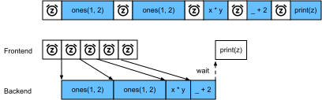

# 异步计算
:label:`sec_async`

今天的计算机是高度并行的系统，由多个CPU核、多个GPU、多个处理单元组成。通常每个CPU核有多个线程，每个设备通常有多个GPU，每个GPU有多个处理单元。总之，我们可以同时处理许多不同的事情，并且通常是在不同的设备上。不幸的是，Python并不善于编写并行和异步代码，至少在没有额外帮助的情况下不是好选择。归根结底，Python是单线程的，将来也是不太可能改变的。因此在诸多的深度学习框架中，MXNet和TensorFlow之类则采用了一种*异步编程*（asynchronous programming）模型来提高性能，而PyTorch则使用了Python自己的调度器来实现不同的性能权衡。对于PyTorch来说GPU操作在默认情况下是异步的。当你调用一个使用GPU的函数时，操作会排队到特定的设备上，但不一定要等到以后才执行。这允许我们并行执行更多的计算，包括在CPU或其他GPU上的操作。

因此，了解异步编程是如何工作的，通过主动地减少计算需求和相互依赖，有助于我们开发更高效的程序。这使我们能够减少内存开销并提高处理器利用率。


```python
import os
import subprocess
import numpy
import paddle
from paddle import nn
from d2l import paddle as d2l
```

## 通过后端异步处理


作为热身，考虑一个简单问题：我们要生成一个随机矩阵并将其相乘。让我们在NumPy和PyTorch张量中都这样做，看看它们的区别。请注意，PyTorch的`tensor`是在GPU上定义的。


```python
# GPU计算热身
a = paddle.randn(shape=(1000, 1000))
b = paddle.mm(a, a)

with d2l.Benchmark('numpy'):
    for _ in range(10):
        a = numpy.random.normal(size=(1000, 1000))
        b = numpy.dot(a, a)

with d2l.Benchmark('飞桨'):
    for _ in range(10):
        a = paddle.randn(shape=(1000, 1000))
        b = paddle.mm(a, a)
```

通过PyTorch的基准输出比较快了几个数量级。NumPy点积是在CPU上执行的，而PyTorch矩阵乘法是在GPU上执行的，后者的速度要快得多。但巨大的时间差距表明一定还有其他原因。默认情况下，GPU操作在PyTorch中是异步的。强制PyTorch在返回之前完成所有计算，这种强制说明了之前发生的情况：计算是由后端执行，而前端将控制权返回给了Python。


```python
with d2l.Benchmark():
    for _ in range(10):
        a = paddle.randn(shape=(1000, 1000))
        b = paddle.mm(a, a)
    paddle.device.cuda.synchronize()
```

    Done: 0.0049 sec


广义上说，PyTorch有一个用于与用户直接交互的前端（例如通过Python），还有一个由系统用来执行计算的后端。如 :numref:`fig_frontends`所示，用户可以用各种前端语言编写Python程序，如Python和C++。不管使用的前端编程语言是什么，PyTorch程序的执行主要发生在C++实现的后端。由前端语言发出的操作被传递到后端执行。后端管理自己的线程，这些线程不断收集和执行排队的任务。请注意，要使其工作，后端必须能够跟踪计算图中各个步骤之间的依赖关系。因此，不可能并行化相互依赖的操作。


:width:`300px`
:label:`fig_frontends`

让我们看另一个简单例子，以便更好地理解依赖关系图。


```python
x = paddle.ones((1, 2))
y = paddle.ones((1, 2))
z = x * y + 2
z
```


:label:`fig_asyncgraph`

上面的代码片段在 :numref:`fig_asyncgraph`中进行了说明。每当Python前端线程执行前三条语句中的一条语句时，它只是将任务返回到后端队列。当最后一个语句的结果需要被打印出来时，Python前端线程将等待C++后端线程完成变量`z`的结果计算。这种设计的一个好处是Python前端线程不需要执行实际的计算。因此，不管Python的性能如何，对程序的整体性能几乎没有影响。 :numref:`fig_threading`演示了前端和后端如何交互。


:label:`fig_threading`

## 障碍器与阻塞器


## 改进计算


## 小结

* 深度学习框架可以将Python前端的控制与后端的执行解耦，使得命令可以快速地异步插入后端、并行执行。
* 异步产生了一个相当灵活的前端，但请注意：过度填充任务队列可能会导致内存消耗过多。建议对每个小批量进行同步，以保持前端和后端大致同步。
* 芯片供应商提供了复杂的性能分析工具，以获得对深度学习效率更精确的洞察。


## 练习


1. 在CPU上，对本节中相同的矩阵乘法操作进行基准测试。你仍然可以通过后端观察异步吗？


[Discussions](https://discuss.d2l.ai/t/2791)

