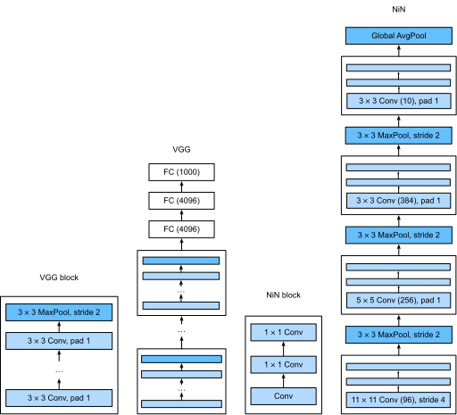

# 网络中的网络（NiN）
:label:`sec_nin`

LeNet、AlexNet 和 VGG 都有一个共同的设计模式：通过一系列的卷积层与池化层来提取空间结构特征；然后通过全连接层对特征的表征进行处理。
AlexNet 和 VGG 对 LeNet 的改进主要在于如何扩大和加深这两个模块。
或者，可以想象在这个过程的早期使用全连接层。
然而，如果使用稠密层了，可能会完全放弃表征的空间结构。
*网络中的网络* (*NiN*) 提供了一个非常简单的解决方案：在每个像素的通道上分别使用多层感知机 :cite:`Lin.Chen.Yan.2013`

## (**NiN块**)

回想一下，卷积层的输入和输出由四维张量组成，张量的每个轴分别对应样本、通道、高度和宽度。
另外，全连接层的输入和输出通常是分别对应于样本和特征的二维张量。
NiN 的想法是在每个像素位置（针对每个高度和宽度）应用一个全连接层。
如果我们将权重连接到每个空间位置，我们可以将其视为 $1\times 1$ 卷积层（如 :numref:`sec_channels` 中所述），或作为在每个像素位置上独立作用的全连接层。
从另一个角度看，即将空间维度中的每个像素视为单个样本，将通道维度视为不同特征（feature）。

:numref:`fig_nin` 说明了 VGG 和 NiN 及它们的块之间主要结构差异。
NiN 块以一个普通卷积层开始，后面是两个 $1\times 1$ 的卷积层。这两个$1\times 1$ 卷积层充当带有 ReLU 激活函数的逐像素全连接层。
第一层的卷积窗口形状通常由用户设置。
随后的卷积窗口形状固定为 $1 \times 1$。


:width:`600px`
:label:`fig_nin`


```python
import paddle
import paddle.nn as nn

def nin_block(in_channels, out_channels, kernel_size, strides, padding):
    return nn.Sequential(
        nn.Conv2D(in_channels, out_channels, kernel_size, strides, padding),
        nn.ReLU(), nn.Conv2D(out_channels, out_channels, kernel_size=1),
        nn.ReLU(), nn.Conv2D(out_channels, out_channels, kernel_size=1),
        nn.ReLU())
```

## [**NiN模型**]

最初的 NiN 网络是在 AlexNet 后不久提出的，显然从中得到了一些启示。
NiN使用窗口形状为 $11\times 11$、$5\times 5$ 和 $3\times 3$的卷积层，输出通道数量与 AlexNet 中的相同。
每个 NiN 块后有一个最大池化层，池化窗口形状为 $3\times 3$，步幅为 2。

NiN 和 AlexNet 之间的一个显著区别是 NiN 完全取消了全连接层。
相反，NiN 使用一个 NiN块，其输出通道数等于标签类别的数量。最后放一个 *全局平均池化层*（global average pooling layer），生成一个多元逻辑向量（logits）。NiN 设计的一个优点是，它显著减少了模型所需参数的数量。然而，在实践中，这种设计有时会增加训练模型的时间。


```python
NiN = nn.Sequential(
    nin_block(1, 96, kernel_size=11, strides=4, padding=0),
    nn.MaxPool2D(3, stride=2),
    nin_block(96, 256, kernel_size=5, strides=1, padding=2),
    nn.MaxPool2D(3, stride=2),
    nin_block(256, 384, kernel_size=3, strides=1, padding=1),
    nn.MaxPool2D(3, stride=2), nn.Dropout(0.5),
    # 标签类别数是10
    nin_block(384, 10, kernel_size=3, strides=1, padding=1),
    nn.AdaptiveAvgPool2D((1, 1)),
    # 将四维的输出转成二维的输出，其形状为(批量大小, 10)
    nn.Flatten())
```

我们创建一个数据样本来[**查看每个块的输出形状**]。


```python
print(paddle.summary(NiN, (1, 1, 224, 224)))
```

    -------------------------------------------------------------------------------
       Layer (type)         Input Shape          Output Shape         Param #    
    ===============================================================================
         Conv2D-1        [[1, 1, 224, 224]]    [1, 96, 54, 54]        11,712     
          ReLU-1         [[1, 96, 54, 54]]     [1, 96, 54, 54]           0       
         Conv2D-2        [[1, 96, 54, 54]]     [1, 96, 54, 54]         9,312     
          ReLU-2         [[1, 96, 54, 54]]     [1, 96, 54, 54]           0       
         Conv2D-3        [[1, 96, 54, 54]]     [1, 96, 54, 54]         9,312     
          ReLU-3         [[1, 96, 54, 54]]     [1, 96, 54, 54]           0       
        MaxPool2D-1      [[1, 96, 54, 54]]     [1, 96, 26, 26]           0       
         Conv2D-4        [[1, 96, 26, 26]]     [1, 256, 26, 26]       614,656    
          ReLU-4         [[1, 256, 26, 26]]    [1, 256, 26, 26]          0       
         Conv2D-5        [[1, 256, 26, 26]]    [1, 256, 26, 26]       65,792     
          ReLU-5         [[1, 256, 26, 26]]    [1, 256, 26, 26]          0       
         Conv2D-6        [[1, 256, 26, 26]]    [1, 256, 26, 26]       65,792     
          ReLU-6         [[1, 256, 26, 26]]    [1, 256, 26, 26]          0       
        MaxPool2D-2      [[1, 256, 26, 26]]    [1, 256, 12, 12]          0       
         Conv2D-7        [[1, 256, 12, 12]]    [1, 384, 12, 12]       885,120    
          ReLU-7         [[1, 384, 12, 12]]    [1, 384, 12, 12]          0       
         Conv2D-8        [[1, 384, 12, 12]]    [1, 384, 12, 12]       147,840    
          ReLU-8         [[1, 384, 12, 12]]    [1, 384, 12, 12]          0       
         Conv2D-9        [[1, 384, 12, 12]]    [1, 384, 12, 12]       147,840    
          ReLU-9         [[1, 384, 12, 12]]    [1, 384, 12, 12]          0       
        MaxPool2D-3      [[1, 384, 12, 12]]     [1, 384, 5, 5]           0       
         Dropout-1        [[1, 384, 5, 5]]      [1, 384, 5, 5]           0       
         Conv2D-10        [[1, 384, 5, 5]]      [1, 10, 5, 5]         34,570     
          ReLU-10         [[1, 10, 5, 5]]       [1, 10, 5, 5]            0       
         Conv2D-11        [[1, 10, 5, 5]]       [1, 10, 5, 5]           110      
          ReLU-11         [[1, 10, 5, 5]]       [1, 10, 5, 5]            0       
         Conv2D-12        [[1, 10, 5, 5]]       [1, 10, 5, 5]           110      
          ReLU-12         [[1, 10, 5, 5]]       [1, 10, 5, 5]            0       
    AdaptiveAvgPool2D-1   [[1, 10, 5, 5]]       [1, 10, 1, 1]            0       
         Flatten-1        [[1, 10, 1, 1]]          [1, 10]               0       
    ===============================================================================
    Total params: 1,992,166
    Trainable params: 1,992,166
    Non-trainable params: 0
    -------------------------------------------------------------------------------
    Input size (MB): 0.19
    Forward/backward pass size (MB): 24.20
    Params size (MB): 7.60
    Estimated Total Size (MB): 31.99
    -------------------------------------------------------------------------------
    
    {'total_params': 1992166, 'trainable_params': 1992166}


## [**训练模型**]

和以前一样，我们使用 Fashion-MNIST 来训练模型。训练 NiN 与训练 AlexNet、VGG时相似。


```python
import paddle.vision.transforms as T
from paddle.vision.datasets import FashionMNIST

lr, num_epochs, batch_size = 0.001, 10, 128

# 数据集处理
transform = T.Compose([
    T.Resize(224),
    T.Transpose(),
    T.Normalize([127.5], [127.5]),
])
# 数据集定义
train_dataset = FashionMNIST(mode='train', transform=transform)
val_dataset = FashionMNIST(mode='test', transform=transform)

# 模型设置
model = paddle.Model(NiN)
model.prepare(
    paddle.optimizer.Adam(learning_rate=lr, parameters=model.parameters()),
    paddle.nn.CrossEntropyLoss(),
    paddle.metric.Accuracy(topk=(1, 5)))
# 模型训练
callback = paddle.callbacks.VisualDL(log_dir='visualdl_log_dir')
model.fit(train_dataset, val_dataset, epochs=num_epochs, batch_size=batch_size, log_freq=200, callbacks=callback)
# model.fit(train_dataset, val_dataset, epochs=1, batch_size=batch_size, log_freq=1)

```

    The loss value printed in the log is the current step, and the metric is the average value of previous steps.
    Epoch 1/10


    /opt/conda/envs/python35-paddle120-env/lib/python3.7/site-packages/paddle/fluid/layers/utils.py:77: DeprecationWarning: Using or importing the ABCs from 'collections' instead of from 'collections.abc' is deprecated, and in 3.8 it will stop working
      return (isinstance(seq, collections.Sequence) and


## 小结

* NiN使用由一个卷积层和多个 $1\times 1$ 卷积层组成的块。该块可以在卷积神经网络中使用，以允许更多的每像素非线性。
* NiN去除了容易造成过拟合的全连接层，将它们替换为全局平均池化层（即在所有位置上进行求和）。该池化层通道数量为所需的输出数量（例如，Fashion-MNIST的输出为10）。
* 移除全连接层可减少过拟合，同时显著减少NiN的参数。
* NiN的设计影响了许多后续卷积神经网络的设计。

## 练习

1. 调整NiN的超参数，以提高分类准确性。
1. 为什么NiN块中有两个 $1\times 1$ 卷积层？删除其中一个，然后观察和分析实验现象。
1. 计算NiN的资源使用情况。
    1. 参数的数量是多少？
    1. 计算量是多少？
    1. 训练期间需要多少显存？
    1. 预测期间需要多少显存？
1. 一次性直接将 $384 \times 5 \times 5$ 的表示缩减为 $10 \times 5 \times 5$ 的表示，会存在哪些问题？


[Discussions](https://discuss.d2l.ai/t/1869)

