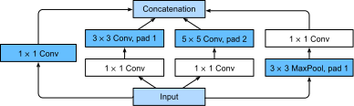

# 含并行连结的网络（GoogLeNet）
:label:`sec_googlenet`

在2014年的ImageNet图像识别挑战赛中，一个名叫*GoogLeNet* :cite:`Szegedy.Liu.Jia.ea.2015` 的网络结构大放异彩。
GoogLeNet吸收了NiN中串联网络的思想，并在此基础上做了改进。
这篇论文的一个重点是解决了什么样大小的卷积核最合适的问题。
毕竟，以前流行的网络使用小到 $1 \times 1$ ，大到 $11 \times 11$ 的卷积核。
本文的一个观点是，有时使用不同大小的卷积核组合是有利的。
在本节中，我们将介绍一个稍微简化的GoogLeNet版本：我们省略了一些为稳定训练而添加的特殊特性，但是现在有了更好的训练算法，这些特性不是必要的。


## (**Inception块**)

在GoogLeNet中，基本的卷积块被称为*Inception块*（Inception block）。这很可能得名于电影《盗梦空间》（Inception），因为电影中的一句话“我们需要走得更深”（“We need to go deeper”）。


:label:`fig_inception`

如 :numref:`fig_inception` 所示，Inception块由四条并行路径组成。
前三条路径使用窗口大小为 $1\times 1$、$3\times 3$ 和 $5\times 5$ 的卷积层，从不同空间大小中提取信息。
中间的两条路径在输入上执行 $1\times 1$ 卷积，以减少通道数，从而降低模型的复杂性。
第四条路径使用 $3\times 3$ 最大池化层，然后使用 $1\times 1$ 卷积层来改变通道数。
这四条路径都使用合适的填充来使输入与输出的高和宽一致，最后我们将每条线路的输出在通道维度上连结，并构成Inception块的输出。在Inception块中，通常调整的超参数是每层输出通道的数量。


```python
import paddle
import paddle.nn as nn
import paddle.nn.functional as F

class Inception(nn.Layer):
    # `c1`--`c4` 是每条路径的输出通道数
    def __init__(self, in_channels, c1, c2, c3, c4, **kwargs):
        super(Inception, self).__init__(**kwargs)
        # 线路1，单1 x 1卷积层
        self.p1_1 = nn.Conv2D(in_channels, c1, kernel_size=1)
        # 线路2，1 x 1卷积层后接3 x 3卷积层
        self.p2_1 = nn.Conv2D(in_channels, c2[0], kernel_size=1)
        self.p2_2 = nn.Conv2D(c2[0], c2[1], kernel_size=3, padding=1)
        # 线路3，1 x 1卷积层后接5 x 5卷积层
        self.p3_1 = nn.Conv2D(in_channels, c3[0], kernel_size=1)
        self.p3_2 = nn.Conv2D(c3[0], c3[1], kernel_size=5, padding=2)
        # 线路4，3 x 3最大池化层后接1 x 1卷积层
        self.p4_1 = nn.MaxPool2D(kernel_size=3, stride=1, padding=1)
        self.p4_2 = nn.Conv2D(in_channels, c4, kernel_size=1)

    def forward(self, x):
        p1 = F.relu(self.p1_1(x))
        p2 = F.relu(self.p2_2(F.relu(self.p2_1(x))))
        p3 = F.relu(self.p3_2(F.relu(self.p3_1(x))))
        p4 = F.relu(self.p4_2(self.p4_1(x)))
        # 在通道维度上连结输出
        return paddle.concat(x=[p1, p2, p3, p4], axis=1)
```

那么为什么GoogLeNet这个网络如此有效呢？
首先我们考虑一下滤波器（filter）的组合，它们可以用各种滤波器尺寸探索图像，这意味着不同大小的滤波器可以有效地识别不同范围的图像细节。
同时，我们可以为不同的滤波器分配不同数量的参数。


## [**GoogLeNet模型**]

如 :numref:`fig_inception_full` 所示，GoogLeNet 一共使用 9 个Inception块和全局平均池化层的堆叠来生成其估计值。Inception块之间的最大池化层可降低维度。
第一个模块类似于 AlexNet 和 LeNet，Inception块的栈从VGG继承，全局平均池化层避免了在最后使用全连接层。


:label:`fig_inception_full`

现在，我们逐一实现GoogLeNet的每个模块。第一个模块使用 64 个通道、 $7\times 7$ 卷积层。


```python
b1 = nn.Sequential(nn.Conv2D(1, 64, kernel_size=7, stride=2, padding=3),
                   nn.ReLU(), nn.MaxPool2D(kernel_size=3, stride=2,
                                           padding=1))
```

第二个模块使用两个卷积层：第一个卷积层是 64个通道、 $1\times 1$ 卷积层；第二个卷积层使用将通道数量增加三倍的 $3\times 3$ 卷积层。
这对应于 Inception 块中的第二条路径。


```python
b2 = nn.Sequential(nn.Conv2D(64, 64, kernel_size=1), nn.ReLU(),
                   nn.Conv2D(64, 192, kernel_size=3, padding=1),
                   nn.MaxPool2D(kernel_size=3, stride=2, padding=1))
```

第三个模块串联两个完整的Inception块。
第一个 Inception 块的输出通道数为 $64+128+32+32=256$，四个路径之间的输出通道数量比为 $64:128:32:32=2:4:1:1$。
第二个和第三个路径首先将输入通道的数量分别减少到 $96/192=1/2$ 和 $16/192=1/12$，然后连接第二个卷积层。第二个 Inception 块的输出通道数增加到 $128+192+96+64=480$，四个路径之间的输出通道数量比为 $128:192:96:64 = 4:6:3:2$。
第二条和第三条路径首先将输入通道的数量分别减少到 $128/256=1/2$ 和 $32/256=1/8$。


```python
b3 = nn.Sequential(Inception(192, 64, (96, 128), (16, 32), 32),
                   Inception(256, 128, (128, 192), (32, 96), 64),
                   nn.MaxPool2D(kernel_size=3, stride=2, padding=1))
```

第四模块更加复杂，
它串联了5个Inception块，其输出通道数分别是 $192+208+48+64=512$ 、 $160+224+64+64=512$ 、 $128+256+64+64=512$ 、 $112+288+64+64=528$ 和 $256+320+128+128=832$ 。
这些路径的通道数分配和第三模块中的类似，首先是含 $3×3$ 卷积层的第二条路径输出最多通道，其次是仅含 $1×1$ 卷积层的第一条路径，之后是含 $5×5$ 卷积层的第三条路径和含 $3×3$ 最大池化层的第四条路径。
其中第二、第三条路径都会先按比例减小通道数。
这些比例在各个 Inception 块中都略有不同。


```python
b4 = nn.Sequential(Inception(480, 192, (96, 208), (16, 48), 64),
                   Inception(512, 160, (112, 224), (24, 64), 64),
                   Inception(512, 128, (128, 256), (24, 64), 64),
                   Inception(512, 112, (144, 288), (32, 64), 64),
                   Inception(528, 256, (160, 320), (32, 128), 128),
                   nn.MaxPool2D(kernel_size=3, stride=2, padding=1))
```

第五模块包含输出通道数为 $256+320+128+128=832$ 和 $384+384+128+128=1024$ 的两个Inception块。
其中每条路径通道数的分配思路和第三、第四模块中的一致，只是在具体数值上有所不同。
需要注意的是，第五模块的后面紧跟输出层，该模块同 NiN 一样使用全局平均池化层，将每个通道的高和宽变成1。
最后我们将输出变成二维数组，再接上一个输出个数为标签类别数的全连接层。


```python
b5 = nn.Sequential(Inception(832, 256, (160, 320), (32, 128), 128),
                   Inception(832, 384, (192, 384), (48, 128), 128),
                   nn.AdaptiveAvgPool2D((1, 1)), nn.Flatten())

GoogLeNet = nn.Sequential(b1, b2, b3, b4, b5, nn.Linear(1024, 10))
```

GoogLeNet 模型的计算复杂，而且不如 VGG 那样便于修改通道数。
[**为了使Fashion-MNIST上的训练短小精悍，我们将输入的高和宽从224降到96**]，这简化了计算。下面演示各个模块输出的形状变化。


```python
print(paddle.summary(GoogLeNet, (1, 1, 96, 96)))
```

    -------------------------------------------------------------------------------
       Layer (type)         Input Shape          Output Shape         Param #    
    ===============================================================================
         Conv2D-1         [[1, 1, 96, 96]]     [1, 64, 48, 48]         3,200     
          ReLU-1         [[1, 64, 48, 48]]     [1, 64, 48, 48]           0       
        MaxPool2D-1      [[1, 64, 48, 48]]     [1, 64, 24, 24]           0       
         Conv2D-2        [[1, 64, 24, 24]]     [1, 64, 24, 24]         4,160     
          ReLU-2         [[1, 64, 24, 24]]     [1, 64, 24, 24]           0       
         Conv2D-3        [[1, 64, 24, 24]]     [1, 192, 24, 24]       110,784    
        MaxPool2D-2      [[1, 192, 24, 24]]    [1, 192, 12, 12]          0       
         Conv2D-4        [[1, 192, 12, 12]]    [1, 64, 12, 12]        12,352     
         Conv2D-5        [[1, 192, 12, 12]]    [1, 96, 12, 12]        18,528     
         Conv2D-6        [[1, 96, 12, 12]]     [1, 128, 12, 12]       110,720    
         Conv2D-7        [[1, 192, 12, 12]]    [1, 16, 12, 12]         3,088     
         Conv2D-8        [[1, 16, 12, 12]]     [1, 32, 12, 12]        12,832     
        MaxPool2D-3      [[1, 192, 12, 12]]    [1, 192, 12, 12]          0       
         Conv2D-9        [[1, 192, 12, 12]]    [1, 32, 12, 12]         6,176     
        Inception-1      [[1, 192, 12, 12]]    [1, 256, 12, 12]          0       
         Conv2D-10       [[1, 256, 12, 12]]    [1, 128, 12, 12]       32,896     
         Conv2D-11       [[1, 256, 12, 12]]    [1, 128, 12, 12]       32,896     
         Conv2D-12       [[1, 128, 12, 12]]    [1, 192, 12, 12]       221,376    
         Conv2D-13       [[1, 256, 12, 12]]    [1, 32, 12, 12]         8,224     
         Conv2D-14       [[1, 32, 12, 12]]     [1, 96, 12, 12]        76,896     
        MaxPool2D-4      [[1, 256, 12, 12]]    [1, 256, 12, 12]          0       
         Conv2D-15       [[1, 256, 12, 12]]    [1, 64, 12, 12]        16,448     
        Inception-2      [[1, 256, 12, 12]]    [1, 480, 12, 12]          0       
        MaxPool2D-5      [[1, 480, 12, 12]]     [1, 480, 6, 6]           0       
         Conv2D-16        [[1, 480, 6, 6]]      [1, 192, 6, 6]        92,352     
         Conv2D-17        [[1, 480, 6, 6]]      [1, 96, 6, 6]         46,176     
         Conv2D-18        [[1, 96, 6, 6]]       [1, 208, 6, 6]        179,920    
         Conv2D-19        [[1, 480, 6, 6]]      [1, 16, 6, 6]          7,696     
         Conv2D-20        [[1, 16, 6, 6]]       [1, 48, 6, 6]         19,248     
        MaxPool2D-6       [[1, 480, 6, 6]]      [1, 480, 6, 6]           0       
         Conv2D-21        [[1, 480, 6, 6]]      [1, 64, 6, 6]         30,784     
        Inception-3       [[1, 480, 6, 6]]      [1, 512, 6, 6]           0       
         Conv2D-22        [[1, 512, 6, 6]]      [1, 160, 6, 6]        82,080     
         Conv2D-23        [[1, 512, 6, 6]]      [1, 112, 6, 6]        57,456     
         Conv2D-24        [[1, 112, 6, 6]]      [1, 224, 6, 6]        226,016    
         Conv2D-25        [[1, 512, 6, 6]]      [1, 24, 6, 6]         12,312     
         Conv2D-26        [[1, 24, 6, 6]]       [1, 64, 6, 6]         38,464     
        MaxPool2D-7       [[1, 512, 6, 6]]      [1, 512, 6, 6]           0       
         Conv2D-27        [[1, 512, 6, 6]]      [1, 64, 6, 6]         32,832     
        Inception-4       [[1, 512, 6, 6]]      [1, 512, 6, 6]           0       
         Conv2D-28        [[1, 512, 6, 6]]      [1, 128, 6, 6]        65,664     
         Conv2D-29        [[1, 512, 6, 6]]      [1, 128, 6, 6]        65,664     
         Conv2D-30        [[1, 128, 6, 6]]      [1, 256, 6, 6]        295,168    
         Conv2D-31        [[1, 512, 6, 6]]      [1, 24, 6, 6]         12,312     
         Conv2D-32        [[1, 24, 6, 6]]       [1, 64, 6, 6]         38,464     
        MaxPool2D-8       [[1, 512, 6, 6]]      [1, 512, 6, 6]           0       
         Conv2D-33        [[1, 512, 6, 6]]      [1, 64, 6, 6]         32,832     
        Inception-5       [[1, 512, 6, 6]]      [1, 512, 6, 6]           0       
         Conv2D-34        [[1, 512, 6, 6]]      [1, 112, 6, 6]        57,456     
         Conv2D-35        [[1, 512, 6, 6]]      [1, 144, 6, 6]        73,872     
         Conv2D-36        [[1, 144, 6, 6]]      [1, 288, 6, 6]        373,536    
         Conv2D-37        [[1, 512, 6, 6]]      [1, 32, 6, 6]         16,416     
         Conv2D-38        [[1, 32, 6, 6]]       [1, 64, 6, 6]         51,264     
        MaxPool2D-9       [[1, 512, 6, 6]]      [1, 512, 6, 6]           0       
         Conv2D-39        [[1, 512, 6, 6]]      [1, 64, 6, 6]         32,832     
        Inception-6       [[1, 512, 6, 6]]      [1, 528, 6, 6]           0       
         Conv2D-40        [[1, 528, 6, 6]]      [1, 256, 6, 6]        135,424    
         Conv2D-41        [[1, 528, 6, 6]]      [1, 160, 6, 6]        84,640     
         Conv2D-42        [[1, 160, 6, 6]]      [1, 320, 6, 6]        461,120    
         Conv2D-43        [[1, 528, 6, 6]]      [1, 32, 6, 6]         16,928     
         Conv2D-44        [[1, 32, 6, 6]]       [1, 128, 6, 6]        102,528    
       MaxPool2D-10       [[1, 528, 6, 6]]      [1, 528, 6, 6]           0       
         Conv2D-45        [[1, 528, 6, 6]]      [1, 128, 6, 6]        67,712     
        Inception-7       [[1, 528, 6, 6]]      [1, 832, 6, 6]           0       
       MaxPool2D-11       [[1, 832, 6, 6]]      [1, 832, 3, 3]           0       
         Conv2D-46        [[1, 832, 3, 3]]      [1, 256, 3, 3]        213,248    
         Conv2D-47        [[1, 832, 3, 3]]      [1, 160, 3, 3]        133,280    
         Conv2D-48        [[1, 160, 3, 3]]      [1, 320, 3, 3]        461,120    
         Conv2D-49        [[1, 832, 3, 3]]      [1, 32, 3, 3]         26,656     
         Conv2D-50        [[1, 32, 3, 3]]       [1, 128, 3, 3]        102,528    
       MaxPool2D-12       [[1, 832, 3, 3]]      [1, 832, 3, 3]           0       
         Conv2D-51        [[1, 832, 3, 3]]      [1, 128, 3, 3]        106,624    
        Inception-8       [[1, 832, 3, 3]]      [1, 832, 3, 3]           0       
         Conv2D-52        [[1, 832, 3, 3]]      [1, 384, 3, 3]        319,872    
         Conv2D-53        [[1, 832, 3, 3]]      [1, 192, 3, 3]        159,936    
         Conv2D-54        [[1, 192, 3, 3]]      [1, 384, 3, 3]        663,936    
         Conv2D-55        [[1, 832, 3, 3]]      [1, 48, 3, 3]         39,984     
         Conv2D-56        [[1, 48, 3, 3]]       [1, 128, 3, 3]        153,728    
       MaxPool2D-13       [[1, 832, 3, 3]]      [1, 832, 3, 3]           0       
         Conv2D-57        [[1, 832, 3, 3]]      [1, 128, 3, 3]        106,624    
        Inception-9       [[1, 832, 3, 3]]     [1, 1024, 3, 3]           0       
    AdaptiveAvgPool2D-1  [[1, 1024, 3, 3]]     [1, 1024, 1, 1]           0       
         Flatten-1       [[1, 1024, 1, 1]]        [1, 1024]              0       
         Linear-1           [[1, 1024]]            [1, 10]            10,250     
    ===============================================================================
    Total params: 5,977,530
    Trainable params: 5,977,530
    Non-trainable params: 0
    -------------------------------------------------------------------------------
    Input size (MB): 0.04
    Forward/backward pass size (MB): 9.66
    Params size (MB): 22.80
    Estimated Total Size (MB): 32.50
    -------------------------------------------------------------------------------
    
    {'total_params': 5977530, 'trainable_params': 5977530}


## [**训练模型**]

和以前一样，我们使用 Fashion-MNIST 数据集来训练我们的模型。在训练之前，我们将图片转换为 $96 \times 96$ 分辨率。


```python
import paddle.vision.transforms as T
from paddle.vision.datasets import FashionMNIST

lr, num_epochs, batch_size = 0.001, 10, 128

# 数据集处理
transform = T.Compose([
    T.Resize(96),
    T.Transpose(),
    T.Normalize([127.5], [127.5]),
])
# 数据集定义
train_dataset = FashionMNIST(mode='train', transform=transform)
val_dataset = FashionMNIST(mode='test', transform=transform)

model = paddle.Model(GoogLeNet)
model.prepare(
    paddle.optimizer.Adam(learning_rate=lr, parameters=model.parameters()),
    paddle.nn.CrossEntropyLoss(),
    paddle.metric.Accuracy(topk=(1, 5)))
# 模型训练
callback = paddle.callbacks.VisualDL(log_dir='visualdl_log_dir')
model.fit(train_dataset, val_dataset, epochs=num_epochs, batch_size=batch_size, log_freq=200, callbacks=callback)
# model.fit(train_dataset, val_dataset, epochs=1, batch_size=batch_size, log_freq=1)
```

    The loss value printed in the log is the current step, and the metric is the average value of previous steps.
    Epoch 1/10


    /opt/conda/envs/python35-paddle120-env/lib/python3.7/site-packages/paddle/fluid/layers/utils.py:77: DeprecationWarning: Using or importing the ABCs from 'collections' instead of from 'collections.abc' is deprecated, and in 3.8 it will stop working
      return (isinstance(seq, collections.Sequence) and


    step 200/469 - loss: 0.5834 - acc_top1: 0.6020 - acc_top5: 0.9458 - 132ms/step
    step 400/469 - loss: 0.4711 - acc_top1: 0.7153 - acc_top5: 0.9707 - 132ms/step
    step 469/469 - loss: 0.3698 - acc_top1: 0.7348 - acc_top5: 0.9745 - 132ms/step
    Eval begin...
    step 79/79 - loss: 0.3513 - acc_top1: 0.8538 - acc_top5: 0.9968 - 43ms/step
    Eval samples: 10000
    Epoch 2/10
    step 200/469 - loss: 0.2382 - acc_top1: 0.8693 - acc_top5: 0.9977 - 133ms/step
    step 400/469 - loss: 0.3100 - acc_top1: 0.8767 - acc_top5: 0.9979 - 132ms/step
    step 469/469 - loss: 0.2306 - acc_top1: 0.8781 - acc_top5: 0.9978 - 131ms/step
    Eval begin...
    step 79/79 - loss: 0.2832 - acc_top1: 0.8887 - acc_top5: 0.9984 - 43ms/step
    Eval samples: 10000
    Epoch 3/10
    step 200/469 - loss: 0.2962 - acc_top1: 0.8954 - acc_top5: 0.9982 - 131ms/step
    step 400/469 - loss: 0.2112 - acc_top1: 0.8985 - acc_top5: 0.9984 - 131ms/step
    step 469/469 - loss: 0.1963 - acc_top1: 0.8997 - acc_top5: 0.9985 - 131ms/step
    Eval begin...
    step 79/79 - loss: 0.2594 - acc_top1: 0.8919 - acc_top5: 0.9984 - 43ms/step
    Eval samples: 10000
    Epoch 4/10
    step 200/469 - loss: 0.1780 - acc_top1: 0.9141 - acc_top5: 0.9988 - 130ms/step
    step 400/469 - loss: 0.2548 - acc_top1: 0.9130 - acc_top5: 0.9988 - 130ms/step
    step 469/469 - loss: 0.3270 - acc_top1: 0.9128 - acc_top5: 0.9989 - 130ms/step
    Eval begin...
    step 79/79 - loss: 0.3658 - acc_top1: 0.8936 - acc_top5: 0.9979 - 43ms/step
    Eval samples: 10000
    Epoch 5/10
    step 200/469 - loss: 0.1665 - acc_top1: 0.9212 - acc_top5: 0.9993 - 134ms/step
    step 400/469 - loss: 0.2028 - acc_top1: 0.9204 - acc_top5: 0.9992 - 133ms/step
    step 469/469 - loss: 0.1925 - acc_top1: 0.9211 - acc_top5: 0.9992 - 133ms/step
    Eval begin...
    step 79/79 - loss: 0.1691 - acc_top1: 0.9099 - acc_top5: 0.9983 - 43ms/step
    Eval samples: 10000
    Epoch 6/10
    step 200/469 - loss: 0.2299 - acc_top1: 0.9283 - acc_top5: 0.9996 - 135ms/step
    step 400/469 - loss: 0.2282 - acc_top1: 0.9277 - acc_top5: 0.9995 - 135ms/step
    step 469/469 - loss: 0.2075 - acc_top1: 0.9286 - acc_top5: 0.9995 - 135ms/step
    Eval begin...
    step 79/79 - loss: 0.2245 - acc_top1: 0.9149 - acc_top5: 0.9987 - 43ms/step
    Eval samples: 10000
    Epoch 7/10
    step 200/469 - loss: 0.1730 - acc_top1: 0.9339 - acc_top5: 0.9995 - 131ms/step
    step 400/469 - loss: 0.1853 - acc_top1: 0.9346 - acc_top5: 0.9994 - 131ms/step
    step 469/469 - loss: 0.0948 - acc_top1: 0.9339 - acc_top5: 0.9994 - 131ms/step
    Eval begin...
    step 79/79 - loss: 0.1587 - acc_top1: 0.9110 - acc_top5: 0.9981 - 43ms/step
    Eval samples: 10000
    Epoch 8/10
    step 200/469 - loss: 0.1191 - acc_top1: 0.9410 - acc_top5: 0.9994 - 133ms/step
    step 400/469 - loss: 0.1503 - acc_top1: 0.9376 - acc_top5: 0.9995 - 132ms/step
    step 469/469 - loss: 0.2162 - acc_top1: 0.9374 - acc_top5: 0.9996 - 132ms/step
    Eval begin...
    step 79/79 - loss: 0.2333 - acc_top1: 0.9147 - acc_top5: 0.9985 - 43ms/step
    Eval samples: 10000
    Epoch 9/10
    step 200/469 - loss: 0.1790 - acc_top1: 0.9400 - acc_top5: 0.9998 - 132ms/step
    step 400/469 - loss: 0.0901 - acc_top1: 0.9401 - acc_top5: 0.9997 - 132ms/step
    step 469/469 - loss: 0.0447 - acc_top1: 0.9402 - acc_top5: 0.9997 - 132ms/step
    Eval begin...
    step 79/79 - loss: 0.2431 - acc_top1: 0.9190 - acc_top5: 0.9986 - 43ms/step
    Eval samples: 10000
    Epoch 10/10
    step 200/469 - loss: 0.1185 - acc_top1: 0.9481 - acc_top5: 0.9998 - 133ms/step


## 小结

* Inception 块相当于一个有4条路径的子网络。它通过不同窗口形状的卷积层和最大池化层来并行抽取信息，并使用 $1×1$ 卷积层减少每像素级别上的通道维数从而降低模型复杂度。
*  GoogLeNet将多个设计精细的Inception块与其他层（卷积层、全连接层）串联起来。其中Inception块的通道数分配之比是在 ImageNet 数据集上通过大量的实验得来的。
* GoogLeNet 和它的后继者们一度是 ImageNet 上最有效的模型之一：它以较低的计算复杂度提供了类似的测试精度。


## 练习

1. GoogLeNet 有数个后续版本。尝试实现并运行它们，然后观察实验结果。这些后续版本包括：
    * 添加批量归一化层 :cite:`Ioffe.Szegedy.2015`（batch normalization），在 :numref:`sec_batch_norm`中将介绍）。
    * 对 Inception 模块进行调整。
    * 使用标签平滑（label smoothing）进行模型正则化 :cite:`Szegedy.Vanhoucke.Ioffe.ea.2016`。
    * 加入残差连接 :cite:`Szegedy.Ioffe.Vanhoucke.ea.2017` ，（ :numref:`sec_resnet` 将介绍）。
1. 使用 GoogLeNet 的最小图像大小是多少？
1. 将 AlexNet、VGG 和 NiN 的模型参数大小与 GoogLeNet 进行比较。后两个网络结构是如何显著减少模型参数大小的？


[Discussions](https://discuss.d2l.ai/t/1871)

