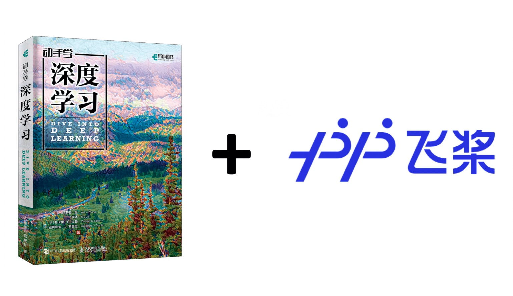

<div align=center>

</div>


[本项目](https://github.com/PaddlePaddle/awesome-DeepLearning/tree/master/Dive-into-DL-paddlepaddle)将[《动手学深度学习》](http://zh.d2l.ai/) 原书中MXNet代码实现改为PaddlePaddle实现。原书作者：阿斯顿·张、李沐、扎卡里 C. 立顿、亚历山大 J. 斯莫拉以及其他社区贡献者，GitHub地址：https://github.com/d2l-ai/d2l-zh


## 简介
本仓库主要包含code和docs两个文件夹（数据存放在data中）。其中code文件夹就是每章相关jupyter notebook代码（基于PaddlePaddle）；docs文件夹就是markdown格式的《动手学深度学习》书中的相关内容，然后将本项目的内容托管在[Read the Docs](https://readthedocs.org/)上。欢迎对本项目做出贡献或提出issue。

## 面向人群
本项目面向对深度学习感兴趣，尤其是想使用PaddlePaddle进行深度学习的童鞋。本项目并不要求你有任何深度学习或者机器学习的背景知识，你只需了解基础的数学和编程，如基础的线性代数、微分和概率，以及基础的Python编程。

## 食用方法

本仓库包含一些latex公式，但github的markdown原生是不支持公式显示的，而docs文件夹已经托管在[Read the Docs](https://readthedocs.org/)上，所以查看文档最简便的方法就是直接访问[本项目网页版]()。当然如果你还想跑一下运行相关代码的话还是得把本项目clone下来，然后运行code文件夹下相关代码。

## Contributors

本项目的主要贡献者如下：


## 目录

* [序言]()

* [安装]()

* [符号]()

* [1. 前言](chapter01_DL-intro/deep-learning-intro.md)

* 2\. 预备知识
  
   * [2.1 数据操作](chapter02_prerequisite/2.1_install.md)
   * [2.2 数据预处理](chapter02_prerequisite/2.2_tensor.md)
   * [2.3 线性代数](chapter02_prerequisite/2.3_autograd.md)
   * [2.4微分](chapter02_prerequisite/2.3_autograd.md)
   * [2.5 自动求导](chapter02_prerequisite/2.3_autograd.md)
   * [2.6 概率](chapter02_prerequisite/2.3_autograd.md)
   * [2.7 查阅文档](chapter02_prerequisite/2.3_autograd.md)
   
* 3\. 线性神经网络

   * [3.1 线性回归](chapter03_DL-basics/3.1_linear-regression.md)
   * [3.2 线性回归的从零开始实现](chapter03_DL-basics/3.2_linear-regression-scratch.md)
   * [3.3 线性回归的简洁实现](chapter03_DL-basics/3.3_linear-regression-pytorch.md)
   * [3.4 softmax回归](chapter03_DL-basics/3.4_softmax-regression.md)
   * [3.5 图像分类数据集（Fashion-MNIST）](chapter03_DL-basics/3.5_fashion-mnist.md)
   * [3.6 softmax回归的从零开始实现](chapter03_DL-basics/3.6_softmax-regression-scratch.md)
   * [3.7 softmax回归的简洁实现](chapter03_DL-basics/3.7_softmax-regression-pytorch.md)

* 4\. 多层感知机
  
   * [4.1 多层感知机](chapter03_DL-basics/3.8_mlp.md)
   * [4.2 多层感知机的从零开始实现](chapter03_DL-basics/3.9_mlp-scratch.md)
   * [4.3 多层感知机的简洁实现](chapter03_DL-basics/3.10_mlp-pytorch.md)
   * [4.4 模型选择、欠拟合和过拟合](chapter03_DL-basics/3.11_underfit-overfit.md)
   * [4.5 权重衰减](chapter03_DL-basics/3.12_weight-decay.md)
   * [4.6 Dropout](chapter03_DL-basics/3.13_dropout.md)
   * [4.7 正向传播、反向传播和计算图](chapter03_DL-basics/3.14_backprop.md)
   * [4.8 数值稳定性和模型初始化](chapter03_DL-basics/3.15_numerical-stability-and-init.md)
   * [4.9 环境和分布偏移]()
   * [4.10 实战Kaggle比赛：预测房价](chapter03_DL-basics/3.16_kaggle-house-price.md)
   
* 5\. 深度学习计算
  
   * [5.1 层和块](chapter05_CNN/5.1_conv-layer.md)
   * [5.2 参数管理](chapter05_CNN/5.2_padding-and-strides.md)
   * [5.3 延后初始化](chapter05_CNN/5.3_channels.md)
   * [5.4 自定义层](chapter05_CNN/5.4_pooling.md)
   * [5.5 读写文件](chapter04_DL_computation/4.5_read-write.md)
   * [5.6 GPU](chapter04_DL_computation/4.6_use-gpu.md)
   
* 6\. 卷积神经网络
  
   * [6.1 从全连接层到卷积](chapter05_CNN/5.5_lenet.md)
   * [6.2 图像卷积]()
   * [6.3 填充和步幅](https://zh-v2.d2l.ai/chapter_convolutional-neural-networks/padding-and-strides.html)
   * [6.4 多输入多输出通道](https://zh-v2.d2l.ai/chapter_convolutional-neural-networks/channels.html)
   * [6.5  池化层](https://zh-v2.d2l.ai/chapter_convolutional-neural-networks/pooling.html)
   * [6.6 卷积神经网络（LeNet）](chapter05_CNN/5.5_lenet.md)
   
* 7\. 现代卷积神经网络

   * [5.6 深度卷积神经网络（AlexNet）](chapter05_CNN/5.6_alexnet.md)
   * [5.7 使用块的网络（VGG）](chapter05_CNN/5.7_vgg.md)
   * [5.8 网络中的网络（NiN）](chapter05_CNN/5.8_nin.md)
   * [5.9 含并行连结的网络（GoogLeNet）](chapter05_CNN/5.9_googlenet.md)
   * [5.10 批量归一化](chapter05_CNN/5.10_batch-norm.md)
   * [5.11 残差网络（ResNet）](chapter05_CNN/5.11_resnet.md)
   * [5.12 稠密连接网络（DenseNet）]()

* 8\. 循环神经网络

   * [8.1 序列模型](chapter06_RNN/6.1_lang-model.md)
   * [8.2 文本预处理](chapter06_RNN/6.2_rnn.md)
   * [8.3 语言模型和数据集](https://zh-v2.d2l.ai/chapter_recurrent-neural-networks/language-models-and-dataset.html)
   * [8.4 循环神经网络](https://zh-v2.d2l.ai/chapter_recurrent-neural-networks/rnn.html)
   * [8.5 循环神经网络的从零开始实现](https://zh-v2.d2l.ai/chapter_recurrent-neural-networks/rnn-scratch.html)
   * [8.6 循环神经网络的简洁实现](https://zh-v2.d2l.ai/chapter_recurrent-neural-networks/rnn-concise.html)
   * [8.7 通过时间反向传播](https://zh-v2.d2l.ai/chapter_recurrent-neural-networks/bptt.html)

* 9. 现代循环神经网络

   * [9.1 门控循环单元（GRU）](chapter06_RNN/6.7_gru.md)
   * [9.2 长短期记忆（LSTM）](chapter06_RNN/6.8_lstm.md)
   * [9.3 深度循环神经网络](chapter06_RNN/6.9_deep-rnn.md)
   * [9.4 双向循环神经网络](https://zh-v2.d2l.ai/chapter_recurrent-modern/bi-rnn.html)
   * [9.5 机器翻译与数据集](https://zh-v2.d2l.ai/chapter_recurrent-modern/machine-translation-and-dataset.html)
   * [9.6 编码器-解码器结构](https://zh-v2.d2l.ai/chapter_recurrent-modern/encoder-decoder.html)
   * [9.7 序列到序列学习（seq2seq）](https://zh-v2.d2l.ai/chapter_recurrent-modern/seq2seq.html)
   * [9.8 束搜索](https://zh-v2.d2l.ai/chapter_recurrent-modern/beam-search.html)

* 12\. 计算性能
  
   * [12.1 编译器和解释器](https://zh-v2.d2l.ai/chapter_computational-performance/hybridize.html)
   
   * [12.2 异步计算](https://zh-v2.d2l.ai/chapter_computational-performance/async-computation.html)
   * [12.3 自动并行](https://zh-v2.d2l.ai/chapter_computational-performance/auto-parallelism.html)
   * [12.4 硬件](https://zh-v2.d2l.ai/chapter_computational-performance/hardware.html)
   * [12.5 多GPU训练](https://zh-v2.d2l.ai/chapter_computational-performance/multiple-gpus.html)
   * [12.6 多GPU的简洁实现](https://zh-v2.d2l.ai/chapter_computational-performance/multiple-gpus-concise.html)
   * [12.7 参数服务器](https://zh-v2.d2l.ai/chapter_computational-performance/parameterserver.html)
   
* 13\. 计算机视觉

   * [13.1 图像增广](chapter09_computer-vision/9.1_image-augmentation.md)
   * [13.2 微调](chapter09_computer-vision/9.2_fine-tuning.md)
   * [13.3 目标检测和边界框](chapter09_computer-vision/9.3_bounding-box.md)
   * [13.4 锚框](chapter09_computer-vision/9.4_anchor.md)
   * [13.5 多尺度目标检测](chapter09_computer-vision/9.5_multiscale-object-detection.md)
   * [13.6 目标检测数据集](chapter09_computer-vision/9.6_object-detection-dataset.md)
   * [13.7 单发多框检测（SSD）]()

   * [13.8 区域卷积神经网络（R-CNN）系列](chapter09_computer-vision/9.8_rcnn.md)
   * [13.9 实战 Kaggle 比赛：图像分类 (CIFAR-10)](https://zh-v2.d2l.ai/chapter_computer-vision/kaggle-cifar10.html)
   * [13.10 实战Kaggle比赛：狗的品种识别（ImageNet Dogs）]()

持续更新中......


## 原书地址
中文版：[动手学深度学习](https://zh.d2l.ai/) | [Github仓库](https://github.com/d2l-ai/d2l-zh)       
English Version: [Dive into Deep Learning](https://d2l.ai/) | [Github Repo](https://github.com/d2l-ai/d2l-en)


## 引用
如果您在研究中使用了这个项目请引用原书:
```
@book{zhang2019dive,
    title={Dive into Deep Learning},
    author={Aston Zhang and Zachary C. Lipton and Mu Li and Alexander J. Smola},
    note={\url{http://www.d2l.ai}},
    year={2020}
}
```
