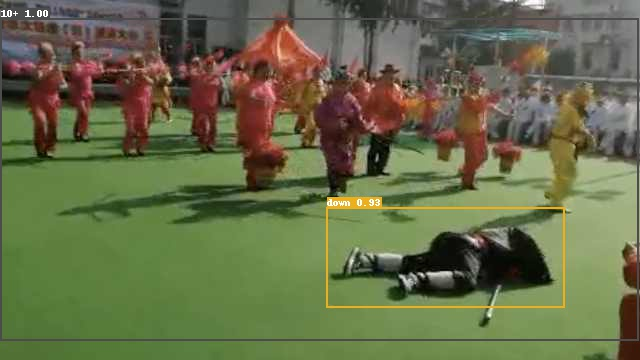

# 摔倒检测


## 项目说明

本次实验通过使用PaddleDetection2.0中的YOLOv3(主干网络为mobilenetv3的轻量化模型)，通过几行代码就能实现跌倒的目标检测，后期可部署用于监控医院、疗养院甚至家里等。

按以下几个步骤来介绍项目实现流程。

1. 解压自定义的数据集；

2. 下载安装PaddleDetection包；

2. 自定义数据集划分；

4. 选择模型（本次选择YOLO-v3）进行训练：训练的配置文件说明；

5. 效果可视化：使用训练好的模型进行预测，同时对结果进行可视化；

6. 模型评估和预测：评估模型效果；

7. 预测结果

8. PaddleDetection 预测部署

**检测效果如下图所示：**



本项目AI Studio版本请参考：[https://aistudio.baidu.com/aistudio/projectdetail/2500639](https://aistudio.baidu.com/aistudio/projectdetail/2500639)


## 数据准备

本案例数据集来源于[北京易华录](https://dev.ehualu.com/dev/home/dataPage/cardDetail?browingNum=810&city=&collectionNum=6&createTime=1591846840000&dataPermission=1&dataSourceName=2019%E5%B9%B4%E4%B8%AD%E5%9B%BD%E5%8D%8E%E5%BD%95%E6%9D%AF%E2%88%99%E6%95%B0%E6%8D%AE%E6%B9%96%E7%AE%97%E6%B3%95%E5%A4%A7%E8%B5%9B%20%E6%B3%A8%E6%84%8F%EF%BC%9A%E6%9C%AC%E6%95%B0%E6%8D%AE%E9%9B%86%E7%94%B1%E5%8C%97%E4%BA%AC%E6%98%93%E5%8D%8E%E5%BD%95%E4%BF%A1%E6%81%AF%E6%8A%80%E6%9C%AF%E8%82%A1%E4%BB%BD%E6%9C%89%E9%99%90%E5%85%AC%E5%8F%B8%E6%8F%90%E4%BE%9B%EF%BC%8C%E4%B8%8D%E5%BE%97%E7%94%A8%E4%BA%8E%E4%BB%BB%E4%BD%95%E5%95%86%E4%B8%9A%E7%94%A8%E9%80%94%E3%80%82&datasFileType=jpg,%E5%85%B6%E4%BB%96&datasFileTypes=jpg&datasFileTypes=%E5%85%B6%E4%BB%96&detailAddr=&district=&downNum=325&flag=1&forwardNum=5&modifyTime=1591846840000&num=2&photoPath=jlAh68%2BOhFw%2BuL2LffGqhA%3D%3D&province=&publisherId=e31315fed7c84a15aab9ac014d9bba4e&publisherName=admin&taskDescribe=%E6%9C%AC%E6%95%B0%E6%8D%AE%E9%9B%86%E4%B8%BB%E8%A6%81%E4%B8%BA%E5%A7%BF%E6%80%81%E6%A3%80%E6%B5%8B-%E4%BA%BA%E4%BD%93%E6%91%94%E5%80%92%E5%A7%BF%E6%80%81%E8%AF%86%E5%88%AB%EF%BC%88%E6%9C%BA%E5%99%A8%E5%AD%A6%E4%B9%A0%EF%BC%89%E6%96%B9%E5%90%91%EF%BC%8C%E4%BB%A5%E6%96%B0%E9%97%BB%E5%9B%BE%E7%89%87%E4%B8%BA%E4%B8%BB%EF%BC%8C%E5%85%B6%E4%B8%AD%E5%9D%87%E6%B7%B7%E5%85%A5%E7%BA%A6%E4%B8%80%E5%AE%9A%E9%87%8F%E7%9A%84%E6%97%A0%E4%BA%BA%E5%9B%BE%E7%89%87%E4%BD%9C%E4%B8%BA%E5%B9%B2%E6%89%B0%E3%80%82&taskId=1000000008&taskName=2019%E5%B9%B4%E4%B8%AD%E5%9B%BD%E5%8D%8E%E5%BD%95%E6%9D%AF%E2%88%99%E6%95%B0%E6%8D%AE%E6%B9%96%E7%AE%97%E6%B3%95%E5%A4%A7%E8%B5%9B%E2%80%94%E2%80%94%E5%AE%9A%E5%90%91%E7%AE%97%E6%B3%95%E8%B5%9B%EF%BC%88%E4%BA%BA%E4%BD%93%E6%91%94%E5%80%92%E5%A7%BF%E6%80%81%E8%AF%86%E5%88%AB%EF%BC%89&timeScope=2019-12-22%2000%3A00%3A00%20-%202020-02-29%2000%3A00%3A00&type=0)。其标注格式为VOC，具体数据解压后目录如下所示：

## 代码和环境准备

本项目基于PaddleDetection 2.0.2实现，通过下面的命令下载：

```
git clone https://gitee.com/paddlepaddle/PaddleDetection.git
```

安装PaddleDetection依赖库：
```
cd PaddleDetection/
pip install -r requirements.txt
```

## 数据集划分

本案例原始数据存在标注错误的情况，如标注数据中图像长宽为0，本案例将这部分数据剔除掉，不参与训练和测试。

运行divide_dataset.py将数据集按照9:1的比例划分成训练集train.txt和验证集val.txt：
```
python divide_dataset.py
```

## 模型训练

用户在选择好模型后，只需要改动对应的配置文件后，运行train.py文件，即可实现训练。

本项目中，使用YOLOv3模型里的yolov3_mobilenet_v3_large_ssld_270e_voc.yml进行训练。

在启动训练前，需要根据我们的数据集修改配置文件：

**../datasets/voc.yml**

```
metric: VOC
map_type: 11point
num_classes: 4

TrainDataset:
  !VOCDataSet
    dataset_dir: /home/aistudio/work
    anno_path: train.txt
    label_list: label_list.txt
    data_fields: ['image', 'gt_bbox', 'gt_class', 'difficult']

EvalDataset:
  !VOCDataSet
    dataset_dir: /home/aistudio/work
    anno_path: val.txt
    label_list: label_list.txt
    data_fields: ['image', 'gt_bbox', 'gt_class', 'difficult']

TestDataset:
  !ImageFolder
    anno_path: /home/aistudio/work/label_list.txt
```

* num_classes为目标类别数目；
* dataset_dir为数据存放目录；
* anno_path为标注文件相对路径；
* label_list为标签列表。

**_base_/optimizer_270e.yml**


* epoch为训练的轮数；
* base_lr为初始学习率。


通过运行下面的脚本启动训练，需要指定训练配置文件路径-c configs/yolov3/yolov3_mobilenet_v3_large_ssld_270e_voc.yml，--eval参数指定在训练过程中进行评估
```
python tools/train.py -c configs/yolov3/yolov3_mobilenet_v3_large_ssld_270e_voc.yml --eval
```

## 模型评估

需要指定评估配置文件路径-c configs/yolov3/yolov3_mobilenet_v3_large_ssld_270e_voc.yml，被评估的模型路径-o weights=output/yolov3_mobilenet_v3_large_ssld_270e_voc/best_model.pdparams。
```
python -u tools/eval.py -c configs/yolov3/yolov3_mobilenet_v3_large_ssld_270e_voc.yml  -o weights=output/yolov3_mobilenet_v3_large_ssld_270e_voc/best_model.pdparams
```

## 模型预测

在执行tools/infer.py后，在output文件夹下会生成对应的预测结果。

需要指定预测配置文件-c configs/yolov3/yolov3_mobilenet_v3_large_ssld_270e_voc.yml，预测用到的模型-o weights=output/yolov3_mobilenet_v3_large_ssld_270e_voc/best_model.pdparams，预测的图像路径--infer_img=images/fall_39.jpg。
```
python tools/infer.py -c configs/yolov3/yolov3_mobilenet_v3_large_ssld_270e_voc.yml -o weights=output/yolov3_mobilenet_v3_large_ssld_270e_voc/best_model.pdparams \
  --infer_img=images/fall_39.jpg
```

## 模型导出

导出模型，默认存储于PaddleDetection/output_inference目录：
```
python tools/export_model.py -c configs/yolov3/yolov3_mobilenet_v3_large_ssld_270e_voc.yml  -o weights=output/yolov3_mobilenet_v3_large_ssld_270e_voc/best_model.pdparams
```

## 使用PaddleInference进行预测
* Python部署 支持`CPU`、`GPU`和`XPU`环境，支持，windows、linux系统，支持NV Jetson嵌入式设备上部署。
* C++部署 支持`CPU`、`GPU`和`XPU`环境，支持，windows、linux系统，支持NV Jetson嵌入式设备上部署。
* PaddleDetection支持TensorRT加速。

**注意:**  Paddle预测库版本需要>=2.1，batch_size>1仅支持YOLOv3和PP-YOLO。
```
python deploy/python/infer.py --model_dir=output_inference/yolov3_mobilenet_v3_large_ssld_270e_voc --image_file=images/fall_39.jpg --use_gpu=True
```

## PaddleServing部署
请参考[PaddleServing](https://github.com/PaddlePaddle/Serving/tree/v0.6.0)中安装教程安装（版本>=0.6.0）。
