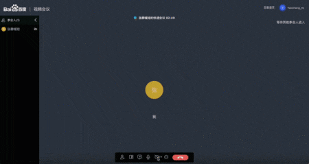
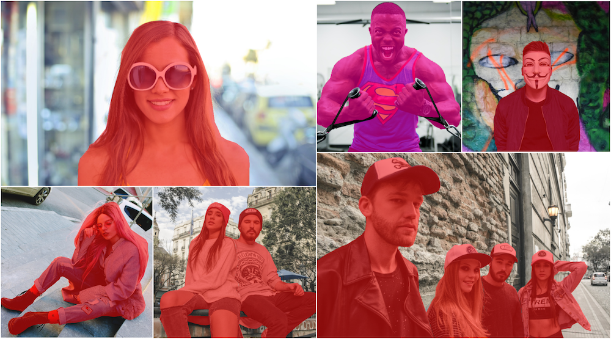
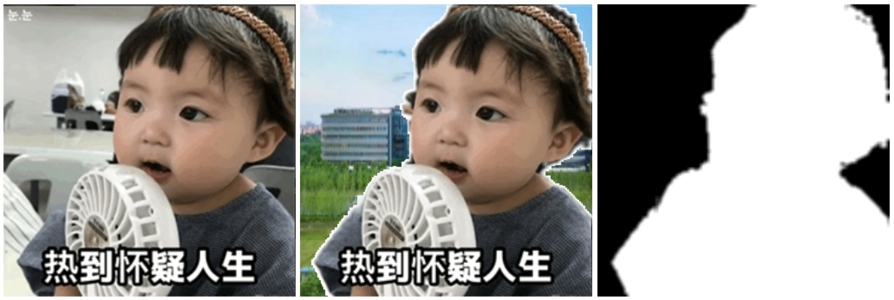
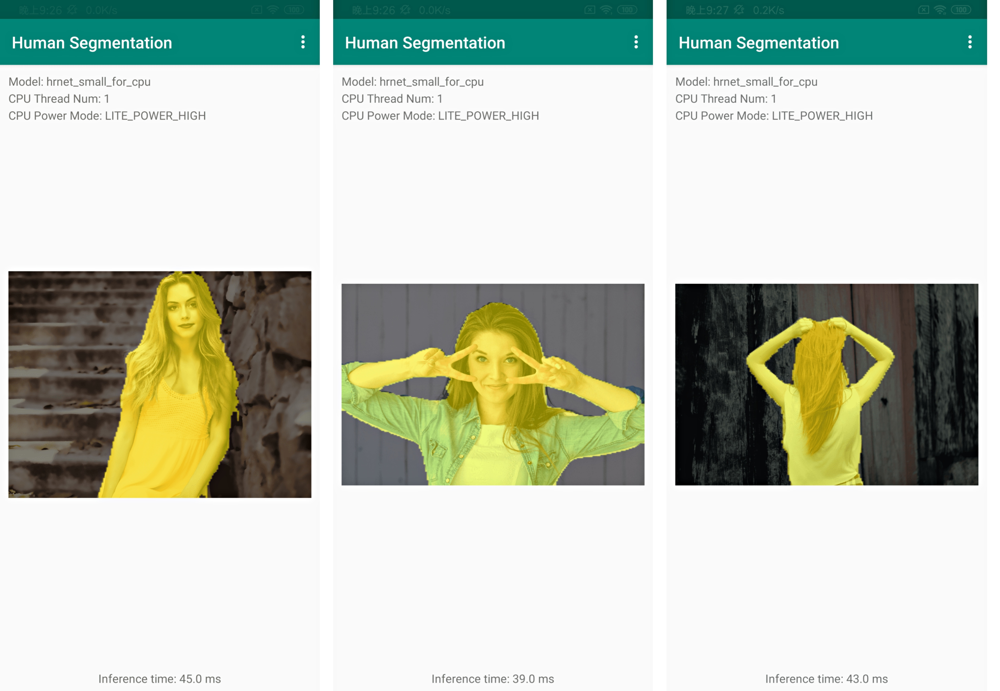
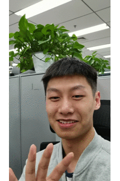
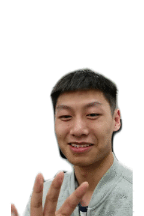
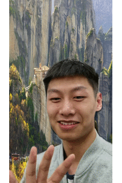

# 基于PaddleSeg实现人像分割

人像分割是图像分割领域非常常见的应用，PaddleSeg推出了在大规模人像数据上训练的人像分割PPSeg模型，满足在服务端、移动端、Web端多种使用场景的需求。本教程提供从训练到部署的全流程应用指南，以及视频流人像分割、背景替换的实际效果体验。最新发布超轻量级人像分割模型，支持Web端、移动端场景的实时分割。

近期 **百度视频会议** 上线了虚拟背景功能，支持在网页端视频会议时进行背景切换和背景虚化。其中人像换背景模型采用我们的**超轻量级模型PPSeg-Lite**。欢迎前去[百度首页](https://www.baidu.com/)右下角体验效果！

<p align="center">

</p>


**如果您觉得本案例对您有帮助，欢迎Star收藏一下，不易走丢哦~，链接指路：** 
[https://github.com/PaddlePaddle/awesome-DeepLearning](http://https://github.com/PaddlePaddle/awesome-DeepLearning)

# 1. 方案设计

本教程中，将用户上传的图片或视频作为输入，使用基于Supervisely Persons数据集训练的人像分割模型或预先准备好的Inference Model进行人像分割实验，实时返回分割结果显示给用户。

# 2. 环境搭建与准备	

1. 安装PaddlePaddle

版本要求

* PaddlePaddle >= 2.0.2

* Python >= 3.7+

由于图像分割模型计算开销大，推荐在GPU版本的PaddlePaddle下使用PaddleSeg。推荐安装10.0以上的CUDA环境。安装教程请见[PaddlePaddle官网](https://www.paddlepaddle.org.cn/install/quick?docurl=/documentation/docs/zh/install/pip/linux-pip.html)。

2. 安装PaddleSeg包


```python
pip install paddleseg
```

3. 下载PaddleSeg仓库


```python
# 若您在本地环境运行，使用git下载PaddleSeg代码
#git clone https://github.com/PaddlePaddle/PaddleSeg.git

# 为快速体验，此处我们已下载PaddleSeg代码，解压后可直接执行后续代码
unzip PaddleSeg.zip
```

以下案例中所有命令均在`PaddleSeg/contrib/HumanSeg`目录下执行。


```python
cd PaddleSeg/contrib/HumanSeg
```

# **3. 数据处理**

本教程使用了[supervise.ly](https://supervise.ly/)发布的人像分割数据集**Supervisely Persons**进行实验。Supervisely人像分割数据集包含 了5711张图片，以及6884个人像注释，所有数据都进行了精细化的标注。



在本教程中，我们从Supervisely人像分割数据集中随机抽取一小部分并转化成PaddleSeg可直接加载数据格式，同时提供了手机前置摄像头的人像视频`video_test.mp4`进行测试。通过运行以下代码进行快速下载：

---------
#### 参考文献
[1]Releasing “Supervisely Person” dataset for teaching machines to segment humans. Supervise.ly

---------


```python
python data/download_data.py
```

# **4. 模型构建**

当前PaddleSeg提供了以下模型用于人像分割任务，包括：通用人像分割模型以及半身像分割模型。

* **通用人像分割(Generic Human Segmentation)模型**

PPSeg开放了在大规模人像数据上训练的三个人像模型，满足服务端、移动端、Web端多种使用场景的需求。

| 模型名 | 模型说明 | Checkpoint | Inference Model |
| --- | --- | --- | ---|
| PPSeg-Server | 高精度模型，适用于服务端GPU且背景复杂的人像场景， 模型结构为Deeplabv3+/ResNet50, 输入大小（512， 512） |[ppseg_server_ckpt](https://paddleseg.bj.bcebos.com/dygraph/humanseg/train/deeplabv3p_resnet50_os8_humanseg_512x512_100k.zip) | [ppseg_server_inference](https://paddleseg.bj.bcebos.com/dygraph/humanseg/export/deeplabv3p_resnet50_os8_humanseg_512x512_100k_with_softmax.zip) |
| PPSeg-Mobile | 轻量级模型，适用于移动端或服务端CPU的前置摄像头场景，模型结构为HRNet_w18_samll_v1，输入大小（192， 192）  | [ppseg_mobile_ckpt](https://paddleseg.bj.bcebos.com/dygraph/humanseg/train/fcn_hrnetw18_small_v1_humanseg_192x192.zip) | [ppseg_mobile_inference](https://paddleseg.bj.bcebos.com/dygraph/humanseg/export/fcn_hrnetw18_small_v1_humanseg_192x192_with_softmax.zip) |
| PPSeg-Lite | 超轻量级模型，适用于Web端或移动端实时分割场景，例如手机自拍、Web视频会议，模型结构为百度自研模型，输入大小（192， 192） | [ppseg_lite_ckpt]() | [ppseg_lite_inference]() |


NOTE:
* 其中Checkpoint为模型权重，用于Fine-tuning场景。

* Inference Model为预测部署模型，包含`model.pdmodel`计算图结构、`model.pdiparams`模型参数和`deploy.yaml`基础的模型配置信息。

* 其中Inference Model适用于服务端的CPU和GPU预测部署，适用于通过Paddle Lite进行移动端等端侧设备部署。更多Paddle Lite部署说明查看[Paddle Lite文档](https://paddle-lite.readthedocs.io/zh/latest/)

**模型性能**

| 模型名 |Input Size | FLOPS | Parameters | 计算耗时 | 模型大小 |
|-|-|-|-|-|-|
| PPSeg-Server | 512x512 | 114G | 26.8M | 37.96ms | 103Mb |
| PPSeg-Mobile | 192x192 | 584M | 1.54M | 13.17ms | 5.9Mb |
| PPSeg-Lite | 192x192 | 121M | 137K | 10.51ms | 543Kb |

测试环境：Nvidia Tesla V100单卡。

* **半身像分割(Portrait Segmentation)模型**

针对Portrait segmentation场景，PPSeg开放了半身像分割模型，该模型已应用于百度视频会议。

| 模型名 | 模型说明 | Checkpoint | Inference Model |
| --- | --- | --- | ---|
| PPSeg-Lite | 超轻量级模型，适用于Web端或移动端实时分割场景，例如手机自拍、Web视频会议，模型结构为百度自研模型，推荐输入大小（398，224） | [ppseg_lite_portrait_ckpt](https://paddleseg.bj.bcebos.com/dygraph/ppseg/ppseg_lite_portrait_398x224.tar.gz) | [ppseg_lite_portrait_inference](https://paddleseg.bj.bcebos.com/dygraph/ppseg/ppseg_lite_portrait_398x224_with_softmax.tar.gz) |

**模型性能**

| 模型名 |Input Size | FLOPS | Parameters | 计算耗时 | 模型大小 |
|-|-|-|-|-|-|
| PPSeg-Lite | 398x224 | 266M | 137K | 23.49ms | 543Kb |
| PPSeg-Lite | 288x162 | 138M | 137K | 15.62ms | 543Kb |

测试环境: 使用Paddle.js converter优化图结构，部署于Web端，显卡型号AMD Radeon Pro 5300M 4 GB。

执行以下脚本快速下载所有Checkpoint作为预训练模型。


```python
python pretrained_model/download_pretrained_model.py
```

# 5. 模型训练
在本案例中，基于上述大规模数据预训练的模型，在抽取的部分[supervise.ly](https://supervise.ly/)数据集上进行Fine-tuning。为了方便大家快速体验人像分割模型的效果，本教程选取了较为轻量的HRNet w18 small v1模型进行实验，训练命令如下：


```python
export CUDA_VISIBLE_DEVICES=0 # 设置1张可用的卡
# windows下请执行以下命令
# set CUDA_VISIBLE_DEVICES=0
python train.py \
--config configs/fcn_hrnetw18_small_v1_humanseg_192x192_mini_supervisely.yml \
--save_dir saved_model/fcn_hrnetw18_small_v1_humanseg_192x192_mini_supervisely \
--save_interval 100 --do_eval --use_vdl
```

**NOTE**:

如果想要更改训练配置，需要修改`configs/fcn_hrnetw18_small_v1_humanseg_192x192_mini_supervisely.yml`配置文件中的具体参数。

更多命令行帮助可运行下述命令进行查看：


```python
python train.py --help
```

# 6. 模型评估
这里我们使用验证集来评估训练完成的模型。


```python
python val.py \
--config configs/fcn_hrnetw18_small_v1_humanseg_192x192_mini_supervisely.yml \
--model_path saved_model/fcn_hrnetw18_small_v1_humanseg_192x192_mini_supervisely/best_model/model.pdparams
```

# 7. 模型预测
这里我们使用下述命令进行模型预测， 预测结果默认保存在`./output/result/`文件夹中。


```python
python predict.py \
--config configs/fcn_hrnetw18_small_v1_humanseg_192x192_mini_supervisely.yml \
--model_path saved_model/fcn_hrnetw18_small_v1_humanseg_192x192_mini_supervisely/best_model/model.pdparams \
--image_path data/human_image.jpg
```

# 8. 模型导出

这里还可以将训练好的模型导出为静态图模型和PPSeg-Lite模型方便后续模型部署使用。

* **将模型导出为静态图模型**

请确保位于PaddleSeg目录下，执行以下脚本：


```python
export CUDA_VISIBLE_DEVICES=0 # 设置1张可用的卡
# windows下请执行以下命令
# set CUDA_VISIBLE_DEVICES=0
python ../../export.py \
--config configs/fcn_hrnetw18_small_v1_humanseg_192x192_mini_supervisely.yml \
--model_path saved_model/fcn_hrnetw18_small_v1_humanseg_192x192_mini_supervisely/best_model/model.pdparams \
--save_dir export_model/fcn_hrnetw18_small_v1_humanseg_192x192_mini_supervisely_with_softmax \
--without_argmax --with_softmax
```

* **导出PPSeg-Lite模型**


```python
python ../../export.py \
--config ../../configs/ppseg_lite/ppseg_lite_export_398x224.yml \
--save_dir export_model/ppseg_lite_portrait_398x224_with_softmax \
--model_path pretrained_model/ppseg_lite_portrait_398x224/model.pdparams \
--without_argmax --with_softmax
```

**导出脚本参数解释**

|参数名|用途|是否必选项|默认值|
|-|-|-|-|
|config|配置文件|是|-|
|save_dir|模型和visualdl日志文件的保存根路径|否|output|
|model_path|预训练模型参数的路径|否|配置文件中指定值|
|with_softmax|在网络末端添加softmax算子。由于PaddleSeg组网默认返回logits，如果想要部署模型获取概率值，可以置为True|否|False|
|without_argmax|是否不在网络末端添加argmax算子。由于PaddleSeg组网默认返回logits，为部署模型可以直接获取预测结果，我们默认在网络末端添加argmax算子|否|False|

**结果文件**

```shell
output
  ├── deploy.yaml            # 部署相关的配置文件
  ├── model.pdiparams        # 静态图模型参数
  ├── model.pdiparams.info   # 参数额外信息，一般无需关注
  └── model.pdmodel          # 静态图模型文件
```

# 9. 模型部署

* **Web端部署**



参见[Web端部署教程](https://github.com/PaddlePaddle/PaddleSeg/tree/release/2.3/deploy/web)

* **移动端部署**



参见[移动端部署教程](https://github.com/PaddlePaddle/PaddleSeg/tree/release/2.3/deploy/lite/)


# 10. 快速体验

这里我们为大家提供了已经训练好的 Inference Model 供大家快速体验人像分割功能。

* **下载Inference Model**

执行以下脚本快速下载所有Inference Model


```python
python export_model/download_export_model.py
```

* **视频流人像分割**

结合DIS（Dense Inverse Search-basedmethod）光流算法预测结果与分割结果，改善视频流人像分割。
```
# 通过电脑摄像头进行实时分割处理
python bg_replace.py \
--config export_model/ppseg_lite_portrait_398x224_with_softmax/deploy.yaml

# 对人像视频进行分割处理
python bg_replace.py \
--config export_model/deeplabv3p_resnet50_os8_humanseg_512x512_100k_with_softmax/deploy.yaml \
--video_path data/video_test.mp4
```


```python
# 对人像视频进行分割处理
python bg_replace.py \
--config export_model/deeplabv3p_resnet50_os8_humanseg_512x512_100k_with_softmax/deploy.yaml \
--video_path data/video_test.mp4
```

视频分割结果如下：



* **视频流背景替换**

根据所选背景进行背景替换，背景可以是一张图片，也可以是一段视频。
```
# 通过电脑摄像头进行实时背景替换处理, 也可通过'--background_video_path'传入背景视频
python bg_replace.py \
--config export_model/ppseg_lite_portrait_398x224_with_softmax/deploy.yaml \
--input_shape 224 398 \
--bg_img_path data/background.jpg

# 对人像视频进行背景替换处理, 也可通过'--background_video_path'传入背景视频
python bg_replace.py \
--config export_model/deeplabv3p_resnet50_os8_humanseg_512x512_100k_with_softmax/deploy.yaml \
--bg_img_path data/background.jpg \
--video_path data/video_test.mp4

# 对单张图像进行背景替换
python bg_replace.py \
--config export_model/ppseg_lite_portrait_398x224_with_softmax/deploy.yaml \
--input_shape 224 398 \
--img_path data/human_image.jpg
```


```python
# 对人像视频进行背景替换处理, 也可通过'--background_video_path'传入背景视频
python bg_replace.py \
--config export_model/deeplabv3p_resnet50_os8_humanseg_512x512_100k_with_softmax/deploy.yaml \
--bg_img_path data/background.jpg \
--video_path data/video_test.mp4

# 对单张图像进行背景替换
python bg_replace.py \
--config export_model/ppseg_lite_portrait_398x224_with_softmax/deploy.yaml \
--input_shape 224 398 \
--img_path data/human_image.jpg
```

背景替换结果如下：




**NOTE**:

视频分割处理时间需要几分钟，请耐心等待。

Portrait模型适用于宽屏拍摄场景，竖屏效果会略差一些。

# **资源**

更多资源请参考：

* 更多深度学习知识、产业案例，请参考：[awesome-DeepLearning](https://github.com/paddlepaddle/awesome-DeepLearning)

* 更多图像分割模型(DeepLab系列等)，请参考：[PaddleSeg](https://github.com/PaddlePaddle/PaddleSeg)

* 飞桨框架相关资料，请参考：[飞桨深度学习平台](https://www.paddlepaddle.org.cn/?fr=paddleEdu_aistudio)

**数据来源**

本案例数据集来源于：https://supervise.ly/