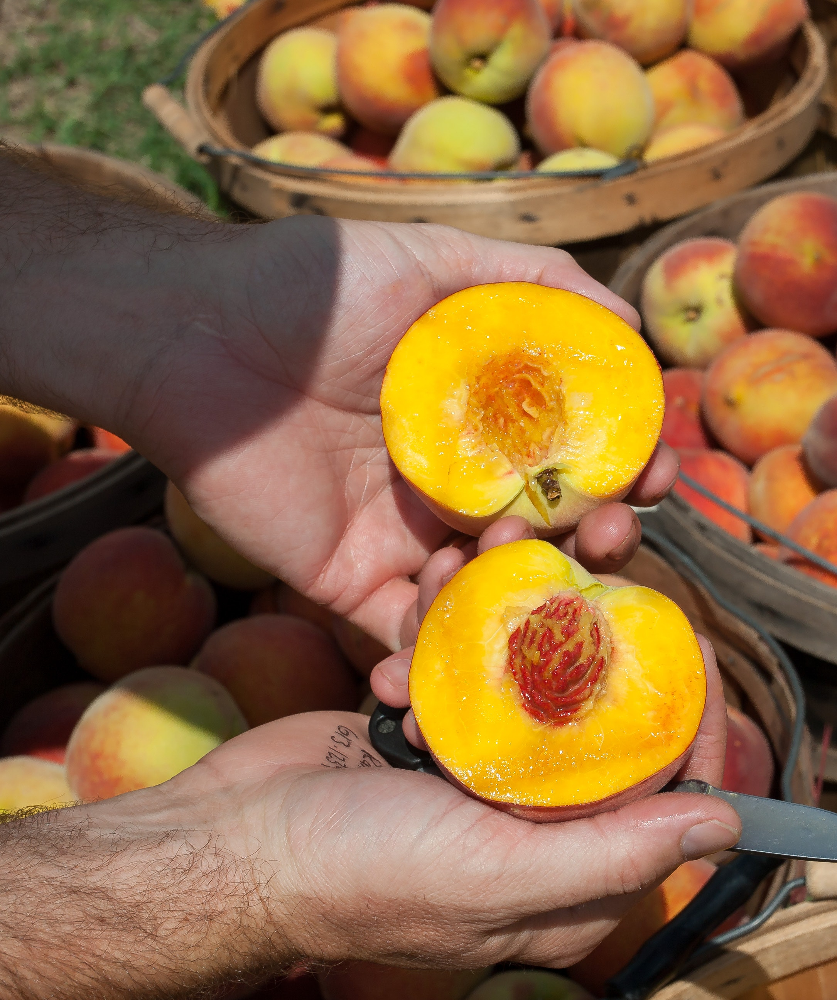
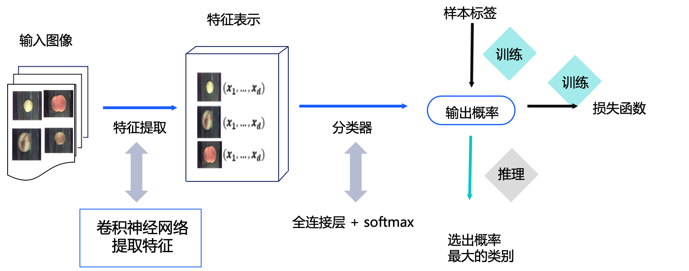
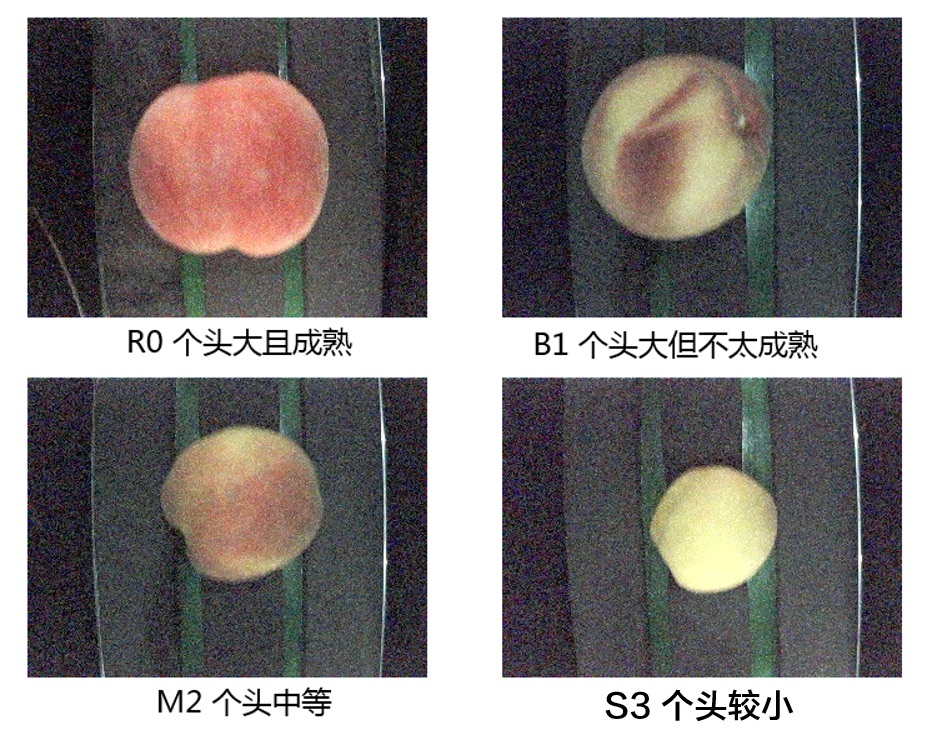

# **基于PaddleHub实现桃子分类**


随着时代的快速发展，人工智能已经融入我们生活的方方面面。中国的农业也因人工智能而受益进入高速发展阶段。现今，看庄稼长势有卫星遥感技术，水果分拣有智能分拣系统，灌溉施肥有自动化机械……

<center></center>

具体以水果分拣场景为例，大型的水果种植园每到丰收的季节，都会雇佣大量的分拣工人来分拣水果，这是一件人力成本很高的事情。另外，人工分拣水平层次不一还可能使得农场主收益受到很大影响。然而，如今智能水果分拣系统的出现，可以自动根据设置的水果等农作物的品级进行分拣，降低人力成本，提高处理效率，提升分拣的准确性，那么问题来了。

**如何搭建一套完整的智能水果分拣系统？巧了，PaddleHub正好可以帮你搞定完整的系统建立！**


今天我们带大家利用PaddleHub搭建ResNet50_vd网络，实现桃子分类，让大家亲自感受图像分类的魅力。
<br/>
**本实践旨在通过桃子分类来让大家对图像分类问题有一个初步了解，同时理解和掌握如何使用PaddleHub搭建一个经典的卷积神经网络。**
<br/>


**如果您觉得本案例对您有帮助，欢迎Star收藏一下，不易走丢哦~，链接指路：** 
[https://github.com/PaddlePaddle/awesome-DeepLearning](http://https://github.com/PaddlePaddle/awesome-DeepLearning)

# 1. 方案设计

本教程的设计方案如图2所示。对于一幅输入的桃子图像，首先使用ResNet50_vd网络提取特征，获取特征表示；然后使用分类器获取属于每个桃子类别的概率值。在训练阶段，通过模型输出的概率值与样本的真实标签构建损失函数，从而进行模型训练；在推理阶段，选出概率最大的类别作为最终的输出。

<center></center>


# 2. 环境搭建与准备	

安装PaddlePaddle: 参考[快速安装](https://www.paddlepaddle.org.cn/install/quick),aistudio已经预先安装好了PaddlePaddle。

安装PaddleHub:为了保证最新版本稳定，建议执行以下命令安装。


```python
pip install paddlehub==2.0.4 -i https://pypi.tuna.tsinghua.edu.cn/simple
```

# **3. 数据处理**

首先需要通过此[链接](https://aistudio.baidu.com/aistudio/datasetdetail/67225)下载桃子数据集。在该数据集中，已经提供了分割好的训练集、验证集、测试集的索引和标注文件。如果用户利用PaddleHub迁移CV类任务使用自定义数据，则需要自行切分数据集，将数据集切分为训练集、验证集和测试集。需要三个文本文件来记录对应的图片路径和标签，此外还需要一个标签文件用于记录标签的名称。相关方法可参考[自定义数据集](https://github.com/PaddlePaddle/PaddleHub/blob/release/v2.0/docs/docs_ch/tutorial/how_to_load_data.md)。该桃子分拣系统按照桃子品相分为4个等级。




其中：
* R0为最好：颜色鲜红且果实较大
* B1为次优：果实较大，颜色较红
* M2为中等：果实中等
* S3为较差：果实个头比较小

数据分为训练集、验证集和测试集，训练集为每种桃子各1500张，验证集每种桃子各100张，测试集每种桃子为15张。

```
├─data: 数据目录	
  ├─train_list.txt：训练集数据列表	
  ├─test_list.txt：测试集数据列表	
  ├─validate_list.txt：验证集数据列表	
  ├─label_list.txt：标签列表	
  └─……	
```
训练集、验证集和测试集的数据列表文件的格式如下，列与列之间以空格键分隔。

```
图片1路径 图片1标签	
图片2路径 图片2标签	
...
```

label_list.txt的格式如下：

```
分类1名称	
分类2名称	
...
```

下载好的数据集存放在`./dataset`目录下，随后进行数据集的解压：


```python
unzip -q -o ./dataset/peach.zip -d ./dataset
```

准备好数据后即可使用PaddleHub完成数据读取器的构建，实现方法如下所示：构建数据读取Python类，并继承paddle.io.Dataset这个类完成数据读取器构建。在定义数据集时，需要预先定义好对数据集的预处理操作，并且设置好数据模式。在数据集定义中，需要重新定义`__init__`，`__getitem__`和`__len__`三个部分。示例如下：


```python
#coding:utf-8
import os

import paddle
import paddlehub as hub


class DemoDataset(paddle.io.Dataset):
    def __init__(self, transforms, num_classes=4, mode='train'):	
        # 数据集存放位置
        self.dataset_dir = "./work/peach-classification"  #dataset_dir为数据集实际路径，需要填写全路径
        self.transforms = transforms
        self.num_classes = num_classes
        self.mode = mode

        if self.mode == 'train':
            self.file = 'train_list.txt'
        elif self.mode == 'test':
            self.file = 'test_list.txt'
        else:
            self.file = 'validate_list.txt'
        
        self.file = os.path.join(self.dataset_dir , self.file)
        self.data = []
        
        with open(self.file, 'r') as f:
            for line in f.readlines():
                line = line.strip()
                if line != '':
                    self.data.append(line)
            
    def __getitem__(self, idx):
        img_path, grt = self.data[idx].split(' ')
        img_path = os.path.join(self.dataset_dir, img_path)
        im = self.transforms(img_path)
        return im, int(grt)


    def __len__(self):
        return len(self.data)
```

将训练数据输入模型之前，我们通常还需要对原始数据做一些数据处理的工作，比如数据格式的规范化处理，或增加一些数据增强策略。

构建图像分类模型的数据读取器，负责将桃子dataset的数据进行预处理，以特定格式组织并输入给模型进行训练。

如下数据处理策略，只做了三种操作：

**1.指定输入图片的尺寸，并将所有样本数据统一处理成该尺寸。**

**2.对输入图像进行裁剪，并且保持图片中心点不变。**

**3.对所有输入图片数据进行归一化处理。**

对数据预处理及加载数据集的示例如下：


```python
import paddlehub.vision.transforms as T

transforms = T.Compose(
        [T.Resize((256, 256)),
         T.CenterCrop(224),
         T.Normalize(mean=[0.485, 0.456, 0.406], std=[0.229, 0.224, 0.225])],
        to_rgb=True)

peach_train = DemoDataset(transforms)
peach_validate =  DemoDataset(transforms, mode='val')
peach_test =  DemoDataset(transforms, mode='test')
```

PaddleHub提供了丰富的数据预处理方式，具体可以参见[预处理](https://github.com/PaddlePaddle/PaddleHub/blob/release/v2.0.0-beta/docs/docs_ch/reference/vision.md)。

# **4. 模型构建**

我们要在PaddleHub中选择合适的预训练模型来Fine-tune，由于桃子分类是一个图像分类任务，这里采用Resnet50模型，并且是采用ImageNet数据集预训练过的版本。这个预训练模型是在图像任务中的一个“万金油”模型，Resnet是目前较为有效的处理图像的网络结构，50层是一个精度和性能兼顾的选择，而ImageNet又是计算机视觉领域公开的最大的分类数据集。所以，在不清楚选择什么模型好的时候，可以优先以这个模型作为baseline。


使用PaddleHub加载ResNet50模型，十分简单，只需一行代码即可实现。关于更多预训练模型信息参见[PaddleHub模型介绍](https://www.paddlepaddle.org.cn/hub)


```python
#安装预训练模型
hub install resnet50_vd_imagenet_ssld==1.1.0
```


```python
# 加载模型

import paddlehub as hub

model = hub.Module(name='resnet50_vd_imagenet_ssld', label_list=["R0", "B1", "M2", "S3"])
```

# **5. 模型训练** 
完整的训练过程包括：构建训练集，指定优化器，使用Resnet50模型进行Fine-tune。命令如下：


```python
python code/train.py
```

# 6. 模型评估
使用测试集来评估训练完成的模型，命令如下：


```python
python code/val.py
```

# **7. 模型推理**
使用训练完成的模型来预测测试集中的一张图片，观察预测结果与真实结果是否一致，命令如下：


```python
python code/test.py
```

# **8. 模型部署**

想用我们自己训练的分拣桃子的网络参数，先配置`config.json`文件：
```
{
  "modules_info": {
    "resnet50_vd_imagenet_ssld": {
      "init_args": {
          "version": "1.1.0",
          "label_list":["R0", "B1", "M2", "S3"],
          "load_checkpoint": "img_classification_ckpt/best_model/model.pdparams"
      },
      "predict_args": {
          "batch_size": 1
      }

    }
  },
  "port": 8866,
  "gpu": "0"
}
```

借助 PaddleHub，服务器端的部署也非常简单，直接用一条命令行在服务器启动resnet50分类模型就行了：

```shell
$ hub serving start --config config.json
```

是的，在服务器端这就完全没问题了。相比手动配置各种参数或者调用各种框架，PaddleHub 部署服务器实在是太好用了。

**NOTE:** 如使用GPU预测，则需要在启动服务之前，请设置CUDA_VISIBLE_DEVICES环境变量，否则不用设置。

在服务端发送请求，请求脚本如下：


```python
import requests
import json
import cv2
import base64

import numpy as np


def cv2_to_base64(image):
    data = cv2.imencode('.jpg', image)[1]
    return base64.b64encode(data.tostring()).decode('utf8')

def base64_to_cv2(b64str):
    data = base64.b64decode(b64str.encode('utf8'))
    data = np.fromstring(data, np.uint8)
    data = cv2.imdecode(data, cv2.IMREAD_COLOR)
    return data

# 发送HTTP请求
org_im = cv2.imread('/PATH/TO/IMAGE')

data = {'images':[cv2_to_base64(org_im)], 'top_k':1}
headers = {"Content-type": "application/json"}
url = "http://127.0.0.1:8866/predict/resnet50_vd_imagenet_ssld"
r = requests.post(url=url, headers=headers, data=json.dumps(data))
data =r.json()["results"]['data']
```

相信只要有一些 Python 基础，在本地预测、以及部署到服务器端都是没问题的，飞桨的 PaddleHub 已经帮我们做好了各种处理过程。

# **资源**

更多资源请参考：

* 更多深度学习知识、产业案例，请参考：[awesome-DeepLearning](https://github.com/paddlepaddle/awesome-DeepLearning)

* 更多预训练模型(图像、文本、语音、视频等)，请参考：[PaddleHub](https://github.com/PaddlePaddle/PaddleHub)

* 飞桨框架相关资料，请参考：[飞桨深度学习平台](https://www.paddlepaddle.org.cn/?fr=paddleEdu_aistudio)

**数据来源**

本案例数据集来源于：https://aistudio.baidu.com/aistudio/datasetdetail/67225