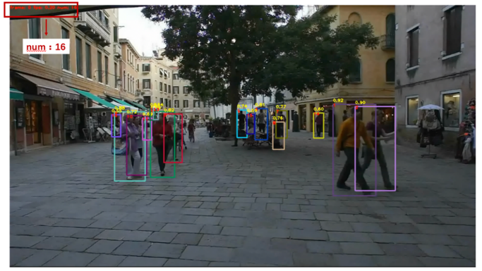
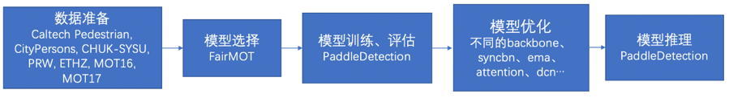
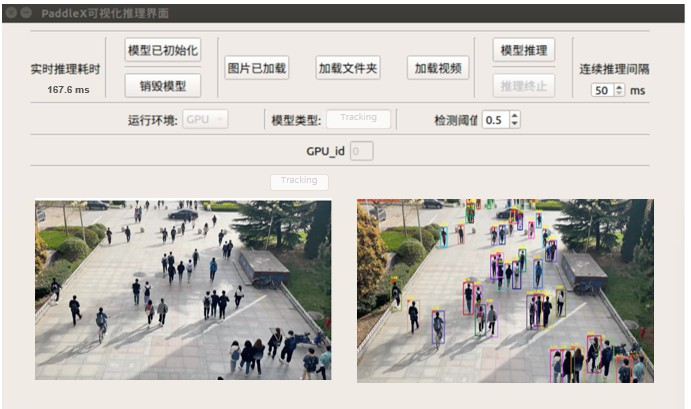

# 人流量统计

## 1. 项目概述

在地铁站、火车站、机场、展馆、景区等公共场所，需要实时检测人流数量，当人流密度过高时及时预警，并实施导流、限流等措施，防止安全隐患。
在人流密度较高的公共场所，使用PaddleDetection多目标跟踪方案，可以实现动态场景下和静态场景下的人流数量统计，帮助场所工作人员制定智能化管理方案，模型效果如 **图1** 所示。


<center>图1 人流量统计效果</center><br></br>

本案例提供从“模型选择→模型优化→模型部署”的全流程指导，模型可以直接或经过少量数据微调后用于相关任务中，无需耗时耗力从头训练。

本项目AI Studio链接：https://aistudio.baidu.com/aistudio/projectdetail/2421822

**如果您觉得本案例对您有帮助，欢迎Star收藏一下，不易走丢哦~，链接指路：** [awesome-DeepLearning](https://github.com/PaddlePaddle/awesome-DeepLearning)


## 2.技术难点 

* **人流密度过高时，容易造成漏检：** 在人流密度较高的场合，人与人之间存在遮挡，会导致模型误检、漏检问题。
* **在动态场景下，容易造成重识别问题：** 模型需要对遮挡后重新出现的行人进行准确的重识别，否则对一段时间内的人流统计会有较大的影响。


## 3. 解决方案

人流量统计任务需要在检测到目标的类别和位置信息的同时，识别出帧与帧间的关联信息，确保视频中的同一个人不会被多次识别并计数。本案例选取PaddleDetection目标跟踪算法中的FairMOT模型来解决人流量统计问题。 

FairMOT以Anchor Free的CenterNet检测器为基础，深浅层特征融合使得检测和ReID任务各自获得所需要的特征，实现了两个任务之间的公平性，并获得了更高水平的实时多目标跟踪精度。 

针对拍摄角度不同（平角或俯角）以及人员疏密程度，在本案例设计了不同的训练方法：

* **针对人员相对稀疏的场景：** 基于Caltech Pedestrian、CityPersons、CHUK-SYSU、PRW、ETHZ、MOT16和MOT17数据集进行训练，**对场景中的行人进行全身检测和跟踪。** 如 **图2** 所示，模型会对场景中检测到的行人进行标识，并在左上角显示出该帧场景下的行人数量，实现人流量统计。

  

  <center>图2 对行人进行全身检测和跟踪</center><br></br>

* **针对人员相对密集的场景：** 人与人之间的遮挡问题会非常严重，这时如果选择对行人整体检测，会导致漏检率升高。因此，本场景中使用人头跟踪方法。基于HT-21数据集进行训练，**对场景中的行人进行人头检测和跟踪**，对人流量的统计基于检测到的人头进行计数，如 **图3** 所示。

  

  <center>图3 对行人进行人头检测和跟踪</center><br></br>

  使用PaddleDetection完成人流量统计任务，只需完成如 **图4** 所示的步骤：

  

<center>图4 实现流程</center><br></br>

## 5. 数据准备

### 数据集介绍与获取

请参照 [数据准备文档](https://github.com/PaddlePaddle/PaddleDetection/blob/release/2.2/docs/tutorials/PrepareMOTDataSet_cn.md) 去下载并准备好所有的数据集，包括 Caltech Pedestrian, CityPersons, CHUK-SYSU, PRW, ETHZ, MOT17和MOT16。训练时，我们采用前六个数据集，共 53694 张已标注好的数据集用于训练。MOT16作为评测数据集。所有的行人都有检测框标签，部分有ID标签。如果您想使用这些数据集，请遵循他们的License。对数据集的详细介绍参见：[数据集介绍](dataset.md)

### 调优数据集

与单纯的训练使用的数据集不同，如需做调优实验，我们采用 Caltech Pedestrian, CityPersons, CHUK-SYSU, PRW, ETHZ和MOT17中一半的数据集作为训练数据集，使用MOT17另一半数据集作为评测数据集。调优时和训练时使用的数据集不同，主要是因为MOT官网的测试集榜单提交流程比较复杂，这种数据集的使用方式也是学术界慢慢摸索出的做消融实验的方法。调优时使用的训练数据共 51035 张。

### 数据格式

上述数据集都遵循以下结构：

```
Caltech
   |——————images
   |        └——————00001.jpg
   |        |—————— ...
   |        └——————0000N.jpg
   └——————labels_with_ids
            └——————00001.txt
            |—————— ...
            └——————0000N.txt
MOT17
   |——————images
   |        └——————train
   |        └——————test
   └——————labels_with_ids
            └——————train
```

所有数据集的标注是以统一数据格式提供的。各个数据集中每张图片都有相应的标注文本。给定一个图像路径，可以通过将字符串`images`替换为 `labels_with_ids`并将 `.jpg`替换为`.txt`来生成标注文本路径。在标注文本中，每行都描述一个边界框，格式如下：

```
[class] [identity] [x_center] [y_center] [width] [height]
```

注意：

* `class`为`0`，目前仅支持单类别多目标跟踪。
* `identity`是从`1`到`num_identifies`的整数(`num_identifies`是数据集中不同物体实例的总数)，如果此框没有`identity`标注，则为`-1`。
* `[x_center] [y_center] [width] [height]`是中心点坐标和宽高，它们的值是基于图片的宽度/高度进行标准化的，因此值为从0到1的浮点数。

### 数据集目录

首先按照以下命令下载`image_lists.zip`并解压放在`dataset/mot`目录下：

```bash
wget https://dataset.bj.bcebos.com/mot/image_lists.zip
```

然后依次下载各个数据集并解压，最终目录为：

```
dataset/mot
  |——————image_lists
            |——————caltech.10k.val  
            |——————caltech.all  
            |——————caltech.train  
            |——————caltech.val  
            |——————citypersons.train  
            |——————citypersons.val  
            |——————cuhksysu.train  
            |——————cuhksysu.val  
            |——————eth.train  
            |——————mot15.train  
            |——————mot16.train  
            |——————mot17.train  
            |——————mot20.train  
            |——————prw.train  
            |——————prw.val
  |——————Caltech
  |——————Cityscapes
  |——————CUHKSYSU
  |——————ETHZ
  |——————MOT16
  |——————MOT17
  |——————PRW
```


## 6. 模型选择

PaddleDetection对于多目标追踪算法主要提供了三种模型，DeepSORT、JDE和FairMOT。

- [DeepSORT](https://arxiv.org/abs/1812.00442) (Deep Cosine Metric Learning SORT) 扩展了原有的 [SORT](https://arxiv.org/abs/1703.07402) (Simple Online and Realtime Tracking) 算法，增加了一个CNN模型用于在检测器限定的人体部分图像中提取特征，在深度外观描述的基础上整合外观信息，将检出的目标分配和更新到已有的对应轨迹上即进行一个ReID重识别任务。DeepSORT所需的检测框可以由任意一个检测器来生成，然后读入保存的检测结果和视频图片即可进行跟踪预测。ReID模型此处选择 [PaddleClas](https://github.com/PaddlePaddle/PaddleClas) 提供的`PCB+Pyramid ResNet101`模型。
- [JDE](https://arxiv.org/abs/1909.12605) (Joint Detection and Embedding) 是在一个单一的共享神经网络中同时学习目标检测任务和embedding任务，并同时输出检测结果和对应的外观embedding匹配的算法。JDE原论文是基于Anchor Base的YOLOv3检测器新增加一个ReID分支学习embedding，训练过程被构建为一个多任务联合学习问题，兼顾精度和速度。
- [FairMOT](https://arxiv.org/abs/2004.01888) 以Anchor Free的CenterNet检测器为基础，克服了Anchor-Based的检测框架中anchor和特征不对齐问题，深浅层特征融合使得检测和ReID任务各自获得所需要的特征，并且使用低维度ReID特征，提出了一种由两个同质分支组成的简单baseline来预测像素级目标得分和ReID特征，实现了两个任务之间的公平性，并获得了更高水平的实时多目标跟踪精度。

综合精度和速度，这里我们选择了FairMOT算法进行人流量统计/人体检测。


## 7. 模型训练

下载PaddleDetection

```bash
git clone https://github.com/PaddlePaddle/PaddleDetection.git
```

**说明：** 本实验使用**PaddleDetection release/2.2**，如遇PaddleDetection更新训练效果出现变动，可尝试下载PaddleDetection 2.2版本进行实验。

在训练前先正确安装PaddleDetection所需依赖：

```bash
cd PaddleDetection/
pip install -r requirements.txt
```

运行如下代码开始训练模型：

使用两个GPU开启训练

```bash
python -m paddle.distributed.launch --log_dir=./fairmot_dla34_30e_1088x608/ --gpus 0,1 tools/train.py -c configs/mot/fairmot/fairmot_dla34_30e_1088x608.yml
```


## 8. 模型评估

### 评估指标

本案例使用MOTA（Multiple Object Tracking Accuracy，多目标跟踪准确率）作为评估指标。MOTA衡量了除误报、丢失目标、ID异常切换等情况以外的正确预测样本占所有样本的比率。它衡量的是跟踪器在检测目标和保持轨迹时的性能，与目标位置的估计精度无关。
$$
MOTA = 1 - \frac{\sum_t(m_t + fp_t + mme_t)}{\sum_t g_t}
$$
其中，$m_t$ 是漏检数，在第 $t$ 帧中本该检测到的目标并没有被检测到；

$fp_t$ 代表误检数，即在第t帧给出的假设位置没有跟踪目标与其匹配；

$mme_t$ 代表误配数，即在第t帧中跟踪目标发生ID切换的次数，问题多发生在这种情况下。


FairMOT使用单张GPU通过如下命令一键式启动评估：

```bash
CUDA_VISIBLE_DEVICES=0 python tools/eval_mot.py -c configs/mot/fairmot/fairmot_dla34_30e_1088x608.yml -o weights=output/fairmot_dla34_30e_1088x608/model_final.pdparams
```

**注意:** 默认评估的是MOT-16 Train Set数据集，如需换评估数据集可参照以下代码修改`configs/datasets/mot.yml`，修改`data_root`：

```bash
EvalMOTDataset:
  !MOTImageFolder
    dataset_dir: dataset/mot
    data_root: MOT16/images/train
    keep_ori_im: False # set True if save visualization images or video
```

依据 `fairmot_dla34_30e_1088x608.yml` 配置文件进行训练并在MOT-16 Train Set数据集上评估后，会得到如下结果：

| 骨干网络 | MOTA |
| -------- | ---- |
| DLA-34   | 83.2 |


## 9. 模型优化(进阶)

具体内容参见[模型优化文档](./improvements.md)。


## 10. 模型预测

使用单个GPU通过如下命令预测一个视频，并保存为视频

```bash
# 预测一个视频
CUDA_VISIBLE_DEVICES=0 python tools/infer_mot.py -c configs/mot/fairmot/fairmot_dla34_30e_1088x608.yml -o weights=https://paddledet.bj.bcebos.com/models/mot/fairmot_dla34_30e_1088x608.pdparams --video_file={your video name}.mp4 --frame_rate=20 --save_videos
```

使用单个GPU通过如下命令预测一个图片文件夹，并保存为视频

```bash
# 预测一个图片文件夹
CUDA_VISIBLE_DEVICES=0 python tools/infer_mot.py -c configs/mot/fairmot/fairmot_dla34_30e_1088x608.yml -o weights=https://paddledet.bj.bcebos.com/models/mot/fairmot_dla34_30e_1088x608.pdparams --image_dir={your infer images folder} --save_videos
```

**注意:** 请先确保已经安装了[ffmpeg](https://ffmpeg.org/ffmpeg.html), Linux(Ubuntu)平台可以直接用以下命令安装：`apt-get update && apt-get install -y ffmpeg`。`--frame_rate`表示视频的帧率，表示每秒抽取多少帧，可以自行设置，默认为-1表示会使用OpenCV读取的视频帧率。


## 11. 模型导出

```bash
CUDA_VISIBLE_DEVICES=0 python tools/export_model.py -c configs/mot/fairmot/fairmot_dla34_30e_1088x608.yml -o weights=https://paddledet.bj.bcebos.com/models/mot/fairmot_dla34_30e_1088x608.pdparams
```


## 12.模型部署

本案例为用户提供了基于Jetson NX的部署Demo方案，如下图所示。支持用户输入单张图片、文件夹文件夹或视频流进行预测。




## 12.人头跟踪

人流量统计/人体检测对高人群密度场景表现不佳，人头跟踪更适用于密集场景的跟踪。人头跟踪使用的仍是PaddleDetection多目标跟踪算法FairMOT，其区别在于人头跟踪基于 [HT-21](https://motchallenge.net/data/Head_Tracking_21) 数据集进行训练。HT-21是一个高人群密度拥挤场景下的人头跟踪数据集，场景包括不同的光线和环境条件下的拥挤的室内和室外场景，所有序列的帧速率都是25fps。

### 模型库

**FairMOT在HT-21 Training Set上结果**

| 骨干网络 | 输入尺寸 | MOTA | 下载链接                                                     | 配置文件                                                     |
| -------- | -------- | ---- | ------------------------------------------------------------ | ------------------------------------------------------------ |
| DLA-34   | 1088x608 | 67.2 | [下载链接](https://paddledet.bj.bcebos.com/models/mot/fairmot_dla34_30e_1088x608_headtracking21.pdparams) | [配置文件](https://github.com/PaddlePaddle/PaddleDetection/tree/release/2.2/configs/mot/headtracking21/fairmot_dla34_30e_1088x608_headtracking21.yml) |

**FairMOT在HT-21 Test Set上结果**

| 骨干网络 | 输入尺寸 | MOTA | 下载链接                                                     | 配置文件                                                     |
| -------- | -------- | ---- | ------------------------------------------------------------ | ------------------------------------------------------------ |
| DLA-34   | 1088x608 | 58.2 | [下载链接](https://paddledet.bj.bcebos.com/models/mot/fairmot_dla34_30e_1088x608_headtracking21.pdparams) | [配置文件](https://github.com/PaddlePaddle/PaddleDetection/tree/release/2.2/configs/mot/headtracking21/fairmot_dla34_30e_1088x608_headtracking21.yml) |


***
**注意：**

 FairMOT使用2个GPU进行训练，每个GPU上batch size为6，训练30个epoch。

### 快速开始

#### 1. 训练

使用2个GPU通过如下命令一键式启动训练

```bash
python -m paddle.distributed.launch --log_dir=./fairmot_dla34_30e_1088x608_headtracking21/ --gpus 0,1 tools/train.py -c configs/mot/headtracking21/fairmot_dla34_30e_1088x608_headtracking21.yml
```

#### 2. 评估

使用单张GPU通过如下命令一键式启动评估

```bash
# 使用PaddleDetection发布的权重
CUDA_VISIBLE_DEVICES=0 python tools/eval_mot.py -c configs/mot/headtracking21/fairmot_dla34_30e_1088x608_headtracking21.yml -o weights=https://paddledet.bj.bcebos.com/models/mot/fairmot_dla34_30e_1088x608_headtracking21.pdparams
```

```bash
# 使用训练保存的checkpoint
CUDA_VISIBLE_DEVICES=0 python tools/eval_mot.py -c configs/mot/headtracking21/fairmot_dla34_30e_1088x608_headtracking21.yml -o weights=output/fairmot_dla34_30e_1088x608_headtracking21/model_final.pdparams
```


#### 3. 预测

使用单个GPU通过如下命令预测一个视频，并保存为视频。

```bash
# 预测一个视频
CUDA_VISIBLE_DEVICES=0 python tools/infer_mot.py -c configs/mot/headtracking21/fairmot_dla34_30e_1088x608_headtracking21.yml -o weights=https://paddledet.bj.bcebos.com/models/mot/fairmot_dla34_30e_1088x608_headtracking21.pdparams --video_file={your video name}.mp4  --save_videos
```

**注意：**

请先确保已经安装了[ffmpeg](https://ffmpeg.org/ffmpeg.html), Linux(Ubuntu)平台可以直接用以下命令安装：`apt-get update && apt-get install -y ffmpeg`。

#### 4. 导出预测模型

```bash
CUDA_VISIBLE_DEVICES=0 python tools/export_model.py -c configs/mot/headtracking21/fairmot_dla34_30e_1088x608_headtracking21.yml -o weights=https://paddledet.bj.bcebos.com/models/mot/fairmot_dla34_30e_1088x608_headtracking21.pdparams
```

#### 5. 用导出的模型基于Python去预测

```bash
python deploy/python/mot_jde_infer.py --model_dir=output_inference/fairmot_dla34_30e_1088x608_headtracking21 --video_file={your video name}.mp4 --device=GPU --save_mot_txts
```

**注意：**

 跟踪模型是对视频进行预测，不支持单张图的预测，默认保存跟踪结果可视化后的视频，可添加`--save_mot_txts`表示保存跟踪结果的txt文件，或`--save_images`表示保存跟踪结果可视化图片。


## 资源

更多资源请参考：

* 更多深度学习知识、产业案例，请参考：[awesome-DeepLearning](https://github.com/paddlepaddle/awesome-DeepLearning)

* 更多目标检测模型，请参考：[PaddleDetection](https://github.com/PaddlePaddle/PaddleDetection)

* 更多学习资料请参阅[飞桨深度学习平台](https://www.paddlepaddle.org.cn/?fr=paddleEdu_aistudio)

  

## 13. 引用

```
@article{zhang2020fair,
	title={FairMOT: On the Fairness of Detection and Re-Identification in Multiple Object Tracking},
	author={Zhang, Yifu and Wang, Chunyu and Wang, Xinggang and Zeng, Wenjun and Liu, Wenyu},
	journal={arXiv preprint arXiv:2004.01888},
	year={2020}
}

@InProceedings{Sundararaman_2021_CVPR,
	author={Sundararaman, Ramana and De Almeida Braga, Cedric and Marchand, Eric and Pettre, Julien},
	title={Tracking Pedestrian Heads in Dense Crowd},
	booktitle={Proceedings of the IEEE/CVF Conference on Computer Vision and Pattern Recognition (CVPR)},
	month={June},
	year={2021},
	pages={3865-3875}
}
```
