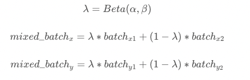

# 模型优化

## 可变形卷积

可变形卷积网络(Deformable Convolution Network, DCN)顾名思义就是卷积的位置是可变形的，并非在传统的$$N × N$$的网格上做卷积，这样的好处就是更准确地提取到我们想要的特征（传统的卷积仅仅只能提取到矩形框的特征）。本实验在CenterNet head中加入了DCN，具体新的CenterNet head代码见centernet_head_dcn.py。在head中加入dcn后，模型的MOTA从原来的34.9%上升为39.3%，增长了4.4%。

## 数据增强
Mixup 是最先提出的图像混叠增广方案，其原理简单、方便实现，不仅在图像分类上，在目标检测上也取得了不错的效果。为了便于实现，通常只对一个 batch 内的数据进行混叠。
Mixup原理公式为：
<center></center>
Mixup后图像可视化如下图所示：
<center></center>
在baseline中加入dcn后再加入mixup数据增强，模型MOTA为36.8%，比只加入dcn下降了2.5%。

具体为在fairmot_reader_1088x608.yml文件中TrainReader的sample_transforms下加入- Mixup: {alpha: 1.5, beta: 1.5}，在TrainReader中加入mixup_epoch: 25。

mixup_epoch (int): 在前mixup_epoch轮使用mixup增强操作；当该参数为-1时，该策略不会生效。默认为-1。

## 指数移动平均（EMA）
在深度学习中，经常会使用EMA（指数移动平均）这个方法对模型的参数做平均，以求提高测试指标并增加模型鲁棒。指数移动平均（Exponential Moving Average）也叫权重移动平均（Weighted Moving Average），是一种给予近期数据更高权重的平均方法。
本实验在baseline中加入dcn的基础上加入了EMA，ema_decay=0.9998。模型MOTA为38.5%，比只加入dcn下降了0.8%。
具体为在fairmot_dla34.yml文件中添加
```
use_ema: true
ema_decay: 0.9998
```

## conf和tracked阈值修改

在fairmot_dla34.yml文件中JDETracker下有conf_thres和tracked_thresh两个超参数，分别用于是检测的阈值和跟踪的阈值，默认均为0.4，将两者都改成0.2后，在baseline基础上加入dcn的模型，MOTA从39.3%降为35.7%，下降3.6%。

## sync_bn

默认情况下，在使用多个GPU卡训练模型的时候，Batch Normzlization都是非同步的（unsynchronized），即归一化操作是基于每个GPU上的数据进行的，卡与卡之间不同步。在fairmot_dla34.yml文件中加入norm_type: sync_bn可实现多卡训练时归一化同步的功能。

baseline+dcn+ema基础上加上sync_bn MOTA从38.5%提升到了38.6%，提升了0.1%。

## dla60

baseline中centernet的backbone为dla34，将dla34换成更大的dla60后，之前的预训练模型不能再用，在加入dcn的情况下，MOTA从39.3%降为22.5%，下降了16.8%。可见预训练模型的重要性。

dla60具体代码见dla.py文件，将class DLA(nn.Layer)中__init__函数输入参数depth改为60。

## hardnet85

将baseline中centernet的backbone换为hardnet85，预训练模型在coco数据集上训练而得。hardnet85网络结构的配置文件见fairmot_hardnet85.yml。利用hardnet85训练的配置文件见fairmot_hardnet85_30e_1088x608.yml。在bdd100k数据集上训练模型的配置文件：fairmot_hardnet85_30e_1088x608_bdd100k_vehicle.yml。训练8个epoch的mota可达到39.1%。

在上面的实验基础上加入sync_bn，8卡训练epoch=12时，mota为39.8%。

继续在上面的基础上加入dcn，4卡训练epoch=12是MOTA为39.2%。

## BDD100K所有四轮车数据看作一个类别

centernet的backbone为dla34，coco数据集进行模型的预训练，lr=0.0005  bs=16*8卡，12epoch（8epoch降lr），MOTA为39.6%。

和上述配置相同的情况下，加入8万张bdd100kdet_vehicle数据集一起训，MOTA为39.7%，提升了0.1%。

同样是dla34作为baseline，coco预训练，4gpu, bs6, 12epoch(8epoch降lr), lr=0.0002，MOTA为38.1%，比8卡训练下降1.5%。

centernet的backbone由dla34换作是hardnet85后，用4卡训练，在epoch=8时，mota为38.9%，比dla34四卡高0.8%。

