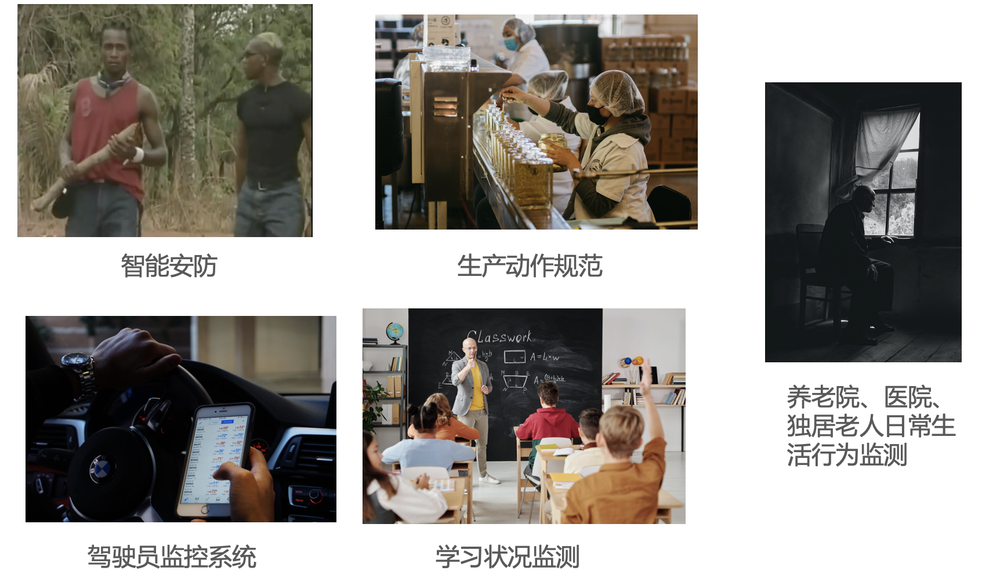
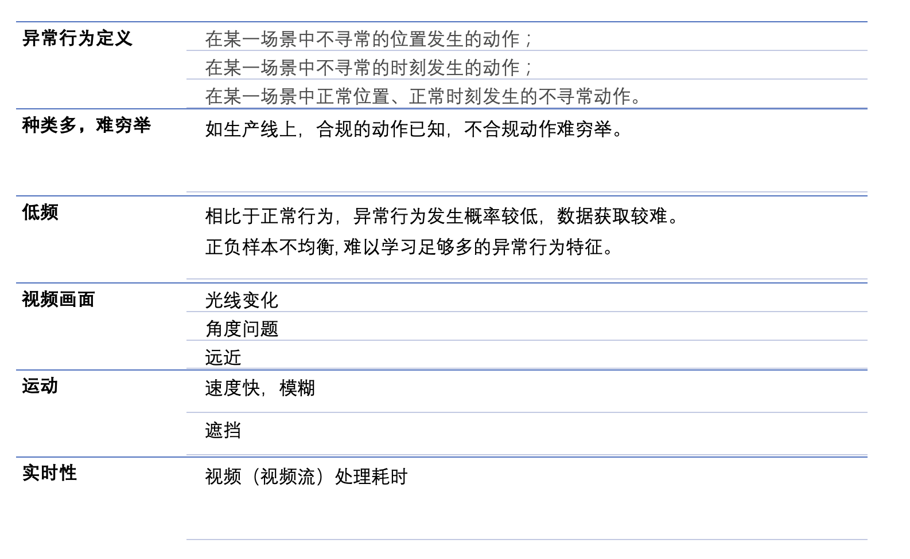
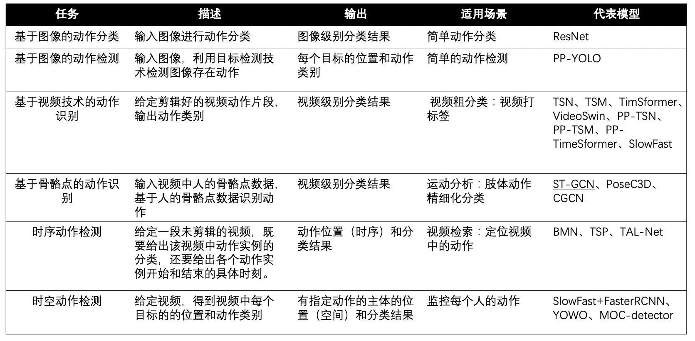
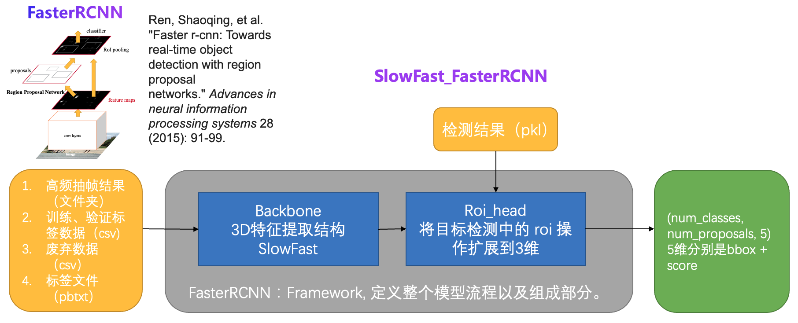
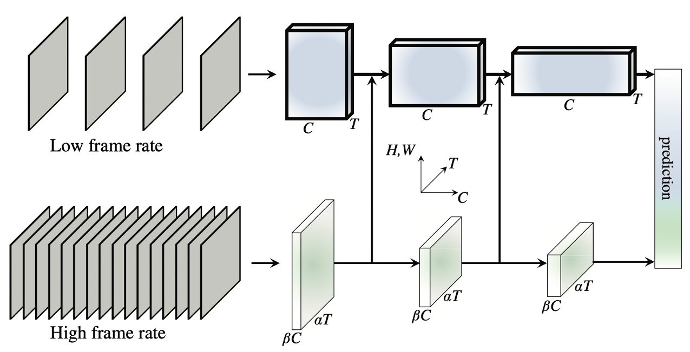
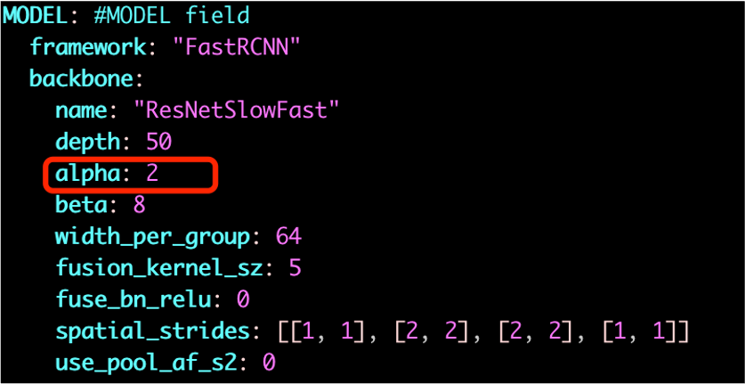
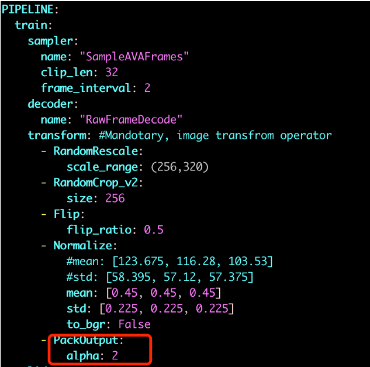
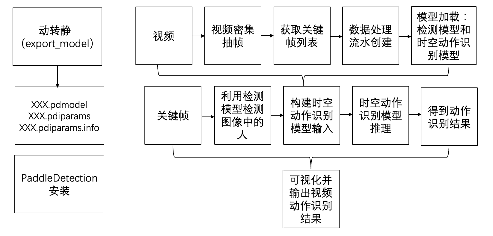

# 基于时空的6类异常行为检测

## 内容

* [项目概述](#项目概述)

* [技术难点](#技术难点)

* [解决方案](#解决方案)

* [数据准备](#数据准备)

* [模型训练](#模型训练)

* [模型评估](#模型评估)

* [模型优化](#模型优化)

* [模型推理](#模型推理)

* [参考文献](#参考文献)

* [资源](#资源)

<a name="项目概述"></a>

# 1.项目概述
异常行为的识别与检测有着广泛的应用场景：

* 在公共区域，监控录像覆盖范围越来越广泛，以监控和防止各种异常行为的发生。
* 在生产线上，通过监控监测员工的生成动作是否规范。
* 在智能驾驶领域，通过监控监测司机是否有违规的行为，如打电话等。
* 在智慧课堂，通过教室内监控，查看是否有扰乱课堂秩序的事件发生。
* 在养老院、医院、独居老人生活的场所，通过视频监控，查看是否有摔倒等行为的发生。
* ...

<center></center>
<center>图1 异常行为检测场景</center>

<a name="技术难点"></a>

# 2.技术难点
异常行为检测有很多的难点，具体如下：
<center></center>
<center>图2 异常行为检测难点</center>

<a name="解决方案"></a>

# 3.解决方案

动作相关任务种类较多，下面就动作相关的任务进行描述总结，并给出适用场景和代表模型：

<center></center>
<center>图3 动作相关任务选型策略剖析 </center>
<br></br>

基于视频的异常行为检测是控制系统中关键技术之一。通过人监控多个视频不仅耗费人力，而且容易出现漏检情况。为了解决这个问题，可通过人工智能赋能安防，让安防领域视频监控更加智能高效。本案例基于SlowFast和Faster-RCNN两个模型，对视频中的异常进行进行检测。

动作可以被理解为是一个时空目标，相比于单纯依靠图像进行异常行为检测，基于时空多维信息能够提高检测的准确率，减少误检情况的发生。

本案例的框架如下图所示：
<center></center>
<center>图3 动作相关任务选型策略剖析 </center>
<br></br>

从上图可以看出，本案例实现是一个两阶段的方案，首先需要一个检测模型来检测视频帧中的人，然后通过SlowFast_FasterRCNN模型对每个人的动作进行分类。其中，SlowFast模型作为时空特征提取的backbone。

SlowFast是视频分类领域的高精度模型，使用slow和fast两个分支。slow分支以稀疏采样得到的帧作为输入，捕捉视频中的表观信息。fast分支以高频采样得到的帧作为输入，捕获视频中的运动信息，最终将两个分支的特征拼接得到预测结果。

<center></center>
<center>图4 SlowFast </center>
<br></br>

<a name="数据准备"></a>

# 4.数据准备
本案例6个异常行为，其中挥棍、踢、争吵三个行为来自于自建数据，打架、摔倒、吸烟三个行为来自AVA数据集。

## 4.1 数据标注
对于自建的数据，首先需要标注。以每秒2帧的采样率进行视频抽帧，具体命令参数如下：

* 第一个参数：视频所在目录；
* 第二个参数：抽取的视频帧存放目录；
* 第三个参数：帧率。
```bash
bash extract_video_frames.sh abnormal_action_videos abnormal_action_frames 2
```

## 4.2 目标检测

利用PaddleDetection中FasterRCNN模型检测上步骤抽取得到的视频帧中的目标：

* --infer_dir为上步骤视频帧保存目录；
* --output_dir为检测结果保存目录；

PaddleDetection提供了对文件夹中所有图像进行检测的脚本，本案例需要对根目录下每个视频帧目录下图像进行检测，将多文件夹目标检测脚本infer_batch.py放到PaddleDetection的tools文件夹下；把多文件夹预测脚本trainer.py替换ppdet/engine/trainer.py:
```
!cp infer_batch.py PaddleDetection/tools
!cp trainer.py PaddleDetection/ppdet/engine/trainer.py
```

下载训练好的检测模型参数：
```bash
!wget https://paddledet.bj.bcebos.com/models/faster_rcnn_r50_fpn_1x_coco.pdparams
```

执行下面的命令进行目标检测，检测结果保存在detection_result文件夹中：
```bash
%cd PaddleDetection
!mkdir detection_result/
!python tools/infer_batch.py -c configs/faster_rcnn/faster_rcnn_r50_fpn_1x_coco.yml \
 -o weights=faster_rcnn_r50_fpn_1x_coco.pdparams \
 --infer_dir=abnormal_action_frames \
 --output_dir=detection_result/ \
--draw_threshold 0.5 --save_txt True
```

## 4.3 检测结果格式转化

通过PaddleDetection的FasterRCNN模型得到检测结果后，将检测结果转成SlowFast_FasterRCNN模型需要的输入格式：
```python
import os
import sys
import pickle
import glob
import cv2

#将目标检测结果整合成proposal文件
def generate_proposal_file(detection_result_dir,proposal_file_path):
    """
    self.proposals:
        1j20qq1JyX4,0902
        [[0.036    0.098    0.55     0.979    0.995518] # x1,y1,x2,y2,score
        [0.443    0.04     0.99     0.989    0.977824]]
    """

    # 每个视频的文件夹名字列表
    sub_dir_list = os.listdir(detection_result_dir)

    proposals = {}

    for sub_dir in sub_dir_list:
        video_dir = os.path.join(detection_result_dir,sub_dir)
        txt_files = glob.glob('{}/*.txt'.format(video_dir))

        for txt_file in txt_files:
            img_path = txt_file.replace(".txt",'.jpg')
            img = cv2.imread(img_path)
            sp = img.shape
            height = sp[0]#height(rows) of image
            width = sp[1]#width(colums) of image

            file_name=txt_file.split("/")[-1].split("_")[-1].replace(".txt","")
            
            key = sub_dir+","+file_name
            #print(file_name,key)
            person_list = []
            #person 0.5414636731147766 738.5703735351562 756.7861328125 315.99468994140625 589.06494140625
            with open(txt_file,'r') as f:
                lines = f.readlines()
                for line in lines:
                    items = line.split(" ")
                    object = items[0]
                    if object != "person":
                            continue

                    score = float(items[1])
                    #xmin, ymin, w, h = bbox
                    x1 = (float(items[2]))/width
                    y1 = ((float)(items[3]))/height
                    w = ((float)(items[4]))
                    h = ((float)(items[5]))

                    x2 = (float(items[2])+w)/width
                    y2 = (float(items[3])+h)/height

                    person_proposal = [x1,y1,x2,y2,score]

                    person_list.append(person_proposal)
            
            proposals[key] = person_list
    
    #for key,value in proposals.items():
    #    if '00001' in key:
    #        print(key,value)
   
    with open(proposal_file_path, 'wb') as handle:
        pickle.dump(proposals, handle, protocol=pickle.HIGHEST_PROTOCOL)

if __name__ == '__main__':
    detection_result_dir = "/home/aistudio/work/data/detection_result"
    proposal_file_path = '/home/aistudio/work/data/frames_proposal_faster_rcnn.pkl'

    generate_proposal_file(detection_result_dir,proposal_file_path)
```

## 4.4 密集抽帧

接下来，以较大帧率（此处为30）抽取视频帧，用于模型输入：
```bash
!bash extract_video_frames.sh abnormal_action_videos abnormal_action_frames_30fps 30
```

## 4.5 label文件

标签数据list文件为abnormal_action_list.pbtxt，注意标签id从1开始：
```
label {
  name: "wave a stick"
  label_id: 1
}
label {
  name: "kick"
  label_id: 2
}
label {
  name: "quarrel"
  label_id: 3
}
label {
  name: "fighting"
  label_id: 4
}
label {
  name: "fall down"
  label_id: 5
}
label {
  name: "smoking"
  label_id: 6
}
```

<a name="模型训练"></a>

# 5. 模型训练

本案例基于在AVA数据集上训练好的模型进行迁移学习，获取路径为：https://videotag.bj.bcebos.com/PaddleVideo-release2.2/SlowFastRCNN_AVA.pdparams

```bash
# 模型训练
%cd PaddleVideo-develop/
!python main.py --validate -w AVA_SlowFast_FastRcnn_best.pdparams \
 -c abnoraml_action.yaml
```

* -c后面的参数是配置文件的路径。
* -w后面的参数是finetuning或者测试时的权重。
* --validate参数表示在训练过程中进行模型评估。

<a name="模型评估"></a>

# 6. 模型评估
abnormal_action_SlowFast_FastRcnn.pdparams为训练好的模型。

```
%cd PaddleVideo-develop/
!python main.py --test \
   -w abnormal_action_SlowFast_FastRcnn.pdparams \
   -c abnoraml_action.yaml
```

<a name="模型优化"></a>

# 7. 模型优化

下表展示了在AVA数据集上3个类别的优化情况：

| AVA数据集动作| 训练样本 | 测试样本 |优化前AP |优化后AP |
| -------- | -------- | -------- |-------- |-------- |
| 摔倒    | 290     | 88     |0.3413     |**0.3466**    |
| 吸烟    | 2855     | 673     |0.4884     |**0.5297**    |
| 打架    | 2602     | 467     |0.5480     |**0.5616**    |


## 7.1 学习率

本案例用到的损失函数为CustomWarmupPiecewiseDecay，Warmup是学习率预热方法，在训练开始时选择较小的学习率训练，再修改为预先设置的学习率进行训练。通过调小开始的学习率和基础学习率，模型精度得到提升。

## 7.2 alpha超参
alpha参数是SlowFast模型的超参数，控制Slow分支和Fast分支帧的刷新频率，通过调小alpha参数，配合学习率参数修改，模型精度有了进一步提升。

具体修改配置如下：
<center></center>
<center></center>
<br></br>

## 7.3 数据质量对模型精度影响

| 摔倒| 样本数量 | AP |
| -------- | -------- | -------- |
|AVA    | 378     | 0.3466     |
|自建    | 1754     | 0.1225    |

同样是摔倒动作，自建数据质量不高，虽然数量比AVA多，但是AP值不高，可见数据质量对模型精度影响较大。
> 注：此处不考虑验证集不同对最终结果的影响。


<a name="模型推理"></a>

# 8. 模型推理
模型应用具体流程框图如下：

<center></center>
<br></br>

基于动态图模型推理：

```
%cd PaddleVideo-develop/
!python tools/ava_predict.py \
  -c abnoraml_action.yaml \
  -w abnormal_action_SlowFast_FastRcnn.pdparams \
  --video_path smoking.mp4 \
  --detection_model_name 'faster_rcnn/faster_rcnn_r50_fpn_1x_coco' \
  --detection_model_weights 'faster_rcnn_r50_fpn_1x_coco.pdparams'
```

在实际应用中，应该用静态图模型。

导出静态图模型：
```
%cd PaddleVideo-develop/
!python tools/export_model.py \
  -c abnoraml_action.yaml \
  -o inference_output \
  -p abnormal_action_SlowFast_FastRcnn.pdparams
```

Paddle Inference 是飞桨的原生推理库， 作用于服务器端和云端，提供高性能的推理能力。Paddle Inference 功能特性丰富，性能优异，针对不同平台不同的应用场景进行了深度的适配优化，做到高吞吐、低时延，保证了飞桨模型在服务器端即训即用，快速部署。

本案例基于Paddle Inference中python部署完成预测：
```
(1) 引用 paddle inference 预测库
      import paddle.inference as paddle_infer
(2) 创建配置对象，并根据需求配置
     # 创建 config，并设置预测模型路径 
     config = paddle_infer.Config(args.model_file, args.params_file)
(3) 根据Config创建预测对象
     predictor = paddle_infer.create_predictor(config)
(4) 设置模型输入 Tensor
     # 获取输入的名称 
     input_names = predictor.get_input_names() 
     input_handle = predictor.get_input_handle(input_names[0]) 
     # 设置输入 
     fake_input = np.random.randn(args.batch_size, 3, 318, 318).astype("float32") 
     input_handle.reshape([args.batch_size, 3, 318, 318]) 
     input_handle.copy_from_cpu(fake_input)
(5) 执行预测
     predictor.run()
(6) 获得预测结果
     output_names = predictor.get_output_names() 
     output_handle = predictor.get_output_handle(output_names[0]) 
     output_data = output_handle.copy_to_cpu() # numpy.ndarray类型
```

基于导出的模型做推理：
```
%cd PaddleVideo-develop/
!python tools/predict.py \
    -c abnoraml_action.yaml \
    --input_file "smoking.mp4" \
    --model_file "inference_output/AVA_SlowFast_FastRcnn.pdmodel" \
    --params_file "PaddleVideo-develop/inference_output/AVA_SlowFast_FastRcnn.pdiparams" \
    --use_gpu=True \
    --use_tensorrt=False
```

<a name="资源"></a>

# 资源
更多资源请参考：

* 更多深度学习知识、产业案例，请参考：[awesome-DeepLearning](https://github.com/paddlepaddle/awesome-DeepLearning)

* 更多动作识别、动作检测、多模态、视频目标分割、单目深度估计模型，请参考：[PaddleVideo](https://github.com/PaddlePaddle/PaddleVideo)

* 更多学习资料请参阅：[飞桨深度学习平台](https://www.paddlepaddle.org.cn/?fr=paddleEdu_aistudio)
