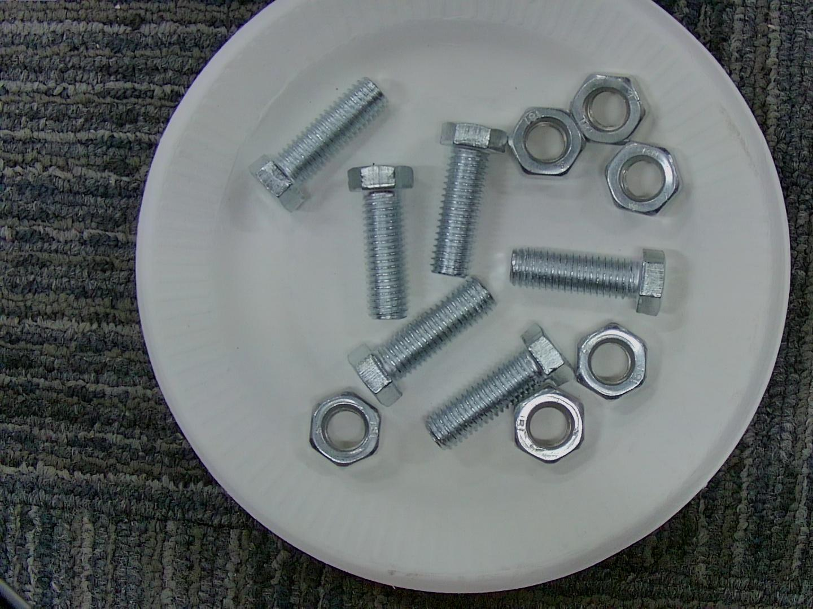

# 基于PPYOLO的螺丝螺母检测


## 项目说明

随着工业4.0时代的到来，针对市场零件生产越来越趋于精密化，而用人成本不断增高，人工稳定性也不高，效率低，成本高。在目前的市场，推出基于机器视觉检测的方法。定位和识别图像中的螺丝螺母是很多更复杂任务的前处理步骤。

[PP-YOLO](https://arxiv.org/abs/2007.12099)是飞桨目标检测套件[PaddleDetection](https://github.com/PaddlePaddle/PaddleDetection)优化和改进的YOLOv3的模型，其精度(COCO数据集mAP)和推理速度均优于YOLOv4模型，PP-YOLO在COCO test-dev2017数据集上精度达到45.9%，在单卡V100上FP32推理速度为72.9 FPS, V100上开启TensorRT下FP16推理速度为155.6 FPS。其中还包含了PP-YOLO tiny模型，此模型后量化压缩模型，将模型体积压缩到1.3M，对精度和预测速度基本无影响，在手机上部署，推理速度也是极快的。

本案例基于Paddle2.1.2利用PP-YOLO模型实现了图像中螺丝和螺母的检测。


本项目AI Studio版本请参考：[https://aistudio.baidu.com/aistudio/projectdetail/2495241](https://aistudio.baidu.com/aistudio/projectdetail/2495241)


## 数据准备

本案例用到了螺丝螺母目标检测数据集，背景为干净的培养皿，里面仅仅包含螺丝和螺母两种类别的目标，如下图所示：



图片数量约420张，train.txt和eval.txt文件分别对应训练集和验证集。文件中描述每个图片中的目标，每一行为一个图像以及其对应的目标信息，一个参考样例如下：

```
lslm/63.jpg	 	{"value":"bolt","coordinate":[[769.459,241.819],[947.546,506.167]]}	{"value":"bolt","coordinate":[[941.913,176.348],[1125.565,424]]}	{"value":"bolt","coordinate":[[1131.13,493.565],[1256.347,777.391]]}	{"value":"bolt","coordinate":[[699.826,460.174],[925.217,705.044]]}	{"value":"nut","coordinate":[[1167.304,340.522],[1298.087,474.087]]}	{"value":"nut","coordinate":[[955.826,504.696],[1100.522,635.479]]}	{"value":"nut","coordinate":[[736,702.261],[880.696,844.174]]}	{"value":"nut","coordinate":[[950.261,688.348],[1092.174,824.696]]}
```

最开始是图片的存放路径，后面是多个dict，每个dict中存放了一个目标的信息。图像路径、目标之间用“\t”分隔。

本项目用到的数据集在AI Studio上可以获取[https://aistudio.baidu.com/aistudio/datasetdetail/6045](https://aistudio.baidu.com/aistudio/datasetdetail/6045)

解压数据命令如下：
```
unzip -qo lslm.zip && unzip -qo lslm-test.zip
mv lslm/*.txt .
mv lslm-test/*.txt .
sed -i 's/^/lslm\//' train.txt
sed -i 's/^/lslm-test\//' eval.txt
awk '{print $2}' label_list.txt > label_list
```

### 数据格式转换

为了复用已有的数据处理函数，将本案例数据格式转为通用的coco格式。

运行data_2_coco.py脚本完成数据转换工作，注意修改自己数据存放路径：
```
python data_2_coco.py
```

## 环境准备

本项目使用飞桨目标检测套件PaddleDetection实现螺丝螺母的检测。

通过如下命令下载源码：
```
git clone https://github.com/PaddlePaddle/PaddleDetection
```

配置项目所需要的环境：
```
cd PaddleDetection
pip install -r requirements.txt
python setup.py install
```


## 模型训练

本项目分模块提供了所需配置，每个模块配置信息存储在一个yml文件中，如模型相关配置存放在ppyolo_r50vd_dcn.yml中。

通过运行下面的脚本启动训练，--eval参数指定在训练过程中进行评估：
```
python tools/train.py -c ppyolo_r50vd_dcn_2x_coco.yml --eval
```

> 断点接着训练需要加入参数-r output/ppyolo_r50vd_dcn_2x_coco/655 

## 模型评估

模型训练好后，在验证集上进行评估，此处需要指定评估模型路径-o  weights=models/best_model.pdparams：
```
python -u tools/eval.py -c ppyolo_r50vd_dcn_2x_coco.yml -o weights=models/best_model.pdparams     
```

## 模型预测

修改类别名称，`ppdet/data/source/category.py`中：
```
 catid2name = {
        0: 'background',
        1: 'bolt',
        2: 'nut'
        }
```

用案例提供的模型或自己训练好的模型进行预测，具体命令如下：
```
python tools/infer.py -c ppyolo_r50vd_dcn_2x_coco.yml \
 -o weights=models/best_model.pdparams \
 --draw_threshold=0.5 \
 --infer_img=7.jpg \
 --output_dir=infer_output
```


