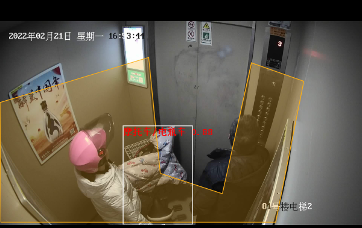
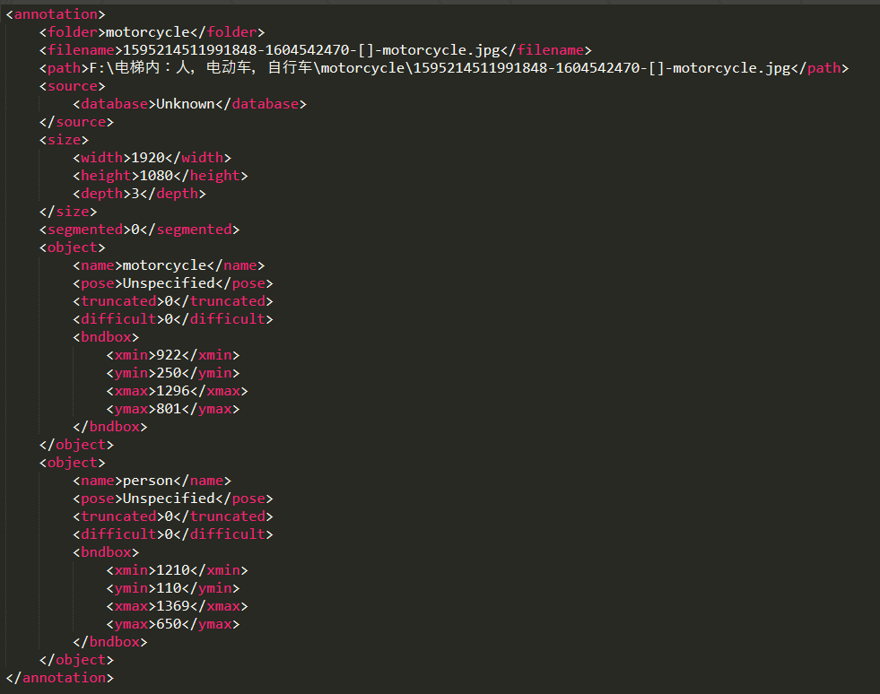
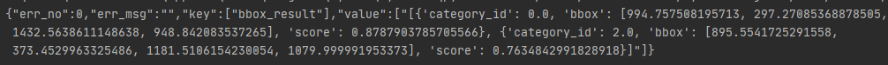
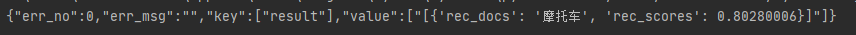

# 电梯内电瓶车入室检测

## 内容

* [项目说明](#项目说明)
* [安装说明](#安装说明)
* [数据准备](#数据准备)
* [模型选择](#模型选择)
* [模型训练](#模型训练)
* [模型导出](#模型导出)
* [检索库生成](#检索库生成)
* [检索库部署](#检索库部署)

<a name="项目说明"></a>

近年来，电瓶车进楼入户发生的火灾事故屡见不鲜，针对该现象推出了相应的电瓶车入室检测模型，旨在从源头减少这一情况的发生。 针对室内摩托车模型可能会发生的误报情况，采用了额外的图像检索方式实现更为精确的识别。 本案例使用了飞桨目标检测套件PaddleDetection中的picodet模型以及图像识别套件PaddleClas中的轻量级通用识别模型。



注:AI Studio在线运行代码请参考[电梯内电瓶车检测全流程](https://aistudio.baidu.com/aistudio/projectdetail/3497217?channelType=0&channel=0)(配置gpu资源)
## 2 安装说明

##### 环境要求

* PaddlePaddle = 2.2.2
* Python >= 3.5

<a name="数据准备"></a>

## 3 数据准备

本案例中picodet的模型数据集为VOC格式(使用labelimg制成)，包括21903张电梯中的图片，其中训练集17522张，测试集4381张，皆来自日常的电梯场景中，共有14715个摩托车的框，23058个人的框，3750个自行车的框，由于picodet使用的是coco格式，所以需要将VOC格式转换成coco格式。 生成VOC数据集：使用python的labelimg图像标注工具为原始图片生成对应的标注xml文件作为原始的VOC格式数据集，生成的xml文件格式如下图所示，其中每个object代表框出的每一个对象，object中的name表明对象的名字而bndbox中包含框的具体坐标（左上角以及右下角）。

![label_img][docs/images/label_img.png]




生成VOC数据集： 完成图片标注后，下一步就是生成数据集，将每个图片与其xml对应起来按比例生成对应的训练集以及测试集.

```
├── classify_voc.py
├── picodet_motorcycle
│   ├── Annotations
│   │   ├── 1595214506200933-1604535322-[]-motorcycle.xml
│   │   ├── 1595214506200933-1604542813-[]-motorcycle.xml
│   │   ├── 1595214506200933-1604559538-[]-motorcycle.xml
|   ...
│   ├── ImageSets
│   │   └── Main
│   │       ├── test.txt
│   │       ├── train.txt
│   │       ├── trainval.txt
│   │       └── val.txt
│   └── JPEGImages
│       ├── 1595214506200933-1604535322-[]-motorcycle.jpg
│       ├── 1595214506200933-1604542813-[]-motorcycle.jpg
│       ├── 1595214506200933-1604559538-[]-motorcycle.jpg
│       |   ...
├── picodet_motorcycle.zip
├── prepare_voc_data.py
├── test.txt
└── trainval.txt
```

VOC数据集 [下载地址](https://aistudio.baidu.com/aistudio/datasetdetail/128282)
检索库数据集 [下载地址](https://aistudio.baidu.com/aistudio/datasetdetail/128448)
将VOC格式的数据集转换为coco格式（使用paddle自带的转换脚本）：
仅举例说明，使用时请修改路径
```
python x2coco.py --dataset_type voc  --voc_anno_dir /home/aistudio/data/data128282/ --voc_anno_list /home/aistudio/data/data128282/trainval.txt --voc_label_list /home/aistudio/data/data128282/label_list.txt  --voc_out_name voc_train.json
python x2coco.py --dataset_type voc --voc_anno_dir /home/aistudio/data/data128282/ --voc_anno_list /home/aistudio/data/data128282/test.txt --voc_label_list /home/aistudio/data/data128282/label_list.txt --voc_out_name voc_test.json
mv voc_test.json /home/aistudio/data/data128282/
mv voc_train.json /home/aistudio/data/data128282/

```
<a name="模型选择"></a>

## 4 模型选择

本案例选择了PaddleDetection中提出了全新的轻量级系列模型PP-PicoDet

PP-PicoDet模型有如下特点：

  - 更高的mAP: 第一个在1M参数量之内mAP(0.5:0.95)超越30+(输入416像素时)。
  - 更快的预测速度: 网络预测在ARM CPU下可达150FPS。
  - 部署友好: 支持PaddleLite/MNN/NCNN/OpenVINO等预测库，支持转出ONNX，提供了C++/Python/Android的demo。
  - 先进的算法: 在现有SOTA算法中进行了创新, 包括：ESNet, CSP-PAN, SimOTA等等。


<a name="模型训练"></a>

## 5 模型训练


首先安装依赖库
```
cd code/train/
pip install pycocotools
pip install faiss-gpu
pip install -r requirements.txt -i https://pypi.tuna.tsinghua.edu.cn/simple  
```

导出为serving模型的准备
```
pip install paddle-serving-app==0.6.2 -i https://pypi.tuna.tsinghua.edu.cn/simple
pip install paddle-serving-client==0.6.2 -i https://pypi.tuna.tsinghua.edu.cn/simple
pip install paddle-serving-server-gpu==0.6.3.post102 -i https://pypi.tuna.tsinghua.edu.cn/simple
```

<a name="模型导出"></a>

## 6 模型导出


导出为serving模型
```
cd code/train/
python export_model.py  --export_serving_model=true -c picodet_lcnet_1_5x_416_coco.yml --output_dir=./output_inference/
```

```
cd code/train/output_inference/picodet_lcnet_1_5x_416_coco/
mv serving_server/ code/picodet_lcnet_1_5x_416_coco/
```

启动服务
```
cd /home/aistudio/work/code/picodet_lcnet_1_5x_416_coco/
python3 web_service.py
```

请求结果如下图所示:



<a name="检索库生成"></a>

## 7 检索库生成

在目标检测模型部署完毕后电瓶车入室检测的功能便可投入使用，但为了提高整体的准确度减少误报则还需要一个额外的检索方式。这里采用了PaddleClas下图像识别中的轻量级通用识别模型general_PPLCNet_x2_5_lite_v1.0_infer

首先从paddle下载解压模型并导出为serving模型
```
cd code/
wget -P models/ https://paddle-imagenet-models-name.bj.bcebos.com/dygraph/rec/models/inference/general_PPLCNet_x2_5_lite_v1.0_infer.tar
cd models
tar -xf general_PPLCNet_x2_5_lite_v1.0_infer.tar
python3 -m paddle_serving_client.convert --dirname ./general_PPLCNet_x2_5_lite_v1.0_infer/ --model_filename inference.pdmodel  --params_filename inference.pdiparams --serving_server ./general_PPLCNet_x2_5_lite_v1.0_serving/  --serving_client ./general_PPLCNet_x2_5_lite_v1.0_client/
cp  -r ./general_PPLCNet_x2_5_lite_v1.0_serving ../general_PPLCNet_x2_5_lite_v1.0/
```

解压数据集后根据路径修改make_label.py,随后生成索引库.
```
cd code
python make_label.py
python python/build_gallery.py -c build_gallery/build_general.yaml -o IndexProcess.data_file="./index_label.txt" -o IndexProcess.index_dir="index_result"
mv index_result/ general_PPLCNet_x2_5_lite_v1.0/
```

<a name="检索库部署"></a>

## 7 检索库部署
```
cd /home/aistudio/work/code/general_PPLCNet_x2_5_lite_v1.0/
python recognition_web_service_onlyrec.py
```

在实际场景中请求结果如图所示。


