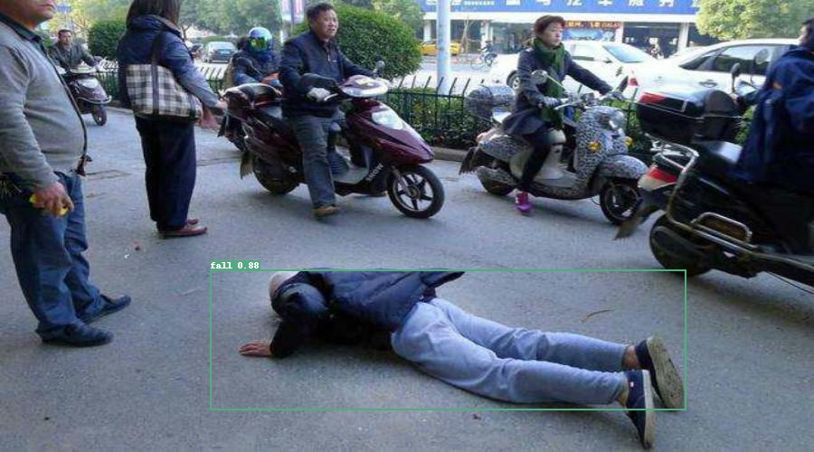
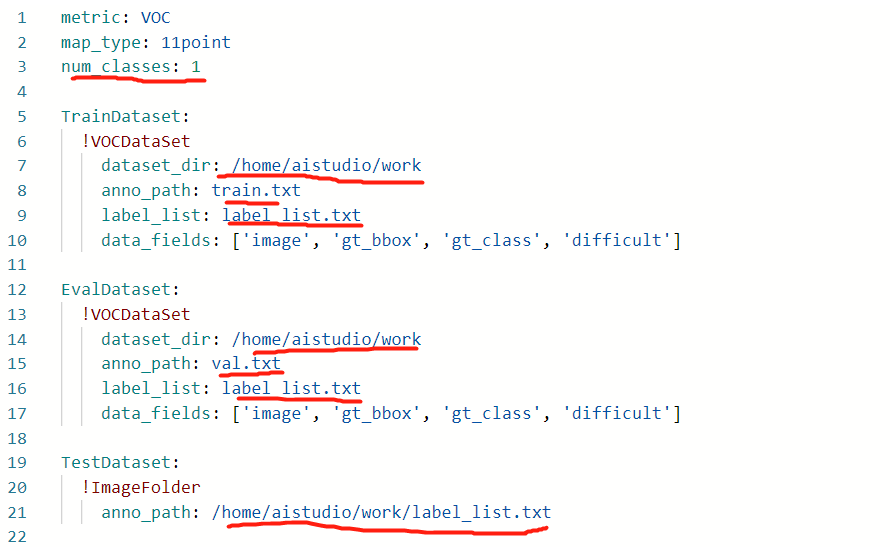
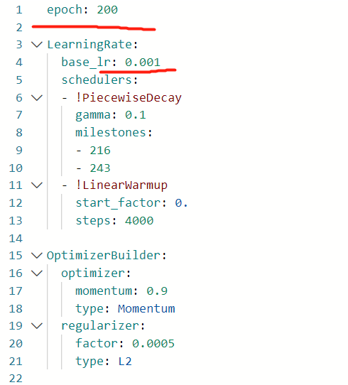

# 摔倒检测


## 项目说明

本次实验通过使用PaddleDetection2.0中的YOLOv3(主干网络为mobilenetv3的轻量化模型)，通过几行代码就能实现跌倒的目标检测，后期可部署用于监控医院、疗养院甚至家里等,mAP值达到80.28%。

按以下几个步骤来介绍项目实现流程。

1. 解压自定义的数据集；

2. 下载安装PaddleDetection包；

2. 自定义数据集划分；

4. 选择模型（本次选择YOLO-v3）进行训练：训练的配置文件说明；

5. 效果可视化：使用训练好的模型进行预测，同时对结果进行可视化；

6. 模型评估和预测：评估模型效果；

7. 预测结果

8. PaddleDetection 预测部署

**检测效果如下图所示：**



本项目AI Studio版本请参考：[https://aistudio.baidu.com/aistudio/projectdetail/2500639](https://aistudio.baidu.com/aistudio/projectdetail/2500639)


## 数据准备

本案例用到了AI Studio公开的数据集[new_fall_dataset](https://aistudio.baidu.com/aistudio/datasetdetail/105389)。其标注格式为VOC，具体数据解压后目录如下所示：

**pp_fall**：


  --**Annotations:**
  
      1.xml
  
      2.xml
  
      .......
  
  --**images:**
  
      1.jpg
  
      2.jpg
  
      .......

## 代码和环境准备

本项目基于PaddleDetection 2.0.2实现，通过下面的命令下载：

```
git clone https://gitee.com/paddlepaddle/PaddleDetection.git
```

安装PaddleDetection依赖库：
```
cd PaddleDetection/
pip install -r requirements.txt
```

## 数据集划分

运行divide_dataset.py将数据集按照9:1的比例划分成训练集train.txt和验证集val.txt：
```
python divide_dataset.py
```

## 模型训练

用户在选择好模型后，只需要改动对应的配置文件后，运行train.py文件，即可实现训练。

本项目中，使用YOLOv3模型里的yolov3_mobilenet_v3_large_ssld_270e_voc.yml进行训练。

在启动训练前，需要根据我们的数据集修改配置文件：

**../datasets/voc.yml**



* num_classes为目标类别数目；
* dataset_dir为数据存放目录；
* anno_path为标注文件相对路径；
* label_list为标签列表。

**_base_/optimizer_270e.yml**



* epoch为训练的轮数；
* base_lr为初始学习率。


通过运行下面的脚本启动训练，需要指定训练配置文件路径-c configs/yolov3/yolov3_mobilenet_v3_large_ssld_270e_voc.yml，--eval参数指定在训练过程中进行评估
```
python tools/train.py -c configs/yolov3/yolov3_mobilenet_v3_large_ssld_270e_voc.yml --eval
```

## 模型评估

需要指定评估配置文件路径-c configs/yolov3/yolov3_mobilenet_v3_large_ssld_270e_voc.yml，被评估的模型路径-o weights=output/yolov3_mobilenet_v3_large_ssld_270e_voc/best_model.pdparams。
```
python -u tools/eval.py -c configs/yolov3/yolov3_mobilenet_v3_large_ssld_270e_voc.yml  -o weights=output/yolov3_mobilenet_v3_large_ssld_270e_voc/best_model.pdparams
```

## 模型预测

在执行tools/infer.py后，在output文件夹下会生成对应的预测结果。

需要指定预测配置文件-c configs/yolov3/yolov3_mobilenet_v3_large_ssld_270e_voc.yml，预测用到的模型-o weights=output/yolov3_mobilenet_v3_large_ssld_270e_voc/best_model.pdparams，预测的图像路径--infer_img=images/fall_39.jpg。
```
python tools/infer.py -c configs/yolov3/yolov3_mobilenet_v3_large_ssld_270e_voc.yml -o weights=output/yolov3_mobilenet_v3_large_ssld_270e_voc/best_model.pdparams \
  --infer_img=images/fall_39.jpg
```

## 模型导出

导出模型，默认存储于PaddleDetection/output_inference目录：
```
python tools/export_model.py -c configs/yolov3/yolov3_mobilenet_v3_large_ssld_270e_voc.yml  -o weights=output/yolov3_mobilenet_v3_large_ssld_270e_voc/best_model.pdparams
```

## 使用PaddleInference进行预测
* Python部署 支持`CPU`、`GPU`和`XPU`环境，支持，windows、linux系统，支持NV Jetson嵌入式设备上部署。
* C++部署 支持`CPU`、`GPU`和`XPU`环境，支持，windows、linux系统，支持NV Jetson嵌入式设备上部署。
* PaddleDetection支持TensorRT加速。

**注意:**  Paddle预测库版本需要>=2.1，batch_size>1仅支持YOLOv3和PP-YOLO。
```
python deploy/python/infer.py --model_dir=output_inference/yolov3_mobilenet_v3_large_ssld_270e_voc --image_file=images/fall_39.jpg --use_gpu=True
```

## PaddleServing部署
请参考[PaddleServing](https://github.com/PaddlePaddle/Serving/tree/v0.6.0)中安装教程安装（版本>=0.6.0）。
