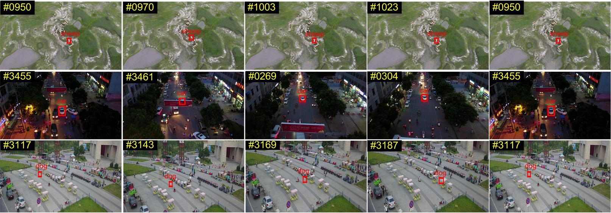

# 多类别车辆跟踪
## 1 项目说明

随着私家车保有量的逐年增加，越来越多的人选择自驾出行的交通方式。因此在车站、机场、景区、商场等人流量车流量大的公共场所周边，需要制定合理的车辆管控措施，从而提高管理效率。比如：在狭窄路段或十字路口，统计每个方向的各类车流量，分析交通状况，为交通调度、路况优化提供精准参考依据；或者在机场航站楼等限时停车地段，可以判断是否有违章停车，并实现自动化的违章审计等。

在上述车辆管控措施中，最重要的一步就是对车辆进行跟踪。使用基于PaddleDetection的多类别车辆跟踪方案，可以实现高空俯拍场景下的多类别车辆跟踪，帮助相关人员制定合理的智能化管理方案。模型效果如图所示。


本案例梳理了模型选择、精度及速度优化的思路，可以帮助用户更高效地解决相关问题，并提供了基于服务器端的部署指南。

**方案难点**：

* **跟踪目标小：** 高空俯拍场景中，车辆目标较小，对小目标大尺幅场景准确性要求较高，因此需要解决跟踪小目标物体的难点；
* **多类别跟踪：** 不同于简单的车辆跟踪任务，由于该场景下涉及车辆类型较多，所以需要满足多类别跟踪诉求，对每种类别的车辆分别进行跟踪；
* **较高的模型泛化能力：** 由于拍摄角度多变，受光照光线等影响，对模型泛化能力的要求较高；
* **实时性：** 预警场景下，对实时性能要求较高。

## 2 安装说明

#### 环境要求

* PaddlePaddle >= 2.2.0rc
* Python >= 3.5
* PaddleDetection-develop

安装的相关问题参考[PaddleDetection安装文档](https://github.com/PaddlePaddle/PaddleDetection/blob/develop/docs/tutorials/INSTALL_cn.md)

#### 下载PaddleDetection源码


```python
git clone https://github.com/PaddlePaddle/PaddleDetection.git -b develop
```


```python
# 安装环境
cd PaddleDetection
pip install -r requirements.txt
```


## 3 数据准备

本案例使用的数据集为 [Visdrone 2019 MOT Dataset](http://aiskyeye.com/iccv2019/)，是 VisDrone 2019 数据集中的多目标跟踪数据集。该数据集由天津大学机器学习与数据挖掘实验室的 AISKYEYE 队伍负责收集，该数据集中包含了由多个无人机平台拍摄得到的视频片段，场景丰富，包含了在不同的地理位置（在中国相隔数千公里的14个不同城市拍摄）、不同的环境（城市和乡村）、不同的密度（包括了拥挤及稀疏场景）以及不同的天气、光照条件下采集的数据。本案例中，仅仅使用该数据集的训练集和验证集。数据集示例图片如下图所示：



图片来源：[Vision Meets Drones: A Challenge](http://aiskyeye.com/)

由于原始数据集中包含10个类别：
```
pedestrian, people, bicycle, car, van, truck, tricycle, awning-tricycle, bus, motor
```

而其中大部分类别都与车辆无关。因此，在实验中，我们先对数据集进行了筛选，筛选出适合进行多类别车辆跟踪任务的以下4类数据。
```
car, van, truck, bus
```


可以按照以下命令下载筛选好的数据集 `visdrone_mcmot_vehicle.zip` 并解压，将其中文件放在 `dataset/mot` 下：


```python
wget https://bj.bcebos.com/v1/paddledet/data/mot/visdrone_mcmot_vehicle.zip
```

下载好的文件需要按照如下的目录结构进行整理：

```
├── dataset/mot
  ├── image_lists
  │   ├── visdrone_mcmot_vehicle.train
  │   ├── visdrone_mcmot_vehicle.val
  ├── visdrone_mcmot_vehicle
  │   ├── images
  │   │   ├── train
  │   │   │   ├── uav0000013_00000_v
  │   │   │   │   ├── 0000001.jpg
  │   │   │   │   ├── ...
  │   │   │   ├── ...
  │   │   ├── val
  │   │   │   ├── uav0000086_00000_v
  │   │   │   │   ├── 0000001.jpg
  │   │   │   │   ├── ...
  │   │   │   ├── ...
  │   ├── labels_with_ids
  │   │   ├── train
  │   │   │   ├── uav0000013_00000_v
  │   │   │   │   ├── 0000001.txt
  │   │   │   │   ├── ...
  │   │   │   ├── ...
  │   │   ├── val
  │   │   │   ├── uav0000086_00000_v
  │   │   │   │   ├── 0000001.txt
  │   │   │   │   ├── ...
  │   │   │   ├── ...
  │   ├── label_list.txt
```

其中，`images`为图像存储路径，`labels_with_ids`为对应的标注文件存储路径，`label_list.txt`中存储了所有的类别名称，每一行为一个类别。数据集中的每张图片都有相应的标注文本，在标注文本中，每行都描述一个边界框，格式如下：

```
[class] [identity] [x_center] [y_center] [width] [height]
```

注意：

* `identity`是从`1`到`num_identifies`的整数(`num_identifies`是数据集中不同物体实例的总数)，如果此框没有`identity`标注，则为`-1`。
* `[x_center] [y_center] [width] [height]`是中心点坐标和宽高，它们的值是基于图片的宽度/高度进行标准化的，因此值为从0到1的浮点数。

## 4.模型选择

当前主流的多目标跟踪算法主要分为两类：SDE(Separate Detection and Embedding)算法 和 JDE(Joint Detection and Embedding)算法：

* SDE类的算法指的是完全分离检测和Re-ID任务，其优势在于可以分别在两个子任务中选择合适的模型并进行调优，从而达到很好的效果。但是由于SDE类的算法不会将检测和Re-ID模型中的特征图进行共享，导致其速度比较慢，很难做到实时跟踪。SDE类算法中最具代表性的就是DeepSORT算法。

* JDE类的算法指的是在一个网络中同时处理目标检测和ReID任务，通过共享检测和Re-ID模型中特征图的计算，来改善SDE类算法中速度慢的缺点。FairMOT算法就是一种典型的JDE类算法。

FairMOT 针对 anchor-based 类的检测算法会导致 anchor 和 Re-ID 特征对不齐的问题，使用了 anchor-free 的 CenterNet 算法进行目标检测任务。同时，融合深层和浅层的特征，使得目标检测和Re-ID任务都能获取到需要的特征，并且使用了较低维度的Re-ID特征，最终提出了一种由两个同质分支组成的简单 baseline 来解决多目标跟踪问题。在当前MOT任务中，FairMOT算法与其他算法相比，能够在精度较优的前提下达到更快的跟踪速度。

为了能够解决区分不同车辆类别的难点问题，本案例中使用了 MCFairMOT 模型进行车辆跟踪，MCFairMOT 模型就是基于多目标跟踪模型 FairMOT 的改进版本，它针对原始的 FairMOT 算法进行了多类别的适配，实现了对不同类别的目标分别进行跟踪的效果。具体来说：

1. 将 CenterNet 检测头中 heatmap 以及 wh 的计算按类别进行扩展；
1. 将损失函数中的 ReID 损失按类别进行扩展；
1. 后处理过程中对每个类别分别进行跟踪。

## 5 模型训练

baseline模型的配置文件为：`mcfairmot_dla34_30e_1088x608_visdrone_vehicle.yml`，将其放到`configs/mot/mcfairmot/`路径下，运行如下代码即可开始训练模型：


```python
# GPU单卡训练
python -m paddle.distributed.launch --log_dir=./mcfairmot_dla34_30e_1088x608_visdrone_vehicle/ --gpus 0 tools/train.py -c configs/mot/mcfairmot/mcfairmot_dla34_30e_1088x608_visdrone_vehicle.yml

# GPU多卡训练，例如使用4张卡时执行：
# export CUDA_VISIBLE_DEVICES=0,1,2,3 #windows和Mac下不需要执行该命令
# python -m paddle.distributed.launch --log_dir=./mcfairmot_dla34_30e_1088x608_visdrone_vehicle/ --gpus 0,1,2,3 tools/train.py -c configs/mot/mcfairmot/mcfairmot_dla34_30e_1088x608_visdrone_vehicle.yml
```

## 6 模型评估

考虑到本案例的场景中希望视频里车辆大部分时间ID都是准确的，从而更好地进行针对性地管控。因此使用IFD1作为评估指标。IDF1衡量了整个视频的跟踪连贯性，评估的是整体的目标被正确识别的概率。 

$$ IFD1 = \frac{2IDTP}{2IDTP+IDFP+IDFN} $$ 

其中，

$$IDFN=\sum_{\tau \in AT}{\sum_{t\in T_{\tau}}{m(\tau , \lambda _m(\tau), t, \Delta)}}$$ 

$$IDFP=\sum_{\Delta \in AC}{\sum_{t\in T_{\Delta}}{m(\tau _m(\lambda), \lambda , t, \Delta)}}$$ 

$$IDTP=\sum_{\tau \in AT}{len(\tau)-IDFN}$$

上述公式中，$m(\tau, \lambda , t, \Delta)$在预测框与真实框的IOU不满足阈值时为1.本案例中，考虑到数据集里小目标数量多，将IOU阈值调整为0.2。需要调整 `ppdet/metrics/mcmot_metrics.py`中`motmetrics.distances.iou_matrix`的 `max_iou`参数为0.8:

```
class MCMOTEvaluator(object):
	def eval_frame_dict(self, trk_objs, gt_objs, rtn_events=False, union=False):
          import motmetrics as mm
          mm.lap.default_solver = 'lap'
          if union:
              trk_tlwhs, trk_ids, trk_cls = unzip_objs_cls(trk_objs)[:3]
              gt_tlwhs, gt_ids, gt_cls = unzip_objs_cls(gt_objs)[:3]

              # get distance matrix
              iou_distance = mm.distances.iou_matrix(
                  gt_tlwhs, trk_tlwhs, max_iou=0.8)

              ...

          else:
              trk_tlwhs, trk_ids = unzip_objs(trk_objs)[:2]
              gt_tlwhs, gt_ids = unzip_objs(gt_objs)[:2]

              # get distance matrix
              iou_distance = mm.distances.iou_matrix(
                  gt_tlwhs, trk_tlwhs, max_iou=0.8)
```

在IDF1指标计算过程中，会先求取所有与GT的IOU大于阈值的结果，然后根据上式判断预测得到的跟踪轨迹与真实轨迹的关系，最终计算得到最终结果。


```python
CUDA_VISIBLE_DEVICES=0 python tools/eval_mot.py -c configs/mot/mcfairmot/mcfairmot_dla34_30e_1088x608_visdrone_vehicle.yml -o weights=output/mcfairmot_dla34_30e_1088x608_visdrone_vehicle/model_final.pdparams
```

**注意：**

默认评估的是 VisDrone 2019 MOT val set 数据集, 如需换评估数据集可参照以下代码修改 `configs/datasets/mcmot.yml` ：

```
EvalMOTDataset:
  !MOTImageFolder
    dataset_dir: dataset/mot
    data_root: your_dataset/images/val
    keep_ori_im: False # set True if save visualization images or video
```

多类别跟踪结果会存于 `{output_dir}/mot_results/` 中，里面每个视频序列对应一个 txt ，每个 txt 文件每行信息是 `frame,id,x1,y1,w,h,score,cls_id,-1,-1` , 此外 `{output_dir}` 可通过 `--output_dir` 设置。

依据 `mcfairmot_dla34_30e_1088x608_visdrone_vehicle.yml` 配置文件进行训练并在 VisDrone 2019 MOT val set 数据集上评估后，会得到如下结果：


|  骨干网络  | IDF1 | 准确率 | 召回率 |
| -------- | -------- | -------- | -------- |
|DLA-34| 46.3 | 74 | 50.9 |

## 7 模型预测

使用单个GPU通过如下命令预测一个视频，并保存为视频：


```python
CUDA_VISIBLE_DEVICES=0 python tools/infer_mot.py -c configs/mot/mcfairmot/mcfairmot_dla34_30e_1088x608_visdrone_vehicle.yml -o weights=output/mcfairmot_dla34_30e_1088x608_visdrone_vehicle/model_final.pdparams --video_file=visdrone_demo.mp4 --frame_rate=20 --save_videos
```

**注意：**

请先确保已经安装了ffmpeg, Linux(Ubuntu)平台可以直接用以下命令安装：apt-get update && apt-get install -y ffmpeg。

可视化预测结果示例如下：


可以点击[此处](https://www.zhihu.com/zvideo/1478657774213558272)观看完整预测视频。

通过观看完整视频可以发现，当前的bseline模型存在一定的漏检以及ID错误问题，在后边的模型优化部分，将会针对这一问题进行进一步优化。

## 8 预测部署

Paddle Inference 功能特性丰富，性能优异，针对不同平台不同的应用场景进行了深度的适配优化，做到高吞吐、低时延，保证了飞桨模型在服务器端即训即用，快速部署。在本案例，使用基于 Python 端的 Paddle Inference 部署方式进行模型部署。

Python 端的 Paddle Inference 预测部署主要包含两个步骤：

* 导出预测模型
* 基于Python进行预测

### 模型导出

PaddleDetection在训练过程包括网络的前向和优化器相关参数，而在部署过程中，我们只需要前向参数，因此需要将模型进行导出成部署需要的模型格式。 执行下面命令，即可导出模型：


```python
# 根据具体使用的训练文件，修改模型路径weights
CUDA_VISIBLE_DEVICES=0 python tools/export_model.py -c configs/mot/mcfairmot/mcfairmot_dla34_30e_1088x608_visdrone_vehicle.yml -o weights=output/mcfairmot_dla34_30e_1088x608_visdrone_vehicle/model_final.pdparams
```

预测模型会导出到`output_inference/mcfairmot_dla34_30e_1088x608_visdrone_vehicle/`目录下，包括`model.pdmodel`、`model.pdiparams`、`model.pdiparams.info`和`infer_cfg.yml`四个文件，分别表示模型的网络结构、模型权重、模型权重名称、模型的配置文件（包括数据预处理参数等）。

### 模型推理

接下来使用导出的模型进行模型推理：


```python
CUDA_VISIBLE_DEVICES=0 python deploy/pptracking/python/mot_jde_infer.py --model_dir=output_inference/mcfairmot_dla34_30e_1088x608_visdrone_vehicle/ --video_file=visdrone_demo.mp4 --device=GPU --save_mot_txts
```

**注意：**

* 跟踪模型是对视频进行预测，不支持单张图的预测，默认保存跟踪结果可视化后的视频，可添加--save_mot_txts表示保存跟踪结果的txt文件，或--save_images表示保存跟踪结果可视化图片。
* 跟踪结果txt文件每行信息是frame,id,x1,y1,w,h,score,cls_id,-1,-1。

### API 调用

这里，还可以通过API来调用导出模型，从而完成模型推理。API调用方式如下：

```
import mot_jde_infer

# 1.model config and weights
model_dir = 'mcfairmot_dla34_30e_1088x608_visdrone_vehicle/'

# 2.inference data
video_file = 'test.mp4'
image_dir = None

# 3.other settings
device = 'CPU' # device should be CPU, GPU or XPU
threshold = 0.3
output_dir = 'output'

# mot predict
mot_jde_infer.predict_naive(model_dir, video_file, image_dir, device, threshold, output_dir)
```

**注意：**

* 以上代码必须进入目录`deploy/pptracking/python`下执行。
* 支持对视频和图片文件夹进行预测，不支持单张图的预测，`video_file`或`image_dir`不能同时为None，推荐使用`video_file`，而`image_dir`需直接存放命名顺序规范的图片。
* 默认会保存跟踪结果可视化后的图片和视频，以及跟踪结果txt文件，默认不会进行轨迹可视化和流量统计。

## 9 模型优化

（1）基线模型选择

本案例采用 MCFairMOT 模型作为基线模型。考虑到车辆跟踪时，通常会对希望速度和精度能够均衡，本案例选择使用 DLA-34 作为骨干网络；同时，考虑到俯拍场景中，车辆目标较小，因此选择较大的图像输入尺寸 `1088x608`，从而改善小目标检测效果。

实际使用过程中，通常会将视频传输到服务器端，使用GPU进行预测。因此，本案例中所有的实验，速度指标均在以下两个设备上分别进行评测。下述表中的推理速度指的是车辆跟踪全流程的FPS（每秒处理帧数）。

* 设备1:
```
CPU：80  Intel(R) Xeon(R) Gold 6271C CPU @ 2.60GHz
GPU：NVIDIA Tesla V100 
```

* 设备2: 
```
CPU：96  Intel(R) Xeon(R) Gold 6271C CPU @ 2.60GHz
GPU：NVIDIA TESLA T4 
```


| 模型 | IDF1 | 推理速度-V100 | 推理速度-T4 | 准确率 | 召回率 |
| -------- | -------- | -------- | -------- | -------- | -------- |
| MCFairMOT+DLA-34+momentum| 46.3| 14.1| 11.5  |74| 50.9  |

**注意：**

本案例中的baseline使用的是Momentum优化器，这与PaddleDetection中`mcfairmot`模型的默认配置有一定不同，需要修改配置文件`mcfairmot_dla34_30e_1088x608_visdrone_vehicle.yml`中的`LearningRate`和`OptimizerBuilder`字段，修改后的内容如下：

```
epoch: 30
LearningRate:
  base_lr: 0.01
  schedulers:
  - !PiecewiseDecay
    gamma: 0.1
    milestones: [15, 22]
    use_warmup: True
  - !BurninWarmup
    steps: 1000

OptimizerBuilder:
  optimizer:
    type: Momentum
  regularizer:
    factor: 0.0001
    type: L2
```

考虑到 baseline 模型存在以下几个问题：
* 模型精度与速度需要进一步优化；
* 存在一定的漏检现象，导致召回率较低；
* 存在一定的ID错误现象。

接下来，在以下几个方面对模型进行进一步优化：

（2）骨干网络

在本案例中，尝试更改骨干网络，通常更轻量的模型可以进一步优化网络速度，而复杂度更高的模型通常可以提升网络精度。这里，分别将骨干网络更换为更加轻量的HRNetV2-W18以及复杂度更高的HardNet。

替换 backbone 可以通过更改配置文件中的`_BASE_`字段来实现，将`_BASE_`字段中的第一个文件路径指定为`../fairmot/`目录下的对应文件即可。其中，为了将骨干网络更换为HardNet，在`../fairmot/`目录下，新增`fairmot_hardnet85_30e_1088x608.yml`，文件的具体内容如下：

```
_BASE_: [
  '../../datasets/mot.yml',
  '../../runtime.yml',
  '_base_/optimizer_30e.yml',
  '_base_/fairmot_hardnet85.yml',
  '_base_/fairmot_reader_1088x608.yml',
]

weights: output/fairmot_hardnet85_30e_1088x608/model_final

```

实验结果：

| 模型 | IDF1 | 推理速度-V100 | 推理速度-T4 | 准确率 | 召回率 |
| -------- | -------- | -------- | -------- | -------- | -------- |
| MCFairMOT+DLA-34| 46.3| 14.1| 11.5  |74| 50.9  |
| MCFairMOT+HRNetV2-W18| 50.5| 15.8| 13.6  |80.2| 51.2  |
| MCFairMOT+HardNet| 48.8| 13.4| 10.8  |80.5| 47.8  |

可以看到：
1. 更换backbone为HRNetV2-W18在速度和精度上都有了显著提升；
1. 更换backbone为带来了显著的准确率提升，但是召回率下降，导致IDF1提升一般，同时速度变慢。

（3）ByteTracker

BYTE是一种非常简单且有效的数据关联方法，其主要思想是利用检测框和跟踪轨迹之间的相关性，在保留高置信度检测框的基础上，挖掘低置信度检测框中真实的目标，从而实现降低漏检并提高跟踪轨迹连贯性的作用。具体做法为：

1. 对于高置信度的检测框，跟之前的跟踪轨迹进行匹配；
1. 对于低置信度的检测框，跟1中剩余的轨迹进行二次关联，将所有不匹配的低分数检测框视为背景并删除。
1. 对于没有关联上的轨迹，保留30帧，如果一直没有检测框与其进行关联，则删除该轨迹。

使用 ByteTracker 可以通过更改配置文件中的`JDETracker`字段来实现，修改后的内容如下：

```
JDETracker:
  use_byte: True
  match_thres: 0.8
  conf_thres: 0.4
  low_conf_thres: 0.1
  min_box_area: 0
  vertical_ratio: 0
```

本案例中，基于上述3种backbone，分别使用ByteTracker进行优化实验，实验结果如下：

| 模型 | IDF1 | 推理速度-V100 | 推理速度-T4 | 准确率 | 召回率 |
| -------- | -------- | -------- | -------- | -------- | -------- |
| MCFairMOT+DLA-34| 46.3| 14.1| 11.5  |74| 50.9  |
| MCFairMOT+DLA-34+ByteTracker| 56.5| 14.0| 11.8  |71| 56.1  |
| MCFairMOT+HRNetV2-W18| 50.5| 15.8| 13.6  |80.2| 51.2  |
| MCFairMOT+HRNetV2-W18+ByteTracker| 59.2| 15| 14.3  |78| 55  |
| MCFairMOT+HardNet| 48.8| 13.4| 10.8  |80.5| 47.8  |
| MCFairMOT+HardNet+ByteTracker| 57.2| 13.4| 10.4  |77.8| 52.1  |

可以看到，对于不同的backbone，使用ByteTracker进行优化，能够明显提升模型的召回率，改善漏检现象，从而取得IDF1的提升，同时几乎不会带来多少速度损失。

（4）预训练模型

在本案例中，考虑到 Visdrone 2019 MOT Dataset 的数据量很少，直接训练很难达到一个比较好的效果。因此，如果能够选择合适的大规模数据集对模型进行预训练，可以有效改善最终的模型训练效果。考虑到 DLA-34 有更多的预训练模型，这里基于 DLA-34 的骨干网络进行优化实验。更换预训练模型可以通过更改配置文件中的`pretrain_weights`字段来实现。这里分别尝试使用ImageNet图像分类数据集、COCO目标检测数据集、CrowdHuman行人检测数据集进行预训练，对应的预训练模型参数链接为：

* ImageNet：`https://bj.bcebos.com/v1/paddledet/models/pretrained/DLA34_pretrain.pdparams`
* COCO：`https://bj.bcebos.com/v1/paddledet/models/centernet_dla34_140e_coco.pdparams`
* CrowdHuman：`https://paddledet.bj.bcebos.com/models/pretrained/fairmot_dla34_crowdhuman_pretrained.pdparams`

本案例中，分别使用上述3个预训练模型进行优化实验。其中，baseline使用的预训练数据集为CrowdHuman行人检测数据集。实验结果如下：

| 模型 | IDF1 |
| -------- | -------- |
| MCFairMOT+DLA-34(CrowdHuman)+ByteTracker| 56.5|
| MCFairMOT+DLA-34(ImageNet)+ByteTracker| 55.3|
| MCFairMOT+DLA-34(COCO)+ByteTracker| 58.6|

可以看到，使用COCO数据集预训练后，模型取得了明显的性能提升，这主要是因为COCO数据集与车辆跟踪数据集的相关性更大，因此使用与训练数据集更贴近的大规模预训练数据集可以取得更好的模型效果。

（5）GIoU Loss

GIoU 基于 IoU Loss，对以下两个问题进行改进：

* 预测框如果和真实框没有重叠，则IoU始终为0，损失函数失去可导性；
* IoU无法分辨不同方式的对齐，IoU值相同，但预测框的方向可能完全不同。

GIoU提出一种计算方式，对于两个框A和B，先计算出A、B的最小包围框C，然后根据如下公式计算出GIoU:
$$
GIoU = IoU - \frac{C-(A \cup B)}{C}
$$
GIoU Loss = 1 - GIoU.

使用 GIoU Loss 可以通过更改配置文件中的`CenterNetHead`和`CenterNetPostProcess`字段来实现，修改后的内容如下：

```
CenterNetHead:
  size_loss: 'giou'
  regress_ltrb: True

CenterNetPostProcess:
  for_mot: True
  regress_ltrb: True
  max_per_img: 200
```

本案例中，基于 HardNet 作为 backbone，使用 GIoU Loss 进行优化实验，实验结果如下：

| 模型 | IDF1 |
| -------- | -------- | 
| MCFairMOT+HardNet+ByteTracker| 57.2|
| MCFairMOT+HardNet+GIoU Loss+ByteTracker| 57.6|

可以看到，基于 HardNet 作为 backbone，使用GIoU Loss的确可以带来一定的模型精度提升。

**注意：**

我们也尝试基于 HRNetV2-W18 以及 DLA-34 作为 backbone，使用 GIoU Loss 进行优化实验，loss非常容易发散，因此如果想要尝试 HRNetV2-W18/DLA-34 与 GIoU Loss 的组合，建议使用更细致的调优策略。

（6）优化器

更换优化器也是模型优化时经常使用的基础策略。Adam 使用动量和自适应学习率来加快收敛速度，对梯度的一阶矩阵估计和二阶矩阵估计进行综合考虑，以此计算更新步长，因此也就避免了使用Momentum优化器时需要寻找更优学习率的问题，有时可以取得更好的结果。

使用 Adam 优化器可以通过更改配置文件中的`LearningRate`和`OptimizerBuilder`字段来实现，修改后的内容如下：

```
LearningRate:
  base_lr: 0.0005
  schedulers:
  - !PiecewiseDecay
    gamma: 0.1
    milestones: [10, 20]
    use_warmup: False

OptimizerBuilder:
  optimizer:
    type: Adam
  regularizer: NULL
```

本案例中，基于3种backbone，使用 Adam 优化器进行优化实验，实验结果如下：

| 模型 | IDF1 |
| -------- | -------- |
| MCFairMOT+HRNetV2-W18+momentum+ByteTracker| 59.2|
| MCFairMOT+HRNetV2-W18+Adam(lr:0.0001)+ByteTracker| 57.2|
| MCFairMOT+DLA-34(COCO)+momentum+ByteTracker| 58.6|
| MCFairMOT+DLA-34(COCO)+Adam(lr:0.0005)+ByteTracker| 59.8|
| MCFairMOT+HardNet+GIoU Loss+momentum+ByteTracker| 57.6|
| MCFairMOT+HardNet+GIoU Loss+Adam(lr:0.0005)+ByteTracker| 54.9|

可以看到，调整优化器在某些实验（以DLA-34作为backbone）上的确可以取得一定的性能提升，但也有部分实验（以HRNetV2-W18/HardNet作为backbone）性能没有提升甚至下降。

**全部实验结果：**

| 模型 | IDF1 | 推理速度-V100 | 推理速度-T4 |
| -------- | -------- | -------- | -------- |
| MCFairMOT+DLA-34(CrowdHuman)+momentum     | 46.3     | 14.1     | 11.5     |
| MCFairMOT+HRNetV2-W18+momentum     | 50.5     | 15.8     | 13.6     |
| MCFairMOT+HardNet+momentum     | 48.8     | 13.4     | 10.8     |
| MCFairMOT+DLA-34(CrowdHuman)+ByteTracker     | 56.5     | 14     | 11.8     |
| MCFairMOT+HRNetV2-W18+ByteTracker     | 59.2     | 15     | 14.3     |
| MCFairMOT+HardNet+ByteTracker     | 57.2    | 13.4     | 10.4     |
| MCFairMOT+DLA-34(ImageNet)+ByteTracker     | 55.3     | 14     | 11.8     |
| MCFairMOT+DLA-34(COCO)+ByteTracke     | 58.6    | 14     | 11.8     |
| MCFairMOT+HardNet+GIoU Loss+ByteTracker     | 57.6    | 13.4     | 10.4     |
| MCFairMOT+HRNetV2-W18+Adam(lr:0.0001)+ByteTracker     | 57.2    | 15     | 14.3     |
| MCFairMOT+DLA-34(COCO)+Adam(lr:0.0005)+ByteTracker     | 59.8     | 14     | 11.8     |
| MCFairMOT+HardNet+GIoU Loss+Adam(lr:0.0005)+ByteTracker     | 54.9     | 13.4     | 10.4     |

可以看到，基于DLA-34的backbone，使用COCO数据集进行预训练，Adam优化器进行网络优化，以及ByteTracker进行后处理可以达到最优的精度。而基于HRNetV2-W18，使用momentum优化器进行网络优化，以及ByteTracker进行后处理，可以在速度与精度的综合效果上取得最好。

**模型优化思路：**
1. backbone的选择不是越复杂越好，预训练数据集与目标任务越契合就可以取得越好的效果，因此合理选择backbone以及预训练数据是很重要的。
1. 使用ByteTracker是一种非常有效地提升模型效果的方法，可以在不影响模型速度的同时显著提升模型精度。
1. 优化器以及学习率的选择也会对模型性能有非常大的影响。

可以点击[此处](https://www.zhihu.com/zvideo/1478657905834930176)观看优化后的完整预测视频，可以发现漏检和ID错误得到了改善，同时模型预测的也更准确！

## 更多资源

* 更多深度学习知识、产业案例、面试宝典等，请参考：[awesome-DeepLearning](https://github.com/paddlepaddle/awesome-DeepLearning)

* 更多PaddleDetection使用教程，请参考：[PaddleDetection](https://github.com/PaddlePaddle/PaddleDetection/tree/develop)

* 飞桨框架相关资料，请参考：[飞桨深度学习平台](https://www.paddlepaddle.org.cn/?fr=paddleEdu_aistudio)
