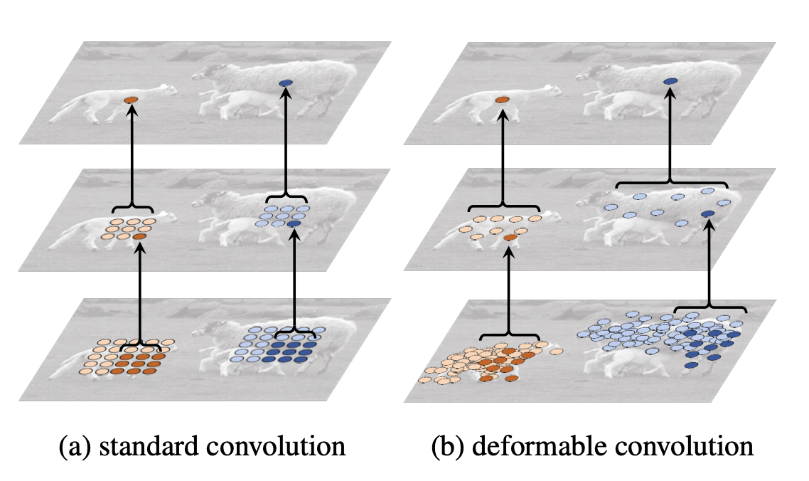
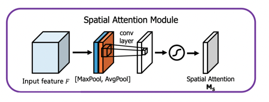

## 6. 模型优化（进阶）

### 精度优化

本小节侧重展示在模型优化过程中，提升模型精度的思路。在这些思路中，有些会对精度有所提升，有些没有。在其他人流量统计/人体检测场景中，可以根据实际情况尝试如下策略，不同的场景下可能会有不同的效果。

#### (1) 基线模型选择

本案例采用FairMOT模型作为基线模型，其骨干网络选择是DLA34。基线模型共有三种：

1）训练基于NVIDIA Tesla V100 32G 2GPU，batch size = 6，使用Adam优化器，模型使用CrowdHuman数据集进行预训练；

2）训练基于NVIDIA Tesla V100 32G 4GPU，batch size = 8，使用Momentum优化器，模型使用CrowdHuman数据集进行预训练；

3）训练基于NVIDIA Tesla V100 32G 4GPU，batch size = 8，使用Momentum优化器，模型使用ImageNet数据集进行预训练。

模型优化时使用的数据集，参见 `调优数据集`。

| 模型                                                   | MOTA | 推理速度 |
| ------------------------------------------------------ | ---- | -------- |
| baseline (dla34 2gpu bs6 adam lr=0.0001)               | 70.9 | 15.600   |
| baseline (dla34 4gpu bs8 momentum)                     | 67.5 | 15.291   |
| baseline (dla34 4gpu bs8 momentum + imagenet_pretrain) | 64.3 | 15.314   |


#### (2) 数据增强

**增加cutmix**

下图中展示了三种数据增强的方式：

* Mixup: 将随机两幅图像以一定的全值叠加构成新的图像；
* Cutout：将图像中随机区域剪裁掉，用0像素值来填充；
* CutMix：将一张图像中的随机区域剪裁掉，并随机选取另一张图片，用其对应区域中的像素来填充剪裁掉的部分。


图片来源：[CutMix: Regularization Strategy to Train Strong Classifiers with Localizable Features](https://arxiv.org/pdf/1905.04899.pdf)

相比于Mixup和Cutout，CutMix在图像分类和目标检测任务上都有更好的效果。因为CutMix要求模型从局部识别对象，可以进一步增强模型定位能力。

实现上，可以通过修改 `configs/mot/fairmot/__base__/fairmot_reader_1088x608.yml`，加入如下代码，实现CutMix数据增强：

```yaml
TrainReader:
  inputs_def:
    image_shape: [3, 608, 1088]
  sample_transforms:
    - Decode: {}
    - RGBReverse: {}
    - AugmentHSV: {}
    - LetterBoxResize: {target_size: [608, 1088]}
    - MOTRandomAffine: {reject_outside: False}
    - RandomFlip: {}
    
    - Cutmix: {}
    
    - BboxXYXY2XYWH: {}
    - NormalizeBox: {}
    - NormalizeImage: {mean: [0, 0, 0], std: [1, 1, 1]}
    - RGBReverse: {}
    - Permute: {}
```

实验结果：

| 模型                             | MOTA | 推理速度 |
| -------------------------------- | ---- | -------- |
| dla34 4gpu bs8 momentum + cutmix | 67.7 | 15.528   |

在baseline中加入cutmix，模型MOTA提升0.2%。


#### (3) 可变形卷积

可变形卷积（Deformable Convolution Network, DCN）顾名思义就是卷积的位置是可变形的，并非在传统的 $N \times N$ 网格上做卷积，这样的好处就是更准确地提取到我们想要的特征（传统的卷积仅仅只能提取到矩形框的特征），通过一张图我们可以更直观地了解：



图片来源：[Deformable Convolutional Networks](https://arxiv.org/pdf/1703.06211.pdf)

在上面这张图里面，左边传统的卷积显然没有提取到完整绵羊的特征，而右边的可变形卷积则提取到了完整的不规则绵羊的特征。本实验在 CenterNet head 中加入了DCN，具体实现方法为：使用 `code/centernet_head_dcn.py` 中的代码替换 `ppdet/modeling/heads/centernet_head.py` 中的代码。

实验结果：

| 模型                          | MOTA | 推理速度 |
| ----------------------------- | ---- | -------- |
| dla34 4gpu bs8 momentum + dcn | 67.2 | 16.695   |

在baseline中加入dcn，模型MOTA降低0.3%。


#### (4) syncbn+ema

**syncbn**

默认情况下，在使用多个GPU卡训练模型的时候，Batch Normalization都是非同步的 (unsynchronized)。每次迭代时，输入被分为多等分，然后在不同的卡上进行前向后向运算，每个卡上的模型都是单独运算的，相应的Batch Normalization也是在卡内完成。因此BN所归一化的样本数量也只局限于卡内的样本数。开启跨卡同步Batch Normalization后，在前向运算时即可得到全局的均值和方差，后向运算时得到相应的全局梯度，卡与卡之间同步。

**ema**

在深度学习中，经常会使用EMA（指数移动平均）这个方法对模型的参数做平均，以求提高测试指标并增加模型鲁棒。指数移动平均（Exponential Moving Average）也叫权重移动平均（Weighted Moving Average），是一种给予近期数据更高权重的平均方法。在深度学习优化中，其基本假设为，模型权重在最后的n步内会在最优点附近震荡，所以我们取n步后的平均值，则能使模型更加鲁棒。

本实验中，使用synbn和ema，可以通过在 `configs/mot/fairmot/_base_/fairmot_dla34.yml` 中，进行如下修改：

```yaml
architecture: FairMOT
pretrain_weights: https://paddledet.bj.bcebos.com/models/pretrained/fairmot_dla34_crowdhuman_pretrained.pdparams
norm_type: sync_bn
use_ema: true
ema_decay: 0.9998
```

实验结果：

| 模型                                   | MOTA | 推理速度 |
| -------------------------------------- | ---- | -------- |
| dla34 4gpu bs8 momentum + syncbn + ema | 67.4 | 16.695   |

在baseline上开启syncbn和ema，模型MOTA降低0.1%。


#### (5) 优化策略

Adam使用动量和自适应学习率来加快收敛速度。对梯度的一阶矩阵估计和二阶矩阵估计进行综合考虑，以此计算更新步长。本实验中可以通过在 `PaddleDetection/configs/mot/fairmot/_base_/optimizer_30e.yml` 中，进行如下修改：

```yaml
LearningRate:
  base_lr: 0.0002
  schedulers:
  - !PiecewiseDecay
    gamma: 0.1
    milestones: [20,]
    use_warmup: False

OptimizerBuilder:
  optimizer:
    type: Adam
  regularizer: NULL
```

实验结果：

| 模型                          | MOTA | 推理速度 |
| ----------------------------- | ---- | -------- |
| dla34 4gpu bs6 adam lr=0.0002 | 71.1 | 15.823   |

将优化器更换为adam，batch size由8更新为6后，MOTA增长3.6%。


#### (6) 空间域注意力模块（Spatial Gate Module）

注意力机制的加入可以让网络更加关注重点信息并忽略无关信息。空间域注意力模块的结构如下图所示：



图片来源：[CBAM: Convolutional Block Attention Module](https://arxiv.org/pdf/1807.06521.pdf)

模块的输入特征为F。首先会基于通道维度进行global max pooling和global average pooling，得到两个H×W×1 的特征图，然后将这两个特征图进行通道拼接。再经过一个7×7卷积操作，将通道数降维为1。然后经过sigmoid函数生成spatial attention feature，即$M_s$。该feature与输入特征相乘则得到最终的特征。

本实验中通过将 `code/centernet_fpn_attention.py` 中的代码替换 `PaddleDetection/ppdet/modeling/necks/centernet_fpn.py` 来实现Spatial Gate Module。设置 `self.attention = SpatialGate()`。

```python
self.attention = SpatialGate()
# self.attention = SANN_Attention(c_state = False, s_state = True) # spatial_attention
```


实验结果：

| 模型                                                     | MOTA | 推理速度 |
| -------------------------------------------------------- | ---- | -------- |
| dla34 4gpu bs8 momentum + attention                      | 67.6 | -        |
| dla34 4gpu bs6 adam lr=0.0002 + syncbn + ema + attention | 71.6 | -        |

我们进行了两个实验：

1. 在 baseline (dla34 4gpu bs8 momentum) 上新增attention模块，模型MOTA增加0.1%;
2. 叠加使用优化方法adam bs6 + syncbn + ema + attention模块，相比使用adam bs6 + syncbn + ema + attention，MOTA降低0.1%。

新增attention部分暂不支持开启TensorRT进行推理。


#### (7) backbone


图片来源：[Deep Layer Aggregation](https://arxiv.org/pdf/1707.06484.pdf)

在本实验中，我们尝试将baseline中的centernet的backbone由DLA-34更换为其他更大的模型，如DLA-46-C、DLA-60及DLA-102。因为更换的backbone都只有在ImageNet上的预训练模型，而我们实验中使用的dla34 backbone 是在CrowdHuman上做过预训练的。所以这一部分的实验结果要与 `baseline (dla34 4gpu bs8 momentum + image_pretrain)` 进行比较。替换backbone可以通过 `code/dla_backbones`中的代码来替换 `PaddleDetection/ppdet/modeling/backbones/dla.py` 中的代码，并通过调整 `depth` 来选择backbone的结构，可选择dla34、46c、60和102。

```python
class DLA(nn.Layer):
    """
    DLA, see https://arxiv.org/pdf/1707.06484.pdf

    Args:
        depth (int): DLA depth, should be 34.
        residual_root (bool): whether use a reidual layer in the root block

    """

    def __init__(self, depth=34, residual_root=False):
      
```


| 模型                                         | MOTA | 推理速度 |
| -------------------------------------------- | ---- | -------- |
| dla46c 4gpu bs8 momentum + imagenet_pretrain | 61.2 | 16.863   |
| dla60 4gpu bs8 momentum + imagenet_pretrain  | 58.8 | 12.531   |
| dla102 4gpu bs8 momentum + imagenet_pretrain | 54.8 | 12.469   |


#### (8) GIoU Loss

GIoU解决了IoU Loss存在的两个问题：

* 预测框如果和真实框没有重叠，则IoU始终为0，损失函数失去可导性；
* IoU无法分辨不同方式的对齐，IoU值相同，但预测框的方向可能完全不同。

GIoU提出一种计算方式，对于两个框A和B，先计算出A、B的最小包围框C，然后根据如下公式计算出GIoU:
$$
GIoU = IoU - \frac{C-(A \cup B)}{C}
$$
GIoU Loss = 1 - GIoU. 如想尝试增加GIoU Loss，可用 `code/centernet_head_iou_head.py` 替换 `ppdet/modeling/heads/centernet_head.py` 中的代码，并且修改 `ppdet/modeling/architectures/fairmot.py` 文件，在第84行增加 `'iou_loss': det_outs['iou_loss'],` : 

```python
det_loss = det_outs['det_loss']
loss = self.loss(det_loss, reid_loss)
loss.update({
  'heatmap_loss': det_outs['heatmap_loss'],
  'size_loss': det_outs['size_loss'],
  'iou_loss': det_outs['iou_loss'],
  'offset_loss': det_outs['offset_loss'],
  'reid_loss': reid_loss
  })
return loss
```

实验结果如下：

| 模型                                                    | MOTA | 推理速度 |
| ------------------------------------------------------- | ---- | -------- |
| dla34 4gpu bs6 adam lr=0.0002 + syncbn + ema + iou head | 71.6 | 15.723   |


#### 全部实验结果展示

本项目中进行过的全部实验结果如下表所示，其中有部分采用混合优化策略进行的实验未在上文中进行详细展示。通过全部的实验结果可以观察到，有些优化策略在精度优化上起到了正向结果，有些策略则相反，但这些结论在不同的模型和不同的数据集上并不是相通的，还需根据具体情况进行实验。同时，我们也观察到，精度最高的模型并不是推理速度最快的，推理速度最快的模型精度效果不是最好的。因此，具体使用什么模型还需要根据需求进行分析。

| 模型                                                         | MOTA | 推理速度（开启TensorRT） |
| ------------------------------------------------------------ | ---- | ------------------------ |
| baseline (dla34 2gpu bs6 adam lr=0.0001)                     | 70.9 | 15.600                   |
| baseline (dla34 4gpu bs8 momentum)                           | 67.5 | 15.291                   |
| baseline (dla34 4gpu bs8 momentum + imagenet_pretrain)       | 64.3 | 15.314                   |
| dla34 4gpu bs8 momentum + dcn                                | 67.2 | 16.695                   |
| dla34 4gpu bs8 momentum + syncbn + ema                       | 67.4 | 16.103                   |
| dla34 4gpu bs8 momentum + cutmix                             | 67.7 | 15.528                   |
| dla34 4gpu bs8 momentum + attention                          | 67.6 | -                        |
| dla34 4gpu bs6 adam lr=0.0002                                | 71.1 | 15.823                   |
| dla34 4gpu bs6 adam lr=0.0002 + syncbn + ema                 | 71.7 | 15.038                   |
| dla34 4gpu bs6 adam lr=0.0002 + syncbn + ema + attention     | 71.6 | -                        |
| dla34 4gpu bs6 adam lr=0.0002 + syncbn + ema + iou head      | 71.6 | 15.723                   |
| dla34 4gpu bs6 adam lr=0.0002 + syncbn + ema + attention + cutmix | 71.3 | -                        |
| dla46c 4gpu bs8 momentum + imagenet_pretrain                 | 61.2 | 16.863                   |
| dla60 4gpu bs8 momentum + imagenet_pretrain                  | 58.8 | 12.531                   |
| dla102 4gpu bs8 momentum + imagenet_pretrain                 | 54.8 | 12.469                   |

