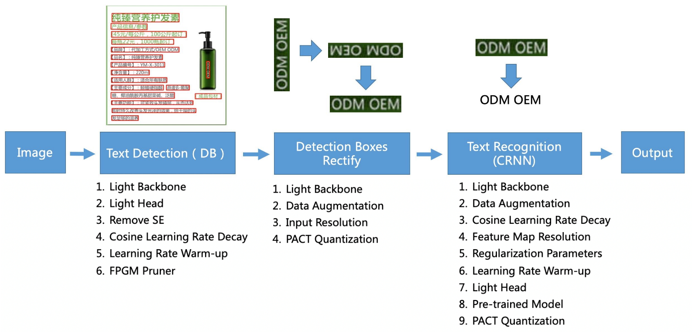
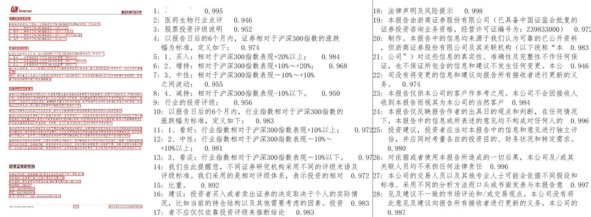
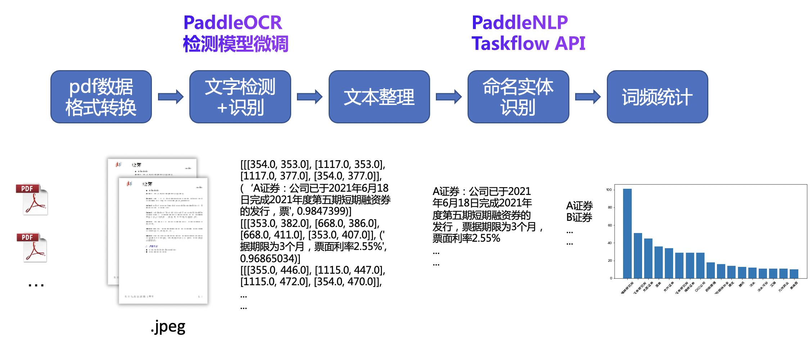
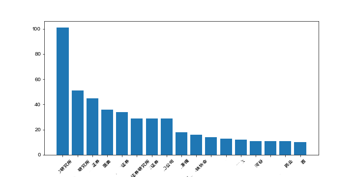

# 财报识别与关键字段抽取

## 1. 案例背景与环境搭建

当前，诸多投资机构都通过研报的形式给出对于股票、基金以及行业的判断，让大众了解热点方向、龙头公司等各类信息。然而，分析和学习研报往往花费大量时间，研报数目的与日俱增也使得自动对研报分析和信息抽取的诉求不断提高。

本案例以文档场景下的文字识别和命名实体识别为串联任务，对研报实体进行词频统计，使用[PaddleOCR](https://github.com/PaddlePaddle/PaddleOCR)和[PaddleNLP](https://github.com/PaddlePaddle/PaddleNLP)两个开发套件，迅速搭建一套文字与命名实体识别统计系统。

AI Studio项目链接可参考：https://aistudio.baidu.com/aistudio/projectdetail/2574084

### 1.1 安装PaddleOCR

#### 1.1.1 项目克隆

```
【推荐】git clone https://github.com/PaddlePaddle/PaddleOCR
```

如果因为网络问题无法pull成功，也可选择使用码云上的托管：

```
git clone https://gitee.com/paddlepaddle/PaddleOCR
```

注：码云托管代码可能无法实时同步本github项目更新，存在3~5天延时，请优先使用推荐方式。

#### 1.1.2 安装第三方库

```bash
cd PaddleOCR
pip install -r requirements.txt
```

### 1.2 安装PaddleNLP whl包

```
pip install --upgrade paddlenlp
```


## 2. 文档场景文字识别微调

### 2.1 数据准备

#### 2.2.1 研报数据获取

获取研报的渠道有很多，比如各种资讯机构以及各类国家机构的公开数据。

#### 2.1.2 数据格式转换

研报数据通常以pdf格式存在，而深度学习模型训练需要图像数据，因此需要将pdf数据转化为jpeg数据。

这里使用fitz包读入pdf文件之后按页保存为jpeg格式，由于过大的图像分辨率会使得模型预测过程中内存消耗严重，因此控制输出图像格式的分辨率也较为重要，通过`fitz.Matrix(zoom_x, zoom_y)`即可传入在x和y方向的缩放系数。

最终输出的图片格式分辨率在1k-2k之间。

#### 2.1.3 数据标注

开源标注工具中，PPOCRLabel是首款针对OCR场景的半自动标注工具，其内嵌PP-OCR系列模型，通过自动标注和重新识别两大核心功能，能使标注效率提升60-80%。

实际使用流程如下：首先打开数据文件夹，点击自动标注，PPOCRLabel会利用PP-OCR模型对所有图片进行预标注，并在软件右侧展示模型自动标注的结果。然后对机器标注的结果进行修正，对于漏检的区域绘制检测框后可以点击重新识别。最后导出标记结果和裁剪的图像。

检测标注数据文件是一个txt，格式如下所示，左侧为图像的文件名，右侧是图像中文本框对应的文字与坐标，两组字符的中间用 `\t` 分隔，行间字符用 `\n` 间隔

```
"图像文件名                    json.dumps编码的图像标注信息"
ch4_test_images/img_61.jpg    [{"transcription": "MASA", "points": [[310, 104], [416, 141], [418, 216], [312, 179]]}, {...}]
```

### 2.2 模型选型



PP-OCR是一个实用的超轻量OCR系统。主要由DB文本检测、检测框矫正和CRNN文本识别三部分组成。该系统从骨干网络选择和调整、预测头部的设计、数据增强、学习率变换策略、正则化参数选择、预训练模型使用以及模型自动裁剪量化8个方面，采用19个有效策略，对各个模块的模型进行效果调优和瘦身。更多细节请参考PP-OCR技术方案 https://arxiv.org/abs/2009.09941

### 2.3 模型训练与评估

#### 2.3.1 预训练模型下载

当数据按照PP-OCR格式整理好后，开始训练前首先需要下载预训练模型

在PP-OCR模型库下载PP-OCR mobile系列的检测模型到`./pretrain_models`文件夹中并解压

```bash
wget -P ./pretrain_models/ https://paddleocr.bj.bcebos.com/dygraph_v2.0/ch/ch_ppocr_mobile_v2.0_det_train.tar
cd ./pretrain_models/ && tar xf ch_ppocr_mobile_v2.0_det_train.tar
```

得到的结果如下

```
./pretrain_models/ch_ppocr_mobile_v2.0_det_train/
  └─ best_accuracy.pdopt       
  └─ best_accuracy.pdparams           
  └─ best_accuracy.states
```

#### 2.3.2 修改配置文件

配置文件是模型训练过程中必不可少的部分，它是由模型参数和训练过程参数组成的集合。对`ch_det_mv3_db_v2.0.yml`配置文件的修改包括预训练模型路径、数据集路径两部分。通过`Global.pretrained_model`指定配置文件中的预训练模型路径。修改配置文件中的`data_dir, label_file_list`为数据所在路径。

```
Global:
	└─pretrained_model:./pretrain_models/ch_ppocr_mobile_v2.0_det_train/best_accuracy
Train:
	└─dataset
		└─data_dir:path/to/your/dataset
		└─label_file_list:path/to/your/dataset/label.txt
Eval:
	└─dataset
		└─data_dir:path/to/your/dataset
		└─label_file_list:path/to/your/dataset/label.txt
```

**注意：**

- 训练程序在读取数据时，读取的文件路径为`data_dir路径 + label.txt中的文件名`，需要注意组合后的路径与图片路径相同。

- 配置文件修改可通过上述方式直接更改yml，也可通过在下方启动训练命令中指定`-o Global.pretrained_model`实现

#### 2.3.3 启动训练

训练平台使用AI Studio,通过 `-c`  选择与模型相同的配置文件`ch_det_mv3_db_v2.0.yml`

```bash
# 单机单卡训练
python3 tools/train.py -c ./configs/det/ch_ppocr_v2.0/ch_det_mv3_db_v2.0.yml
```

此时程序会在ouput文件夹中输出配置文件 `config.yml`、最优模型 `best_accuracy.*`、最新模型 `latest.*` 和训练日志 `train.log`

#### 2.3.4 断点训练

当程序中值后，重新启动训练可通过`Global.checkpoints`读入之前训练的权重

```
python3 tools/train.py -c ./configs/det/ch_ppocr_v2.0/ch_det_mv3_db_v2.0.yml -o Global.checkpoints=./output/ch_db_mv3/latest
```

**注意**：`Global.checkpoints`的优先级高于`Global.pretrained_model`的优先级，即同时指定两个参数时，优先加载`Global.checkpoints`指定的模型，如果`Global.checkpoints`指定的模型路径有误，会加载`Global.pretrained_model`指定的模型。

#### 2.3.5 测试集评估

PaddleOCR计算三个OCR检测相关的指标，分别是：Precision、Recall、H-mean（F-Score）。

训练中模型参数默认保存在`Global.save_model_dir`目录下。在评估指标时，需要设置`Global.checkpoints`指向保存的参数文件。

```shell
# 原始模型
python3 tools/eval.py -c configs/det/ch_ppocr_v2.0/ch_det_mv3_db_v2.0.yml  -o Global.checkpoints="./pretrain_models/ch_ppocr_mobile_v2.0_det_train/best_accuracy"

# Finetune后模型
python3 tools/eval.py -c configs/det/ch_ppocr_v2.0/ch_det_mv3_db_v2.0.yml  -o Global.checkpoints="./output/ch_db_mv3/best_accuracy"
```

获得结果如下，经过finetune后的模型在综合指标H-mean上比原先提升3%左右。

| Model                  | Precision | Recall | H-mean |
| ---------------------- | --------- | ------ | ------ |
| PP-OCR mobile          | 0.770     | 0.890  | 0.826  |
| PP-OCR mobile finetune | 0.833     | 0.882  | 0.856  |

### 2.4 结果可视化

首先将训练模型转换为inference模型，加载配置文件`ch_det_mv3_db_v2.0.yml`，从`output/ch_db_mv3`目录下加载`best_accuracy`模型，inference模型保存在`./output/ch_db_mv3_inference`目录下

```python
python3 tools/export_model.py -c configs/det/ch_ppocr_v2.0/ch_det_mv3_db_v2.0.yml -o Global.pretrained_model="./output/ch_db_mv3/best_accuracy" Global.save_inference_dir="./output/ch_db_mv3_inference/"
```

然后在实例化PaddleOCR时通过参数`det_model_dir`指定转化后的模型位置

```python
from paddleocr import PaddleOCR, draw_ocr

ocr = PaddleOCR(det_model_dir='./output/ch_db_mv3_inference/inference',
                use_angle_cls=True)
img_path = './train_data/Research_val/85_11.jpeg'
result = ocr.ocr(img_path, cls=True)
for line in result:
    print(line)

# 显示结果
from PIL import Image

image = Image.open(img_path).convert('RGB')
boxes = [line[0] for line in result]
txts = [line[1][0] for line in result]
scores = [line[1][1] for line in result]
im_show = draw_ocr(image, boxes, txts, scores, font_path='./doc/fonts/simfang.ttf')
im_show = Image.fromarray(im_show)
im_show.save('result.jpg')
```

结果图片




## 3. 命名实体识别

什么是实体？*实体，可以认为是某一个概念的实例，*

*命名实体识别(Named Entities Recognition，NER)，就是识别这些实体指称的边界和类别。主要关注人名、地名和组织机构名这三类专有名词的识别方法。*

词法分析任务即可获得句子中的实体。该任务的输入是一个字符串（句子），输出是句子中的词边界和词性、实体类别。其中能够识别的标签和对应含义如下表所示：

| 标签 | 含义     | 标签 | 含义     | 标签 | 含义     | 标签 | 含义     |
| ---- | -------- | ---- | -------- | ---- | -------- | ---- | -------- |
| n    | 普通名词 | f    | 方位名词 | s    | 处所名词 | t    | 时间     |
| nr   | 人名     | ns   | 地名     | nt   | 机构名   | nw   | 作品名   |
| nz   | 其他专名 | v    | 普通动词 | vd   | 动副词   | vn   | 名动词   |
| a    | 形容词   | ad   | 副形词   | an   | 名形词   | d    | 副词     |
| m    | 数量词   | q    | 量词     | r    | 代词     | p    | 介词     |
| c    | 连词     | u    | 助词     | xc   | 其他虚词 | w    | 标点符号 |
| PER  | 人名     | LOC  | 地名     | ORG  | 机构名   | TIME | 时间     |

用户可以使用PaddleNLP提供的Taskflow工具来对输入的文本进行一键分词，具体使用方法如下，其中 `segs` 部分即为对 `text` 分词后的结果，`tags` 即为 `segs` 中每个分词对应的标签。对于其中的机构名，可以根据标签 `ORG`、 `nt` 抽出。

```python
from paddlenlp import Taskflow

tag = Taskflow("pos_tagging")
tag("第十四届全运会在西安举办")
>>>[('第十四届', 'm'), ('全运会', 'nz'), ('在', 'p'), ('西安', 'LOC'), ('举办', 'v')]

tag(["第十四届全运会在西安举办", "三亚是一个美丽的城市"])
>>> [[('第十四届', 'm'), ('全运会', 'nz'), ('在', 'p'), ('西安', 'LOC'), ('举办', 'v')], [('三亚', 'LOC'), ('是', 'v'), ('一个', 'm'), ('美丽', 'a'), ('的', 'u'), ('城市', 'n')]]

```

关于词法分析的详细说明文档可以参考 [此处](https://github.com/PaddlePaddle/PaddleNLP/tree/develop/examples/lexical_analysis) ，其中包含在自定义数据集上的训练、评估和导出。


## 4. Pipeline

<div align="center">
  
</div>  


整个系统包含一下流程：首先对pdf格式的研报拆分为图片格式，然后对每张图片进行ocr，得到结果后输入LAC分词工具提取其中出现的机构名，最后统计同一个pdf研报下机构名出现的频率，得到当前研报主要关注的机构，批量统计多个研报后即可得到当前主要研究的热点领域和机构等。代码运行方法如下

首先将数据放置在`./Research` 文件夹下，运行下方代码将pdf切分为图片

```python
python splitPDF.py
```

然后运行 `test.py` 完成OCR与LAC以及词频统计，得到示意图如下图所示

```
python DocRec.py
```

<div align="center">
  
</div>  


