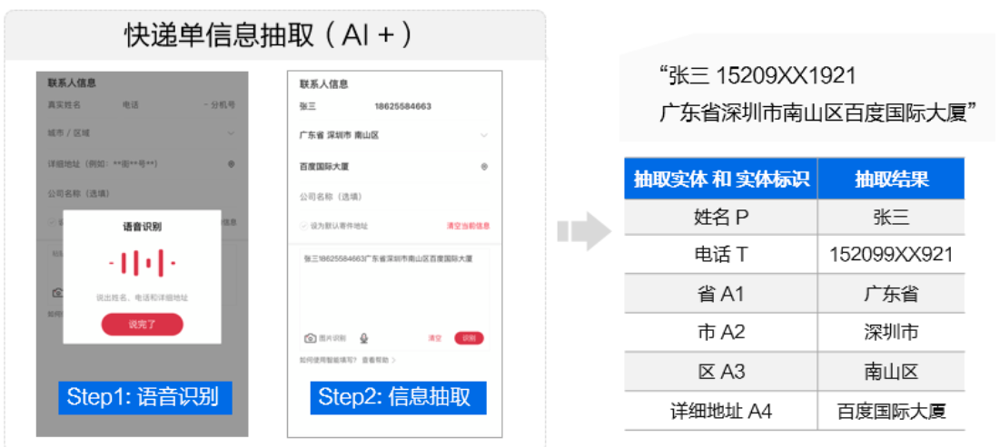
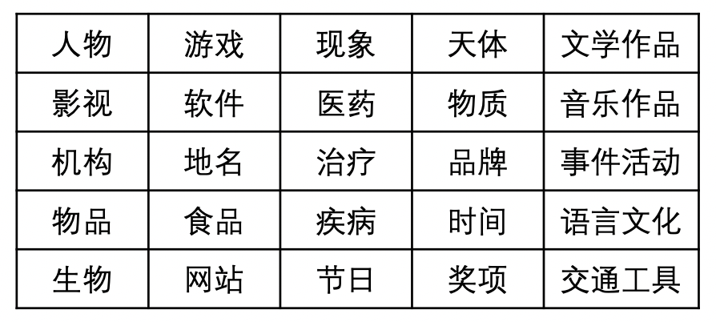
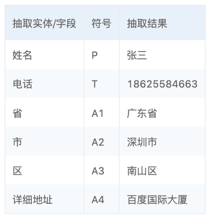
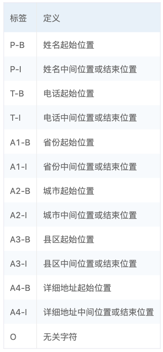
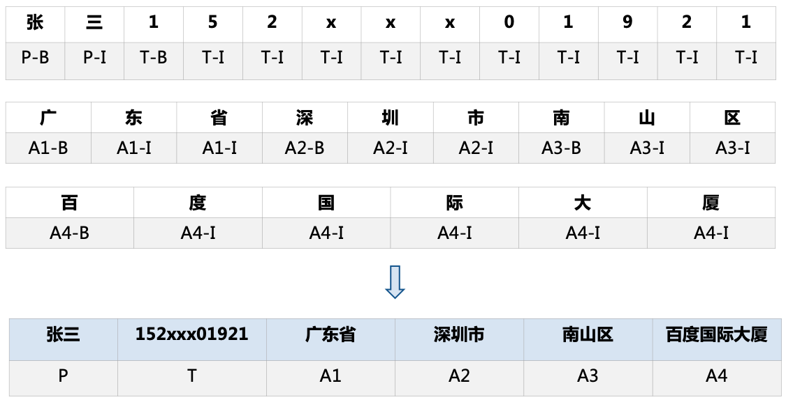
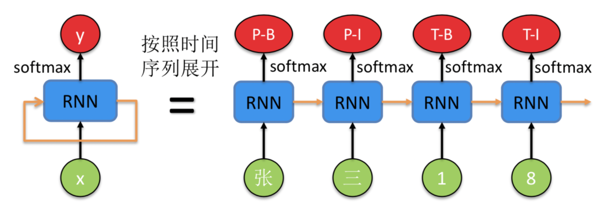
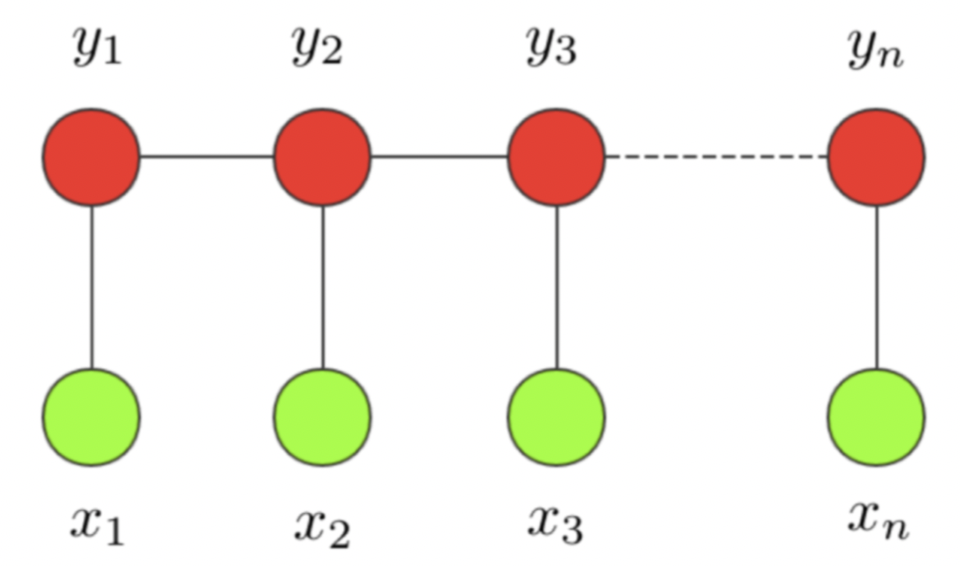
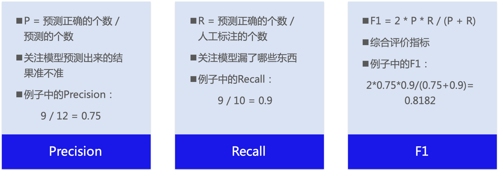
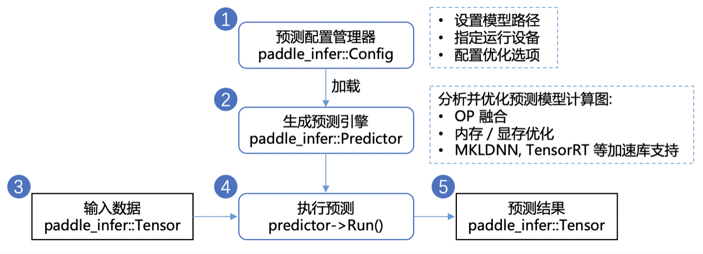

# 物流快递单信息抽取

## 目 录

* [项目概述](#项目概述)
* [安装说明](#安装说明)
* [方案介绍](#方案介绍)
* [数据准备](#数据准备)
* [组网、训练、评估](#模型选择、训练、评估)
* [模型部署](#模型部署)

<a name="项目概述"></a>

## 1  项目概述

本项目主要介绍如何使用飞桨自然语言处理开发库 PaddleNLP 完成物流快递单信息抽取：从用户提供的快递单中，抽取姓名、电话、省、市、区、详细地址等内容，形成结构化信息。辅助物流行业从业者进行有效信息的提取，从而降低客户填单的成本。




从物流信息中抽取想要的关键信息，实际上是NLP中的实体抽取任务。实体信息抽取技术业务难点如下：

* **实体类别多，任务复杂度高**    
同一名词可能对应多个实体类别，如“蜗牛”。    
不少实体词与普通用语相同，尤其作品名。     
此外，实体类别多，任务复杂度较高，如下所示实体示例：

<div align="center"></div>  

<div align="center">图1：实体示例</div>  

* **实体词往往稀疏低频**    
人名在语料出现频次高，但不同人名出现频次有限。大多垂类实体词在通用语料出现频次低。

* **特定业务场景中标注数据集较少，需要一定的成本标注，如果数据集质量差或样本量过少，精度会比较低。**  

  

<a name="安装说明"></a>

## 2  安装说明

### 环境要求

* PaddlePaddle >= 2.1.0
* Python >= 3.6
* PaddleNLP >= 2.0.0

### pip安装

```
pip install --upgrade paddlenlp
```

PaddlePaddle 安装可参考[安装文档](https://www.paddlepaddle.org.cn/install/quick?docurl=/documentation/docs/zh/install/pip/linux-pip.html)。


<a name="方案介绍"></a>

## 3  方案介绍

### 3.1 序列标注

针对实体信息抽取技术，有如下三种方案：

- **符号主义 —— 字符串匹配**
  需要构建词典，穷举所有地址、姓名等信息，但无法发现新词、简称等。
- **统计语言模型（Word-Based Generative Model）- n-gram概率/最大概率路径**
  需要构建词典及词频，仍无法发现新词、简称等。
- **序列标注（Character-Based Discriminative Model）**
  需要标注数据，效果好，可发现新词、简称。 有两类实现方法：一是基于统计的模型：HMM、MEMM、CRF，这类方法需要关注特征工程；二是深度学习方法：RNN、LSTM、GRU、CRF、RNN+CRF....

本案例采用序列标注的方式，更加灵活、通用。

在序列标注任务中，我们首先要定义好需要抽取哪些字段。比如现在拿到一个快递单，可以作为我们的模型输入，例如“张三18625584663广东省深圳市南山区学府路东百度国际大厦”，那么序列标注模型的目的就是识别出其中的“张三”为人名（用符号 P 表示），“18625584663”为电话名（用符号 T 表示），“广东省深圳市南山区百度国际大厦”分别是 1-4 级的地址（分别用 A1~A4 表示，可以释义为省、市、区、街道）。

这是一个典型的命名实体识别（Named Entity Recognition，NER）场景，各实体类型及相应符号表示见下表：

<div align="center"></div>  

<div align="center">图2：快递单实体类型</div>  

针对需要被抽取的“姓名、电话、省、市、区、详细地址”等实体，我们采用BIO标注体系，标签集合可以定义为：label = {P-B, P-I, T-B, T-I, A1-B, A1-I, A2-B, A2-I, A3-B, A3-I, A4-B, A4-I, O}。每个标签的定义分别为：

<div align="center"></div>  

<div align="center">图3：标签体系</div>  

采用以上标注体系，对于句子“张三18625584663广东省深圳市南山区百度国际大厦”，每个汉字及对应标签如下，其中“张“，”三”在这里表示成了“P-B” 和 “P-I”，“P-B”和“P-I”合并成“P” 这个标签。这样重新组合后可以得到最终的信息抽取结果：

<div align="center">
  
</div>  

<div align="center">图4：数据集标注示例</div>  

### 3.2 模型选择

#### 3.2.1 循环神经网络 - 门控循环单元（GRU，Gate Recurrent Unit）

循环神经网络（RNN，Recurrent Neural Network）能够对序列信息建模，一个 RNN 的示意图如下所示，

<div align="center">
  
</div>  

<div align="center">图5：RNN示意图</div>  

左边是原始的 RNN，可以看到绿色的点代码输入 x，红色的点代表输出 y，中间的蓝色是 RNN 模型部分。橙色的箭头由自身指向自身，表示 RNN 的输入来自于上时刻的输出，这也是为什么名字中带有循环（Recurrent）这个词。

右边是按照时间序列展开的示意图，注意到蓝色的 RNN 模块是同一个，只不过在不同的时刻复用了。这时候能够清晰地表示序列标注模型的输入输出。

长短时记忆（Long Short-Term Memory, LSTM）是RNN中最经典的模型，通过引入三个门控函数有效解决了长序列训练过程中的梯度消失和梯度爆炸问题。相比普通的RNN，LSTM能够在更长的序列中有更好的表现。GRU可以理解为LSTM网络的简化版，保留了两个门控函数，同样能够解决长期记忆和反向传播中的梯度问题，且更易于计算。

这里我们采用双向网络 - BiGRU，每一个时刻的输出，由前后两个时刻的GRU输出共同决定，这样能够有效考虑到自然语言中的前后语境。

#### 3.2.2 条件随机场（CRF，Conditional Random Fields)

长句子的问题解决了，序列标注任务的另外一个问题也亟待解决，即标签之间的依赖性。举个例子，我们预测的标签一般不会出现 P-B，T-I 并列的情况，因为这样的标签不合理，也无法解析。无论是 RNN 还是 LSTM 都只能尽量不出现，却无法从原理上避免这个问题。下面要提到的条件随机场 CRF 却很好的解决了这个问题。

条件随机场属于概率图模型中的无向图模型，这里我们不做展开，只直观解释下该模型背后考量的思想。一个经典的链式 CRF 如下图所示，

<div align="center">
  
</div>  

<div align="center">图6：CRF示意图</div>  

CRF 本质是一个无向图，其中绿色点表示输入，红色点表示输出。点与点之间的边可以分成两类，一类是 x 与 y 之间的连线，表示其相关性；另一类是相邻时刻的 y之间的相关性。也就是说，在预测某时刻 y 时，同时要考虑相邻的标签。当 CRF 模型收敛时，就会学到类似 P-B 和 T-I 作为相邻标签的概率非常低。

#### 3.2.3 预训练模型 （ERNIE、ERNIE-Gram）

除了GRU+CRF方案外，我们也可以使用预训练模型，将序列信息抽取问题，建模成字符级分类问题。这里我们采用强大的语义模型ERNIE，完成字符级分类任务。使用预训练模型往往比RNN网络能获得更高的模型精度，但从部署上看，预训练模型参数较多，预测性能可能不符合线上快速相应需求，可以结合模型压缩、FasterTransformer加速等方式进行高性能部署。

<div align="center">
  
</div>  

<div align="center">
  
</div>  

<div align="center">图7：ERNIE示意图</div>  

### 3.3 评估指标

信息抽取的通用评测指标：Precision、Recall、F1值。
例如：希望抽取10个信息，实际抽取12个，其中有9个是对的：

<div align="center">
  
</div>  


<a name="数据准备"></a>

##  4  数据准备

这里采取的是快递单数据集，包括1600条训练集，验证集和测试集各200条。这份数据除姓名、人名、地名之外，无其他信息。采用BIO方式标注训练集，由于仅含实体信息，所以数据集无“O”（非实体）标识。训练集中除第一行是 `text_a\tlabel`，后面的每行数据都是由两列组成，以制表符分隔，第一列是 utf-8 编码的中文文本，以 `\002` 分割，第二列是对应序列标注的结果，以 `\002` 分割。

最终数据集文件组织结构为：

```
 ├── dataset
  ├── train.txt
  └── dev.txt
  └── test.txt
```

此外还需要标签文件:

```
 ├── conf
  ├── tag.dic
```


<a name="模型选择、训练、评估"></a>

##  5  组网、训练、评估

PaddleNLP中提供了一系列模型，均可简便调用。预训练模型的使用方法可参考[官方文档](https://paddlenlp.readthedocs.io/zh/latest/model_zoo/transformers.html)。

* BiGRU + CRF

```python
python run_bigru_crf.py
```

* ERNIE 1.0

```python
python run_ernie.py
```

* ERNIE 1.0 + CRF

```python
python run_ernie_crf.py
```

* ERNIE-Gram

```python
python run_erniegram.py
```

* ERNIE-Gram + CRF

```python
python run_erniegram_crf.py
```

最终，ERNIE-Gram、ERNIE-Gram+CRF模型取得了最佳效果。由于这份数据集的标注质量非常高，所以模型间效果的差别不是很大。在实际工业中的数据集上，ERNIE-Gram更能发挥出绝对领先的优势。

| 模型             | Precision | Precision | F1    |
| ---------------- | --------- | --------- | ----- |
| ERNIE-Gram + CRF | 0.987     | 0.991     | 0.989 |

<a name="模型部署"></a>

## 6  模型部署

在模型训练过程中保存的模型文件包含前向预测和反向传播的过程，在实际的工业部署则不需要反向传播，因此需要将模型导成部署需要的模型格式。我们推荐在动态图模式下开发，训练完成后再导出静态图模型，进行部署， 可参考[PaddleNLP模型导出](https://github.com/PaddlePaddle/PaddleNLP/blob/develop/examples/information_extraction/waybill_ie/export_model.py)示例。

获得静态图模型之后，我们使用Paddle Inference进行预测部署。Paddle Inference是飞桨的原生推理库，作用于服务器端和云端，提供高性能的推理能力。



<div align="center">图8：使用推理库进行预测</div>  

Paddle Inference 采用 Predictor 进行预测。Predictor 是一个高性能预测引擎，该引擎通过对计算图的分析，完成对计算图的一系列的优化（如OP的融合、内存/显存的优化、 MKLDNN，TensorRT 等底层加速库的支持等），能够大大提升预测性能。另外Paddle Inference提供了Python、C++、GO等多语言的API，可以根据实际环境需要进行选择，例如使用 Paddle Inference 开发 Python 预测程序可参考[示例](https://github.com/PaddlePaddle/PaddleNLP/blob/develop/examples/information_extraction/waybill_ie/deploy/python/predict.py)，相关API已安装在Paddle包，直接使用即可。

