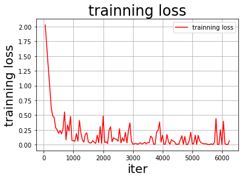
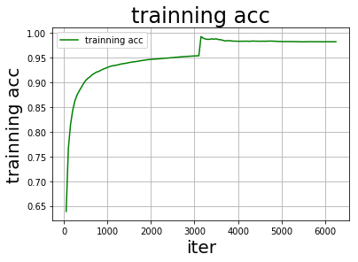

# 一、论文简介

### 1.1 简介

Mlp-mixer是谷歌提出的基于纯mlp结构的cv框架，用来替代卷积和Transformer里的注意力操作。

- **Motiviation**

卷积网络是计算机视觉的首选模型。近期，如Vision Transformer这般基于注意力机制的模型流行起来，这篇文章认为尽管用卷积或注意力足够取得卓越的性能，但是他们都不是必要的。

于是这篇文章提出纯Mlp结构的cv模型：Mlp-mixer，该模型包含两种类型的MLP层:

- 第一种MLP独立作用于图片的各个patch（混合每个位置的特征）；

- 第二种MLP作用于跨patch（混合空间信息）。

当使用非常大的数据集时，Mlp-mixer能在图像分类任务上取得非常有竞争力的水平。

[论文地址](https://arxiv.org/abs/2105.01601v4.pdf)


### 1.2 网络结构
Mlp-Mixer网络结构如下所示：


Mlp-Mixer包含如下三个部分：

 1.**嵌入层（per-patch linear embedding）**：

  &emsp;&emsp; 把HxW分辨率的图像分为S个不重叠的PxP的小块（patch），然后送入嵌入层，将小块的像素值用全连接映射到C维，则输出X是SxC的二维矩阵,S代表序列数（或token），C代表通道数。

  &emsp;&emsp; 该层对不重叠的小块用全连接嵌入，可用kernel_size和stride都为patch_size的卷积来替代，再把宽高展平和通道调换维度就得到SxC。全连接和卷积本质上可以相互转化，全连接的后一个神经元仅和前面临近的几个神经元稀连接，且共享权重时就成了卷积；卷积使用和图像大小相同的kernel_size且无stride时就变成了全连接。

2.**混合层（MixerLayer）**：

&emsp;&emsp;混合层不会改变输入维度，即输出还是SxC。该层中包含token混合和通道混合两个全连接块（图右下），每个块中包含两层的全连接，中间采用GELU激活函数；除此之外，还采用了跨层直连、层归一化、dropout。

&emsp;&emsp;混合层的结构为：

（1）先将SxC的输入对通道进行层归一化，即对单个样本（或称token）的所有通道求均值和方差，然后归一；

（2）其次经转置后CxS经**token-mixing**块，对相同通道的不同token进行空间上的混合（此处输入是对位置敏感的，所以不需要transformer的位置嵌入）；

（3）然后转置为SxC后与原始输入x进行跨层直连得到x2；

（4）最后经层归一化后，用**channel-mixing**对相同位置的不同通道进行混合，得到SxC的输出与x2跨层直连得到SxC的最终输出。

3.**分类头（classfier head）**：

&emsp;&emsp;单层全连接，输入是SxC经全局平均池化（对各个channel求平均）后C维的向量，输出是num_classes维。


**注**：

&emsp;&emsp;上述的token-mixing和channel-mixing类似深度可分离卷积，但是表达能力没有深度可分离卷积强。深度可分离卷积把传统卷积分成逐点卷积（pointwise）和逐通道卷积（depthwise），逐点卷积采用1x1的卷积核，改变了特征映射的通道数；然后逐通道卷积不同于传统卷积，对每个通道单独卷积，结果只改变图像分辨率不改变通道数。

- **token-mixing**类似逐通道卷积，对所有token的相同通道进行混合。但不同的是，token-mixing对不同通道都共享权重，而逐通道卷积不同通道的卷积核参数都不一样，所以说表达能力没有深度可分离卷积强。

- **channel-mixing**类似逐点卷积，对同一个token的不同通道进行混合，其实就是用了patch_size的卷积核（比较大），并在不同token之间共享权重;


### 1.3 GELU激活函数
&emsp;&emsp;GELU激活函数即高斯误差单元（Gaussian Error Linear Unit），它是dropout、zoneout、relu属性的混合。其中relu对输入确定性的乘0或1；

而dropout依概率对输出乘0；zoneout用于rnn中，依概率对上一个cell输出状态乘1，即随机失活这个cell，把上一个cell的状态向量跨cell直接输出到下一个cell。

&emsp;&emsp;这些随机正则化器与非线性激活函数不同，他们不依赖于输入，并且辅助了非线性激活函数的效果。

&emsp;&emsp;而GELU做的就是依赖于输入的随机正则化，即对x乘一个0或1的掩码mask，而这个mask是服从概率为Φ(x)的伯努利分布,即当随机变量X<=Φ(x)时mask=1，X>Φ(x)时mask=0，mask（m）为：


&emsp;&emsp;而Φ(x)是正态分布的分布函数，严格递增。所以x越小，Φ(x)越小，则mask=1的概率就越小；反之x越大，mask=1的概率就越大。


&emsp;&emsp;也就是说GELU依概率对x进行了缩放。具体来说，同层中某个神经元输出的x0比其他神经元的输出要大，则x0的缩放系数较大。

&emsp;&emsp;GELU(x)可以被近似为：


&emsp;&emsp;GELU,RELU,ELU（输出可为负的elu，加速训练）激活函数的图像如下所示：


### 1.4 实验结果
Mlp-Mixer具体有B L H (base lage huge)三种规格，B/16指的是base模型使用16*16的patch像素。除了分类头外，其他层的总参数如下所示：


论文中使用base16和lage16在ImageNet上指标为：

| Model      | Top1 | Params | FLOPs |
|:--:|:--:|:--:|:--:|
| mlp_mixer_b16_224 | 0.7644 | 0.766 | 0.929 |
| mlp_mixer_l16_224 | 0.7176 | 0.786 | 0.940 |

在cifar10上指标为：
| Model      | ImageNet-1k | ImageNet-21K | Image Size |
|:--:|:--:|:--:|:--:|
| mlp_mixer_b16_224 | 96.72% | 96.82%  | 224 |


# 二、复现结果
实验环境以及超参：
| Paddle Version | Memory | Card | Batch Size | Learning Rate | Epoch | Training time |
|:--:|:--:|:--:|:--:|:--:|:--:|:--:|
| 2.1.2 | 16G | V100*1  | 16 | 1e-5 | 2 | 15min |

本项目用PaddlePaddle复现了Mlp-Mixer模型，并在使用imagenet上预训练的**base16**模型，在**cifar10**上微调达到了精度，复现结果如下所示：

| Source      | ImageNet-1k | ImageNet-21K | Image Size |
|:--:|:--:|:--:|:--:|
| Paper | 96.72% | 96.82%  | 224 |
| this project | 97.45% | 97.17% |224 |

ImageNet预训练权重与cifar10微调权重地址为：

| imagenet预训练权重 | cifar10迁移权重 |
| -------- | -------- |
|  [链接:](https://pan.baidu.com/s/1sLPrOM4WXq2SG23yxWtTeA) 提取码：zm5v     | [链接:](https://pan.baidu.com/s/13drJv02mF_FGWD-1sbACeQ)  提取码: yrsc     |

```
# 权重目录结构
> tree:
├── checkpoints # 迁移权重
│   ├── in1k
│   │   └── final.pdparams # 迁移权重里的final1k.pdparams
│   └── in21k
│       └── final.pdparams # 迁移权重里的final21k.pdparams
└── ckpt # 预训练权重
    ├── mixer_b16_224_in21k.pdparams
    └── mixer_b16_224_miil_in1k.pdparams
```


# 三、准备工作


```python
# 2.1解压模型和权重
!unzip /home/aistudio/models.zip
!unzip /home/aistudio/data/data103202/ckpt.zip
```


```python
# 2.2 导入相关包
import os
import time
import random
import paddle
import numpy as np
import paddle.vision.transforms as T
from models import mixer_b16_224_in1k,mixer_b16_224_in21k
import matplotlib.pyplot as plt
import paddle.nn as nn
from tqdm import tqdm
```

    /opt/conda/envs/python35-paddle120-env/lib/python3.7/site-packages/matplotlib/__init__.py:107: DeprecationWarning: Using or importing the ABCs from 'collections' instead of from 'collections.abc' is deprecated, and in 3.8 it will stop working
      from collections import MutableMapping
    /opt/conda/envs/python35-paddle120-env/lib/python3.7/site-packages/matplotlib/rcsetup.py:20: DeprecationWarning: Using or importing the ABCs from 'collections' instead of from 'collections.abc' is deprecated, and in 3.8 it will stop working
      from collections import Iterable, Mapping
    /opt/conda/envs/python35-paddle120-env/lib/python3.7/site-packages/matplotlib/colors.py:53: DeprecationWarning: Using or importing the ABCs from 'collections' instead of from 'collections.abc' is deprecated, and in 3.8 it will stop working
      from collections import Sized


```python
# 2.3配置模型参数
'''
参数配置
'''
train_parameters = {
    "input_size": [3, 224, 224],                             #输入图片的shape
    "class_dim": 10,                                          #分类数
    "label_dict":{'0':'飞机','1':'汽车','2':'鸟','3':"猫",'4':"鹿",
                  '5':"狗",'6':"青蛙",'7':"马",'8':"船",'9':"卡车"},        #标签字典
    "num_epochs": 2,                                        #训练轮数,3轮会过拟合，达不到精度！
    "train_batch_size": 16,                                   #训练时每个批次的大小
    "learning_strategy": {                                   #优化函数相关的配置
        "lr": 1e-5                                        #超参数学习率
    },
    'skip_steps': 50,                                        #每N个批次打印一次结果
    'eval_steps':1000,                                       #每N个批次评估一下
    'save_steps': 2000,                                       #每N个批次保存一次模型参数
    "checkpoints": "./checkpoints"         #保存的路径
}
```

# 四、数据处理

### cifar10数据介绍

 CIFAR-10 是由 Hinton 的学生 Alex Krizhevsky 和 Ilya Sutskever 整理的一个用于识别普适物体的小型数据集。一共包含 10 个类别的 RGB 彩色图片：

 飞机、汽车、鸟类、猫、鹿、狗、蛙类、马、船和卡车。图片的尺寸为 32×32 ，数据集中一共有 50000 张训练图片和 10000 张测试图片。

 CIFAR-10 的图片样例如图所示。


下载地址：[cifar10](http://www.cs.toronto.edu/~kriz/cifar.html)

paddle已经内置了该数据集：[cifar10](https://www.paddlepaddle.org.cn/documentation/docs/zh/api/paddle/vision/datasets/Cifar10_cn.html#cifar10)


```python
# 设置随机种子
def seed_paddle(seed=1024):
    seed = int(seed)
    random.seed(seed)
    os.environ['PYTHONHASHSEED'] = str(seed)
    np.random.seed(seed)
    paddle.seed(seed)
seed_paddle(seed=1024)

```


```python
# transform
IMAGENET_DEFAULT_MEAN = (0.485, 0.456, 0.406)
IMAGENET_DEFAULT_STD = (0.229, 0.224, 0.225)
mean = list(map(lambda x:x*255,IMAGENET_DEFAULT_MEAN))
std = list(map(lambda x:x*255,IMAGENET_DEFAULT_STD))
transform1 = T.Compose([
                        T.Resize(size=(224,224)),
                        T.RandomHorizontalFlip(0.5),
                        T.Transpose(order=(2,0,1)),
                        T.Normalize(mean=mean,std=std)])
transform2 = T.Compose([
                        T.Resize(size=((224,224))),
                        T.Transpose(order=(2,0,1)),
                        T.Normalize(mean=mean,std=std)])

```


```python
# 加载数据集
train_dataset = paddle.vision.datasets.Cifar10(mode='train', transform=transform1)
eval_dataset = paddle.vision.datasets.Cifar10(mode='test', transform=transform2)
# 加载dataloader
train_loader=paddle.io.DataLoader(train_dataset,batch_size=train_parameters['train_batch_size'],shuffle=True)
eval_loader=paddle.io.DataLoader(eval_dataset,batch_size=train_parameters['train_batch_size'],shuffle=False)

```

    Cache file /home/aistudio/.cache/paddle/dataset/cifar/cifar-10-python.tar.gz not found, downloading https://dataset.bj.bcebos.com/cifar/cifar-10-python.tar.gz
    Begin to download

    Download finished


# 五、模型组网


```python
# 迁移imagenet1k的权重
model=mixer_b16_224_in1k(pretrained=True,num_classes=10) # imagenet1k
```


```python
# 迁移imagenet21k的权重
model21k=mixer_b16_224_in21k(pretrained=True,num_classes=10) # imagenet21k
```

# 六、训练模型

### 6.1 imagenet1k迁移 （高层API）


```python
model = paddle.Model(model)
optimizer = paddle.optimizer.Adam(learning_rate=train_parameters['learning_strategy']['lr'],
                                  parameters=model.parameters())
cross_entropy = paddle.nn.CrossEntropyLoss()
model.prepare(optimizer,  # 优化器
              cross_entropy,        # 损失函数
              paddle.metric.Accuracy(topk=(1, 5))) # 评估指标
```


```python
model.fit(train_loader,eval_loader,epochs=train_parameters['num_epochs'],eval_freq=1,save_dir=os.path.join(train_parameters['checkpoints'],'in1k'),save_freq=1,verbose=2)
```

```
step 470/625 - loss: 0.0986 - acc_top1: 0.9742 - acc_top5: 0.9997 - 44ms/step
step 480/625 - loss: 0.0218 - acc_top1: 0.9738 - acc_top5: 0.9997 - 44ms/step
step 490/625 - loss: 0.4833 - acc_top1: 0.9735 - acc_top5: 0.9996 - 44ms/step
step 500/625 - loss: 0.0075 - acc_top1: 0.9738 - acc_top5: 0.9996 - 44ms/step
step 510/625 - loss: 0.0441 - acc_top1: 0.9738 - acc_top5: 0.9996 - 44ms/step
step 520/625 - loss: 0.0609 - acc_top1: 0.9740 - acc_top5: 0.9996 - 44ms/step
step 530/625 - loss: 0.1437 - acc_top1: 0.9738 - acc_top5: 0.9996 - 44ms/step
step 540/625 - loss: 0.0068 - acc_top1: 0.9737 - acc_top5: 0.9997 - 44ms/step
step 550/625 - loss: 0.0569 - acc_top1: 0.9739 - acc_top5: 0.9997 - 44ms/step
step 560/625 - loss: 0.0346 - acc_top1: 0.9742 - acc_top5: 0.9997 - 44ms/step
step 570/625 - loss: 0.0271 - acc_top1: 0.9745 - acc_top5: 0.9997 - 44ms/step
step 580/625 - loss: 0.0461 - acc_top1: 0.9744 - acc_top5: 0.9997 - 44ms/step
step 590/625 - loss: 0.0045 - acc_top1: 0.9744 - acc_top5: 0.9997 - 44ms/step
step 600/625 - loss: 0.3085 - acc_top1: 0.9744 - acc_top5: 0.9997 - 44ms/step
step 610/625 - loss: 0.0030 - acc_top1: 0.9746 - acc_top5: 0.9997 - 44ms/step
step 620/625 - loss: 0.2112 - acc_top1: 0.9745 - acc_top5: 0.9997 - 44ms/step
step 625/625 - loss: 0.0237 - acc_top1: 0.9745 - acc_top5: 0.9997 - 44ms/step
Eval samples: 10000
save checkpoint at /home/aistudio/checkpoints/in1k/final
```
**注：详细日志见logs里的in1k.log和in21k.log**

### 6.2 imagenet21k迁移


```python
# 指标可视化
def draw_process(title,color,iters,data,label):
    plt.title(title, fontsize=24)
    plt.xlabel("iter", fontsize=20)
    plt.ylabel(label, fontsize=20)
    plt.plot(iters, data,color=color,label=label)
    plt.legend()
    plt.grid()
    plt.show()
```


```python
def prep_model(model):
    criterion = paddle.nn.CrossEntropyLoss()
    optimizer = paddle.optimizer.Adam(learning_rate=train_parameters['learning_strategy']['lr'],parameters=model.parameters())
    metric = paddle.metric.Accuracy()
    return criterion,optimizer,metric
```


```python
# 评估
@paddle.no_grad()
def evaluate(model,data_loader):
    model.eval()
    criterion = nn.CrossEntropyLoss()
    loss,correct=0,0
    for batch in tqdm(data_loader):
        imgs,labels=batch
        logits=model(imgs)
        batch_loss = criterion(logits, labels)
        loss+=float(batch_loss)
        pred=paddle.argmax(logits,axis=1).numpy()
        labels=labels.numpy().reshape(-1)
        correct+=np.sum(pred==labels)
    loss=loss/len(data_loader)
    acc=correct/len(data_loader.dataset)
    print(f'Cifar10 Eval | Loss: {loss:.4f} | Acc: {acc:.4f}')
    model.train()
```


```python
# 训练
def train(model,train_loader,dev_loader):
    model.train()
    criterion, optimizer,metric=prep_model(model)
    steps = 0
    Iters, total_loss, total_acc = [], [], []
    max_epochs=train_parameters['num_epochs']
    total_steps=len(train_loader)*max_epochs
    tic_train = time.time()
    for epoch in range(max_epochs):
        for imgs, labels in train_loader:
            steps += 1
            # forward
            logits = model(imgs)
            loss = criterion(logits, labels)
            # acc
            correct = metric.compute(logits, labels)
            metric.update(correct)
            acc = metric.accumulate()
            # backward
            loss.backward()
            optimizer.step()
            optimizer.clear_grad()
            if steps % train_parameters["skip_steps"] == 0:
                Iters.append(steps)
                total_loss.append(float(loss))
                total_acc.append(float(acc))
                #打印中间过程
                print(f'Cifar10 Train| Epoch: [{epoch+1}/{max_epochs}] | Step: [{steps}/{total_steps}]'
                      f' Loss: {float(loss):.4f} | Acc: {float(acc):.4f} | Speed:{train_parameters["skip_steps"]/(time.time()-tic_train):.2f} step/s')
                tic_train = time.time()

            #保存模型参数
            if steps % train_parameters["save_steps"] == 0:
                save_path = os.path.join(train_parameters["checkpoints"],'in21k')
                if not os.path.exists(save_path):os.makedirs(save_path)
                print('save model to: ' + save_path)
                paddle.save(model.state_dict(),os.path.join(save_path,'model_{}.pdparams'.format(steps)))
            # 评估模型
            if steps % train_parameters['eval_steps'] == 0:
                evaluate(model,dev_loader)
        metric.reset()
    save_path = os.path.join(train_parameters["checkpoints"],'in21k')
    paddle.save(model.state_dict(),os.path.join(save_path,"final.pdparams"))
    draw_process("trainning loss","red",Iters,total_loss,"trainning loss")
    draw_process("trainning acc","green",Iters,total_acc,"trainning acc")
```


```python
train(model21k,train_loader,eval_loader)
```

    Cifar10 Train| Epoch: [1/2] | Step: [50/6250] Loss: 2.0279 | Acc: 0.6388 | Speed:7.91 step/s
    Cifar10 Train| Epoch: [1/2] | Step: [100/6250] Loss: 1.6730 | Acc: 0.7656 | Speed:7.80 step/s
    Cifar10 Train| Epoch: [1/2] | Step: [150/6250] Loss: 1.3224 | Acc: 0.8142 | Speed:7.97 step/s
    Cifar10 Train| Epoch: [1/2] | Step: [200/6250] Loss: 0.9854 | Acc: 0.8431 | Speed:7.98 step/s
    Cifar10 Train| Epoch: [1/2] | Step: [250/6250] Loss: 0.6404 | Acc: 0.8622 | Speed:7.97 step/s
    Cifar10 Train| Epoch: [1/2] | Step: [300/6250] Loss: 0.4868 | Acc: 0.8742 | Speed:7.98 step/s
    Cifar10 Train| Epoch: [1/2] | Step: [350/6250] Loss: 0.4631 | Acc: 0.8825 | Speed:7.97 step/s
    Cifar10 Train| Epoch: [1/2] | Step: [400/6250] Loss: 0.2874 | Acc: 0.8898 | Speed:7.99 step/s
    Cifar10 Train| Epoch: [1/2] | Step: [450/6250] Loss: 0.2497 | Acc: 0.8975 | Speed:7.96 step/s
    Cifar10 Train| Epoch: [1/2] | Step: [500/6250] Loss: 0.1946 | Acc: 0.9038 | Speed:7.84 step/s
    Cifar10 Train| Epoch: [1/2] | Step: [550/6250] Loss: 0.2385 | Acc: 0.9078 | Speed:7.94 step/s
    Cifar10 Train| Epoch: [1/2] | Step: [600/6250] Loss: 0.1838 | Acc: 0.9113 | Speed:7.95 step/s
    Cifar10 Train| Epoch: [1/2] | Step: [650/6250] Loss: 0.2716 | Acc: 0.9154 | Speed:7.94 step/s
    Cifar10 Train| Epoch: [1/2] | Step: [700/6250] Loss: 0.5537 | Acc: 0.9179 | Speed:7.95 step/s
    Cifar10 Train| Epoch: [1/2] | Step: [750/6250] Loss: 0.0839 | Acc: 0.9207 | Speed:7.95 step/s
    Cifar10 Train| Epoch: [1/2] | Step: [800/6250] Loss: 0.3333 | Acc: 0.9220 | Speed:7.94 step/s
    Cifar10 Train| Epoch: [1/2] | Step: [850/6250] Loss: 0.2323 | Acc: 0.9243 | Speed:7.95 step/s
    Cifar10 Train| Epoch: [1/2] | Step: [900/6250] Loss: 0.4795 | Acc: 0.9266 | Speed:7.89 step/s
    Cifar10 Train| Epoch: [1/2] | Step: [950/6250] Loss: 0.0708 | Acc: 0.9281 | Speed:7.97 step/s


      1%|          | 4/625 [00:00<00:56, 10.90it/s]

    Cifar10 Train| Epoch: [1/2] | Step: [1000/6250] Loss: 0.0656 | Acc: 0.9301 | Speed:7.97 step/s


      2%|▏         | 10/625 [00:00<00:41, 14.91it/s] 70%|███████   | 439/625 [00:18<00:07, 23.49it/s]

    Cifar10 Train| Epoch: [1/2] | Step: [1100/6250] Loss: 0.1892 | Acc: 0.9330 | Speed:7.97 step/s
    Cifar10 Train| Epoch: [1/2] | Step: [1150/6250] Loss: 0.0588 | Acc: 0.9337 | Speed:7.95 step/s
    Cifar10 Train| Epoch: [1/2] | Step: [1200/6250] Loss: 0.4107 | Acc: 0.9344 | Speed:7.95 step/s
    Cifar10 Train| Epoch: [1/2] | Step: [1250/6250] Loss: 0.2025 | Acc: 0.9355 | Speed:7.95 step/s
    Cifar10 Train| Epoch: [1/2] | Step: [1300/6250] Loss: 0.0806 | Acc: 0.9367 | Speed:7.96 step/s
    Cifar10 Train| Epoch: [1/2] | Step: [1350/6250] Loss: 0.0444 | Acc: 0.9375 | Speed:7.98 step/s
    Cifar10 Train| Epoch: [1/2] | Step: [1400/6250] Loss: 0.1772 | Acc: 0.9380 | Speed:7.98 step/s
    Cifar10 Train| Epoch: [1/2] | Step: [1450/6250] Loss: 0.1991 | Acc: 0.9389 | Speed:7.98 step/s
    Cifar10 Train| Epoch: [1/2] | Step: [1500/6250] Loss: 0.0479 | Acc: 0.9398 | Speed:7.97 step/s
    Cifar10 Train| Epoch: [1/2] | Step: [1550/6250] Loss: 0.0279 | Acc: 0.9407 | Speed:7.98 step/s
    Cifar10 Train| Epoch: [1/2] | Step: [1600/6250] Loss: 0.0297 | Acc: 0.9413 | Speed:7.97 step/s
    Cifar10 Train| Epoch: [1/2] | Step: [1650/6250] Loss: 0.0678 | Acc: 0.9418 | Speed:7.97 step/s
    Cifar10 Train| Epoch: [1/2] | Step: [1700/6250] Loss: 0.0400 | Acc: 0.9426 | Speed:7.99 step/s
    Cifar10 Train| Epoch: [1/2] | Step: [1750/6250] Loss: 0.0214 | Acc: 0.9433 | Speed:7.98 step/s
    Cifar10 Train| Epoch: [1/2] | Step: [1800/6250] Loss: 0.1611 | Acc: 0.9440 | Speed:7.98 step/s
    Cifar10 Train| Epoch: [1/2] | Step: [1850/6250] Loss: 0.0336 | Acc: 0.9447 | Speed:7.99 step/s
    Cifar10 Train| Epoch: [1/2] | Step: [1900/6250] Loss: 0.3096 | Acc: 0.9453 | Speed:7.97 step/s
    Cifar10 Train| Epoch: [1/2] | Step: [1950/6250] Loss: 0.0213 | Acc: 0.9459 | Speed:7.96 step/s
    Cifar10 Train| Epoch: [1/2] | Step: [2000/6250] Loss: 0.4851 | Acc: 0.9463 | Speed:7.96 step/s
    save model to: ./checkpoints/in2k


    100%|██████████| 625/625 [00:26<00:00, 23.19it/s]


    Cifar10 Eval | Loss: 0.1131 | Acc: 0.9661
    Cifar10 Train| Epoch: [1/2] | Step: [2050/6250] Loss: 0.0383 | Acc: 0.9467 | Speed:1.38 step/s
    Cifar10 Train| Epoch: [1/2] | Step: [2100/6250] Loss: 0.0498 | Acc: 0.9470 | Speed:7.98 step/s
    Cifar10 Train| Epoch: [1/2] | Step: [2150/6250] Loss: 0.0202 | Acc: 0.9471 | Speed:7.99 step/s
    Cifar10 Train| Epoch: [1/2] | Step: [2200/6250] Loss: 0.2496 | Acc: 0.9476 | Speed:7.98 step/s
    Cifar10 Train| Epoch: [1/2] | Step: [2250/6250] Loss: 0.3032 | Acc: 0.9480 | Speed:7.95 step/s
    Cifar10 Train| Epoch: [1/2] | Step: [2300/6250] Loss: 0.0500 | Acc: 0.9485 | Speed:7.95 step/s
    Cifar10 Train| Epoch: [1/2] | Step: [2350/6250] Loss: 0.1179 | Acc: 0.9487 | Speed:7.93 step/s
    Cifar10 Train| Epoch: [1/2] | Step: [2400/6250] Loss: 0.0974 | Acc: 0.9490 | Speed:7.94 step/s
    Cifar10 Train| Epoch: [1/2] | Step: [2450/6250] Loss: 0.0908 | Acc: 0.9495 | Speed:7.91 step/s
    Cifar10 Train| Epoch: [1/2] | Step: [2500/6250] Loss: 0.0587 | Acc: 0.9498 | Speed:7.90 step/s
    Cifar10 Train| Epoch: [1/2] | Step: [2550/6250] Loss: 0.2704 | Acc: 0.9503 | Speed:7.88 step/s
    Cifar10 Train| Epoch: [1/2] | Step: [2600/6250] Loss: 0.0301 | Acc: 0.9506 | Speed:7.90 step/s
    Cifar10 Train| Epoch: [1/2] | Step: [2650/6250] Loss: 0.1156 | Acc: 0.9511 | Speed:7.90 step/s
    Cifar10 Train| Epoch: [1/2] | Step: [2700/6250] Loss: 0.0564 | Acc: 0.9515 | Speed:7.92 step/s
    Cifar10 Train| Epoch: [1/2] | Step: [2750/6250] Loss: 0.2088 | Acc: 0.9518 | Speed:7.89 step/s
    Cifar10 Train| Epoch: [1/2] | Step: [2800/6250] Loss: 0.0290 | Acc: 0.9521 | Speed:7.90 step/s
    Cifar10 Train| Epoch: [1/2] | Step: [2850/6250] Loss: 0.2328 | Acc: 0.9524 | Speed:7.89 step/s
    Cifar10 Train| Epoch: [1/2] | Step: [2900/6250] Loss: 0.3705 | Acc: 0.9526 | Speed:7.86 step/s
    Cifar10 Train| Epoch: [1/2] | Step: [2950/6250] Loss: 0.0616 | Acc: 0.9530 | Speed:7.86 step/s


      0%|          | 2/625 [00:00<00:43, 14.47it/s]

    Cifar10 Train| Epoch: [1/2] | Step: [3000/6250] Loss: 0.0104 | Acc: 0.9532 | Speed:7.86 step/s


      1%|          | 5/625 [00:00<00:38, 16.22it/s]100%|██████████| 625/625 [00:27<00:00, 22.85it/s]


    Cifar10 Eval | Loss: 0.1306 | Acc: 0.9590
    Cifar10 Train| Epoch: [1/2] | Step: [3050/6250] Loss: 0.0139 | Acc: 0.9534 | Speed:1.48 step/s
    Cifar10 Train| Epoch: [1/2] | Step: [3100/6250] Loss: 0.0223 | Acc: 0.9535 | Speed:7.88 step/s
    Cifar10 Train| Epoch: [2/2] | Step: [3150/6250] Loss: 0.0091 | Acc: 0.9925 | Speed:7.85 step/s
    Cifar10 Train| Epoch: [2/2] | Step: [3200/6250] Loss: 0.0160 | Acc: 0.9892 | Speed:7.86 step/s
    Cifar10 Train| Epoch: [2/2] | Step: [3250/6250] Loss: 0.0316 | Acc: 0.9875 | Speed:7.85 step/s
    Cifar10 Train| Epoch: [2/2] | Step: [3300/6250] Loss: 0.0127 | Acc: 0.9868 | Speed:7.85 step/s
    Cifar10 Train| Epoch: [2/2] | Step: [3350/6250] Loss: 0.0224 | Acc: 0.9869 | Speed:7.87 step/s
    Cifar10 Train| Epoch: [2/2] | Step: [3400/6250] Loss: 0.0406 | Acc: 0.9877 | Speed:7.87 step/s
    Cifar10 Train| Epoch: [2/2] | Step: [3450/6250] Loss: 0.0152 | Acc: 0.9871 | Speed:7.90 step/s
    Cifar10 Train| Epoch: [2/2] | Step: [3500/6250] Loss: 0.0330 | Acc: 0.9878 | Speed:7.90 step/s
    Cifar10 Train| Epoch: [2/2] | Step: [3550/6250] Loss: 0.0331 | Acc: 0.9863 | Speed:7.92 step/s
    Cifar10 Train| Epoch: [2/2] | Step: [3600/6250] Loss: 0.1447 | Acc: 0.9861 | Speed:7.93 step/s
    Cifar10 Train| Epoch: [2/2] | Step: [3650/6250] Loss: 0.1161 | Acc: 0.9849 | Speed:7.95 step/s
    Cifar10 Train| Epoch: [2/2] | Step: [3700/6250] Loss: 0.0075 | Acc: 0.9836 | Speed:7.95 step/s
    Cifar10 Train| Epoch: [2/2] | Step: [3750/6250] Loss: 0.0099 | Acc: 0.9840 | Speed:7.95 step/s
    Cifar10 Train| Epoch: [2/2] | Step: [3800/6250] Loss: 0.2141 | Acc: 0.9841 | Speed:7.94 step/s
    Cifar10 Train| Epoch: [2/2] | Step: [3850/6250] Loss: 0.2424 | Acc: 0.9835 | Speed:7.94 step/s
    Cifar10 Train| Epoch: [2/2] | Step: [3900/6250] Loss: 0.3830 | Acc: 0.9831 | Speed:7.96 step/s
    Cifar10 Train| Epoch: [2/2] | Step: [3950/6250] Loss: 0.0432 | Acc: 0.9831 | Speed:7.97 step/s
    Cifar10 Train| Epoch: [2/2] | Step: [4000/6250] Loss: 0.1598 | Acc: 0.9829 | Speed:7.97 step/s
    save model to: ./checkpoints/in2k


    100%|██████████| 625/625 [00:27<00:00, 23.06it/s]


    Cifar10 Eval | Loss: 0.1176 | Acc: 0.9633
    Cifar10 Train| Epoch: [2/2] | Step: [4050/6250] Loss: 0.0063 | Acc: 0.9828 | Speed:1.38 step/s
    Cifar10 Train| Epoch: [2/2] | Step: [4100/6250] Loss: 0.0132 | Acc: 0.9829 | Speed:7.95 step/s
    Cifar10 Train| Epoch: [2/2] | Step: [4150/6250] Loss: 0.1720 | Acc: 0.9830 | Speed:7.95 step/s
    Cifar10 Train| Epoch: [2/2] | Step: [4200/6250] Loss: 0.0480 | Acc: 0.9831 | Speed:7.96 step/s
    Cifar10 Train| Epoch: [2/2] | Step: [4250/6250] Loss: 0.0086 | Acc: 0.9828 | Speed:7.95 step/s
    Cifar10 Train| Epoch: [2/2] | Step: [4300/6250] Loss: 0.0843 | Acc: 0.9830 | Speed:7.95 step/s
    Cifar10 Train| Epoch: [2/2] | Step: [4350/6250] Loss: 0.0633 | Acc: 0.9834 | Speed:7.93 step/s
    Cifar10 Train| Epoch: [2/2] | Step: [4400/6250] Loss: 0.0512 | Acc: 0.9830 | Speed:7.77 step/s
    Cifar10 Train| Epoch: [2/2] | Step: [4450/6250] Loss: 0.0084 | Acc: 0.9830 | Speed:7.92 step/s
    Cifar10 Train| Epoch: [2/2] | Step: [4500/6250] Loss: 0.0087 | Acc: 0.9829 | Speed:7.92 step/s
    Cifar10 Train| Epoch: [2/2] | Step: [4550/6250] Loss: 0.0088 | Acc: 0.9830 | Speed:7.92 step/s
    Cifar10 Train| Epoch: [2/2] | Step: [4600/6250] Loss: 0.0830 | Acc: 0.9829 | Speed:7.94 step/s
    Cifar10 Train| Epoch: [2/2] | Step: [4650/6250] Loss: 0.1512 | Acc: 0.9830 | Speed:7.93 step/s
    Cifar10 Train| Epoch: [2/2] | Step: [4700/6250] Loss: 0.0075 | Acc: 0.9832 | Speed:7.94 step/s
    Cifar10 Train| Epoch: [2/2] | Step: [4750/6250] Loss: 0.1386 | Acc: 0.9833 | Speed:7.95 step/s
    Cifar10 Train| Epoch: [2/2] | Step: [4800/6250] Loss: 0.0044 | Acc: 0.9831 | Speed:7.77 step/s
    Cifar10 Train| Epoch: [2/2] | Step: [4850/6250] Loss: 0.0058 | Acc: 0.9829 | Speed:7.93 step/s
    Cifar10 Train| Epoch: [2/2] | Step: [4900/6250] Loss: 0.0749 | Acc: 0.9827 | Speed:7.92 step/s
    Cifar10 Train| Epoch: [2/2] | Step: [4950/6250] Loss: 0.2108 | Acc: 0.9825 | Speed:7.94 step/s


      0%|          | 2/625 [00:00<00:42, 14.53it/s]

    Cifar10 Train| Epoch: [2/2] | Step: [5000/6250] Loss: 0.0132 | Acc: 0.9824 | Speed:7.94 step/s


      1%|          | 5/625 [00:00<00:38, 16.31it/s]100%|██████████| 625/625 [00:27<00:00, 22.93it/s]


    Cifar10 Eval | Loss: 0.1208 | Acc: 0.9629
    Cifar10 Train| Epoch: [2/2] | Step: [5050/6250] Loss: 0.0158 | Acc: 0.9822 | Speed:1.49 step/s
    Cifar10 Train| Epoch: [2/2] | Step: [5100/6250] Loss: 0.1615 | Acc: 0.9823 | Speed:7.95 step/s
    Cifar10 Train| Epoch: [2/2] | Step: [5150/6250] Loss: 0.0057 | Acc: 0.9823 | Speed:7.93 step/s
    Cifar10 Train| Epoch: [2/2] | Step: [5200/6250] Loss: 0.1578 | Acc: 0.9822 | Speed:7.96 step/s
    Cifar10 Train| Epoch: [2/2] | Step: [5250/6250] Loss: 0.0649 | Acc: 0.9823 | Speed:7.97 step/s
    Cifar10 Train| Epoch: [2/2] | Step: [5300/6250] Loss: 0.0307 | Acc: 0.9822 | Speed:7.96 step/s
    Cifar10 Train| Epoch: [2/2] | Step: [5350/6250] Loss: 0.0223 | Acc: 0.9821 | Speed:7.98 step/s
    Cifar10 Train| Epoch: [2/2] | Step: [5400/6250] Loss: 0.0144 | Acc: 0.9820 | Speed:7.96 step/s
    Cifar10 Train| Epoch: [2/2] | Step: [5450/6250] Loss: 0.0174 | Acc: 0.9819 | Speed:7.86 step/s
    Cifar10 Train| Epoch: [2/2] | Step: [5500/6250] Loss: 0.0095 | Acc: 0.9818 | Speed:7.96 step/s
    Cifar10 Train| Epoch: [2/2] | Step: [5550/6250] Loss: 0.0033 | Acc: 0.9818 | Speed:7.96 step/s
    Cifar10 Train| Epoch: [2/2] | Step: [5600/6250] Loss: 0.0073 | Acc: 0.9820 | Speed:7.95 step/s
    Cifar10 Train| Epoch: [2/2] | Step: [5650/6250] Loss: 0.0132 | Acc: 0.9821 | Speed:7.94 step/s
    Cifar10 Train| Epoch: [2/2] | Step: [5700/6250] Loss: 0.0043 | Acc: 0.9821 | Speed:7.95 step/s
    Cifar10 Train| Epoch: [2/2] | Step: [5750/6250] Loss: 0.0398 | Acc: 0.9819 | Speed:7.95 step/s
    Cifar10 Train| Epoch: [2/2] | Step: [5800/6250] Loss: 0.4418 | Acc: 0.9819 | Speed:7.95 step/s
    Cifar10 Train| Epoch: [2/2] | Step: [5850/6250] Loss: 0.0045 | Acc: 0.9820 | Speed:7.77 step/s
    Cifar10 Train| Epoch: [2/2] | Step: [5900/6250] Loss: 0.0066 | Acc: 0.9819 | Speed:7.97 step/s
    Cifar10 Train| Epoch: [2/2] | Step: [5950/6250] Loss: 0.2558 | Acc: 0.9818 | Speed:7.94 step/s
    Cifar10 Train| Epoch: [2/2] | Step: [6000/6250] Loss: 0.0047 | Acc: 0.9819 | Speed:7.96 step/s
    save model to: ./checkpoints/in2k


    100%|██████████| 625/625 [00:26<00:00, 23.23it/s]


    Cifar10 Eval | Loss: 0.0945 | Acc: 0.9696
    Cifar10 Train| Epoch: [2/2] | Step: [6050/6250] Loss: 0.3986 | Acc: 0.9819 | Speed:1.38 step/s
    Cifar10 Train| Epoch: [2/2] | Step: [6100/6250] Loss: 0.0168 | Acc: 0.9819 | Speed:7.97 step/s
    Cifar10 Train| Epoch: [2/2] | Step: [6150/6250] Loss: 0.0054 | Acc: 0.9819 | Speed:7.97 step/s
    Cifar10 Train| Epoch: [2/2] | Step: [6200/6250] Loss: 0.0035 | Acc: 0.9819 | Speed:7.97 step/s
    Cifar10 Train| Epoch: [2/2] | Step: [6250/6250] Loss: 0.0644 | Acc: 0.9819 | Speed:8.00 step/s


    /opt/conda/envs/python35-paddle120-env/lib/python3.7/site-packages/matplotlib/cbook/__init__.py:2349: DeprecationWarning: Using or importing the ABCs from 'collections' instead of from 'collections.abc' is deprecated, and in 3.8 it will stop working
      if isinstance(obj, collections.Iterator):
    /opt/conda/envs/python35-paddle120-env/lib/python3.7/site-packages/matplotlib/cbook/__init__.py:2366: DeprecationWarning: Using or importing the ABCs from 'collections' instead of from 'collections.abc' is deprecated, and in 3.8 it will stop working
      return list(data) if isinstance(data, collections.MappingView) else data








# 七、评估模型


```python
state1k_path=os.path.join(train_parameters['checkpoints'],'in1k','final.pdparams')
state21k_path=os.path.join(train_parameters['checkpoints'],'in21k','final.pdparams')
```

### 7.1 imagenet 1k


```python
# 加载迁移训练模型
model=mixer_b16_224_in1k(pretrained=True,num_classes=10) # imagenet1k
model.set_dict(paddle.load(state1k_path))
model=paddle.Model(model)
optimizer = paddle.optimizer.Adam(learning_rate=train_parameters['learning_strategy']['lr'],
                                  parameters=model.parameters())
cross_entropy = paddle.nn.CrossEntropyLoss()
model.prepare(optimizer,  # 优化器
              cross_entropy,        # 损失函数
              paddle.metric.Accuracy(topk=(1, 5))) # 评估指标
```


```python
model.evaluate(eval_loader,verbose=1)
```

    Eval begin...


    /opt/conda/envs/python35-paddle120-env/lib/python3.7/site-packages/paddle/fluid/layers/utils.py:77: DeprecationWarning: Using or importing the ABCs from 'collections' instead of from 'collections.abc' is deprecated, and in 3.8 it will stop working
      return (isinstance(seq, collections.Sequence) and


    step 625/625 [==============================] - loss: 0.0237 - acc_top1: 0.9745 - acc_top5: 0.9997 - 45ms/step  
    Eval samples: 10000


    {'loss': [0.023678483], 'acc_top1': 0.9745, 'acc_top5': 0.9997}


###  7.2 imagenet21k


```python
# 加载迁移训练模型
model21k.set_dict(paddle.load(state21k_path))
```


```python
evaluate(model21k,eval_loader)
```

      0%|          | 0/625 [00:00<?, ?it/s]

# 八、对齐相关
mixer的对齐比较容易，除了全连接以外的权重直接转成numpy拷贝到paddle里，然后全连接的权重需要转置变为[in_features,out_features]，如下所示：
```
    for i, k in enumerate(paddle_keys):
        if i >= key_pair_length:
            break
        torch_w=torch_weights[k].detach().numpy()
        if paddle_weights[k].shape == list(torch_w.shape): # 形状一致，直接拷贝； paddle shape是list，numpy 的shape是tuple
            paddle_weights[k] = torch_w
            print('same')
        elif paddle_weights[k].shape==list(torch_w.transpose().shape) and k.find('weight') != -1 : # 形状不一致，维度一致，且都是weight
            paddle_weights[k] = torch_w.transpose()
            print('linear weight')
```
**注：详细对齐代码请看align.py**

# 九、总结展望

- Mlp-Mixer这篇论文总结了卷积和注意力共同的操作，即混合token和混合通道，创新性的使用Mlp结构来完成了两种混合操作，并添加了残差连接、dropout、层归一化、Gelu激活函数等，构建了Mlp架构的CV模型，其思路清晰，代码简洁，值得学习。

- 不过它并没有达到sota，虽然Mlp-Mixer能达到较有竞争力的水准，但其需要的数据量也令人惊叹，希望往后能出现训练数据更少、精度更高的Mlp模型！

# 十、相关链接

- [Mlp-Mixer论文地址](https://arxiv.org/pdf/2105.01601v4.pdf)
- [timm](https://github.com/rwightman/pytorch-image-models)
- [csdn:Mlp-Mixer简介](https://blog.csdn.net/weixin_43312063/article/details/117250816?spm=1001.2014.3001.5501)
- [github完整项目](https://github.com/MiuGod0126/Mlp-Mixer-Paddle)
