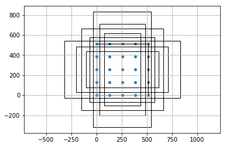

# 论文简介 & 核心代码讲解

## 论文解读

<center></center>

RetinaNet 是一个十分经典的单阶段目标检测网络，首先通过 backbone （一般是 ResNet 系列进行特征的提取），然后进行 neck （FPN）进行特征的融合，最后分别进入分类子网络和回归子网络进行预测。

### Backbone & Neck
首先通过 ResNet 输出 C3、C4、C5 三个尺度的特征图（若 ResNet 分为 Stem、res2、res3、res4、res5，其为最后三个 Stage 的输出），其对应分别为原图大小的 1/8、1/16、1/32。然后进行入 FPN，与一般情况不同，FPN 将再增加两层卷积层对 C5 进行卷积并产生 P6、P7 的特征图，最后 FPN 输出 P3、P4、P5、P6、P7，其对应分别为原图大小的 1/8、1/16、1/32、1/64、1/128。其流程示意图如下表示：


```python
                                -----> Conv -----> P7
                                |  
             -----> Conv -----> P6 --------------> P6
             |  
    Res5 --> C5 --> Conv --> lateral5 --> Conv --> P5
     |                          v
    Res4 --> C4 --> Conv --> lateral4 --> Conv --> P4
     |                          v
    Res3 --> C3 --> Conv --> lateral3 --> Conv --> P3
     |              |_______________________|
    Res2                       V
     |                        FPN
    Stem
     |
    imgs
```

### Head
如图所示，RetinaNet 的 Head 其实是非常简单的，分类和回归分支都是 4 层卷积层进行特征提取，每层跟上 ReLu 激活函数，所有的最后再分别跟一层预测的卷积层（所以一共算是有 5 层卷积层）。P3 到 P7 都是分别送入这两个分支的子网络，最后针对 P3 - P7 进行预测，由于每个格点有 9 个框，分类则是预测每个格点上 9 个框的每个框的所有类别的 prob，回归则是预测每个格点上 9 个框的 delta（anchor 与 gt 的 offset）。

### Loss
<center></center>

这篇论文最大的亮点其实是在于对单阶段的检测器提出了解决样本不平衡，重点关注难分类样本的方法，文章是从 loss 入手的，设计了称之为 Focal Loss 的分类 loss。对于交叉熵 loss 来说公式如下：
$$
Loss_{ce} = -(y\log(p) + (1-y)\log(1-p))
$$
其中 y 为 label。对于正样本来说 y 为 1，上式则为 $Loss_{+} = -\log(p)$；对于负样本来说 y 为 0，上式则为 $Loss_{-} = -\log(1-p)$。然而在单阶段检测模型中大部分都是容易分类的负样本，我们不希望 loss 主要由这部分组成，于是我们将在 loss 前加上 $(1-p)^{\gamma}$，以此来削弱易分类样本的 loss，让模型更加关注难分类的样本。比如正样本的 loss 会由$Loss_{+} = -\log(p)$ 变为 $Loss_{+} = -(1-p)^{\gamma}\log(p)$，预测的 p 越接近 label（即 1）越表示这个样本分得越准确，也就越容易分，那么前面的 $(1-p)^{\gamma}$ 就越小。负样本的 loss $Loss_{-} = -(1-p)^{\gamma}\log(p)$ 也是同样的道理。然后再加上平衡样本的权重，最终修改为：
$$
Loss_{focal} = -(\alpha(1-p)^{\gamma}y\log(p) + (1-\alpha)p^{\gamma}(1-y)\log(1-p))
$$
一般 $\alpha$ 和 $\gamma$ 分别设置为 0.25 和 2，这里设置为 0.25 的原因我觉得是因为背景类虽然多，但是大多数仍然是容易分类的，因此 loss 占比并不高。而且最后的分数预测层，将其中的 bias 设置为 $-\log((1-\pi)/\pi)$，其中 $\pi$ 一般为 0.01，这会防止大量的背景产生巨大的 loss 从而使得模型训练极其不稳定。可以计算得 bias 的值为 -4.595，此时由于 weight 是高斯分布，所以预测的值经过激活函数会在 0.01 附近，这使得 loss 的产生主要是由前景产生。

## 先验框生成的代码


```python
import math
import matplotlib.pyplot as plt
from matplotlib.patches import Rectangle
%matplotlib inline

import paddle
import paddle.nn as nn

class AnchorGenerator(nn.Layer):
    def __init__(self,
                 anchor_sizes=[32, 64, 128, 256, 512],
                 aspect_ratios=[0.5, 1.0, 2.0],
                 strides=[16.0],
                 variance=[1.0, 1.0, 1.0, 1.0],
                 offset=0.):
        super(AnchorGenerator, self).__init__()
        self.anchor_sizes = anchor_sizes
        self.aspect_ratios = aspect_ratios
        self.strides = strides
        self.variance = variance
        self.cell_anchors = self._calculate_anchors(len(strides))
        self.offset = offset

    def _broadcast_params(self, params, num_features):
        if not isinstance(params[0], (list, tuple)):  # list[float]
            return [params] * num_features
        if len(params) == 1:
            return list(params) * num_features
        return params

    def generate_cell_anchors(self, sizes, aspect_ratios):
        anchors = []
        for size in sizes:
            area = size**2.0
            for aspect_ratio in aspect_ratios:
                w = math.sqrt(area / aspect_ratio)
                h = aspect_ratio * w
                x0, y0, x1, y1 = -w / 2.0, -h / 2.0, w / 2.0, h / 2.0
                anchors.append([x0, y0, x1, y1])
        return paddle.to_tensor(anchors, dtype='float32')

    def _calculate_anchors(self, num_features):                                     # anchor 的生成
        sizes = self._broadcast_params(self.anchor_sizes, num_features)
        aspect_ratios = self._broadcast_params(self.aspect_ratios, num_features)
        cell_anchors = [
            self.generate_cell_anchors(s, a)
            for s, a in zip(sizes, aspect_ratios)
        ]
        [
            self.register_buffer(
                t.name, t, persistable=False) for t in cell_anchors
        ]
        return cell_anchors

    def _create_grid_offsets(self, size, stride, offset):                           # 特征图在原图上坐标的生成
        grid_height, grid_width = size[0], size[1]
        shifts_x = paddle.arange(
            offset * stride, grid_width * stride, step=stride, dtype='float32')
        shifts_y = paddle.arange(
            offset * stride, grid_height * stride, step=stride, dtype='float32')
        shift_y, shift_x = paddle.meshgrid(shifts_y, shifts_x)
        shift_x = paddle.reshape(shift_x, [-1])

        shift_y = paddle.reshape(shift_y, [-1])
        return shift_x, shift_y

    def _grid_anchors(self, grid_sizes):
        anchors = []
        coords = []
        for size, stride, base_anchors in zip(grid_sizes, self.strides, self.cell_anchors):
            shift_x, shift_y = self._create_grid_offsets(size, stride, self.offset)
            shifts = paddle.stack((shift_x, shift_y, shift_x, shift_y), axis=1)
            shifts = paddle.reshape(shifts, [-1, 1, 4])
            base_anchors = paddle.reshape(base_anchors, [1, -1, 4])

            anchors.append(paddle.reshape(shifts + base_anchors, [-1, 4]))
            coords.append(shifts.reshape([-1, 4]))

        return anchors, coords

    def forward(self, input):
        grid_sizes = [paddle.shape(feature_map)[-2:] for feature_map in input]
        anchors_and_coords = self._grid_anchors(grid_sizes)
        return anchors_and_coords

anchor_generator = AnchorGenerator(
    anchor_sizes=[[x, x * 2**(1.0/3), x * 2**(2.0/3)] for x in [32, 64, 128, 256, 512 ]],
    aspect_ratios=[0.5, 1.0, 2.0],
    strides=[8.0, 16.0, 32.0, 64.0, 128.0]
)

p3 = paddle.rand([4, 256, 80, 80])
p4 = paddle.rand([4, 256, 40, 40])
p5 = paddle.rand([4, 256, 20, 20])
p6 = paddle.rand([4, 256, 10, 10])
p7 = paddle.rand([4, 256, 5, 5])

anchors, coords = anchor_generator([p3, p4, p5, p6, p7])
anchors_plot = paddle.empty_like(anchors[-1])

coords_plot = coords[-1]
anchors_plot[:, 2:] = anchors[-1][:, 2:] - anchors[-1][:, 0:2]
anchors_plot[:, 0:2] = anchors[-1][:, 0:2]

fig = plt.figure()
axs = fig.add_subplot(111)

begin = 12
for i in range(begin*9, begin*9+9):
    axs.add_patch(Rectangle((anchors_plot[i][0], anchors_plot[i][1]), anchors_plot[i][2], anchors_plot[i][3], fill=False))

axs.scatter(coords_plot[:, 0], coords_plot[:, 1], s=15)

plt.axis('equal')
plt.grid()
plt.show()
```





由上图可知，每个格点会产生 9 个 anchors，每个 anchor 的长和宽是由最初始设定的三个 size （即： [[x, x * 2**(1.0/3), x * 2**(2.0/3)] for x in [32, 64, 128, 256, 512 ]]），当 x 为 32 时，分别产生 [32, 40.31, 50.8] 三种 size，然后再分别从三种长宽比 [0.5, 1.0, 2.0] 中依次选择进行计算，size 除以长宽比的算术平方根为宽，相乘则为长，有三种 size 和三种长宽比，总共生成 9 种 anchors，这就是 generate_cell_anchors 这个函数做的事情。
因为 fpn 一共会生成 5 个 level 的特征图，那么会根据特征图不同的 stride 生成不同的格点，其实这里相当于将特征图上的一个点还原到最初输入的原图上，比如原图为 800 * 800，特征图为 100 * 100 (即 stride 为 8），那么特征图坐标为 (1, 1) 的点在原图上就为 (8, 8)。经过函数 _create_grid_offsets 生成在原图上的坐标后，再将生成的 anchors 还原到原图的对应位置，最后 anchor 的位置表示为 (x0, y0, x1, y1) 即左上角坐标和右下角坐标。

## Loss 的核心代码


```python
def label_anchors(self, anchors, gt):
    batch_gt_box = gt["gt_bbox"]
    batch_gt_class = gt["gt_class"]

    gt_labels_list = []
    gt_boxes_list = []

    for i in range(len(batch_gt_box)):
        gt_boxes = batch_gt_box[i]
        gt_classes = batch_gt_class[i].flatten()
        matches_idxs, match_labels = label_box(anchors,
                                               gt_boxes,
                                               self.positive_thresh,
                                               self.negative_thresh,
                                               self.allow_low_quality,
                                               -1)

        if len(gt_boxes) > 0:
            matched_boxes_i = paddle.gather(gt_boxes, matches_idxs)
            matched_classes_i = paddle.gather(gt_classes, matches_idxs)
            matched_classes_i = paddle.where(match_labels == 0,
                                             paddle.full_like(matched_classes_i, self.num_classes),
                                             matched_classes_i)
            matched_classes_i = paddle.where(match_labels == -1,
                                             paddle.full_like(matched_classes_i, -1),
                                             matched_classes_i)
        else:
            matched_boxes_i = paddle.zeros_like(anchors)
            matched_classes_i = paddle.zeros_like(matches_idxs) + self.num_classes

        gt_boxes_list.append(matched_boxes_i)
        gt_labels_list.append(matched_classes_i)

    return gt_boxes_list, gt_labels_list

def label_box(anchors,
              gt_boxes,
              positive_overlap,
              negative_overlap,
              allow_low_quality,
              ignore_thresh,
              is_crowd=None):
    iou = bbox_overlaps(gt_boxes, anchors)
    n_gt = gt_boxes.shape[0]
    if n_gt == 0 or is_crowd is None:
        n_gt_crowd = 0
    else:
        n_gt_crowd = paddle.nonzero(is_crowd).shape[0]
    if iou.shape[0] == 0 or n_gt_crowd == n_gt:
        # No truth, assign everything to background
        default_matches = paddle.full((iou.shape[1], ), 0, dtype='int64')
        default_match_labels = paddle.full((iou.shape[1], ), 0, dtype='int32')
        return default_matches, default_match_labels
    # if ignore_thresh > 0, remove anchor if it is closed to
    # one of the crowded ground-truth
    if n_gt_crowd > 0:
        N_a = anchors.shape[0]
        ones = paddle.ones([N_a])
        mask = is_crowd * ones

        if ignore_thresh > 0:
            crowd_iou = iou * mask
            valid = (paddle.sum((crowd_iou > ignore_thresh).cast('int32'),
                                axis=0) > 0).cast('float32')
            iou = iou * (1 - valid) - valid

        # ignore the iou between anchor and crowded ground-truth
        iou = iou * (1 - mask) - mask

    matched_vals, matches = paddle.topk(iou, k=1, axis=0)
    match_labels = paddle.full(matches.shape, -1, dtype='int32')
    # set ignored anchor with iou = -1
    neg_cond = paddle.logical_and(matched_vals > -1,
                                  matched_vals < negative_overlap)
    match_labels = paddle.where(neg_cond,
                                paddle.zeros_like(match_labels), match_labels)
    match_labels = paddle.where(matched_vals >= positive_overlap,
                                paddle.ones_like(match_labels), match_labels)
    if allow_low_quality:
        highest_quality_foreach_gt = iou.max(axis=1, keepdim=True)
        pred_inds_with_highest_quality = paddle.logical_and(
            iou > 0, iou == highest_quality_foreach_gt).cast('int32').sum(
                0, keepdim=True)
        match_labels = paddle.where(pred_inds_with_highest_quality > 0,
                                    paddle.ones_like(match_labels),
                                    match_labels)

    matches = matches.flatten()
    match_labels = match_labels.flatten()

    return matches, match_labels
```

关于 loss 的计算我觉得最主要的就是对 label 的处理，其他都是维度的调整进行计算 loss。首先对每一张图的每一个 anchor 进行标注分为三类 0（负样本背景类），1（正样本前景类），-1 （忽略类，这部分不参加 loss 计算）。这部分是由 label_box 函数完成的，其通过计算 anchor （假设数量为 1000 ）与每一个 gt （数量为 20）计算 iou，并对每一个 anchor 取与它 iou 最大的 gt 作为与该 anchor 匹配上的 gt，返回两个 tensor matched_vals, matches（matched_vals shape 为 [1000, 1] 即每个 anchor 与所有 gt 计算 iou 中的最大 iou 值，matches 为与每一个 anchor 匹配的 gt 的序号），然后再根据 matched_vals 中的值，iou 大于 0.5 标记为 1，iou 小于 0.4 标记为 0，其余的为 -1。allow_low_quality 这部分是防止有的 gt 没有匹配上 anchor 而设置的，原理一样。最后返回 matches，和根据 matched_vals 标记的 match_labels。
然后在 label_anchors 函数里面将 gt_boxes，gt_classes 按照 matches_idxs 进行复制、排序，将 match_labels 里面的标记为 1 的分别改为它真实的类别（比如 20），标记为 0 的改为 num_classes。最后返回所有图片的 gt： gt_boxes_list、gt_labels_list，到这里所有 anchor 对应的 gt_box 以及该 anchor 属于哪一类的 label 就做好了，进行计算就 ok。

## 后处理的代码


```python
def _process_single_level_pred(self, box_lvl, score_lvl, anchors, scale_factor_wh, img_whwh):
    if isinstance(scale_factor_wh, list):
        scale_factor_wh = paddle.concat(scale_factor_wh)
    if isinstance(img_whwh, list):
        img_whwh = paddle.concat(img_whwh)

    score_lvl = paddle.transpose(score_lvl, [0, 2, 1])
    score_lvl = F.sigmoid(score_lvl)

    batch_lvl = []
    for i in range(len(img_whwh)):
        box_lvl_i = delta2bbox(box_lvl[i],
                                anchors,
                                self.bbox_reg_weights).reshape(anchors.shape)

        box_lvl_i[:, 0::2] = paddle.clip(                                     # 还原至原图
            box_lvl_i[:, 0::2], min=0, max=img_whwh[i][0]
        ) / scale_factor_wh[i][0]
        box_lvl_i[:, 1::2] =  paddle.clip(
            box_lvl_i[:, 1::2], min=0, max=img_whwh[i][1]
        ) / scale_factor_wh[i][1]

        batch_lvl.append(box_lvl_i)

    box_lvl = paddle.stack(batch_lvl)

    return box_lvl, score_lvl

def __call__(self, pred_scores_list, pred_boxes_list, anchors, scale_factor_wh, img_whwh):
    """
    Args:
        pred_scores_list (list[Tensor]): tensor of shape (batch_size, R, num_classes).
            The tensor predicts the classification probability for each proposal.
        pred_boxes_list (list[Tensor]): tensors of shape (batch_size, R, 4).
            The tensor predicts anchor's delta
        anchors (list[Tensor]): mutil-level anchors.
        scale_factor_wh (Tensor): tensors of shape [batch_size, 2] the scalor of  per img
        img_whwh (Tensor): tensors of shape [batch_size, 4]
    Returns:
        bbox_pred (Tensor): tensors of shape [num_boxes, 6] Each row has 6 values:
        [label, confidence, xmin, ymin, xmax, ymax]
        bbox_num (Tensor): tensors of shape [batch_size] the number of RoIs in each image.
    """
    assert len(pred_boxes_list[0]) == len(scale_factor_wh) == len(img_whwh)
    assert len(pred_boxes_list) == len(anchors)
    mutil_level_bbox = []
    mutil_level_score = []

    for i in range(len(pred_boxes_list)):
        lvl_res_b, lvl_res_s = self._process_single_level_pred(
            pred_boxes_list[i],
            pred_scores_list[i],
            anchors[i],
            scale_factor_wh,
            img_whwh)

        mutil_level_bbox.append(lvl_res_b)
        mutil_level_score.append(lvl_res_s)

    pred_boxes = paddle.concat(mutil_level_bbox, axis=1)     # [N, \sum_{i=0}^{n} (Hi * Wi), 4]
    pred_scores = paddle.concat(mutil_level_score, axis=2)

    assert pred_boxes.shape[1] == pred_scores.shape[2]

    bbox_pred, bbox_num, _ = self.nms(pred_boxes, pred_scores)

    pred_label = bbox_pred[:, 0:1]
    pred_score = bbox_pred[:, 1:2]
    pred_bbox = bbox_pred[:, 2:]
    keep_mask = nonempty_bbox(pred_bbox, return_mask=True)            # 剔除空的 box
    keep_mask = paddle.unsqueeze(keep_mask, [1])
    pred_label = paddle.where(keep_mask, pred_label,
                                paddle.ones_like(pred_label) * -1)

    pred_result = paddle.concat([pred_label, pred_score, pred_bbox], axis=1)

    return pred_result, bbox_num
```

后处理其实就比较常规，首先预测的是 delta （即 anchor 需要调整的偏移量），所以根据预测的 delta 和 anchor 得到最后的预测框，然后由于对图片进行了 resize ，所以需要对预测框进行大小的调整还原至原图并裁剪超出的部分。NMS 完之后将 empty 的 box 剔除就好了。

# 项目介绍
## 项目背景
项目成果来源于百度第四届论文复现赛中目标检测方向论文 Focal Loss for Dense Object Detection 第一名复现结果。项目基于 <font color=red>Paddle 2.1.2</font> 与 <font color=red>PaddleDetection develop</font> 进行开发并实现论文精度，十分感谢百度提供比赛平台和 GPU 资源！

## 项目结果
Method|Environment|mAP|Epoch|Dataset
:--:|:--:|:--:|:--:|:--:
R50_fpn_1x_ss_training|Tesla V-100 x 8 ([Facebook Official](https://github.com/facebookresearch/Detectron/blob/master/MODEL_ZOO.md))|35.7|12|COCO
R50_fpn_1x_ss_training|**Tesla V-100 x 4**|<font color=red>37.0</font>|12|COCO
R50_fpn_1x_ms_training|Tesla V-100 x 8 ([Facebook Official](https://github.com/facebookresearch/detectron2/blob/master/MODEL_ZOO.md))|37.4|12|COCO
R50_fpn_1x_ms_training|**Tesla V-100 x 4**|<font color=red>37.4</font>|12|COCO

<font color=gray face="楷体">其中</font><font color=gray> ss_training </font><font color=gray face="楷体">和</font></font><font color=gray> ms_training </font><font color=gray face="楷体">分别代表单尺度训练和多尺度训练。</font>

## 最优模型和预训练权重
* 单尺度训练最优模型保存至 [Baidu Aistudio](https://aistudio.baidu.com/aistudio/datasetdetail/104154)
* 多尺度训练最优模型保存至 [Baidu Aistudio](https://aistudio.baidu.com/aistudio/datasetdetail/104021)
* 转换 Torch 预训练权重以及 Paddle 和 Torch 混合预训练权重 [pretrain model](https://aistudio.baidu.com/aistudio/datasetdetail/103882)

## 项目使用
### PPDet 框架结构简介
PPDet 是飞桨目标检测开发套件，旨在帮助开发者更快更好地完成检测模型的组建、训练、优化及部署等全开发流程。其常用文件目录如下：
* 模型的所有配置文件目录 -> <font color=gray face=Times new roman>*./configs*</font>
* 模型的数据集预处理文件目录 -> <font color=gray face=Times new roman>*./ppdet/data/transform*</font>
* 模型的具体实现文件目录 -> <font color=gray face=Times new roman>*./ppdet/modeling*</font>
* 模型的训练、验证启动文件目录 -> <font color=gray face=Times new roman>*./tools*</font>
### 具体使用
* 解压代码 ```unzip PaddleDetection.zip```
* 修改 <font color=blue face=Times new roman>*PaddleDetection/configs/datasets/coco_detection.yml*</font> 中关于数据集的路径（根据自己的数据集结构修改）

一般具有以下结构

<font face=Times new roman>--dataset/coco (Dataset dir) </font></br>
<font face=Times new roman>&emsp;--train2017 (Image dir) </font></br>
<font face=Times new roman>&emsp;--annotations/instances_train2017.json (Annotations path) </font>

* Install third-party library

```
pip install pycocotools
pip install -r PaddleDetection/requirements.txt
```
* 训练
	* <font color=pink>单卡</font>

    ```python PaddleDetection/tools/train.py -c PaddleDetection/configs/retinanet/retinanet_r50_fpn_1x_coco.yml --eval```
   * <font color=red>单机多卡</font>

   ```python -m paddle.distributed.launch --gpus 0,1,2,3 PaddleDetection/tools/train.py -c PaddleDetection/configs/retinanet/retinanet_r50_fpn_1x_coco.yml --eval```
* 测试

```python tools/eval.py -c PaddleDetection/tools/train.py -c PaddleDetection/configs/retinanet/retinanet_r50_fpn_1x_coco.yml```
测试的时候可以 -weights your_model_path/best_model.pdparams，也可以在 PaddleDetection/configs/retinanet/retinanet_r50_fpn_1x_coco.yml 中修改，但注意需要注释掉 PaddleDetection/configs/retinanet/_base_/retinanet_r50_fpn.yml 中的 pretrain 路径。

若需要修改**保存模型路径、保存运行日志**等更多命令请参照文件 <font face=Times new roman>*PaddleDetection/docs/tutorials/GETTING_STARTED_cn.md*</font>

--> [<font face=宋体 size="3">论文链接</font>](https://arxiv.org/pdf/1708.02002.pdf) </br>
--> [<font face=宋体 size="3">论文 github 地址</font>](https://github.com/facebookresearch/detectron2) </br>
--> [<font face=宋体 size="3">复现 github 地址</font>](https://github.com/FL77N/RetinaNet-Based-on-PPdet)
