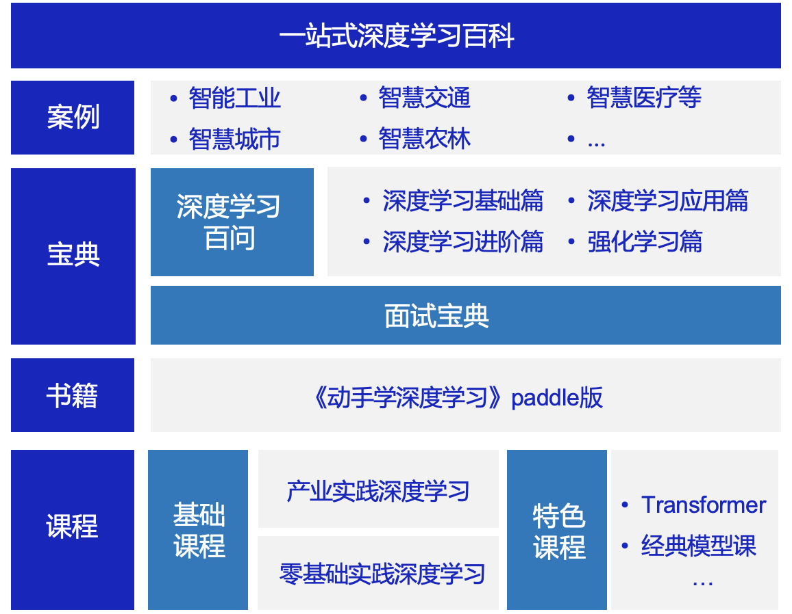

# 一、项目简介

本项目是飞桨官方出品的一站式深度学习在线百科，当前内容涵盖：

📒课程类：[**零基础实践深度学习**](https://aistudio.baidu.com/aistudio/course/introduce/1297)、**产业实践深度学习**、**[特色课程](https://aistudio.baidu.com/aistudio/education/group/info/24322)、飞桨套件课程汇总资料**

📒书籍类：**《动手学深度学习》paddle版**

📒宝典类：[**深度学习百问**](https://paddlepedia.readthedocs.io/en/latest/index.html)、**面试宝典**

📒案例类：**产业实践案例**

从理论到实践，从科研到产业应用，各类学习材料一应俱全，旨在帮助开发者高效地学习和掌握深度学习知识，快速成为AI跨界人才。

* **内容全面**：无论您是深度学习初学者，还是资深用户，都可以在本项目中快速获取到需要的学习材料。
* **形式丰富**：材料形式多样，包括可在线运行的notebook、视频、书籍、B站直播等，满足您随时随地学习的需求。
* **实时更新**：本项目中涉及到的代码均匹配Paddle最新发布版本，开发者可以实时学习最新的深度学习任务实现方案。
* **前沿分享**：定期分享顶会最新论文解读和代码复现，开发者可以实时掌握最新的深度学习算法。

#### 如果本项目对您有帮助，欢迎点击网页右上方进行star❤️

---

## 👨‍🏫我是高校用户

| 我希望：     | 我可以学习：                                                 |
| ------------ | ------------------------------------------------------------ |
| 入门深度学习 | 零基础实践深度学习[:arrow_heading_down:](#1)、深度学习百问[:arrow_heading_down:](#2)、动手学深度学习paddle版[:arrow_heading_down:](#dive) |
| 进阶深度学习 | 产业实践深度学习、深度学习百问[:arrow_heading_down:](#2)、面试宝典[:arrow_heading_down:](#6) |
| 趣味深度学习 | 特色课程[:arrow_heading_down:](#3)、产业实践案例[:arrow_heading_down:](#5) |

## 👷‍♂️我是企业用户

| 我希望：     | 我可以学习：                                                 |
| ------------ | ------------------------------------------------------------ |
| 入门深度学习 | 零基础实践深度学习[:arrow_heading_down:](#1)、深度学习百问[:arrow_heading_down:](#2)、动手学深度学习paddle版[:arrow_heading_down:](#dive) |
| 进阶深度学习 | 产业实践深度学习、特色课程[:arrow_heading_down:](#3)、面试宝典[:arrow_heading_down:](#6) |
| 实践深度学习 | 产业实践案例[:arrow_heading_down:](#5)、飞桨各产品课程[:arrow_heading_down:](#fj) |

---

# 二、项目内容

# 👉课程类

##  零基础实践深度学习

  - **AI Studio在线课程：[《零基础实践深度学习》](https://aistudio.baidu.com/aistudio/course/introduce/1297
    )**：理论和代码结合、实践与平台结合，包含20小时视频课程，由百度杰出架构师、飞桨产品负责人和资深研发人员共同打造。

    

  

  - **《零基础实践深度学习》书籍**：本课程配套书籍，由清华出版社2020年底发行，京东/当当等电商均有销售。

    

  

## 特色课 - Transformer系列

| 章节名称                            | notebook链接                                                 | Python实现                                                   | 课程简介                                                     |
| ----------------------------------- | ------------------------------------------------------------ | ------------------------------------------------------------ | ------------------------------------------------------------ |
| 经典的预训练语言模型                | [notebook链接](https://aistudio.baidu.com/aistudio/projectdetail/2110336) | [Python实现](./transformer_courses/Transformer_Machine_Translation) | 本章节将为大家详细介绍NLP领域 Transformer。Transformer的前世今生，包括ELMo，GPT，Transformer，BERT等经典模型，还会介绍Transformer在机器翻译里面的应用。 |
| 经典的预训练语言模型                | [notebook链接](https://aistudio.baidu.com/aistudio/projectdetail/2110336) | [Python实现](./transformer_courses/Transformer_Machine_Translation) | 本章节将为大家详细介绍NLP领域 Transformer。Transformer的前世今生，包括ELMo，GPT，Transformer，BERT等经典模型，还会介绍Transformer在机器翻译里面的应用。 |
| 预训练模型在自然语言理解方面的改进  | [notebook链接](https://aistudio.baidu.com/aistudio/projectdetail/2166195) | [Python实现](./transformer_courses/reading_comprehension_based_on_ernie) | ERNIE， RoBERTa， KBERT，清华ERNIE等，在广度上去分析经典预训练模型的一些改进。 |
| 预训练模型在长序列建模方面的改进    | [notebook链接](https://aistudio.baidu.com/aistudio/projectdetail/2166197) | [Python实现](./transformer_courses/sentiment_analysis_based_on_xlnet) | Transformer-xl， xlnet， longformer等，分析BERT和transformer的长度局限，并讨论这些方法的改进点。 |
| BERT蒸馏                            | [notebook链接](https://aistudio.baidu.com/aistudio/projectdetail/2177549) | [Python实现](./transformer_courses/BERT_distillation)        | 本章节为大家详细介绍了针对BERT模型的蒸馏算法，包括：Patient-KD、DistilBERT、TinyBERT、DynaBERT等模型，同时以代码的形式为大家展现了如何使用DynaBERT的训练策略对TinyBERT进行蒸馏。 |
| 预训练模型的瘦身策略 – – 高效结构   | [notebook链接](https://aistudio.baidu.com/aistudio/projectdetail/2138857) | [Python实现](./transformer_courses/Transformer_Punctuation_Restoration) | 本章节将为大家详细介绍NLP领域，基于Transformer模型的瘦身技巧。包括 Electra，AlBERT 以及 performer。还会介绍代码实现案例：基于Electra的语音识别后处理中文标点符号预测 |
| transformer在图像分类中的应用(上)   | [notebook链接](https://aistudio.baidu.com/aistudio/projectdetail/2154618) | [Python实现](https://github.com/tngt/awesome-DeepLearning/blob/master/transformer_courses/Application_of_transformer_in_image_classification) | 本章节将为大家详细介绍 Transformer 在 CV 领域中的两个经典算法：ViT 以及 DeiT。带领大家一起学习Transformer 结构在图像分类领域的具体应用。 |
| transformer在图像分类中的应用（下） | [notebook链接](https://aistudio.baidu.com/aistudio/projectdetail/2271352) | [Python实现](https://github.com/tngt/awesome-DeepLearning/blob/master/transformer_courses/Application_of_transformer_in_image_classification_Swin) | 本章节将为大家详细介绍 Transformer 在 CV 领域中的经典算法：Swin Transformer。带领大家一起学习Transformer 结构在图像分类领域的具体应用。 |

返回[:arrow_heading_up:](#0)

-----

# 👉书籍类

## 《动手学深度学习》paddle版

[本项目](https://github.com/tngt/awesome-DeepLearning/tree/develop/Dive-into-DL-paddlepaddle)将《[动手学深度学习](http://zh.d2l.ai/)》原书中MXNet代码实现改为PaddlePaddle实现。原书作者：阿斯顿·张、李沐、扎卡里 C. 立顿、亚历山大 J. 斯莫拉以及其他社区贡献者，GitHub地址：https://github.com/d2l-ai/d2l-zh。

本项目面向对深度学习感兴趣，尤其是想使用PaddlePaddle进行深度学习的童鞋。本项目并不要求你有任何深度学习或者机器学习的背景知识，你只需了解基础的数学和编程，如基础的线性代数、微分和概率，以及基础的Python编程。

返回[:arrow_heading_up:](#0)

----

# 👉宝典类

## 深度学习百问

深度学习百问内容包含深度学习基础篇、深度学习进阶篇、深度学习应用篇、强化学习篇以及面试宝典，详细信息请参阅[Paddle知识点文档平台](https://paddlepedia.readthedocs.io/en/latest/index.html)。

* **深度学习基础篇**  

  1. [深度学习](https://paddlepedia.readthedocs.io/en/latest/tutorials/deep_learning/index.html#)  

  2. [卷积神经网络](https://paddlepedia.readthedocs.io/en/latest/tutorials/CNN/index.html)  

  3. [序列模型](https://paddlepedia.readthedocs.io/en/latest/tutorials/sequence_model/index.html)  

* **深度学习进阶篇**  

  1. [预训练模型](https://paddlepedia.readthedocs.io/en/latest/tutorials/pretrain_model/index.html)
  2. [对抗神经网络](https://paddlepedia.readthedocs.io/en/latest/tutorials/generative_adversarial_network/index.html)  

* **深度学习应用篇**  

  1. [计算机视觉](https://paddlepedia.readthedocs.io/en/latest/tutorials/computer_vision/index.html)  
  2. [自然语言处理](https://paddlepedia.readthedocs.io/en/latest/tutorials/natural_language_processing/index.html)  
  3. [推荐系统](https://paddlepedia.readthedocs.io/en/latest/tutorials/recommendation_system/index.html)  

* **产业实践篇**  

  1. [模型压缩](https://paddlepedia.readthedocs.io/en/latest/tutorials/model_compress/index.html)
  2. [模型部署](https://paddlepedia.readthedocs.io/en/latest/tutorials/model_deployment/index.html)  

* **强化学习篇**  

  1. [强化学习](https://paddlepedia.readthedocs.io/en/latest/tutorials/reinforcement_learning/index.html)  

* **面试宝典**  
  1.  [深度学习基础常见面试题](https://paddlepedia.readthedocs.io/en/latest/tutorials/interview_questions/interview_questions.html)
  2. [卷积模型常见面试题](https://paddlepedia.readthedocs.io/en/latest/tutorials/interview_questions/interview_questions.html#id2)
  3. [预训练模型常见面试题](https://paddlepedia.readthedocs.io/en/latest/tutorials/interview_questions/interview_questions.html#id3)
  4. [对抗神经网络常见面试题](https://paddlepedia.readthedocs.io/en/latest/tutorials/interview_questions/interview_questions.html#id4)
  5. [计算机视觉常见面试题](https://paddlepedia.readthedocs.io/en/latest/tutorials/interview_questions/interview_questions.html#id5)
  6. [自然语言处理常见面试题](https://paddlepedia.readthedocs.io/en/latest/tutorials/interview_questions/interview_questions.html#id6)
  7. [推荐系统常见面试题](https://paddlepedia.readthedocs.io/en/latest/tutorials/interview_questions/interview_questions.html#id7)
  8.  [模型压缩常见面试题](https://paddlepedia.readthedocs.io/en/latest/tutorials/interview_questions/interview_questions.html#id8)
  9.  [强化学习常见面试题](https://paddlepedia.readthedocs.io/en/latest/tutorials/interview_questions/interview_questions.html#id9)

返回[:arrow_heading_up:](#0)

-----

# 👉案例类

## 飞桨产业实践案例集

| 领域         | 产业案例                                                     | 来源                                         | 更多内容                                                     |
| ------------ | ------------------------------------------------------------ | -------------------------------------------- | ------------------------------------------------------------ |
| **智能工业** | [厂区传统仪表统计监测](https://paddlex.readthedocs.io/zh_CN/develop/examples/meter_reader.html) | 飞桨官方                                     | [更多飞桨案例](https://www.paddlepaddle.org.cn/customercase) |
| **智能工业** | [新能源汽车锂电池隔膜质检](https://www.paddlepaddle.org.cn/support/news?action=detail&id=2104) | 飞桨官方                                     | [更多飞桨案例](https://www.paddlepaddle.org.cn/customercase) |
| **智能工业** | [天池铝材表面缺陷检测](https://paddlex.readthedocs.io/zh_CN/develop/examples/industrial_quality_inspection/README.html) | 飞桨官方                                     | [更多飞桨案例](https://www.paddlepaddle.org.cn/customercase) |
| **智能工业** | [安全帽检测](https://github.com/PaddleCV-FAQ/PaddleDetection-FAQ/blob/main/Lite%E9%83%A8%E7%BD%B2/yolov3_for_raspi.md) | 飞桨官方                                     | [更多飞桨案例](https://www.paddlepaddle.org.cn/customercase) |
| **智慧城市** | [高尔夫球场遥感监测](https://www.paddlepaddle.org.cn/support/news?action=detail&id=2103) | 飞桨官方                                     | [更多飞桨案例](https://www.paddlepaddle.org.cn/customercase) |
| **智慧城市** | [积雪语义分割](https://paddlex.readthedocs.io/zh_CN/develop/examples/multi-channel_remote_sensing/README.html) | 飞桨官方                                     | [更多飞桨案例](https://www.paddlepaddle.org.cn/customercase) |
| **智慧城市** | [戴口罩的人脸识别](https://aistudio.baidu.com/aistudio/projectdetail/267322?channelType=0&channel=0) | 飞桨官方                                     | [更多飞桨案例](https://www.paddlepaddle.org.cn/customercase) |
| **智慧交通** | [车道线分割和红绿灯安全检测](https://github.com/PaddlePaddle/PaddleDetection/blob/release/2.1/configs/vehicle/README_cn.md) | 飞桨官方                                     | [更多飞桨案例](https://www.paddlepaddle.org.cn/customercase) |
| **智慧交通** | [PaddleOCR: 车牌识别](https://aistudio.baidu.com/aistudio/projectdetail/739559?channelType=0&channel=0) |                                              | [更多飞桨案例](https://www.paddlepaddle.org.cn/customercase) |
| **智慧农林** | [耕地地块识别](https://mp.weixin.qq.com/s/JlDVmYlhN7sF0hpRlncDNw) | 飞桨官方                                     | [更多飞桨案例](https://www.paddlepaddle.org.cn/customercase) |
| **智慧农林** | [AI识虫](https://aistudio.baidu.com/aistudio/projectdetail/439888) | 飞桨官方                                     | [更多飞桨案例](https://www.paddlepaddle.org.cn/customercase) |
| **智慧农林** | [基于PaddleX实现森林火灾监测](https://aistudio.baidu.com/aistudio/projectdetail/1968964?channelType=0&channel=0) |                                              | [更多飞桨案例](https://www.paddlepaddle.org.cn/customercase) |
| **智慧医疗** | [医学常见中草药分类](https://aistudio.baidu.com/aistudio/projectdetail/1434738?channelType=0&channel=0) | 飞桨官方                                     | [更多飞桨案例](https://www.paddlepaddle.org.cn/customercase) |
| **智慧医疗** | [眼疾识别](https://www.paddlepaddle.org.cn/tutorials/projectdetail/1630501) | 飞桨官方                                     | [更多飞桨案例](https://www.paddlepaddle.org.cn/customercase) |
| **其他**     | [人摔倒检测](https://aistudio.baidu.com/aistudio/projectdetail/2071768) | 开发者[Niki_173](https://github.com/Niki173) | [该开发者更多案例](https://aistudio.baidu.com/aistudio/personalcenter/thirdview/474269) |
| **其他**     | [足球比赛动作定位](https://github.com/PaddlePaddle/PaddleVideo/tree/application/FootballAction) | 飞桨官方                                     | [更多飞桨案例](https://www.paddlepaddle.org.cn/customercase) |
| **其他**     | [基于强化学习的飞行器仿真](https://github.com/PaddlePaddle/PARL/tree/develop/examples/tutorials/homework/lesson5/ddpg_quadrotor) | 飞桨官方                                     | [更多飞桨案例](https://www.paddlepaddle.org.cn/customercase) |
| **其他**     | [基于ERNIE-Gram实现语义匹配](https://aistudio.baidu.com/aistudio/projectdetail/2247755) | 飞桨官方                                     | [更多飞桨案例](https://www.paddlepaddle.org.cn/customercase) |
| **其他**     | [基于PaddleDetection的PCB瑕疵检测](https://aistudio.baidu.com/aistudio/projectdetail/2240725) | 飞桨官方                                     | [更多飞桨案例](https://www.paddlepaddle.org.cn/customercase) |
| **其他**     | [中文语音识别](https://aistudio.baidu.com/aistudio/projectdetail/2280562) | 飞桨官方                                     | [更多飞桨案例](https://www.paddlepaddle.org.cn/customercase) |
| **其他**     | [全流程，从零搞懂基于PaddlePaddle的图像分割](https://aistudio.baidu.com/aistudio/projectdetail/1674328?channelType=0&channel=0) | 开发者                                       |                                                              |
| **其他**     | [PaddleHub一键OCR中文识别(超轻量8.1M模型，火爆)](https://aistudio.baidu.com/aistudio/projectdetail/507159?channelType=0&channel=0) | 飞桨官方                                     | [更多飞桨案例](https://www.paddlepaddle.org.cn/customercase) |
| **其他**     | [天下第一AI武道会-Deepfake换脸](https://aistudio.baidu.com/aistudio/projectdetail/1189026?channelType=0&channel=0) | 飞桨官方                                     | [更多飞桨案例](https://www.paddlepaddle.org.cn/customercase) |
| **其他**     | [飞桨创意之星 宋代诗人念诗的秘密——PaddleGAN实现精准唇形合成](https://aistudio.baidu.com/aistudio/projectdetail/1463208?channelType=0&channel=0) | 飞桨官方                                     | [更多飞桨案例](https://www.paddlepaddle.org.cn/customercase) |
| **其他**     | [通过OCR实现验证码识别](https://aistudio.baidu.com/aistudio/projectdetail/1100507?channelType=0&channel=0) | 飞桨官方                                     | [更多飞桨案例](https://www.paddlepaddle.org.cn/customercase) |

## 飞桨学术案例集

| 领域     | 学术案例                                                     | 介绍 |
| -------- | ------------------------------------------------------------ | ---- |
| 机器学习 |                                                              |      |
| NLP      |                                                              |      |
| 语音     |                                                              |      |
|          | [一文详解yolov3目标检测算法](https://aistudio.baidu.com/aistudio/projectdetail/2240328) |      |
| 推荐     |                                                              |      |
| 强化学习 |                                                              |      |

返回[:arrow_heading_up:](#0)

----

# 👉汇总

## 飞桨各产品学习资料汇总

| 产品                             | 视频课程                                                     | 学习文档 |
| -------------------------------- | ------------------------------------------------------------ | -------- |
| PaddleGAN                        | [生成对抗网络七日打卡营](https://aistudio.baidu.com/aistudio/course/introduce/16651) |          |
| PaddleOCR                        | [OCR自动标注小工具讲解](https://www.bilibili.com/video/BV1uX4y1K7PW)、[3.5M超轻量实用OCR模型解读](https://www.bilibili.com/video/BV1p54y1y7CM)、[OCR应用与部署实战](https://www.bilibili.com/video/BV1Zz4y1C7MW) |          |
| PaddleClas                       | [PaddleClas系列直播课](https://aistudio.baidu.com/aistudio/course/introduce/24519) |          |
| PaddleDetection                  | [目标检测7日打卡营](https://aistudio.baidu.com/aistudio/course/introduce/1617) |          |
| PaddleX                          | [PaddleX实例分割任务详解](https://www.bilibili.com/video/BV1M44y1r7s6)、[PaddleX目标检测任务详解](https://www.bilibili.com/video/BV1HB4y1A73b)、[PaddleX语义分割任务详解](https://www.bilibili.com/video/BV1qQ4y1Z7co)、[PaddleX图像分类任务详解](https://www.bilibili.com/video/BV1nK411F7J9)、[PaddleX客户端操作指南](https://www.bilibili.com/video/BV1bz4y1C7wr)、[飞桨全流程开发工具PaddleX](https://www.bilibili.com/video/BV17i4y1b7TZ) |          |
| PaddleHub | [手把手教你转换PaddleHub模型教程](https://www.bilibili.com/video/BV1YK411V71d) |          |
| VDL      | [可视化分析工具助力AI算法快速开发](https://www.bilibili.com/video/BV1uy4y137iH)、[深度学习算法可视化调优实战演示](https://www.bilibili.com/video/BV1iD4y1o7Pf) |          |
| 高层API                          | [高层API助你快速上手深度学习](https://aistudio.baidu.com/aistudio/course/introduce/6771) |          |
| PaddleNLP  | [基于深度学习的自然语言处理](https://www.bilibili.com/video/BV1fB4y1M7A3) |          |

返回​[:arrow_heading_up:](#0)

# 三、技术交流

非常感谢您使用本项目。您在使用过程中有任何建议或意见，可以在 **[Issue](https://github.com/PaddlePaddle/tutorials/issues)** 上反馈给我们，也可以通过扫描下方的二维码联系我们，飞桨的开发人员非常高兴能够帮助到您，并与您进行更深入的交流和技术探讨。

  

# 四、许可证书

本项目的发布受[Apache 2.0 license](https://www.apache.org/licenses/LICENSE-2.0.txt)许可认证。

# 五、贡献内容

本项目的不断成熟离不开各位开发者的贡献，如果您对深度学习知识分享感兴趣，非常欢迎您能贡献给我们，让更多的开发者受益。

本项目欢迎任何贡献和建议，大多数贡献都需要你同意参与者许可协议（CLA）来声明你有权并实际上授权我们可以使用你的贡献。

### 代码贡献规范

> pip install pre-commit
>
> pre-commit install

添加修改的代码后，对修改的文件进行代码规范，pre-commit 会自动调整代码格式，执行一次即可，后续commit不需要再执行。提交pr流程，详见：[awesome-DeepLearning 提交 pull request 流程](./examples/awesome-DeepLearning_pr_procedure.md)。

### 贡献者

以下是awesome-DeepLearning贡献者列表： [youngzhou](https://youngzhou1999.github.io/cv/)，[Niki_173](https://github.com/Niki173)，[Twelveeee](https://github.com/Twelveeee)

