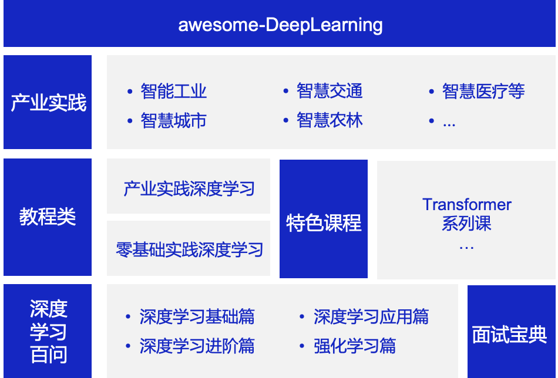

# 一、项目简介

本项目是一站式深度学习在线百科，内容涵盖[**零基础入门深度学习**](https://aistudio.baidu.com/aistudio/course/introduce/1297)、**产业实践深度学习**、**特色课程**；[**深度学习百问**](https://paddlepedia.readthedocs.io/en/latest/index.html)、**产业实践(开发中)** 等等。从理论到实践，从科研到产业应用，各类学习材料一应俱全，旨在帮助开发者高效地学习和掌握深度学习知识，快速成为AI跨界人才。

 awesome-DeepLearning 全景图 

* **内容全面**：无论您是深度学习初学者，还是资深用户，都可以在本项目中快速获取到需要的学习材料。

* **形式丰富** ：材料形式多样，包括可在线运行的notebook、视频、书籍、B站直播等，满足您随时随地学习的需求。

* **实时更新**：本项目中涉及到的代码均匹配Paddle最新发布版本，开发者可以实时学习最新的深度学习任务实现方案。

* **前沿分享** ：定期分享顶会最新论文解读和代码复现，开发者可以实时掌握最新的深度学习算法。

# 快速跳转：

| 目录                                         | 简介                                                         |
| -------------------------------------------- | ------------------------------------------------------------ |
| 零基础入门深度学习​[:arrow_heading_down:](#1) | 理论和代码结合、实践与平台结合，由百度杰出架构师、飞桨产品负责人和资深研发人员共同打造。 |
| 特色系列课程[:arrow_heading_down:](#3)       | 详细介绍各个领域中Transformer模型的的应用与改进，原理与案例相结合。 |
| 深度学习百问[:arrow_heading_down:](#2)       | 包含深度学习基础篇、深度学习进阶篇、深度学习应用篇、强化学习篇等多阶段多领域的知识点详解。 |
| 产业实践深度学习[:arrow_heading_down:](#5)   | 飞桨在真实工业场景中，基于产业数据实现的解决方案。           |
| 经典深度学习案例集[:arrow_heading_down:](#4) | 待开发。                                                     |
| 面试宝典[:arrow_heading_down:](#6)           | 多领域多维度的深度学习面试问题合集。                         |

# 二、项目内容

# 2.1零基础实践深度学习

  - **AI Studio在线课程：[《零基础实践深度学习》](https://aistudio.baidu.com/aistudio/course/introduce/1297
    )**：理论和代码结合、实践与平台结合，包含20小时视频课程，由百度杰出架构师、飞桨产品负责人和资深研发人员共同打造。

    

  

  - **《零基础实践深度学习》书籍**：本课程配套书籍，由清华出版社2020年底发行，京东/当当等电商均有销售。

    

  

    ## [学习地图](https://aistudio.baidu.com/aistudio/projectdetail/2056805)：

    **1.零基础实践深度学习七日课 开营介绍**

    | 资料 | 链接                                                         |
    | ---- | ------------------------------------------------------------ |
    | 视频 | [https://aistudio.baidu.com/aistudio/education/lessonvideo/1452173](https://aistudio.baidu.com/aistudio/education/lessonvideo/1452173) |
    | 课件 | [https://aistudio.baidu.com/aistudio/education/preview/1447519](https://aistudio.baidu.com/aistudio/education/preview/1447519) |

    **2.比赛赛题讲解**

    | 资料 | 链接                                                         |
    | ---- | ------------------------------------------------------------ |
    | 视频 | [https://aistudio.baidu.com/aistudio/education/lessonvideo/1372844](https://aistudio.baidu.com/aistudio/education/lessonvideo/1372844) |
    | 项目 | [https://aistudio.baidu.com/aistudio/projectdetail/1938271](https://aistudio.baidu.com/aistudio/projectdetail/1938271) |

    **3.DAY1-AI职业发展与课程介绍**

    | 资料 | 链接                                                         |
    | ---- | ------------------------------------------------------------ |
    | 视频 | [https://aistudio.baidu.com/aistudio/education/lessonvideo/1452185](https://aistudio.baidu.com/aistudio/education/lessonvideo/1452185) |
    | 课件 | [https://aistudio.baidu.com/aistudio/education/preview/1452186](https://aistudio.baidu.com/aistudio/education/preview/1452186) |

    **4.DAY2-手写数字识别案例入门深度学习**

    | 资料       | 链接                                                         |
    | ---------- | ------------------------------------------------------------ |
    | 视频（上） | [https://aistudio.baidu.com/aistudio/education/lessonvideo/1452194](https://aistudio.baidu.com/aistudio/education/lessonvideo/1452194) |
    | 视频（下） | [https://aistudio.baidu.com/aistudio/education/lessonvideo/1452196](https://aistudio.baidu.com/aistudio/education/lessonvideo/1452196) |
    | 课件       | [https://aistudio.baidu.com/aistudio/education/preview/1382783](https://aistudio.baidu.com/aistudio/education/preview/1382783) |

    **5.DAY3-眼疾识别案例实践计算机视觉**

    | 资料       | 链接                                                         |
    | ---------- | ------------------------------------------------------------ |
    | 视频（上） | [https://aistudio.baidu.com/aistudio/education/lessonvideo/1452200](https://aistudio.baidu.com/aistudio/education/lessonvideo/1452200) |
    | 视频（下） | [https://aistudio.baidu.com/aistudio/education/lessonvideo/1452203](https://aistudio.baidu.com/aistudio/education/lessonvideo/1452203) |
    | 课件       | [https://aistudio.baidu.com/aistudio/education/preview/1452198](https://aistudio.baidu.com/aistudio/education/preview/1452198) |

    **6.DAY4-词向量训练和情感分析任务**

    | 资料       | 链接                                                         |
    | ---------- | ------------------------------------------------------------ |
    | 视频（上） | [https://aistudio.baidu.com/aistudio/education/lessonvideo/1452210](https://aistudio.baidu.com/aistudio/education/lessonvideo/1452210) |
    | 视频（下） | [https://aistudio.baidu.com/aistudio/education/lessonvideo/1452213](https://aistudio.baidu.com/aistudio/education/lessonvideo/1452213) |
    | 课件       | [https://aistudio.baidu.com/aistudio/education/preview/1452208](https://aistudio.baidu.com/aistudio/education/preview/1452208) |

    **7.DAY5-基于DSSM的电影推荐案例**

    | 资料       | 链接                                                         |
    | ---------- | ------------------------------------------------------------ |
    | 视频（上） | [https://aistudio.baidu.com/aistudio/education/lessonvideo/1452219](https://aistudio.baidu.com/aistudio/education/lessonvideo/1452219) |
    | 视频（下） | [https://aistudio.baidu.com/aistudio/education/lessonvideo/1452220](https://aistudio.baidu.com/aistudio/education/lessonvideo/1452220) |
    | 课件       | [https://aistudio.baidu.com/aistudio/education/preview/1452217](https://aistudio.baidu.com/aistudio/education/preview/1452217) |

    **8.DAY6-模型优化经验与飞桨深入解读**

    | 资料       | 链接                                                         |
    | ---------- | ------------------------------------------------------------ |
    | 视频（上） | [https://aistudio.baidu.com/aistudio/education/lessonvideo/1452226](https://aistudio.baidu.com/aistudio/education/lessonvideo/1452226) |
    | 视频（下） | [https://aistudio.baidu.com/aistudio/education/lessonvideo/1452227](https://aistudio.baidu.com/aistudio/education/lessonvideo/1452227) |
    | 课件       | [https://aistudio.baidu.com/aistudio/education/preview/1452224](https://aistudio.baidu.com/aistudio/education/preview/1452224) |

[返回快速跳转:arrow_heading_up:](#0)

# 2.2 深度学习百问

深度学习百问包含深度学习基础篇、深度学习进阶篇、深度学习应用篇、强化学习篇以及面试宝典，详细信息请参阅[Paddle知识点文档平台](https://paddlepedia.readthedocs.io/en/latest/index.html)。

* **深度学习基础篇**  

  1. [深度学习](https://paddlepedia.readthedocs.io/en/latest/tutorials/deep_learning/index.html#)  
     1. [基础知识](https://paddlepedia.readthedocs.io/en/latest/tutorials/deep_learning/basic_concepts/index.html)
     2. [优化策略](https://paddlepedia.readthedocs.io/en/latest/tutorials/deep_learning/optimizers/index.html)  
     3. [激活函数](https://paddlepedia.readthedocs.io/en/latest/tutorials/deep_learning/activation_functions/index.html)
     4. [常用损失函数](https://paddlepedia.readthedocs.io/en/latest/tutorials/deep_learning/loss_functions/index.html)
     5. [评估指标](https://paddlepedia.readthedocs.io/en/latest/tutorials/deep_learning/metrics/index.html)  
     6. [模型调优](https://paddlepedia.readthedocs.io/en/latest/tutorials/deep_learning/model_tuning/index.html#)  
        - [学习率](https://paddlepedia.readthedocs.io/en/latest/tutorials/deep_learning/model_tuning/learning_rate.html)
        - [归一化](https://paddlepedia.readthedocs.io/en/latest/tutorials/deep_learning/model_tuning/normalization/index.html)
        - [正则化](https://paddlepedia.readthedocs.io/en/latest/tutorials/deep_learning/model_tuning/regularization/index.html)
        - [注意力机制](https://paddlepedia.readthedocs.io/en/latest/tutorials/deep_learning/model_tuning/attention/index.html)
        - [Batch size](https://paddlepedia.readthedocs.io/en/latest/tutorials/deep_learning/model_tuning/batch_size.html)  
        - [参数初始化](https://paddlepedia.readthedocs.io/en/latest/tutorials/deep_learning/model_tuning/weight_initializer.html)

  2. [卷积神经网络](https://paddlepedia.readthedocs.io/en/latest/tutorials/CNN/index.html)  
     1. [CNN综述](https://paddlepedia.readthedocs.io/en/latest/tutorials/CNN/CV_CNN.html)  
     2. [卷积算子](https://paddlepedia.readthedocs.io/en/latest/tutorials/CNN/convolution_operator/index.html)
     3. [池化](https://paddlepedia.readthedocs.io/en/latest/tutorials/CNN/Pooling.html)  

  3. [序列模型](https://paddlepedia.readthedocs.io/en/latest/tutorials/sequence_model/index.html)  
     1. [词表示](https://paddlepedia.readthedocs.io/en/latest/tutorials/sequence_model/word_representation/index.html)
     2. [循环神经网络RNN](https://paddlepedia.readthedocs.io/en/latest/tutorials/sequence_model/rnn.html)  
     3. [长短时记忆网络LSTM](https://paddlepedia.readthedocs.io/en/latest/tutorials/sequence_model/lstm.html)  
     4. [门控循环单元GRU](https://paddlepedia.readthedocs.io/en/latest/tutorials/sequence_model/gru.html)  

* **深度学习进阶篇**  

  1. [预训练模型](https://paddlepedia.readthedocs.io/en/latest/tutorials/pretrain_model/index.html)
     1. [预训练模型是什么](https://paddlepedia.readthedocs.io/en/latest/tutorials/pretrain_model/pretrain_model_description.html)
     2. [预训练分词Subword](https://paddlepedia.readthedocs.io/en/latest/tutorials/pretrain_model/subword.html)
     3. [Transformer](https://paddlepedia.readthedocs.io/en/latest/tutorials/pretrain_model/transformer.html)
     4. [BERT](https://paddlepedia.readthedocs.io/en/latest/tutorials/pretrain_model/bert.html)
     5. [ERNIE](https://paddlepedia.readthedocs.io/en/latest/tutorials/pretrain_model/erine.html)
  2. [对抗神经网络](https://paddlepedia.readthedocs.io/en/latest/tutorials/generative_adversarial_network/index.html)  
     1. [encoder-decoder](https://paddlepedia.readthedocs.io/en/latest/tutorials/generative_adversarial_network/encoder_decoder/index.html)
     2. [GAN基本概念](https://paddlepedia.readthedocs.io/en/latest/tutorials/generative_adversarial_network/basic_concept/index.html)
     3. [GAN应用](https://paddlepedia.readthedocs.io/en/latest/tutorials/generative_adversarial_network/gan_applications/index.html)

* **深度学习应用篇**  

  1. [计算机视觉](https://paddlepedia.readthedocs.io/en/latest/tutorials/computer_vision/index.html)  
     1. [图像增广](https://paddlepedia.readthedocs.io/en/latest/tutorials/computer_vision/image_augmentation/index.html)
     2. [图像分类](https://paddlepedia.readthedocs.io/en/latest/tutorials/computer_vision/classification/index.html)
     3. [目标检测](https://paddlepedia.readthedocs.io/en/latest/tutorials/computer_vision/object_detection/index.html)
     4. [OCR](https://paddlepedia.readthedocs.io/en/latest/tutorials/computer_vision/OCR/index.html)
  2. [自然语言处理](https://paddlepedia.readthedocs.io/en/latest/tutorials/natural_language_processing/index.html)  
     1. [命名实体识别](https://paddlepedia.readthedocs.io/en/latest/tutorials/natural_language_processing/ner/index.html)
  3. [推荐系统](https://paddlepedia.readthedocs.io/en/latest/tutorials/recommendation_system/index.html)  
     1. [推荐系统基础](https://paddlepedia.readthedocs.io/en/latest/tutorials/recommendation_system/recommender_system.html)
     2. [DSSM模型](https://paddlepedia.readthedocs.io/en/latest/tutorials/recommendation_system/dssm.html)

* **产业实践篇**  

  1. [模型压缩](https://paddlepedia.readthedocs.io/en/latest/tutorials/model_compress/index.html)
  2. [模型部署](https://paddlepedia.readthedocs.io/en/latest/tutorials/model_deployment/index.html)  

* **强化学习篇**  

  1. [强化学习](https://paddlepedia.readthedocs.io/en/latest/tutorials/reinforcement_learning/index.html)  
     1. [强化学习基础知识点](https://paddlepedia.readthedocs.io/en/latest/tutorials/reinforcement_learning/basic_information.html)
     2. [马尔可夫决策过程](https://paddlepedia.readthedocs.io/en/latest/tutorials/reinforcement_learning/markov_decision_process.html)
     3. [策略梯度定理](https://paddlepedia.readthedocs.io/en/latest/tutorials/reinforcement_learning/policy_gradient.html)
     4. [蒙特卡洛策略梯度定理](https://paddlepedia.readthedocs.io/en/latest/tutorials/reinforcement_learning/policy_gradient.html)
     5. [REINFORCE算法](https://paddlepedia.readthedocs.io/en/latest/tutorials/reinforcement_learning/policy_gradient.html#reinforce)
     6. [SARSA](https://paddlepedia.readthedocs.io/en/latest/tutorials/reinforcement_learning/Sarsa.html)
     7. [Q-Learning](https://paddlepedia.readthedocs.io/en/latest/tutorials/reinforcement_learning/Q-learning.html)  
     8. [DQN](https://paddlepedia.readthedocs.io/en/latest/tutorials/reinforcement_learning/DQN.html#)

* **面试宝典**  

  1.  深度学习基础常见面试题
  2. 卷积模型常见面试题
  3. 预训练模型常见面试题
  4. 对抗神经网络常见面试题
  5. 计算机视觉常见面试题
  6. 自然语言处理常见面试题
  7. 推荐系统常见面试题

  [返回快速跳转:arrow_heading_up:](#0)

#  2.3 特色课- Transformer系列

| 章节名称                      | notebook链接                                                 | Python实现                                                   | 课程简介                                                     |
| ----------------------------- | ------------------------------------------------------------ | ------------------------------------------------------------ | ------------------------------------------------------------ |
|经典的预训练语言模型   |  [notebook链接](https://aistudio.baidu.com/aistudio/projectdetail/2110336)  |[Python实现](./transformer_courses/Transformer_Machine_Translation)|本章节将为大家详细介绍NLP领域 Transformer。Transformer的前世今生，包括ELMo，GPT，Transformer，BERT等经典模型，还会介绍Transformer在机器翻译里面的应用|
|经典的预训练语言模型   |  [notebook链接](https://aistudio.baidu.com/aistudio/projectdetail/2110336)  |[Python实现](./transformer_courses/Transformer_Machine_Translation)|本章节将为大家详细介绍NLP领域 Transformer。Transformer的前世今生，包括ELMo，GPT，Transformer，BERT等经典模型，还会介绍Transformer在机器翻译里面的应用|
|预训练模型在自然语言理解方面的改进| [notebook链接](https://aistudio.baidu.com/aistudio/projectdetail/2166195) | [Python实现](./transformer_courses/reading_comprehension_based_on_ernie)|ERNIE， RoBERTa， KBERT，清华ERNIE等，在广度上去分析经典预训练模型的一些改进。|
|预训练模型在长序列建模方面的改进| [notebook链接](https://aistudio.baidu.com/aistudio/projectdetail/2166197) |[Python实现](./transformer_courses/sentiment_analysis_based_on_xlnet)|Transformer-xl， xlnet， longformer等，分析BERT和transformer的长度局限，并讨论这些方法的改进点。|
| BERT蒸馏 |  [notebook链接](https://aistudio.baidu.com/aistudio/projectdetail/2177549)|  [Python实现](./transformer_courses/BERT_distillation) | 本章节为大家详细介绍了针对BERT模型的蒸馏算法，包括：Patient-KD、DistilBERT、TinyBERT、DynaBERT等模型，同时以代码的形式为大家展现了如何使用DynaBERT的训练策略对TinyBERT进行蒸馏。   |
| 预训练模型的瘦身策略 – – 高效结构 |  [notebook链接](https://aistudio.baidu.com/aistudio/projectdetail/2138857)|  [Python实现](./transformer_courses/Transformer_Punctuation_Restoration) | 本章节将为大家>详细介绍NLP领域，基于Transformer模型的瘦身技巧。包括 Electra，AlBERT 以及 performer。还会介绍代码实现案例：基于Electra的语音识别后处理中文标点符号预测   |
| transformer在图像分类中的应用 | [notebook链接](https://aistudio.baidu.com/aistudio/projectdetail/2154618) | [Python实现](./transformer_courses/Application_of_transformer_in_image_classification) | 本章>节将为大家详细介绍 Transformer 在 CV 领域中的两个经典算法：ViT 以及 DeiT。带领大家一起学习Transformer 结构在图像分类领域的具体应用。 |
|                               |                                                              |                                                              |                                                              |

[返回快速跳转:arrow_heading_up:](#0)

# 2.4 经典深度学习案例集（开发中）

[返回快速跳转:arrow_heading_up:](#0)

# 2.5 飞桨产业实践

| 领域         | 产业案例                   | 链接                                                         |
| ------------ | -------------------------- | ------------------------------------------------------------ |
| **智能工业** | 厂区传统仪表统计监测       | https://paddlex.readthedocs.io/zh_CN/develop/examples/meter_reader.html |
| **智能工业** | 新能源汽车锂电池隔膜质检   | https://www.paddlepaddle.org.cn/support/news?action=detail&id=2104 |
| **智能工业** | 天池铝材表面缺陷检测       | https://paddlex.readthedocs.io/zh_CN/develop/examples/industrial_quality_inspection/README.html |
| **智能工业** | 安全帽检测                 | https://github.com/PaddleCV-FAQ/PaddleDetection-FAQ/blob/main/Lite%E9%83%A8%E7%BD%B2/yolov3_for_raspi.md |
| **智慧城市** | 高尔夫球场遥感监测         | https://www.paddlepaddle.org.cn/support/news?action=detail&id=2103 |
| **智慧城市** | 积雪语义分割               | https://paddlex.readthedocs.io/zh_CN/develop/examples/multi-channel_remote_sensing/README.html |
| **智慧城市** | 戴口罩的人脸识别           | https://aistudio.baidu.com/aistudio/projectdetail/267322?channelType=0&channel=0 |
| **智慧交通** | 车道线分割和红绿灯安全检测 | https://github.com/PaddlePaddle/PaddleDetection/blob/release/2.1/configs/vehicle/README_cn.md |
| **智慧农林** | 耕地地块识别               | https://mp.weixin.qq.com/s/JlDVmYlhN7sF0hpRlncDNw            |
| **智慧农林** | AI识虫                     | https://aistudio.baidu.com/aistudio/projectdetail/439888     |
| **智慧医疗** | 医学常见中草药分类         | https://aistudio.baidu.com/aistudio/projectdetail/1434738?channelType=0&channel=0 |
| **智慧医疗** | 眼疾识别                   | https://www.paddlepaddle.org.cn/tutorials/projectdetail/1630501 |
| **其他**     | 人摔倒检测                 |                                                              |
| **其他**     | 足球比赛动作定位           | https://github.com/PaddlePaddle/PaddleVideo/tree/application/FootballAction |
| **其他**     | 基于强化学习的飞行器仿真   |  https://github.com/PaddlePaddle/PARL/tree/develop/examples/tutorials/homework/lesson5/ddpg_quadrotor |

[返回快速跳转:arrow_heading_up:](#0)

# 三、技术交流

非常感谢您使用本项目。您在使用过程中有任何建议或意见，可以在 **[Issue](https://github.com/PaddlePaddle/tutorials/issues)** 上反馈给我们，也可以通过扫描下方的二维码联系我们，飞桨的开发人员非常高兴能够帮助到您，并与您进行更深入的交流和技术探讨。

  

# 四、许可证书

本项目的发布受[Apache 2.0 license](https://www.apache.org/licenses/LICENSE-2.0.txt)许可认证。

# 五、贡献内容

本项目的不断成熟离不开各位开发者的贡献，如果您对深度学习知识分享感兴趣，非常欢迎您能贡献给我们，让更多的开发者受益。

本项目欢迎任何贡献和建议，大多数贡献都需要你同意参与者许可协议（CLA），来声明你有权，并实际上授予我们有权使用你的贡献。

### 代码贡献规范

> pip install pre-commit
>
> pre-commit install

添加修改的代码后，对修改的文件进行代码规范，pre-commit 会自动调整代码格式，执行一次即可，后续commit不需要再执行。提交pr流程，详见：[awesome-DeepLearning 提交 pull request 流程](./examples/awesome-DeepLearning_pr_procedure.md)
