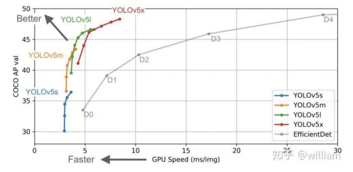

# YOLO5

目标检测也叫目标提取，是一种基于目标几何和统计特征的图像分割。它将目标的分割和识别合二为一，其准确性和实时性是整个系统的一项重要能力。尤其是在复杂场景中，需要对多个目标进行实时处理时，目标自动提取和识别就显得特别重要。

随着计算机技术的发展和计算机视觉原理的广泛应用,利用计算机图像处理技术对目标进行实时跟踪研究越来越热门,对目标进行动态实时跟踪定位在智能化交通系统、智能监控系统、军事目标检测及医学导航手术中手术器械定位等方面具有广泛的应用价值。

下面介绍的目标检测的方法为Yolov5。Yolo之父Joseph Redmon在2020年年初宣布退出计算机视觉的研究的时候，很多人都以为目标检测神器Yolo系列就此终结。然而在4月23日，继任者Yolov4却悄无声息地来了。Yolov4是Yolo系列一个重大的更新,其在COCO数据集上的平均精度(AP)和帧率精度(FPS)分别提高了10%和12%，被认为是当前最强的实时对象检测模型之一。

正当计算机视觉的从业者们正在努力研究Yolov4的时候，万万没想到，6月25日，Ultralytics发布了Yolov5 的第一个正式版本，其性能与Yolov4不相伯仲。

Yolov5结构分为输入端、Backbone、Neck、Prediction四个部分。

对于Yolov5的四种模型，无论是V5s，V5m，V5l还是V5x其结构部分都一致。唯一的区别在与模型的深度和宽度设置。

Yolov5s 网络最小,速度最少，AP精度也最低。但如果检测的以大目标为主，追求速度，倒也是个不错的选择。其他的三种网络，在此基础上，不断加深加宽网络，AP精度也不断提升，但速度的消耗也在不断增加。目前使用下来，Yolov5s的模型十几M大小，速度很快，线上生产效果可观，嵌入式设备可以使用。

 

## 输入端

Yolov5的输入端采用了和Yolov4一样的Mosaic数据增强的方式;在Yolo算法中，针对不同的数据集，都会有初始设定长宽的锚框;在网络训练中，网络在初始锚框的基础上输出预测框，进而和真实框groundtruth进行比对，计算两者差距，再反向更新，迭代网络参数。

在Yolov3、Yolov4中，训练不同的数据集时，计算初始锚框的值是通过单独的程序运行的，但Yolov5中将此功能嵌入到代码中，每次训练时，自适应的计算不同训练集中的最佳锚框值。

在常用的目标检测算法中，不同的图片长宽都不相同，因此常用的方式是将原始图片统一缩放到一个标准尺寸，再送入检测网络中。但Yolov5代码中对此进行了改进，也是Yolov5推理速度能够很快的一个不错的 trick。作者认为，在项目实际使用时，很多图片的长宽比不同，因此缩放填充后，两端的黑边大小都不同，而如果填充的比较多，则存在信息冗余，影响推理速度。因此在Yolov5的代码中datasets.py的letterbox 函数中进行了修改,对原始图像自适应的添加最少的黑边。图像高度上两端的黑边变少了，在推理时，计算量也会减少，即目标检测速度会得到提升。通过这种简单的改进，推理速度得到了37%的提升，可以说效果很明显。

 

## Backbone

(1)Focus 结构

在Yolov3和Yolov4中并没有这个结构，其中比较关键是切片操作。以Yolov5s 的结构为例，原始608*608*3的图像输入Focus 结构，采用切片操作，先变成304*304*12的特征图，再经过一次32个卷积核的卷积操作，最终变成304*304*32的特征图。

需要注意的是:Yolov5s 的Focus 结构最后使用了32个卷积核，而其他三种结构，使用的数量有所增加。

(2)CSP结构

Yolov4 网络结构中，借鉴了CSPNet 的设计思路，在主干网络中设计了CSP结构。Yolov5与 Yolov4不同点在于，Yolov4中只有主干网络使用了CSP结构，而Yolov5中设计了两种CSP结构，CSP1_X结构应用于Backbone主干网络，另一种CSP2_X结构则应用于Neck 中。

 

## Neck

Yolov5现在的Neck和Yolov4中一样,都采用FPN+PAN的结构,但在Yolov5刚出来时，只使用了FPN结构，后面才增加了PAN结构，此外网络中其他部分也进行了调整。

但如上面CSPNet结构中讲到，Yolov5和Yolov4 的不同点在于，Yolov4的Neck 结构中，采用的都是普通的卷积操作。而Yolov5的Neck 结构中，采用借鉴CSPnet 设计的CSP2结构，加强网络特征融合的能力。

 

## 输出端

(1) Bounding box损失函数

Yolov5中采用其中的GIOU_Loss做Bounding box的损失函数，而Yolov4中采用CIOU_Loss作为目标Bounding box的损失。

(2) nms非极大值抑制

在目标检测的后处理过程中，针对很多目标框的筛选，通常需要nms操作。因为CIOU_Loss 中包含影响因子v，涉及 groudtruth的信息，而测试推理时，是没有groundtruth的，所以Yolov4在DIOU_Loss 的基础上采用DIOU_nms的方式，而Yolov5中采用加权nms 的方式。

 