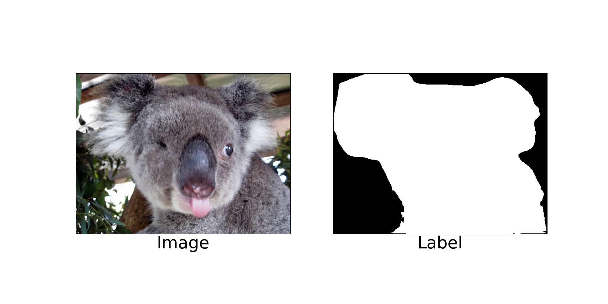
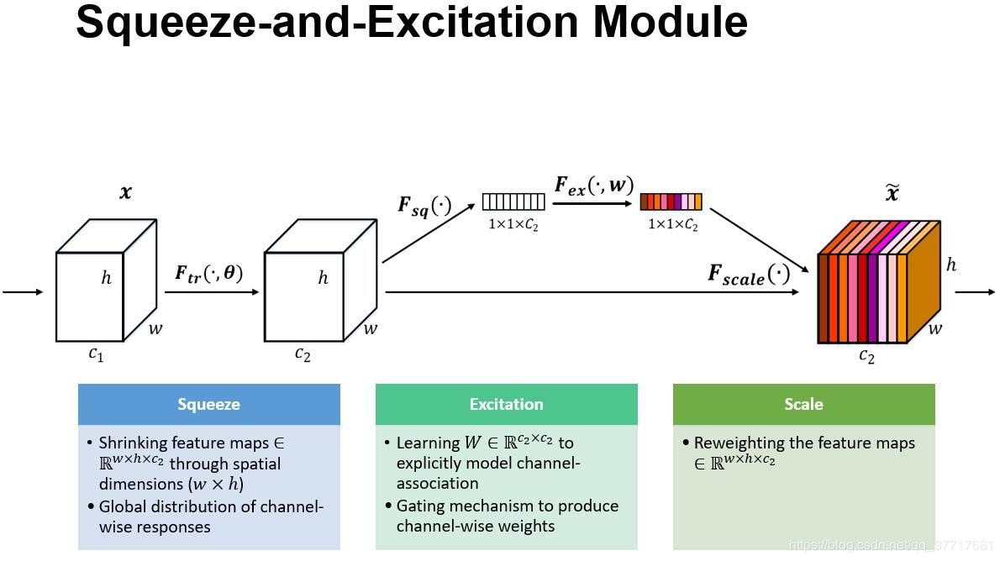
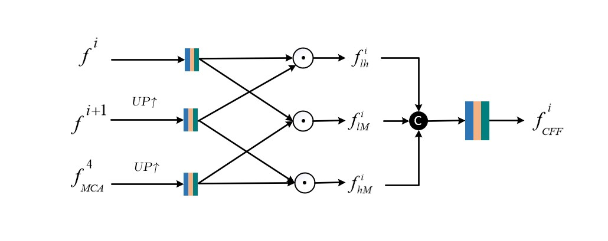

                                       ****************第三届中国AI+创新创业大赛：半监督学习目标定位竞赛冠军模型**************

# 1 赛题介绍
## 1.1 赛题背景
半监督学习（Semi-Supervised Learning）是指通过大量无标注数据和少量有标注数据完成模型训练，解决具有挑战性的模式识别任务。近几年，随着计算硬件性能的提升和大量大规模标注数据集的开源，基于深度卷积神经网络(Deep Convolutional Neural Networks, DCNNs)的监督学习研究取得了革命性进步。然而，监督学习模型的优异性能要以大量标注数据作为支撑，可现实中获得数量可观的标注数据十分耗费人力物力（例如：获取像素级标注数据）。于是，半监督学习逐渐成为深度学习领域的热门研究方向，只需要少量标注数据就可以完成模型训练过程，更适用于现实场景中的各种任务。
## 1.2 比赛任务
本次比赛要求选手基于少量有标注数据训练模型，使分类网络具有目标定位能力，实现半监督目标定位任务。每一位参赛选手仅可以使用ImageNet大型视觉识别竞赛(ILSVRC)的训练集图像作为训练数据，其中有标注的训练数据仅可以使用大赛组委会提供的像素级标注数据。
## 1.3 数据集介绍
训练数据集包括50,000幅像素级有标注的图像，共包含500个类，每个类100幅图像；<br>
A榜测试数据集包括11,878幅无标注的图像；<br>
B榜测试数据集包括10,989幅无标注的图像。<br>
下图选取了一张图展示了赛题的图片以及标签信息


## 1.4 评价指标
本次比赛使用IoU曲线作为评价指标，即利用预测的目标的定位概率图，计算不同阈值下预测结果与真实目标之间的IoU分数，最后取一个最高点作为最终的分数。在理想状态下，IoU曲线最高值接近1.0，对应的阈值为255，因为阈值越高，目标对象与背景的对比度越高。

# 2 冠军团队方案详解
## 2.1 竞赛基础算法介绍
从赛题图片可以看出，本次中国AI+创新创业大赛的赛题半监督学习目标定位是属于语义分割的范畴，确切来说是二分类语义分割，即将背景像素点归类为0（黑色），物体像素点归类为255（白色），同时，这也与显著目标检测的任务类似，都是划分出图片中的特定物体，可以说，显著目标检测任务类似于语义分割的子任务，在二值分割任务中，使用显著目标检测的算法一般会更加有效。目前显著目标检测领域最为常用的就是以端到端为目标的编码器-解码器架构，以实现像素级别的输出，从而提高分割的精度。实现这一目标的方法为全卷积神经网络（Fully Convolutional Network， FCN），见图2，全卷积神经网络中的编码器起到提取不同尺度特征信息的作用，通常由分类网络如ResNet、VGG提取输入图片的特征及语义信息， 这样的分类网络又被称为FCN中的骨干网络。提取的不同尺度特征具有不同的语义信息，浅层特征具有较大的分辨率以及明显的物体轮廓信息，但也包含了复杂的背景噪音，深层特征具有较小的分辨率以及探测物体的位置信息，但小分辨率往往带来了粗糙的物体边界，以ResNet为例，假如输入图像尺寸为3×320×320，则可以在ResNet系列模型中的conv、layer1、layer2、layer3、layer4五层结构中提取出64×160×160、256×80×80、512×40×40、1024×20×20、2048×10×10 一共五层特征信息，可以看到第一层和第二层的特征具有较大的尺寸，因此存在着丰富的图像细节信息，第四第五层特征尺寸较小，具有更为抽象的语义信息。
而分割任务则需要精细的物体边界。因此，解码器就实现了深层浅层特征的融合，以定位具有清晰边界的目标物体。因此，本次赛题就采用的是全卷积神经网络为基础的目标定位算法。以下为全卷积神经网络的结构。


## 2.2 比赛模型解析
这部分介绍比赛的模型，包括了骨干网络和解码网络。
### 2.3 骨干网络
在上面我们讲到，骨干网络的作用是提取具有不同尺寸与不同语义的特征信息，对于视觉任务来说，提取的特征信息的重要程度，相当于造房子的地基，地基越牢房子也会越稳固，特征信息越全面越丰富，后续的特征处理才会充分运用丰富的特征信息，从而生成高质量的预测图。因此骨干网络的选择，会对后续的结果图会产生直接的影响, 常用的骨干网络为ImageNet分类数据集上的预训练模型，如VGG系列，MobileNet系列,ResNet及其变体Res2Net、ResNeXt系列等。在ImageNet数据集上表现越好的网络，往往也会在分割任务上表现越好。因此我们在PaddleClas中的ImageNet预训练模型库选择了Top-1 Acc分别为0.851、0.8424和0.8719的Res2Net200_vd_26w_4s_ssld（以下简称为Res2Net200）、ResNeXt101_32x16d_wsl(以下简称为ResNeXt101)
和SwinTransformer_large_patch4_window12_384 (以下简称为SwinT384) 三种骨干网络。
#### 2.3.1 Res2Net

ResNet系列可以在https://paddlepedia.readthedocs.io/en/latest/tutorials/computer_vision/classification/ResNet.html 这里了解

相较于ResNet，Res2Net将输入分成几部分，一组卷积核从对应的一组输入特征图中提取信息。前面得到的信息送到另一组卷积核中作为输入。重复此操作，直到处理完所有输入特征图。最后，每组输出的特征图通过拼接操作送入1x1的卷积中用于进行特征融合。Res2Net着重于分割类型的任务，其中改进的物体识别能力发挥了作用。

#### 2.3.2 ResNeXt and ResNext_wsl

ResNeXt是facebook于2016年提出的一种对ResNet的改进版网络。ResNeXt是ResNet和Inception的结合体， ResNext的每一个分支都采用相同的拓扑结构。ResNeXt的本质是分组卷积（Group Convolution），通过变量基数（Cardinality）来控制组的数量。分组卷积是普通卷积和深度可分离卷积的一个折中方案，即每个分支产生的Feature Map的通道数为n(n>1)。在2019年，facebook通过弱监督学习研究了该系列网络在ImageNet上的精度上限，为了区别之前的ResNeXt网络，该系列网络的后缀为wsl，其中wsl是弱监督学习（weakly-supervised-learning）的简称。为了能有更强的特征提取能力，研究者将其网络宽度进一步放大，其中最大的ResNeXt101_32x48d_wsl拥有8亿个参数，将其在9.4亿的弱标签图片下训练并在ImageNet-1k上做finetune，最终在ImageNet-1k的top-1达到了85.4%，这也是迄今为止在ImageNet-1k的数据集上以224x224的分辨率下精度最高的网络。Fix-ResNeXt中，作者使用了更大的图像分辨率，针对训练图片和验证图片数据预处理不一致的情况下做了专门的Fix策略，并使得ResNeXt101_32x48d_wsl拥有了更高的精度，由于其用到了Fix策略，故命名为Fix-ResNeXt101_32x48d_wsl。
#### 2.3.3 SwinTransformer

Swin Transformer 是一种新的视觉Transformer网络，可以用作计算机视觉领域的通用骨干网路。SwinTransformer由移动窗口（shifted windows）表示的层次Transformer结构组成。移动窗口将自注意计算限制在非重叠的局部窗口上，同时允许跨窗口连接，从而提高了网络性能。
### 2.4 解码网络
我们根据显著目标检测研究方向以及语义分割研究方向的内容提出了两个方向可以共用的两个解码网络，Attention Guided Contextual Feature Fusion Network （注意力引导的上下文融合网络，简称ACFFNet）和Feature Mutual Feedback Network（特征互馈网络，简称FMFNet）。
#### 2.4.1 ACFFNet

Conv1以及L1、L2、L3、L4是骨干网络（Res2Net、ResNeXt、SwinTransformer)提取的特征,SE为Squeeze-and-Excitation注意力模块，MFR为Multi-filed Feature Refinement Module，CFF为Context Feature Fusion Module, SR为Self Refirement Module。

ACFFNet先使用SE模块与MFR模块处理最高层特征，然后使用CFF模块融合上下文特征，在CFF模块融合不同层特征的时候，SR模块用以改善CFF模块不同层特征元素级相乘导致的预测图存在孔洞的问题。这就是整个特征处理的流程。下面是各个模块的详解。
##### 2.4.1.1 SE

SE模块通过压缩与激励两个操作实现特征通道的选择，为不同的通道分配不同的权重，从特征图层面以抑制不重要的特征通道。Paddle代码实现如下。

``` python

 from paddle import nn
  
  
  class SEModule(nn.Layer):
      def __init__(self, channels, reduction=16):

          super(SEModule, self).__init__()
          self.avg_pool = nn.AdaptiveAvgPool2D(1)
          self.fc1 = nn.Conv2D(channels, channels // reduction, kernel_size=1, padding=0)
          self.relu = nn.ReLU()
          self.fc2 = nn.Conv2D(channels // reduction, channels, kernel_size=1, padding=0)
          self.sigmoid = nn.Sigmoid()

      def forward(self, inputs):
          x = self.avg_pool(inputs)
          x = self.fc1(x)
          x = self.relu(x)
          x = self.fc2(x)
          x = self.sigmoid(x)
          return inputs * x
```

##### 2.4.1.2 MFR

MFR模块使用了1×3和3×1的非对称卷积以及残差连接的方式进行特征的处理，非对称卷积可以从多种感受野来获取特征信息，尤其在小尺寸的特征图中，非对称卷积会比普通的3×3卷积效果好。残差连接则是为了通过对应像素点相加，抑制背景噪音。Paddle代码实现如下。

``` python

class MFRModel(nn.Layer):
    def __init__(self, in_channel_left, in_channel_right):
        super(MFRModel, self).__init__()
        self.conv0 = nn.Conv2D(in_channel_left, 256, 3, 1, 1)
        self.bn0 = nn.BatchNorm2D(256)
        self.conv1 = nn.Conv2D(in_channel_right, 256, 1)
        self.bn1 = nn.BatchNorm2D(256)

        self.conv2 = nn.Conv2D(256, 256, kernel_size=3, stride=1, padding=1)
        self.bn2 = nn.BatchNorm2D(256)

        self.conv13 = nn.Conv2D(256, 256, kernel_size=(1, 3), stride=1, padding=(0, 1))
        self.bn13 = nn.BatchNorm2D(256)
        self.conv31 = nn.Conv2D(256, 256, kernel_size=(3, 1), stride=1, padding=(1, 0))
        self.bn31 = nn.BatchNorm2D(256)

    def forward(self, left, down):
        left = F.relu(self.bn0(self.conv0(left)))
        down = F.relu(self.bn1(self.conv1(down)))
        left = F.relu(self.bn2(self.conv2(left)))

        down = F.relu(self.bn31(self.conv31(down)))
        down = self.bn13(self.conv13(down))
        return F.relu(left + down)
```

 ##### 2.4.1.3 CFF
 
CFF模块结合了上下文信息与全局信息，每个CFF模块都有来自最深层特征的指导，通过融合深层次特征，更容易定位图像中的目标。CFF模块采取了3个输入特征两两相乘的方式进行特征融合，元素级乘法可以有效地抑制不同层特征的背景噪音，大尺寸图片中复杂的背景像素点的值在对应的小尺寸图片中的位置往往为0或者负，相乘再经过激活函数的处理，就可以很好的优化特征信息。Paddle代码实现如下。

``` python

class CFFModel(nn.Layer):
    def __init__(self, in_channel_left, in_channel_down, in_channel_right):
        super(CFFModel, self).__init__()
        self.conv0 = nn.Conv2D(in_channel_left, 256, kernel_size=3, stride=1, padding=1)
        self.bn0 = nn.BatchNorm2D(256)

        self.conv1 = nn.Conv2D(in_channel_down, 256, kernel_size=3, stride=1, padding=1)
        self.bn1 = nn.BatchNorm2D(256)
        self.conv2 = nn.Conv2D(in_channel_right, 256, kernel_size=3, stride=1, padding=1)
        self.bn2 = nn.BatchNorm2D(256)

        self.conv3 = nn.Conv2D(256 * 3, 256, kernel_size=3, stride=1, padding=1)
        self.bn3 = nn.BatchNorm2D(256)

    def forward(self, left, down, right):
        left = F.relu(self.bn0(self.conv0(left)))  

        down = F.relu(self.bn1(self.conv1(down)))  
        right = F.relu(self.bn2(self.conv2(right)))

        down = F.interpolate(down, size=left.shape[2:], mode='bilinear')
        right = F.interpolate(right, size=left.shape[2:], mode='bilinear')

        x = left * down  # Flh
        y = left * right  # FlM
        z = right * down  # FhM
        out = paddle.concat([x, y, z], 1)
        return F.relu(self.bn3(self.conv3(out)))
```

 ##### 2.4.1.4 SR
  
  
 SR模块是参考的2020年CVPR顶会《Global Context-Aware Progressive Aggregation Network for Salient Object Detection》里面提出的SR模块，可以起到填补CFF模块中不同层直接相乘导致的预测图中出现孔洞的作用。Paddle代码如下。
 ``` python
 class SRModel(nn.Layer):
 
    def __init__(self, in_channel):
        super(SRModel, self).__init__()
        self.conv1 = nn.Conv2D(in_channel, 256, kernel_size=3, stride=1, padding=1)
        self.bn1 = nn.BatchNorm2D(256)
        self.conv2 = nn.Conv2D(256, 512, kernel_size=3, stride=1, padding=1)

    def forward(self, x):
        out1 = F.relu(self.bn1(self.conv1(x)))
        out2 = self.conv2(out1)
        w, b = out2[:, :256, :, :], out2[:, 256:, :, :]
        return F.relu(w * out1 + b)
 ```
 
#### 2.4.2 FMFNet
  

Feature Mutual Feedback Module(FMFNet)包括了Semantic Supplementary Module(SSM)、Feature Interaction Module(FIM)、Progressive Fusion Module(PFM)。SSM模块用以解决池化操作导致特征缺失的问题，FIM通过高低层特征的交互，实现上下文信息融合。PFM模块渐进式的融合各层特征，以应对深层特征上采样过程中导致的边界模糊情况。下面是每个模块的说明。

##### 2..4.2.1 SSM
SSM模块使用了空洞卷积，空洞卷积图如下
  

空洞卷积通过在卷积核之间填充0的方式增大卷积核的感受野，从而使相同大小的卷积核拥有更大的视野，可以获取更加全面的视觉信息。不同的空洞率有着不同的感受野，越大的空洞率拥有越大的视野。以空洞卷积为主的ASPP模块通过有着多种空洞率的卷积核的堆叠获得不同尺度的特征信息，经卷积压缩后输出，从而补充经池化操作损失的信息，这里我们只用了一种空洞率为3的卷积核。Paddle代码如下
``` python
class SSM(nn.Layer): 

    def __init__(self):
        super(SSM, self).__init__()
        self.cv1 = nn.Conv2D(64, 64, 3, 1, 1)
        self.bn1 = nn.BatchNorm2D(64)
        self.cv2 = nn.Conv2D(64, 64, 3, 1, 3, dilation=3)
        self.bn2 = nn.BatchNorm2D(64)

    def forward(self, x):
        d1 = self.bn1(self.cv1(x))
        d2 = self.bn2(self.cv2(x))
        out = F.relu(d1+d2+x)
        return out
```

##### 2..4.2.2 FIM
FIM模块通过高低层特征分别与邻层特征交互，再通过残差连接的方式细化特征，最终实现多层特征的优化。高层特征通过上采样，低层特征通过下采样，分别于低高层特征融合，实现交互。Paddle代码如下。
``` python
class FIM(nn.Layer): 

    def __init__(self):
        super(FIM, self).__init__()
        self.cv1 = nn.Conv2D(64, 64, 3, 1, 1)
        self.bn1 = nn.BatchNorm2D(64)
        self.cv2 = nn.Conv2D(64, 64, 3, 1, 1)
        self.bn2 = nn.BatchNorm2D(64)

        self.cv3 = nn.Conv2D(64, 64, 3, 1, 1)
        self.bn3 = nn.BatchNorm2D(64)
        self.cv4 = nn.Conv2D(64, 64, 3, 1, 1)
        self.bn4 = nn.BatchNorm2D(64)
        
    def forward(self, l, h):
        h_l = F.interpolate(h, size=l.shape[2:], mode='bilinear', align_corners=True)
        l_h = F.interpolate(l, size=h.shape[2:], mode='bilinear', align_corners=True)

        h_l = F.relu(self.bn1(self.cv1(h_l)))
        l_h = F.relu(self.bn2(self.cv2(l_h)))

        l_h_l = self.bn3(self.cv3(l * h_l))
        h_l_h = self.bn4(self.cv4(h * l_h))

        l = F.relu(l_h_l + l)
        h = F.relu(h_l_h + h)
        return l, h
```
##### 2..4.2.3 PFM
PFM模块很简单，就是高层特征的渐进式上采样与低层特征相互融合的过程。Paddle代码如下。
``` python
class PFM(nn.Layer):

    def __init__(self):
        super(PFM, self).__init__()
        self.cv1 = nn.Conv2D(64, 64, 3, 1, 1)
        self.bn1 = nn.BatchNorm2D(64)

        self.cv2 = nn.Conv2D(128, 64, 3, 1, 1)
        self.bn2 = nn.BatchNorm2D(64)

        self.cv3 = nn.Conv2D(64, 64, 3, 1, 1)
        self.bn3 = nn.BatchNorm2D(64)

        self.cv4 = nn.Conv2D(128, 64, 3, 1, 1)
        self.bn4 = nn.BatchNorm2D(64)

        self.cv5 = nn.Conv2D(64, 64, 3, 1, 1)
        self.bn5 = nn.BatchNorm2D(64)

        self.cv6 = nn.Conv2D(128, 64, 3, 1, 1)
        self.bn6 = nn.BatchNorm2D(64)

        self.cv7 = nn.Conv2D(64, 64, 3, 1, 1)
        self.bn7 = nn.BatchNorm2D(64)

        self.cv8 = nn.Conv2D(128, 64, 3, 1, 1)
        self.bn8 = nn.BatchNorm2D(64)

    def forward(self, out1, out2, out3, out4, out5):
        out5 = F.interpolate(out5, size=out4.shape[2:], mode='bilinear', align_corners=True)
        out5 = F.relu(self.bn1(self.cv1(out5)))

        out4 = paddle.concat([out4, out5], axis=1)
        out4 = F.relu(self.bn2(self.cv2(out4)))
        out4 = F.interpolate(out4, size=out3.shape[2:], mode='bilinear', align_corners=True)
        out4 = F.relu(self.bn3(self.cv3(out4)))

        out3 = paddle.concat([out3, out4], axis=1)
        out3 = F.relu(self.bn4(self.cv4(out3)))
        out3 = F.interpolate(out3, size=out2.shape[2:], mode='bilinear', align_corners=True)
        out3 = F.relu(self.bn5(self.cv5(out3)))

        out2 = paddle.concat([out2, out3], axis=1)
        out2 = F.relu(self.bn6(self.cv6(out2)))
        out2 = F.interpolate(out1, size=out2.shape[2:], mode='bilinear', align_corners=True)
        out2 = F.relu(self.bn7(self.cv7(out2)))

        out1 = paddle.concat([out1, out2], axis=1)
        out1 = F.relu(self.bn8(self.cv8(out1)))
        return out1

```


#### 2.4.3总结
我们通过使用PaddleClas中提供的三个骨干网络(Res2Net200、ResNeXt101、SwinT384)和两种解码网络(ACFFNet、FMFNet)构建了四个模型，即Res2Net200+ACFFNet、ResNeXt101+ACFFNet、SwinT384+ACFFNet、Res2Net200+FMFNet。四个模型的加权融合得到了比赛的最高分。


