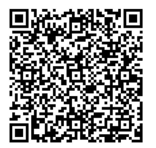

# 深度学习百问

深度学习百问包含深度学习基础篇、深度学习进阶篇、深度学习应用篇、强化学习篇以及面试宝典，详细信息请参阅[Paddle知识点文档平台](https://paddlepedia.readthedocs.io/en/latest/index.html)。

* **深度学习基础篇**  

  1. [深度学习](https://paddlepedia.readthedocs.io/en/latest/tutorials/deep_learning/index.html#)  
     1. [基础知识](https://paddlepedia.readthedocs.io/en/latest/tutorials/deep_learning/basic_concepts/index.html)（包括神经元、单层感知机、多层感知机等5个知识点）
     2. [优化策略](https://paddlepedia.readthedocs.io/en/latest/tutorials/deep_learning/optimizers/index.html)（包括什么是优化器、GD、SGD、BGD、鞍点、Momentum、NAG、Adagrad、AdaDelta、RMSProp、Adam、AdaMa、Nadam、AMSGrad、AdaBound、AdamW、RAdam、Lookahead等18个知识点）  
     3. [激活函数](https://paddlepedia.readthedocs.io/en/latest/tutorials/deep_learning/activation_functions/index.html)(包括什么是激活函数、激活函数的作用、identity、step、sigmoid、tanh、relu、lrelu、prelu、rrelu、elu、selu、softsign、softplus、softmax、swish、hswish、激活函数的选择等21个知识点)  
     4. [常用损失函数](https://paddlepedia.readthedocs.io/en/latest/tutorials/deep_learning/loss_functions/index.html)（包括交叉熵损失、MSE损失以及CTC损失等3个知识点）  
     5. [评估指标](https://paddlepedia.readthedocs.io/en/latest/tutorials/deep_learning/metrics/index.html)（包括Precision、Recall、mAP、IS、FID等5个知识点）  
     6. [模型调优](https://paddlepedia.readthedocs.io/en/latest/tutorials/deep_learning/model_tuning/index.html#)  
        - [学习率](https://paddlepedia.readthedocs.io/en/latest/tutorials/deep_learning/model_tuning/learning_rate.html)（包括什么是学习率、学习率对网络的影响以及不同的学习率率衰减方法，如：分段常数衰减等12个学习率衰减方法）  
        - [归一化](https://paddlepedia.readthedocs.io/en/latest/tutorials/deep_learning/model_tuning/normalization/index.html)（包括什么是归一化、为什么要归一化、为什么归一化能提高求解最优解速度、归一化有哪些类型、不同归一化的使用条件、归一化和标准化的联系与区别等6个知识点）  
        - [正则化](https://paddlepedia.readthedocs.io/en/latest/tutorials/deep_learning/model_tuning/regularization/index.html)(包括什么是正则化？正则化如何帮助减少过度拟合？数据增强、L1 L2正则化介绍、L1和L2的贝叶斯推断分析法、Dropout、DropConnect、早停法等8个知识点)  
        - [注意力机制](https://paddlepedia.readthedocs.io/en/latest/tutorials/deep_learning/model_tuning/attention/index.html) (包括自注意力、多头注意力、经典注意力计算方式等10个知识点)  
        - [Batch size](https://paddlepedia.readthedocs.io/en/latest/tutorials/deep_learning/model_tuning/batch_size.html)（包括什么是batch size、batch size对网络的影响、batch size的选择3个知识点）  
        - [参数初始化](https://paddlepedia.readthedocs.io/en/latest/tutorials/deep_learning/model_tuning/weight_initializer.html)（包括为什么不能全零初始化、常见的初始化方法等5个知识点）  

  2. [卷积神经网络](https://paddlepedia.readthedocs.io/en/latest/tutorials/CNN/index.html)  
     1. [CNN综述](https://paddlepedia.readthedocs.io/en/latest/tutorials/CNN/CV_CNN.html)  （包括计算机视觉综述、计算机视觉发展历程、卷积神经网络结构等3个知识点）
     2. [卷积算子](https://paddlepedia.readthedocs.io/en/latest/tutorials/CNN/convolution_operator/index.html)（包括标准卷积、1*1卷积、3D卷积、转置卷积、空洞卷积、分组卷积、可分离卷积等7个知识点）  
     3. [池化](https://paddlepedia.readthedocs.io/en/latest/tutorials/CNN/Pooling.html)  （包括池化的基本概念、池化特点等2个知识点）

  3. [序列模型](https://paddlepedia.readthedocs.io/en/latest/tutorials/sequence_model/index.html)  
     1. [词表示](https://paddlepedia.readthedocs.io/en/latest/tutorials/sequence_model/word_representation/index.html) (包括one-hot编码、word-embedding以及word2vec等9个知识点)  
     2. [循环神经网络RNN](https://paddlepedia.readthedocs.io/en/latest/tutorials/sequence_model/rnn.html)  
     3. [长短时记忆网络LSTM](https://paddlepedia.readthedocs.io/en/latest/tutorials/sequence_model/lstm.html)  
     4. [门控循环单元GRU](https://paddlepedia.readthedocs.io/en/latest/tutorials/sequence_model/gru.html)  

* **深度学习进阶篇**  

  1. [预训练模型](https://paddlepedia.readthedocs.io/en/latest/tutorials/pretrain_model/index.html)
     1. [预训练模型是什么](https://paddlepedia.readthedocs.io/en/latest/tutorials/pretrain_model/pretrain_model_description.html) (包括预训练、微调等2个知识点)  
     2. [预训练分词Subword](https://paddlepedia.readthedocs.io/en/latest/tutorials/pretrain_model/subword.html)(包括BPE、WordPiece、ULM等3个知识点)  
     3. [Transformer](https://paddlepedia.readthedocs.io/en/latest/tutorials/pretrain_model/transformer.html)（包括self-attention、multi-head Attention、Position Encoding、Transformer Encoder、Transformer Decoder等5个知识点）  
     4. [BERT](https://paddlepedia.readthedocs.io/en/latest/tutorials/pretrain_model/bert.html)（包括BERT预训练任务、BERT微调等2个知识点）  
     5. [ERNIE](https://paddlepedia.readthedocs.io/en/latest/tutorials/pretrain_model/erine.html)(包括ERNIE介绍、Knowledge Masking等2个知识点)  
  2. [对抗神经网络](https://paddlepedia.readthedocs.io/en/latest/tutorials/generative_adversarial_network/index.html)  
     1. [encoder-decoder](https://paddlepedia.readthedocs.io/en/latest/tutorials/generative_adversarial_network/encoder_decoder/index.html)(包括encoder、decoder等2个知识点)  
     2. [GAN基本概念](https://paddlepedia.readthedocs.io/en/latest/tutorials/generative_adversarial_network/basic_concept/index.html)(包括博弈论、纳什均衡、输入随机噪声、生成器、判别器、损失函数、训练不稳定、模式崩溃等8个知识点)  
     3. [GAN应用](https://paddlepedia.readthedocs.io/en/latest/tutorials/generative_adversarial_network/gan_applications/index.html)(包括GAN在图像生成、超分辨率、图片上色等方面的应用)  

* **深度学习应用篇**  

  1. [计算机视觉](https://paddlepedia.readthedocs.io/en/latest/tutorials/computer_vision/index.html)  
     1. [图像增广](https://paddlepedia.readthedocs.io/en/latest/tutorials/computer_vision/image_augmentation/index.html)（包括什么是数据增广、常用数据增广方法、图像变换类增广方法、图像裁剪类增广方法、图像混叠类增广方法、不同方法对比实验等11个知识点）  
     2. [图像分类](https://paddlepedia.readthedocs.io/en/latest/tutorials/computer_vision/classification/index.html)（包括LeNet、AlexNet、VGG、GoogleNet、DarkNet、ResNet、ViT等7个知识点）  
     3. [目标检测](https://paddlepedia.readthedocs.io/en/latest/tutorials/computer_vision/object_detection/index.html)（包括目标检测综述、边界框、锚框、交并比、NMS等5个知识点）  
     4. [OCR](https://paddlepedia.readthedocs.io/en/latest/tutorials/computer_vision/OCR/index.html)（包括OCR综述、OCR常用检测方法(CTPN、EAST、DBNet)、OCR常用识别方法(CRNN)等5个知识点）
  2. [自然语言处理](https://paddlepedia.readthedocs.io/en/latest/tutorials/natural_language_processing/index.html)  
     1. [命名实体识别](https://paddlepedia.readthedocs.io/en/latest/tutorials/natural_language_processing/ner/index.html) (包括bilstm+CRF架构剖析、CRF原理等8个知识点)  
  3. [推荐系统](https://paddlepedia.readthedocs.io/en/latest/tutorials/recommendation_system/index.html)  
     1. [推荐系统基础](https://paddlepedia.readthedocs.io/en/latest/tutorials/recommendation_system/recommender_system.html)(包括协同过滤推荐、内容过滤推荐、组合推荐、用户画像、召回、排序等6个知识点)  
     2. [DSSM模型](https://paddlepedia.readthedocs.io/en/latest/tutorials/recommendation_system/dssm.html)（包括DSSM模型等1个知识点）  

* **产业实践篇**  

  1. [模型压缩](https://paddlepedia.readthedocs.io/en/latest/tutorials/model_compress/index.html)（包括为什需要模型压缩、模型压缩基本方法、PKD、DistilBERT、TinyBERT、DynaBERT等6个知识点）
  2. [模型部署](https://paddlepedia.readthedocs.io/en/latest/tutorials/model_deployment/index.html)  

* **强化学习篇**  

  1. [强化学习](https://paddlepedia.readthedocs.io/en/latest/tutorials/reinforcement_learning/index.html)  
     1. [强化学习基础知识点](https://paddlepedia.readthedocs.io/en/latest/tutorials/reinforcement_learning/basic_information.html)（包括智能体、环境、状态、动作、策略和奖励的定义）  
     2. [马尔可夫决策过程](https://paddlepedia.readthedocs.io/en/latest/tutorials/reinforcement_learning/markov_decision_process.html) （包括马尔可夫决策过程、Model-based、Model-free三个知识点）  
     3. [策略梯度定理](https://paddlepedia.readthedocs.io/en/latest/tutorials/reinforcement_learning/policy_gradient.html) （包括策略梯度定理一个知识点）  
     4. [蒙特卡洛策略梯度定理](https://paddlepedia.readthedocs.io/en/latest/tutorials/reinforcement_learning/policy_gradient.html)（包括蒙特卡洛策略梯度定理一个知识点）  
     5. [REINFORCE算法](https://paddlepedia.readthedocs.io/en/latest/tutorials/reinforcement_learning/policy_gradient.html#reinforce) （包括REINFORCE算法简介和流程两个知识点）  
     6. [SARSA](https://paddlepedia.readthedocs.io/en/latest/tutorials/reinforcement_learning/Sarsa.html)（包括SARSA的公式、优缺点等2个知识点）  
     7. [Q-Learning](https://paddlepedia.readthedocs.io/en/latest/tutorials/reinforcement_learning/Q-learning.html)（包括Q-Learning的公式、优缺点等2个知识点）  
     8. [DQN](https://paddlepedia.readthedocs.io/en/latest/tutorials/reinforcement_learning/DQN.html#)（包括DQN网络概述及其创新点和算法流程2个知识点）  

* **面试宝典**  

  1.  深度学习基础

    * [为什么归一化能够提高求解最优解的速度？](https://paddlepedia.readthedocs.io/en/latest/tutorials/deep_learning/model_tuning/normalization/basic_normalization.html#id4)
    * [为什么要归一化？](https://paddlepedia.readthedocs.io/en/latest/tutorials/deep_learning/model_tuning/normalization/basic_normalization.html)
    * [归一化与标准化有什么联系和区别？](https://paddlepedia.readthedocs.io/en/latest/tutorials/deep_learning/model_tuning/normalization/basic_normalization.html#id7)
    * [归一化有哪些类型？](https://paddlepedia.readthedocs.io/en/latest/tutorials/deep_learning/model_tuning/normalization/basic_normalization.html#id5)
    * [Min-max归一化一般在什么情况下使用？](https://paddlepedia.readthedocs.io/en/latest/tutorials/deep_learning/model_tuning/normalization/basic_normalization.html#id6)
    * [Z-score归一化在什么情况下使用？](https://paddlepedia.readthedocs.io/en/latest/tutorials/deep_learning/model_tuning/normalization/basic_normalization.html#id6)
    * [学习率过大或过小对网络会有什么影响？](https://paddlepedia.readthedocs.io/en/latest/tutorials/deep_learning/model_tuning/learning_rate.html)
    * [batch size的大小对网络有什么影响？](https://paddlepedia.readthedocs.io/en/latest/tutorials/deep_learning/model_tuning/batch_size.html)
    * [在参数初始化时，为什么不能全零初始化？](https://paddlepedia.readthedocs.io/en/latest/tutorials/deep_learning/model_tuning/weight_initializer.html)
    * [激活函数的作用？](https://paddlepedia.readthedocs.io/en/latest/tutorials/deep_learning/activation_functions/Activation_Function.html#id3)
    * [sigmoid函数有什么优缺点？](https://paddlepedia.readthedocs.io/en/latest/tutorials/deep_learning/activation_functions/Activation_Function.html#sigmoid)
    * [RELU函数有什么优缺点？](https://paddlepedia.readthedocs.io/en/latest/tutorials/deep_learning/activation_functions/Activation_Function.html#relu)
    * [如何选择合适的激活函数？](https://paddlepedia.readthedocs.io/en/latest/tutorials/deep_learning/activation_functions/Activation_Function.html#id5)
    * [为什么 relu 不是全程可微/可导也能用于基于梯度的学习？](https://paddlepedia.readthedocs.io/en/latest/tutorials/deep_learning/activation_functions/Activation_Function.html#id6)
    * [怎么计算mAP？](https://paddlepedia.readthedocs.io/en/latest/tutorials/deep_learning/metrics/mAP.html)
    * [交叉熵为什么可以作为分类任务的损失函数？](https://paddlepedia.readthedocs.io/en/latest/tutorials/deep_learning/loss_functions/CE_Loss.html)
    * [CTC方法主要使用了什么方式来解决了什么问题？](https://paddlepedia.readthedocs.io/en/latest/tutorials/deep_learning/loss_functions/CTC.html#)
    * [机器学习指标精确率，召回率，f1指标是怎样计算的？](https://paddlepedia.readthedocs.io/en/latest/tutorials/deep_learning/metrics/evaluation_metric.html)

  2. 卷积模型

    * [相较于全连接网络，卷积在图像处理方面有什么样的优势？](https://paddlepedia.readthedocs.io/en/latest/tutorials/CNN/convolution_operator/Convolution.html#id1)
    * [卷积中感受野的计算方式？](https://paddlepedia.readthedocs.io/en/latest/tutorials/CNN/convolution_operator/Convolution.html#receptive-field)
    * [1*1卷积的作用是什么？](https://paddlepedia.readthedocs.io/en/latest/tutorials/CNN/convolution_operator/1%2A1_Convolution.html)
    * [深度可分离卷积的计算方式以及意义是什么？](https://paddlepedia.readthedocs.io/en/latest/tutorials/CNN/convolution_operator/Separable_Convolution.html#id4)

  3. 预训练模型

    * [BPE生成词汇表的算法步骤是什么？](https://paddlepedia.readthedocs.io/en/latest/tutorials/pretrain_model/subword.html#byte-pair-encoding-bpe)
    * [Multi-Head Attention的时间复杂度是多少？](https://paddlepedia.readthedocs.io/en/latest/tutorials/pretrain_model/transformer.html#multi-head-attention)
    * [Transformer的权重共享在哪个地方？](https://paddlepedia.readthedocs.io/en/latest/tutorials/pretrain_model/transformer.html#id6)
    * [Transformer的self-attention的计算过程是什么？](https://paddlepedia.readthedocs.io/en/latest/tutorials/pretrain_model/transformer.html#self-attention)
    * [讲一下BERT的基本原理](https://paddlepedia.readthedocs.io/en/latest/tutorials/pretrain_model/bert.html#id1)
    * [讲一下BERT的三个Embedding是做什么的？](https://paddlepedia.readthedocs.io/en/latest/tutorials/pretrain_model/bert.html#embedding)
    * [BERT的预训练做了些什么？](https://paddlepedia.readthedocs.io/en/latest/tutorials/pretrain_model/bert.html#id11)
    * [BERT,GPT,ELMO的区别](https://paddlepedia.readthedocs.io/en/latest/tutorials/pretrain_model/bert.html#id11)
    * [请列举一下BERT的优缺点](https://paddlepedia.readthedocs.io/en/latest/tutorials/pretrain_model/bert.html#id13)
    * [ALBERT相对于BERT做了哪些改进？](https://paddlepedia.readthedocs.io/en/latest/tutorials/pretrain_model/ALBERT.html#id2)
    * [NSP和SOP的区别是什么？](https://paddlepedia.readthedocs.io/en/latest/tutorials/pretrain_model/ALBERT.html#sentence-order-prediction)

  4. 对抗神经网络

    * [GAN是怎么训练的？](https://paddlepedia.readthedocs.io/en/latest/tutorials/generative_adversarial_network/basic_concept/GAN%20train.html)
    * [GAN生成器输入为什么是随机噪声？](https://paddlepedia.readthedocs.io/en/latest/tutorials/generative_adversarial_network/basic_concept/Input%20noise.html#gan)
    * [GAN生成器最后一层激活函数为什么通常使用tanh()？](https://paddlepedia.readthedocs.io/en/latest/tutorials/generative_adversarial_network/basic_concept/Generator.html#generator)
    * [GAN使用的损失函数是什么？](https://paddlepedia.readthedocs.io/en/latest/tutorials/generative_adversarial_network/basic_concept/GAN%20loss.html)
    * [GAN中模式坍塌(model callapse指什么？)](https://paddlepedia.readthedocs.io/en/latest/tutorials/generative_adversarial_network/basic_concept/Collapse.html)
    * [GAN模式坍塌解决办法](https://paddlepedia.readthedocs.io/en/latest/tutorials/generative_adversarial_network/basic_concept/Collapse.html)
    * [GAN模型训练不稳定的原因](https://paddlepedia.readthedocs.io/en/latest/tutorials/generative_adversarial_network/basic_concept/Unstable%20training.html#)
    * [GAN模式训练不稳定解决办法 or 训练GAN的经验/技巧](https://paddlepedia.readthedocs.io/en/latest/tutorials/generative_adversarial_network/basic_concept/Unstable%20training.html#)

  5. 计算机视觉

    * [ResNet中Residual block解决了什么问题？](https://paddlepedia.readthedocs.io/en/latest/tutorials/computer_vision/classification/ResNet.html)
    * [使用Cutout进行数据增广有什么样的优势？](https://paddlepedia.readthedocs.io/en/latest/tutorials/computer_vision/image_augmentation/ImageAugment.html#cutout)
    * [GoogLeNet使用了怎样的方式进行了网络创新？](https://paddlepedia.readthedocs.io/en/latest/tutorials/computer_vision/classification/GoogLeNet.html)
    * [ViT算法中是如何将Transformer结构应用到图像分类领域的？](https://paddlepedia.readthedocs.io/en/latest/tutorials/computer_vision/classification/ViT.html)
    * [NMS的原理以及具体实现？](https://paddlepedia.readthedocs.io/en/latest/tutorials/computer_vision/object_detection/NMS.html)
    * [OCR常用检测方法有哪几种、各有什么优缺点？](https://paddlepedia.readthedocs.io/en/latest/tutorials/computer_vision/OCR/OCR.html#id2)
    * [介绍一下DBNet算法原理](https://paddlepedia.readthedocs.io/en/latest/tutorials/computer_vision/OCR/OCR_Detection/DBNet.html#id3)
    * [DBNet 输出是什么？](https://paddlepedia.readthedocs.io/en/latest/tutorials/computer_vision/OCR/OCR_Detection/DBNet.html#id2)
    * [DBNet loss](https://paddlepedia.readthedocs.io/en/latest/tutorials/computer_vision/OCR/OCR_Detection/DBNet.html#loss)
    * [介绍以下CRNN算法原理](https://paddlepedia.readthedocs.io/en/latest/tutorials/computer_vision/OCR/OCR_Recognition/CRNN.html#crnn)
    * [介绍一下CTC原理](https://paddlepedia.readthedocs.io/en/latest/tutorials/deep_learning/loss_functions/CTC.html)
    * [OCR常用的评估指标](https://paddlepedia.readthedocs.io/en/latest/tutorials/computer_vision/OCR/OCR.html#id7)
    * [OCR目前还存在哪些挑战/难点？](https://paddlepedia.readthedocs.io/en/latest/tutorials/computer_vision/OCR/OCR.html#id9)

  6. 自然语言处理

    * [RNN一般有哪几种常用建模方式?](https://paddlepedia.readthedocs.io/en/latest/tutorials/sequence_model/rnn.html#span-id-4-rnn-span)
    * [LSTM是如何改进RNN，保持长期依赖的?](https://paddlepedia.readthedocs.io/en/latest/tutorials/sequence_model/lstm.html#span-id-1-lstm-span)
    * [LSTM在每个时刻是如何融合之前信息和当前信息的?](https://paddlepedia.readthedocs.io/en/latest/tutorials/sequence_model/lstm.html#span-id-3-lstm-span)
    * [使用LSTM如何简单构造一个情感分析任务?](https://paddlepedia.readthedocs.io/en/latest/tutorials/sequence_model/lstm.html#span-id-4-lstm-span)
    * [介绍一下GRU的原理](https://paddlepedia.readthedocs.io/en/latest/tutorials/sequence_model/gru.html)
    * [word2vec提出了哪两种词向量训练方式](https://paddlepedia.readthedocs.io/en/latest/tutorials/sequence_model/word_representation/word2vec.html#id1)
    * [word2vec提出了负采样的策略，它的原理是什么，解决了什么样的问题？](https://paddlepedia.readthedocs.io/en/latest/tutorials/sequence_model/word_representation/word2vec.html#skip-gram)
    * [word2vec通过什么样任务来训练词向量的?](https://paddlepedia.readthedocs.io/en/latest/tutorials/sequence_model/word_representation/word2vec.html#)
    * [如果让你实现一个命名实体识别任务，你会怎么设计?](https://paddlepedia.readthedocs.io/en/latest/tutorials/natural_language_processing/ner/bilstm_crf.html#1)
    * [在命名实体识别中，一般在编码网络的后边添加CRF层有什么意义](https://paddlepedia.readthedocs.io/en/latest/tutorials/natural_language_processing/ner/bilstm_crf.html#1)
    * [介绍一下CRF的原理](https://paddlepedia.readthedocs.io/en/latest/tutorials/natural_language_processing/ner/bilstm_crf.html#2.1)
    * [CRF是如何计算一条路径分数的?](https://paddlepedia.readthedocs.io/en/latest/tutorials/natural_language_processing/ner/bilstm_crf.html#2.4)
    * [CRF是如何解码序列的?](https://paddlepedia.readthedocs.io/en/latest/tutorials/natural_language_processing/ner/bilstm_crf.html#2.6)
    * [使用bilstm+CRF做命名实体识别时，任务的损失函数是怎么设计的？](https://paddlepedia.readthedocs.io/en/latest/tutorials/natural_language_processing/ner/bilstm_crf.html#2.3)
    * [BERT的结构和原理是什么?](https://paddlepedia.readthedocs.io/en/latest/tutorials/pretrain_model/bert.html#id1)
    * [BERT使用了什么预训练任务?](https://paddlepedia.readthedocs.io/en/latest/tutorials/pretrain_model/bert.html#id11)
    * [说一下self-attention的原理?](https://paddlepedia.readthedocs.io/en/latest/tutorials/pretrain_model/transformer.html#self-attention)

  7. 推荐系统

    * [DSSM模型的原理是什么？](https://paddlepedia.readthedocs.io/en/latest/tutorials/recommendation_system/dssm.html)
    * [DSSM怎样解决OOV问题的？](https://paddlepedia.readthedocs.io/en/latest/tutorials/recommendation_system/dssm.html#id2)
    * [推荐系统的PV和UV代表什么？](https://paddlepedia.readthedocs.io/en/latest/tutorials/recommendation_system/evaluation_metric.html#id2)
    * [协同过滤推荐和基于内容的推荐的区别是什么？](https://paddlepedia.readthedocs.io/en/latest/tutorials/recommendation_system/evaluation_metric.html#id2)

  

# 贡献内容

您要是能贡献新的深度学习知识点那就太好了！欢迎扫码加入SIG群，了解SIG成员权益，共同建设飞桨教育生态。

