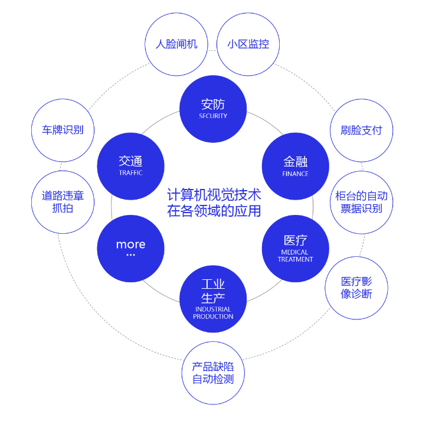
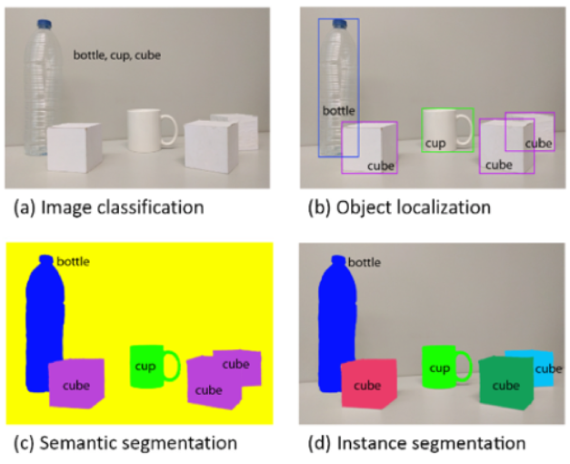
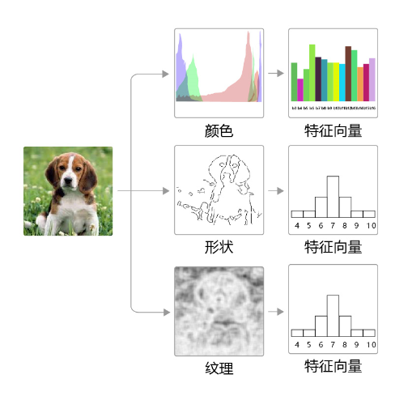
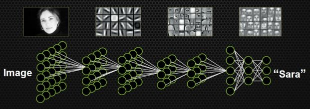
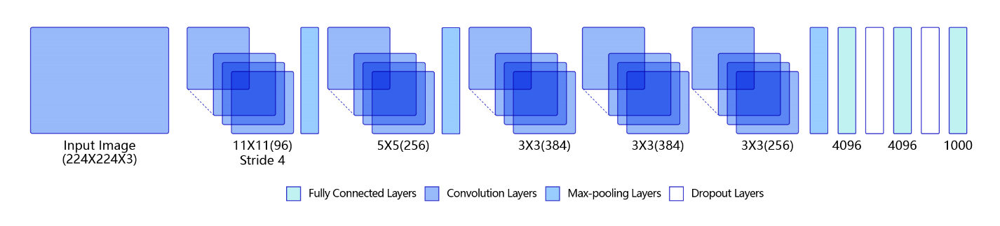

# 计算机视觉与卷积神经网络

## 计算机视觉综述

计算机视觉作为一门让机器学会如何去“看”的学科，具体的说，就是让机器去识别摄像机拍摄的图片或视频中的物体，检测出物体所在的位置，并对目标物体进行跟踪，从而理解并描述出图片或视频里的场景和故事，以此来模拟人脑视觉系统。因此，计算机视觉也通常被叫做机器视觉，其目的是建立能够从图像或者视频中“感知”信息的人工系统。

计算机视觉技术经过几十年的发展，已经在交通（车牌识别、道路违章抓拍）、安防（人脸闸机、小区监控）、金融（刷脸支付、柜台的自动票据识别）、医疗（医疗影像诊断）、工业生产（产品缺陷自动检测）等多个领域应用，影响或正在改变人们的日常生活和工业生产方式。未来，随着技术的不断演进，必将涌现出更多的产品和应用，为我们的生活创造更大的便利和更广阔的机会。

图1 计算机视觉技术在各领域的应用

## 计算机视觉的发展历程

计算机视觉的发展历程要从生物视觉讲起。对于生物视觉的起源，目前学术界尚没有形成定论。有研究者认为最早的生物视觉形成于距今约7亿年前的水母之中，也有研究者认为生物视觉产生于距今约5亿年前寒武纪。寒武纪生物大爆发的原因一直是个未解之谜，不过可以肯定的是在寒武纪动物具有了视觉能力，捕食者可以更容易地发现猎物，被捕食者也可以更早的发现天敌的位置。视觉系统的形成有力地推动了食物链的演化，加速了生物进化过程，是生物发展史上重要的里程碑。经过几亿年的演化，目前人类的视觉系统已经具备非常高的复杂度和强大的功能，人脑中神经元数目达到了1000亿个，这些神经元通过网络互相连接，这样庞大的视觉神经网络使得我们可以很轻松的观察周围的世界，如 **图2** 所示。

图2 人类视觉感知

对人类来说，识别猫和狗是件非常容易的事。但对计算机来说，即使是一个精通编程的高手，也很难轻松写出具有通用性的程序（比如：假设程序认为体型大的是狗，体型小的是猫，但由于拍摄角度不同，可能一张图片上猫占据的像素比狗还多）。那么，如何让计算机也能像人一样看懂周围的世界呢？研究者尝试着从不同的角度去解决这个问题，由此也发展出一系列的子任务，如 **图3** 所示。

图3 计算机视觉子任务示意图

- **(a) Image Classification：** 图像分类，用于识别图像中物体的类别（如：bottle、cup、cube）。

- **(b) Object Localization：** 目标检测，用于检测图像中每个物体的类别，并准确标出它们的位置。

- **(c) Semantic Segmentation：** 语义分割，用于标出图像中每个像素点所属的类别，属于同一类别的像素点用一个颜色标识。

- **(d) Instance Segmentation：** 实例分割，值得注意的是，目标检测任务只需要标注出物体位置，而实例分割任务不仅要标注出物体位置，还需要标注出物体的外形轮廓。

这里以图像分类任务为例，为大家介绍计算机视觉技术的发展历程。在早期的图像分类任务中，通常是先人工提取图像特征，再用机器学习算法对这些特征进行分类，分类的结果强依赖于特征提取方法，往往只有经验丰富的研究者才能完成，如 **图4** 所示。

图4 早期的图像分类任务

在这种背景下，基于神经网络的特征提取方法应运而生。Yann LeCun是最早将卷积神经网络应用到图像识别领域的，其主要逻辑是使用卷积神经网络提取图像特征，并对图像所属类别进行预测，通过训练数据不断调整网络参数，最终形成一套能自动提取图像特征并对这些特征进行分类的网络，如 **图5** 所示。

图5 早期的卷积神经网络处理图像任务示意

这一方法在手写数字识别任务上取得了极大的成功，但在接下来的时间里，却没有得到很好的发展。其主要原因一方面是**数据集不完善**，只能处理简单任务，在大尺寸的数据上容易发生过拟合；另一方面是**硬件瓶颈**，网络模型复杂时，计算速度会特别慢。

目前，随着互联网技术的不断进步，数据量呈现大规模的增长，越来越丰富的数据集不断涌现。另外，得益于硬件能力的提升，计算机的算力也越来越强大。不断有研究者将新的模型和算法应用到计算机视觉领域。由此催生了越来越丰富的模型结构和更加准确的精度，同时计算机视觉所处理的问题也越来越丰富，包括分类、检测、分割、场景描述、图像生成和风格变换等，甚至还不仅仅局限于2维图片，包括视频处理技术和3D视觉等。

## 卷积神经网络

卷积神经网络是目前计算机视觉中使用最普遍的模型结构。**图6** 是一个典型的卷积神经网络结构，多层卷积和池化层组合作用在输入图片上，在网络的最后通常会加入一系列全连接层，ReLU激活函数一般加在卷积或者全连接层的输出上，网络中通常还会加入Dropout来防止过拟合。

图6 卷积神经网络经典结构

- 卷积层：卷积层用于对输入的图像进行特征提取。卷积的计算范围是在像素点的空间邻域内进行的，因此可以利用输入图像的空间信息。卷积核本身与输入图片大小无关，它代表了对空间邻域内某种特征模式的提取。比如，有些卷积核提取物体边缘特征，有些卷积核提取物体拐角处的特征，图像上不同区域共享同一个卷积核。当输入图片大小不一样时，仍然可以使用同一个卷积核进行操作。

- 池化层：池化层通过对卷积层输出的特征图进行约减，实现了下采样。同时对感受域内的特征进行筛选，提取区域内最具代表性的特征，保留特征图中最主要的信息。

- 激活函数：激活函数给神经元引入了非线性因素，对输入信息进行非线性变换，从而使得神经网络可以任意逼近任何非线性函数，然后将变换后的输出信息作为输入信息传给下一层神经元。

- 全连接层：全连接层用于对卷积神经网络提取到的特征进行汇总，将多维的特征映射为二维的输出。其中，高维代表样本批次大小，低维代表分类或回归结果。

