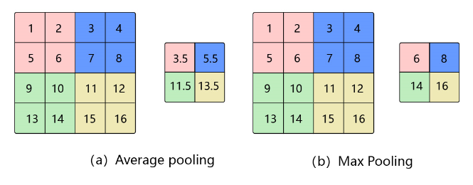
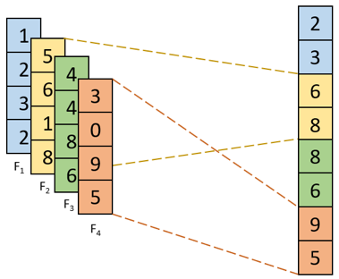
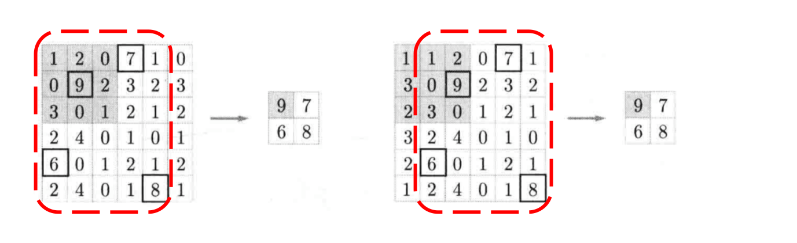

# 池化

## 1 基础概念

在图像处理中，由于图像中存在较多冗余信息，可用某一区域子块的统计信息（如最大值或均值等）来刻画该区域中所有像素点呈现的空间分布模式，以替代区域子块中所有像素点取值，这就是卷积神经网络中池化(pooling)操作。

池化操作对卷积结果特征图进行约减，实现了下采样，同时保留了特征图中主要信息。比如：当识别一张图像是否是人脸时，我们需要知道人脸左边有一只眼睛，右边也有一只眼睛，而不需要知道眼睛的精确位置，这时候通过池化某一片区域的像素点来得到总体统计特征会显得很有用。

池化的几种常见方法包括：平均池化、最大池化、K-max池化。其中平均池化和最大池化如 **图1** 所示，K-max池化如 **图2** 所示。



图1 平均池化和最大池化

- **平均池化：** 计算区域子块所包含所有像素点的均值，将均值作为平均池化结果。如 **图1(a)**，这里使用大小为$2\times2$的池化窗口，每次移动的步幅为2，对池化窗口覆盖区域内的像素取平均值，得到相应的输出特征图的像素值。池化窗口的大小也称为池化大小，用$k_h \times k_w$表示。在卷积神经网络中用的比较多的是窗口大小为$2 \times 2$，步幅为2的池化。

- **最大池化：** 从输入特征图的某个区域子块中选择值最大的像素点作为最大池化结果。如 **图1(b)**，对池化窗口覆盖区域内的像素取最大值，得到输出特征图的像素值。当池化窗口在图片上滑动时，会得到整张输出特征图。

  

图2 K-max池化

- **K-max池化：** 对输入特征图的区域子块中像素点取前K个最大值，常用于自然语言处理中的文本特征提取。如图2，从包含了4个取值的每一列中选取前2个最大值就得到了K最大池化结果。

## 2 特点

1. 当输入数据做出少量平移时，经过池化后的大多数输出还能保持不变，因此，池化**对微小的位置变化具有鲁棒性**。例如 **图3** 中，输入矩阵向右平移一个像素值，使用最大池化后，结果与平移前依旧能保持不变。

   

   图3 微小位置变化时的最大池化结果

2. 由于池化之后特征图会变小，如果后面连接的是全连接层，能有效的**减小神经元的个数，节省存储空间并提高计算效率**。

## 3 池化中填充的方式
在飞桨中，各种Pooling API中的Padding参数, 接收值类型都包括int、list、tuple和string。下面用代码和公式来介绍一下这些方式吧。

### 3.1 int输入
int输入即接收一个int类型的数字n，对图片的四周包裹n行n列的0来填充图片。如果要保持图片尺寸不变，n的值和池化窗口的大小是有关的。假如 $H_{in}, W_{in}$ 为图片输入的大小，$k_h, k_w$ 为池化窗口的大小，$H_{out}, H_{out}$ 为结果图的大小的话，他们之间有着这样的关系。
$$H_{out} = \frac{H_{in} + 2*p_h - k_h}{s_h} + 1 \\
  W_{out} = \frac{W_{out} + 2*p_w -k_w}{s_w} + 1
$$
在使用3×3的池化窗口且步长为1的情况下，还要保持图片大小不变，则需要使用padding=1的填充。
那么，公式就变为了
$$H_{out} = \frac{6 - 3 + 2*1}{1} + 1 \\
  W_{out} = \frac{6 - 3 + 2*1}{1} + 1
$$
另外，在stride不为1且不能被整除的情况下，整体结果向下取整。
关于Padding和K的公式如下
$$
Padding = \frac{(k-1)}{2} \quad \quad (k \% 2 != 0)
$$

关于上面的讲解，下面用飞桨的API来看看吧。

```python
import paddle # No padding
x = paddle.rand((1, 1, 6, 6))
avgpool = paddle.nn.AvgPool2D(kernel_size=3, stride=1, padding=0)
y = avgpool(x)
print('result:', 'shape of x:', x.shape, 'shape of result:', y.shape)

result: shape of x: [1, 1, 6, 6] shape of result: [1, 1, 4, 4]
```
这是池化中不padding，stride为1的结果，可以根据公式填入，$H_{out} = W_{out} = (6 + 0 - 3) + 1 = 4$，因此池化后的结果为4。如果填充呢？

```python
import paddle # Padding 1
x = paddle.rand((1, 1, 6, 6))
avgpool = paddle.nn.AvgPool2D(kernel_size=3, stride=1, padding=1)
y = avgpool(x)
print('result:', 'shape of x:', x.shape, 'shape of result:', y.shape)

result: shape of x: [1, 1, 6, 6] shape of result: [1, 1, 6, 6]
```
正如我们上面的公式，$H_{out} = W_{out} = (6 + 2 - 3) + 1 = 6$, 填充为1的时候图像保持为原大小。


### 3.2 list和tuple输入
因为图像有宽和高，所以list和tuple的长度应该为2，里面的两个值分别对应了高和宽，计算方式和上面int输入的一样，单独计算。一般用作输入图片宽高不一致，或者池化窗口大小不一的情况。我们直接用飞桨的API来看看吧。
```python
import paddle # No padding and different kernel size
x = paddle.rand((1, 1, 12, 6)) # 12为高H， 6为宽W
avgpool = paddle.nn.AvgPool2D(kernel_size=(3, 5), stride=1, padding=0)
y = avgpool(x)
print('result:', 'shape of x:', x.shape, 'shape of result:', y.shape)
result: shape of x: [1, 1, 12, 6] shape of result: [1, 1, 10, 2]
```
这里我们带入公式推理一下，$H_{out} = 12 - 3 + 1 = 10, W_{out} = 6 - 5 + 1 = 2$.与结果相符。下面是有填充的情况，且3的滑动窗口大小我们需要填充1，5的话则需要填充2了。下面来看看吧。
```python
import paddle # No padding and different kernel size
x = paddle.rand((1, 1, 12, 6)) # 12为高H， 6为宽W
avgpool = paddle.nn.AvgPool2D(kernel_size=(3, 5), stride=1, padding=(1, 2))
y = avgpool(x)
print('result:', 'shape of x:', x.shape, 'shape of result:', y.shape)
result: shape of x: [1, 1, 12, 6] shape of result: [1, 1, 12, 6]
```
这里的结果与我们的期望一致，大家试着带入公式算一下吧。


### 3.3 string输入
string输入有两个值，一个是SAME，一个是VALID。这两个的计算公式如下：

SAME:$H_{out} = \lceil \frac{H_{in}}{s_h} \rceil$, $W_{out} = \lceil\frac{W_{in}}{s_w}\rceil$

VALID:$H_{out} = \frac{H_{in} - k_h}{s_h} + 1$, $W_{out} = \frac{W_{in} - k_w}{s_w} + 1$

可以看到，VALID方式就是默认采用的不填充的方式，与上面不Padding的公式一样。而SAME则与池化窗口的大小无关，若$s_h$和$s_w$为1，无论池化窗口的大小，输出的特征图的大小都与原图保持一致。当任意一个大于1时，如果能整除，输出的尺寸就是整除的结果，如果不能整除，则通过padding的方式继续向上取整。理论过于难懂，我们直接用飞桨的API来看看吧。
```python
import paddle # Padding SAME kernel_size 2
x = paddle.rand((1, 1, 6, 6))
avgpool = paddle.nn.AvgPool2D(kernel_size=2, padding='SAME')
y = avgpool(x)
print('result:', 'shape of x:', x.shape, 'shape of result:', y.shape)
result: shape of x: [1, 1, 6, 6] shape of result: [1, 1, 3, 3]
 ```
  代码的结果出来了，我们来直接带入公式来计算吧，$H_{out} = 6/2 = 3, W_{out} = 6/2 = 3$,结果一致。

 ```python
import paddle # Padding SAME kernel_size 1
x = paddle.rand((1, 1, 6, 6))
avgpool = paddle.nn.AvgPool2D(kernel_size=1, padding='SAME')
y = avgpool(x)
print('result:', 'shape of x:', x.shape, 'shape of result:', y.shape)
result: shape of x: [1, 1, 6, 6] shape of result: [1, 1, 6, 6]
 ```
 这个呢，就和我们上面说的一致。下面来看看VALID填充方式吧。
```python 
import paddle # Padding VALID
x = paddle.rand((1, 1, 6, 6))
avgpool = paddle.nn.AvgPool2D(kernel_size=2, padding='VALID')
y = avgpool(x)
print('result:', 'shape of x:', x.shape, 'shape of result:', y.shape)
result: shape of x: [1, 1, 6, 6] shape of result: [1, 1, 3, 3]
```
这就是VALID的填充方式的结果啦。大家自己按照公式算算，看看你的答案和程序输出的对不对哦。


## 4 应用示例

与卷积核类似，池化窗口在图片上滑动时，每次移动的步长称为步幅，当宽和高方向的移动大小不一样时，分别用$s_w$和$s_h$表示。也可以对需要进行池化的图片进行填充，填充方式与卷积类似，假设在第一行之前填充$p_{h1}$行，在最后一行后面填充$p_{h2}$行。在第一列之前填充$p_{w1}$列，在最后一列之后填充$p_{w2}$列，则池化层的输出特征图大小为：

$$H_{out} = \frac{H + p_{h1} + p_{h2} - k_h}{s_h} + 1$$

$$W_{out} = \frac{W + p_{w1} + p_{w2} - k_w}{s_w} + 1$$

在卷积神经网络中，通常使用$2\times2$大小的池化窗口，步幅也使用2，填充为0，则输出特征图的尺寸为：

$$H_{out} = \frac{H}{2}$$

$$W_{out} = \frac{W}{2}$$

通过这种方式的池化，输出特征图的高和宽都减半，但通道数不会改变。

这里以 **图1** 中的2个池化运算为例，此时，输入大小是$4 \times 4$ ，使用大小为$2 \times 2$ 的池化窗口进行运算，步幅为2。此时，输出尺寸的计算方式为：

$$H_{out} = \frac{H + p_{h1} + p_{h2} - k_h}{s_h} + 1=\frac{4 + 0 + 0 - 2}{2} + 1=\frac{4}{2}=2$$

$$W_{out} = \frac{W + p_{w1} + p_{w2} - k_w}{s_w} + 1=\frac{4 + 0 + 0 - 2}{2} + 1=\frac{4}{2}=2$$

**图1(a)** 中，使用平均池化进行运算，则输出中的每一个像素均为池化窗口对应的 $2 \times 2$ 区域求均值得到。计算步骤如下：

1. 池化窗口的初始位置为左上角，对应粉色区域，此时输出为 $3.5 = \frac{1 + 2 + 5 + 6}{4}$ ；
2. 由于步幅为2，所以池化窗口向右移动两个像素，对应蓝色区域，此时输出为 $5.5 = \frac{3 + 4 + 7 + 8}{4}$ ；
3. 遍历完第一行后，再从第三行开始遍历，对应绿色区域，此时输出为 $11.5 = \frac{9 + 10 + 13 + 14}{4}$ ；
4. 池化窗口向右移动两个像素，对应黄色区域，此时输出为 $13.5 = \frac{11 + 12 + 15 + 16}{4}$ 。

**图1(b)** 中，使用最大池化进行运算，将上述过程的求均值改为求最大值即为最终结果。
