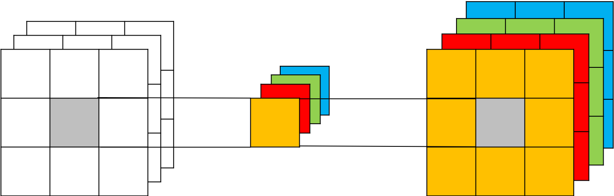
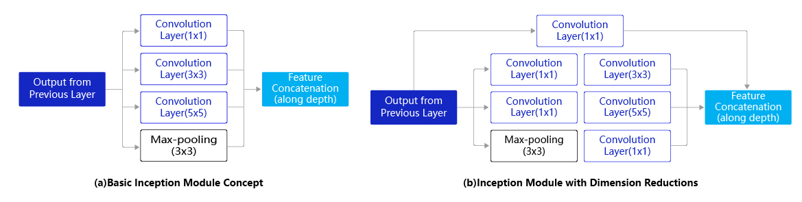
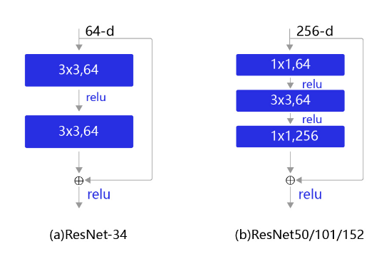

#  $1\times{1}$ 卷积（$1\times{1}$ Convolution）

## 一、1*1 卷积

$1\times{1}$ 卷积，与标准卷积完全一样，唯一的特殊点在于卷积核的尺寸是$1\times{1}$ ，也就是不去考虑输入数据局部信息之间的关系，而把关注点放在不同通道间。当输入矩阵的尺寸为$3\times{3}$ ，通道数也为3时，使用4个$1\times{1}$卷积核进行卷积计算，最终就会得到与输入矩阵尺寸相同，通道数为4的输出矩阵，如 **图1** 所示。



图1 1*1 卷积结构示意图

- **$1\times{1}$ 卷积的作用**

1. 实现信息的跨通道交互与整合。考虑到卷积运算的输入输出都是3个维度（宽、高、多通道），所以$1\times{1}$ 卷积实际上就是对每个像素点，在不同的通道上进行线性组合，从而整合不同通道的信息。
2. 对卷积核通道数进行降维和升维，减少参数量。经过$1\times{1}$ 卷积后的输出保留了输入数据的原有平面结构，通过调控通道数，从而完成升维或降维的作用。
3. 利用$1\times{1}$ 卷积后的非线性激活函数，在保持特征图尺寸不变的前提下，大幅增加非线性

## 二、应用示例

- **$1\times{1}$ 卷积在GoogLeNet<sup>[1]</sup>中的应用**

GoogLeNet是2014年ImageNet比赛的冠军，它的主要特点是网络不仅有深度，还在横向上具有“宽度”。由于图像信息在空间尺寸上的巨大差异，如何选择合适的卷积核来提取特征就显得比较困难了。空间分布范围更广的图像信息适合用较大的卷积核来提取其特征；而空间分布范围较小的图像信息则适合用较小的卷积核来提取其特征。为了解决这个问题，GoogLeNet提出了一种被称为Inception模块的方案。如 **图2** 所示：



图2 Inception模块结构示意图

Inception模块的设计思想采用多通路(multi-path)的设计形式，每个支路使用不同大小的卷积核，最终输出特征图的通道数是每个支路输出通道数的总和。如 **图2(a)** 所示，Inception模块使用3个不同大小的卷积核对输入图片进行卷积操作，并附加最大池化，将这4个操作的输出沿着通道维度进行拼接，构成的输出特征图将会包含经过不同大小的卷积核提取出来的特征，从而达到捕捉不同尺度信息的效果。然而，这将会导致输出通道数变得很大，尤其是将多个Inception模块串联操作的时候，模型参数量会变得非常大。

为了减小参数量，Inception模块改进了设计方式。如 **图2(b)** 所示，在$3\times{3}$ 和$5\times{5}$ 的卷积层之前均增加$1\times{1}$ 的卷积层来控制输出通道数；在最大池化层后面增加$1\times{1}$ 卷积层减小输出通道数。下面这段程序是Inception块的具体实现方式，可以对照 **图2(b)** 和代码一起阅读。

我们这里可以简单计算一下Inception模块中使用$1\times{1}$ 卷积前后参数量的变化，这里以 **图2(a)** 为例，输入通道数 $C_{in}=192$，$1\times{1}$ 卷积的输出通道数$C_{out1}=64$，$3\times{3}$ 卷积的输出通道数$C_{out2}=128$，$5\times{5}$ 卷积的输出通道数$C_{out3}=32$，则 **图2(a)** 中的结构所需的参数量为：


$$
1\times1\times192\times64+3\times3\times192\times128+5\times5\times192\times32=387072
$$
**图2(b)** 中在$3\times{3}$ 卷积前增加了通道数$C_{out4}=96$ 的 $1\times{1}$ 卷积，在$5\times{5}$ 卷积前增加了通道数$C_{out5}=16$ 的 $1\times{1}$ 卷积，同时在maxpooling后增加了通道数$C_{out6}=32$ 的 $1\times{1}$ 卷积，参数量变为：

$$
\begin{eqnarray}\small{
1\times1\times192\times64+1\times1\times192\times96+1\times1\times192\times16+3\times3\times96\times128+5\times5\times16\times32 \\
+1\times1\times192\times32 =163328}
\end{eqnarray}
$$
可见，$1\times{1}$ 卷积可以在不改变模型表达能力的前提下，大大减少所使用的参数量。

Inception模块的具体实现如下代码所示：


```python
# GoogLeNet模型代码
import numpy as np
import paddle
from paddle.nn import Conv2D, MaxPool2D, AdaptiveAvgPool2D, Linear
## 组网
import paddle.nn.functional as F

# 定义Inception块
class Inception(paddle.nn.Layer):
    def __init__(self, c0, c1, c2, c3, c4, **kwargs):
        '''
        Inception模块的实现代码，
        
        c1,图(b)中第一条支路1x1卷积的输出通道数，数据类型是整数
        c2,图(b)中第二条支路卷积的输出通道数，数据类型是tuple或list, 
               其中c2[0]是1x1卷积的输出通道数，c2[1]是3x3
        c3,图(b)中第三条支路卷积的输出通道数，数据类型是tuple或list, 
               其中c3[0]是1x1卷积的输出通道数，c3[1]是3x3
        c4,图(b)中第一条支路1x1卷积的输出通道数，数据类型是整数
        '''
        super(Inception, self).__init__()
        # 依次创建Inception块每条支路上使用到的操作
        self.p1_1 = Conv2D(in_channels=c0,out_channels=c1, kernel_size=1)
        self.p2_1 = Conv2D(in_channels=c0,out_channels=c2[0], kernel_size=1)
        self.p2_2 = Conv2D(in_channels=c2[0],out_channels=c2[1], kernel_size=3, padding=1)
        self.p3_1 = Conv2D(in_channels=c0,out_channels=c3[0], kernel_size=1)
        self.p3_2 = Conv2D(in_channels=c3[0],out_channels=c3[1], kernel_size=5, padding=2)
        self.p4_1 = MaxPool2D(kernel_size=3, stride=1, padding=1)
        self.p4_2 = Conv2D(in_channels=c0,out_channels=c4, kernel_size=1)

    def forward(self, x):
        # 支路1只包含一个1x1卷积
        p1 = F.relu(self.p1_1(x))
        # 支路2包含 1x1卷积 + 3x3卷积
        p2 = F.relu(self.p2_2(F.relu(self.p2_1(x))))
        # 支路3包含 1x1卷积 + 5x5卷积
        p3 = F.relu(self.p3_2(F.relu(self.p3_1(x))))
        # 支路4包含 最大池化和1x1卷积
        p4 = F.relu(self.p4_2(self.p4_1(x)))
        # 将每个支路的输出特征图拼接在一起作为最终的输出结果
        return paddle.concat([p1, p2, p3, p4], axis=1)
```

-  **$1\times{1}$ 卷积在ResNet<sup>[2]</sup>中的应用**

随着深度学习的不断发展，模型的层数越来越多，网络结构也越来越复杂。但是增加网络的层数之后，训练误差往往不降反升。由此，Kaiming He等人提出了残差网络ResNet来解决上述问题。ResNet是2015年ImageNet比赛的冠军，将识别错误率降低到了3.6%，这个结果甚至超出了正常人眼识别的精度。在ResNet中，提出了一个非常经典的结构—残差块（Residual block）。

残差块是ResNet的基础，具体设计方案如 **图3** 所示。不同规模的残差网络中使用的残差块也并不相同，对于小规模的网络，残差块如 **图3(a)** 所示。但是对于稍大的模型，使用 **图3(a)** 的结构会导致参数量非常大，因此从ResNet50以后，都是使用 **图3(b)** 的结构。**图3(b)** 中的这种设计方案也常称作瓶颈结构（BottleNeck）。1\*1的卷积核可以非常方便的调整中间层的通道数，在进入3\*3的卷积层之前减少通道数（256->64），经过该卷积层后再恢复通道数(64->256)，可以显著减少网络的参数量。这个结构（256->64->256）像一个中间细，两头粗的瓶颈，所以被称为“BottleNeck”。

我们这里可以简单计算一下残差块中使用$1\times{1}$ 卷积前后参数量的变化，为了保持统一，我们令图3中的两个结构的输入输出通道数均为256，则图3(a)中的结构所需的参数量为：


$$
3\times3\times256\times256\times2=1179648
$$
而图3(b)中采用了$1\times{1}$ 卷积后，参数量为：


$$
1\times1\times256\times64+3\times3\times64\times64+1\times1\times64\times256=69632
$$
同样，$1\times{1}$ 卷积可以在不改变模型表达能力的前提下，大大减少所使用的参数量。



图3 残差块结构示意图

残差块的具体实现如下代码所示：

```python
# ResNet模型代码
import numpy as np
import paddle
import paddle.nn as nn
import paddle.nn.functional as F

# ResNet中使用了BatchNorm层，在卷积层的后面加上BatchNorm以提升数值稳定性
# 定义卷积批归一化块
class ConvBNLayer(paddle.nn.Layer):
    def __init__(self,
                 num_channels,
                 num_filters,
                 filter_size,
                 stride=1,
                 groups=1,
                 act=None):
       
        """
        num_channels, 卷积层的输入通道数
        num_filters, 卷积层的输出通道数
        stride, 卷积层的步幅
        groups, 分组卷积的组数，默认groups=1不使用分组卷积
        """
        super(ConvBNLayer, self).__init__()

        # 创建卷积层
        self._conv = nn.Conv2D(
            in_channels=num_channels,
            out_channels=num_filters,
            kernel_size=filter_size,
            stride=stride,
            padding=(filter_size - 1) // 2,
            groups=groups,
            bias_attr=False)

        # 创建BatchNorm层
        self._batch_norm = paddle.nn.BatchNorm2D(num_filters)
        
        self.act = act

    def forward(self, inputs):
        y = self._conv(inputs)
        y = self._batch_norm(y)
        if self.act == 'leaky':
            y = F.leaky_relu(x=y, negative_slope=0.1)
        elif self.act == 'relu':
            y = F.relu(x=y)
        return y

# 定义残差块
# 每个残差块会对输入图片做三次卷积，然后跟输入图片进行短接
# 如果残差块中第三次卷积输出特征图的形状与输入不一致，则对输入图片做1x1卷积，将其输出形状调整成一致
class BottleneckBlock(paddle.nn.Layer):
    def __init__(self,
                 num_channels,
                 num_filters,
                 stride,
                 shortcut=True):
        super(BottleneckBlock, self).__init__()
        # 创建第一个卷积层 1x1
        self.conv0 = ConvBNLayer(
            num_channels=num_channels,
            num_filters=num_filters,
            filter_size=1,
            act='relu')
        # 创建第二个卷积层 3x3
        self.conv1 = ConvBNLayer(
            num_channels=num_filters,
            num_filters=num_filters,
            filter_size=3,
            stride=stride,
            act='relu')
        # 创建第三个卷积 1x1，但输出通道数乘以4
        self.conv2 = ConvBNLayer(
            num_channels=num_filters,
            num_filters=num_filters * 4,
            filter_size=1,
            act=None)

        # 如果conv2的输出跟此残差块的输入数据形状一致，则shortcut=True
        # 否则shortcut = False，添加1个1x1的卷积作用在输入数据上，使其形状变成跟conv2一致
        if not shortcut:
            self.short = ConvBNLayer(
                num_channels=num_channels,
                num_filters=num_filters * 4,
                filter_size=1,
                stride=stride)

        self.shortcut = shortcut

        self._num_channels_out = num_filters * 4

    def forward(self, inputs):
        y = self.conv0(inputs)
        conv1 = self.conv1(y)
        conv2 = self.conv2(conv1)

        # 如果shortcut=True，直接将inputs跟conv2的输出相加
        # 否则需要对inputs进行一次卷积，将形状调整成跟conv2输出一致
        if self.shortcut:
            short = inputs
        else:
            short = self.short(inputs)

        y = paddle.add(x=short, y=conv2)
        y = F.relu(y)
        return y
```

## 参考文献

[1] [Going deeper with convolutions](https://arxiv.org/pdf/1409.4842.pdf)

[2] [Deep Residual Learning for Image Recognition](https://arxiv.org/pdf/1512.03385.pdf)

