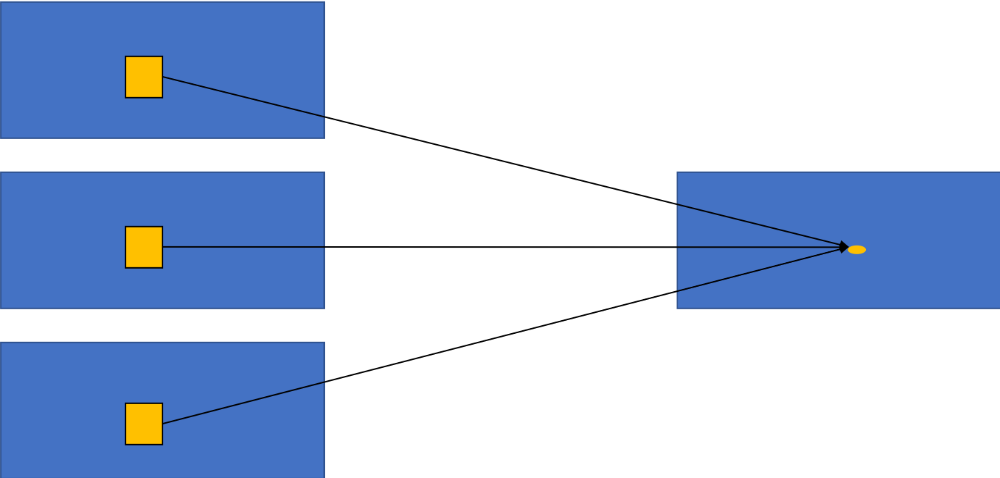
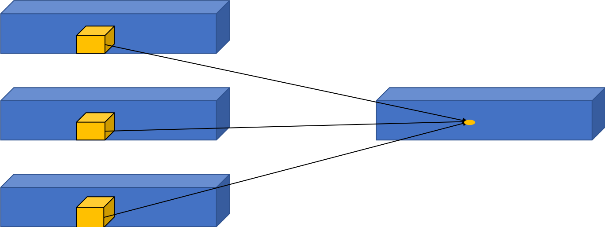
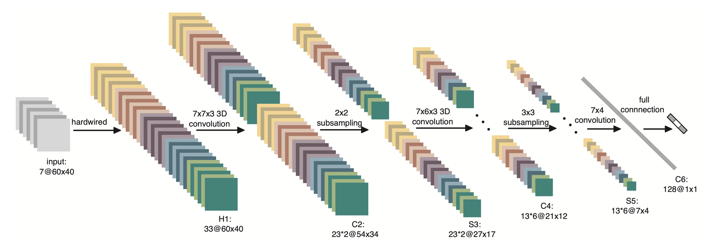
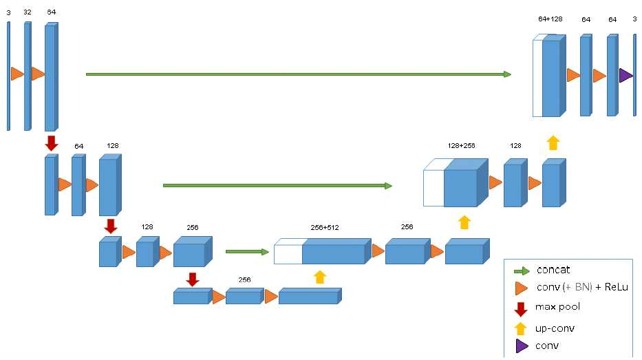

# 3D卷积（3D Convolution）

## 一、3D卷积

标准卷积是一种2D卷积，计算方式如 **图1** 所示。在2D卷积中，卷积核在图片上沿着宽和高两个维度滑动，在每次滑动过程时，对应位置的图像元素与卷积核中的参数进行乘加计算，得到输出特征图中的一个值。

图1 2D卷积示意图

2D卷积仅仅考虑2D图片的空间信息，所以只适用于单张2D图片的视觉理解任务。在处理3D图像或视频时，网络的输入多了一个维度，输入由$(c,height,width)$ 变为了$(c,depth,height,width)$ ，其中$c$ 是通道数，$depth$为输入数据的宽度。因此，对该数据进行处理时，就需要卷积也作出相应的变换，由2D卷积变为3D卷积。

在2D卷积的基础上，3D卷积[1]被提出。3D卷积在结构上较2D卷积多了一个维度，2D卷积的尺寸可以表示为$k_h\times{k_w}$ ，而3D卷积的尺寸可以表示为$k_h\times{k_w}\times{k_d}$ 。3D卷积的具体的计算方式与2D卷积类似，即每次滑动时与$c$ 个通道、尺寸大小为$(depth,height,width)$ 的图像做乘加运算，从而得到输出特征图中的一个值，如 **图2** 所示。

图2 3D卷积示意图

## 二、应用示例

3D卷积的主要应用就是视频理解和医疗图像领域。

在**视频理解任务**中，$k_d$ 就代表了时间维度，也就是每个3D卷积核处理的连续帧数。在视频理解领域的3D卷积计算中，首先会将$k_d$ 个连续帧组成一个3D的图像序列，然后在图像序列中进行卷积计算。3D卷积核会在$k_d$ 个连续帧上进行滑动，每次滑动$k_d$ 个连续帧中对应位置内的元素都要与卷积核中的参数进行乘加计算，最后得到输出特征图中的一个值。

3D CNN中，使用了3D卷积对人体行为进行识别，网络结构如 **图3** 所示。网络只有3个卷积层、1个全连接层以及2个池化层。其中，前两个卷积层为3D卷积层，卷积核大小为$7\times{7}\times{3}$ 和$7\times{6}\times{3}$ ，也就是说每个卷积核处理3个连续帧中$7\times{7}$ 和$7\times{6}$ 大小的区域。

图3 3D CNN网络结构

由于该模型使用了3D卷积，使得其可以从空间和时间的维度提取特征，从而捕捉从多个连续帧中得到的运动信息。

在**医疗图像领域**中，医学数据通常是3D的，比如我们要分割出的肿瘤就是3D的。如果用2D的图像处理模型去处理3D物体也是可以的，但是需要将生物医学影像图片的每一个切片成组的（包含训练数据和标注好的数据）的喂给模型进行训练，在这种情况下会存在一个效率问题，因此我们使用的模型即将U-Net中2D卷积改为3D的形式，即3D U-Net[2]，如 **图4** 所示。

图4 3D U-Net网络结构

该模型的网络结构跟2D结构的U-Net基本一样，唯一不同就是将2D卷积操作换成了3D卷积，因此，不需要单独输入每个切片进行训练，而是可以采取输入整张图片到模型中。

## 参考文献

[1] [3D Convolutional Neural Networks for Human Action Recognition](http://users.eecs.northwestern.edu/~mya671/mypapers/ICML10_Ji_Xu_Yang_Yu.pdf)

[2] [3D U-Net: Learning Dense Volumetric Segmentation from Sparse Annotation](https://arxiv.org/abs/1606.06650)

