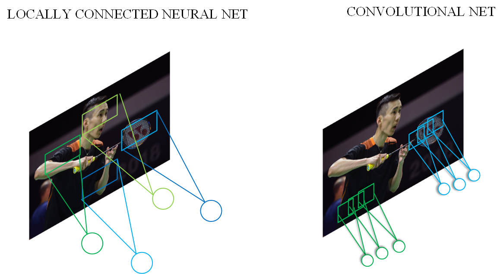

# 卷积（Convolution）

## 一、卷积提出背景

在全连接网络<sup>[1]</sup>中，一张图片上的所有像素点会被展开成一个1维向量输入网络，如 **图1** 所示，28 x 28的输入数据被展开成为784 x 1 的数据作为输入。


图1 全连接网络图

这样往往会存在如下两个问题：

**1. 输入数据的空间信息被丢失。** 空间上相邻的像素点往往具有相似的RGB值，RGB的各个通道之间的数据通常密切相关，但是转化成1维向量时，这些信息被丢失。如 **图2** 所示，空间位置相邻的两个点A和B，转化成1维向量后并没有体现出他们之间的空间关联性。


图2 图片转换为1维向量

**2. 模型参数过多，容易发生过拟合。** 由于每个像素点都要跟所有输出的神经元相连接。当图片尺寸变大时，输入神经元的个数会按图片尺寸的平方增大，导致模型参数过多，容易发生过拟合。例如：对于一幅$1000\times 1000$ 的输入图像而言，如果下一个隐含层的神经元数目为$10^6$ 个，那么将会有$1000\times 1000\times 10^6=10^{12}$ 个权重参数，可以想象，如此大规模的参数量使得网络很难训练。

为了解决上述问题，引入卷积（Convolution）来对输入的图像进行特征提取。卷积的计算范围是在像素点的空间邻域内进行的，因此可以利用输入图像的空间信息；此外，由于卷积具有局部连接、权重共享等特性，卷积核参数的数目也远小于全连接层。

## 二、卷积核 / 特征图 / 卷积计算 

**卷积核（kernel）**：也被叫做滤波器（filter），假设卷积核的高和宽分别为$k_h$和$k_w$，则将称为$k_h\times k_w$卷积，比如$3\times5$卷积，就是指卷积核的高为3, 宽为5。卷积核中数值为对图像中与卷积核同样大小的子块像素点进行卷积计算时所采用的权重。

**卷积计算（convolution）**：图像中像素点具有很强的空间依赖性，卷积（convolution）就是针对像素点的空间依赖性来对图像进行处理的一种技术。

**特征图（feature map）**：卷积滤波结果在卷积神经网络中被称为特征图（feature map）。


### 应用示例

在卷积神经网络中，卷积层的实现方式实际上是数学中定义的互相关 （cross-correlation）运算，具体的计算过程如 **图3** 所示，每张图的左图表示输入数据是一个维度为3 x 3的二维数组；中间的图表示卷积核是一个维度为2 x 2的二维数组。


图3 卷积计算过程


- 如图3（a）所示：左边的图大小是$3\times3$，表示输入数据是一个维度为$3\times3$的二维数组；中间的图大小是$2\times2$，表示一个维度为$2\times2$的二维数组，我们将这个二维数组称为卷积核。先将卷积核的左上角与输入数据的左上角（即：输入数据的(0, 0)位置）对齐，把卷积核的每个元素跟其位置对应的输入数据中的元素相乘，再把所有乘积相加，得到卷积输出的第一个结果：

$$0\times1 + 1\times2 + 2\times4 + 3\times5 = 25  \ \ \ \ \ \ \ (a)$$

- 如图3（b）所示：将卷积核向右滑动，让卷积核左上角与输入数据中的(0,1)位置对齐，同样将卷积核的每个元素跟其位置对应的输入数据中的元素相乘，再把这4个乘积相加，得到卷积输出的第二个结果：

$$0\times2 + 1\times3 + 2\times5 + 3\times6 = 31  \ \ \ \ \ \ \ (b)$$

- 如图3（c）所示：将卷积核向下滑动，让卷积核左上角与输入数据中的(1, 0)位置对齐，可以计算得到卷积输出的第三个结果：

$$0\times4 + 1\times5 + 2\times7 + 3\times8 = 43   \ \ \ \ \ \ \ (c)$$

- 如图3（d）所示：将卷积核向右滑动，让卷积核左上角与输入数据中的(1, 1)位置对齐，可以计算得到卷积输出的第四个结果：

$$0\times5 + 1\times6 + 2\times8 + 3\times9 = 49   \ \ \ \ \ \ \ (d)$$

最终可以得到图3（d）右侧所示的特征图。


卷积核的计算过程可以用下面的数学公式表示，其中 $a$ 代表输入图片， $b$ 代表输出特征图，$w$ 是卷积核参数，它们都是二维数组，$\sum{u,v}{\ }$ 表示对卷积核参数进行遍历并求和。

$$b[i, j] = \sum_{u,v}{a[i+u, j+v]\cdot w[u, v]}$$

举例说明，假如上图中卷积核大小是$2\times 2$，则$u$可以取0和1，$v$也可以取0和1，也就是说：

$$b[i, j] = a[i+0, j+0]\cdot w[0, 0] + a[i+0, j+1]\cdot w[0, 1] + a[i+1, j+0]\cdot w[1, 0] + a[i+1, j+1]\cdot w[1, 1]$$

读者可以自行验证，当$[i, j]$取不同值时，根据此公式计算的结果与上图中的例子是否一致。


------
**思考：**

为了能够更好地拟合数据，在卷积神经网络中，一个卷积算子除了上面描述的卷积过程之外，还包括加上偏置项的操作。例如假设偏置为1，则上面卷积计算的结果为：

$$0\times1 + 1\times2 + 2\times4 + 3\times5 \mathbf{\  + 1}  = 26$$
$$0\times2 + 1\times3 + 2\times5 + 3\times6 \mathbf{\  + 1} = 32$$
$$0\times4 + 1\times5 + 2\times7 + 3\times8 \mathbf{\  + 1} = 44$$
$$0\times5 + 1\times6 + 2\times8 + 3\times9 \mathbf{\  + 1} = 50$$

------

**说明：**

1. 输入图像的边缘像素因其处于边缘位置，因此无法参与卷积计算；
2. 图像卷积计算实质上是对图像进行了下采样 (down sampling)操作。对卷积得到的图像结果不断卷积滤波，则原始图像就会被“层层抽象、层层约减”，从而使得蕴涵在图像中的重要信息“显山露水”；
3. 卷积核中的权重系数$w_i$是通过数据驱动机制学习得到，其用来捕获图像中某像素点及其邻域像素点所构成的特有空间模式。一旦从数据中学习得到权重系数，这些权重系数就刻画了图像中像素点构成的空间分布不同模式。

##  三、填充（Padding）

输入图像边缘位置的像素点无法进行卷积滤波，为了使边缘像素也参与卷积滤波，填充技术应运而生。填充是指在边缘像素点周围填充“0”（即0填充），使得输入图像的边缘像素也可以参与卷积计算。注意，在这种填充机制下，卷积后的图像分辨率将与卷积前图像分辨率一致，不存在下采样。

### 应用示例

在上面的例子中，输入图片尺寸为$3\times3$，输出图片尺寸为$2\times2$，经过一次卷积之后，图片尺寸变小。卷积输出特征图的尺寸计算方法如下（卷积核的高和宽分别为$k_h$和$k_w$）：

$$H_{out} = H - k_h + 1$$
$$W_{out} = W - k_w + 1$$

如果输入尺寸为4，卷积核大小为3时，输出尺寸为$4-3+1=2$。读者可以自行检查当输入图片和卷积核为其他尺寸时，上述计算式是否成立。当卷积核尺寸大于1时，输出特征图的尺寸会小于输入图片尺寸。如果经过多次卷积，输出图片尺寸会不断减小。为了避免卷积之后图片尺寸变小，通常会在图片的外围进行填充(padding)，如 **图4** 所示。


图4 图形填充

- 如图4（a）所示：填充的大小为1，填充值为0。填充之后，输入图片尺寸从$4\times4$变成了$6\times6$，使用$3\times3$的卷积核，输出图片尺寸为$4\times4$。

- 如图4（b）所示：填充的大小为2，填充值为0。填充之后，输入图片尺寸从$4\times4$变成了$8\times8$，使用$3\times3$的卷积核，输出图片尺寸为$6\times6$。

如果在输入图片第一行之前填充$p_{h1}$行，在最后一行之后填充$p_{h2}$行；在图片第1列之前填充$p_{w1}$列，在最后1列之后填充$p_{w2}$列；则填充之后的图片尺寸为$(H + p_{h1} + p_{h2})\times(W + p_{w1} + p_{w2})$。经过大小为$k_h\times k_w$的卷积核操作之后，输出图片的尺寸为：

$$H_{out} = H + p_{h1} + p_{h2} - k_h + 1$$

$$W_{out} = W + p_{w1} + p_{w2} - k_w + 1$$

在卷积计算过程中，通常会在高度或者宽度的两侧采取等量填充，即$p_{h1} = p_{h2} = p_h,\ \ p_{w1} = p_{w2} = p_w$，上面计算公式也就变为：

$$H_{out} = H + 2p_h - k_h + 1$$

$$W_{out} = W + 2p_w - k_w + 1$$
为了便于padding，卷积核大小通常使用1，3，5，7这样的奇数，这样如果使用的填充大小为$p_h=(k_h-1)/2 ，p_w=(k_w-1)/2$，则可以使得卷积之后图像尺寸不变。例如当卷积核大小为3时，padding大小为1，卷积之后图像尺寸不变；同理，如果卷积核大小为5，padding大小为2，也能保持图像尺寸不变。

## 四、步长（Stride）

在卷积操作时，通常希望输出图像分辨率与输入图像分辨率相比会逐渐减少，即图像被约减。因此，可以通过改变卷积核在输入图像中移动步长大小来跳过一些像素，进行卷积滤波。当Stride=1时，卷积核滑动跳过1个像素，这是最基本的单步滑动，也是标准的卷积模式。Stride=k表示卷积核移动跳过的步长是k。

### 应用示例

**图3** 中卷积核每次滑动一个像素点，这是步长为1的情况。**图5** 是步长为2的卷积过程，卷积核在图片上移动时，每次移动大小为2个像素点。


图5 步幅为2的卷积过程

当高和宽方向的步幅分别为$s_h$和$s_w$时，输出特征图尺寸的计算公式是：

$$H_{out} = \frac{H + 2p_h - k_h}{s_h} + 1$$

$$W_{out} = \frac{W + 2p_w - k_w}{s_w} + 1$$

---

**思考：**

假设输入图片尺寸是$H\times W = 100 \times 100$，卷积核大小$k_h \times k_w = 3 \times 3$，填充$p_h = p_w = 1$，步长为$s_h = s_w = 2$，则输出特征图的尺寸为：

$$H_{out} = \frac{100 + 2 - 3}{2} + 1 = 50$$

$$W_{out} = \frac{100 + 2 - 3}{2} + 1 = 50$$

---

## 五、感受野（Receptive Field）

卷积所得结果中，每个特征图像素点取值依赖于输入图像中的某个区域，该区域被称为感受野（receptive field），正所谓“管中窥豹、见微知著”。那么这个区域在哪呢，在卷积神经网络中，感受野是特征图（feature map）上的点对应输入图像上的区域。感受野内每个元素数值的变动，都会影响输出点的数值变化。

### 应用示例

比如$3\times3$卷积对应的感受野大小就是$3\times3$，如 **图6** 所示。


图6 感受野为3×3的卷积

而当通过两层$3\times3$的卷积之后，感受野的大小将会增加到$5\times5$，如 **图7** 所示。


图7 感受野为5×5的卷积

因此，当增加卷积网络深度的同时，感受野将会增大，输出特征图中的一个像素点将会包含更多的图像语义信息。

## 六、多输入通道、多输出通道和批量操作

前面介绍的卷积计算过程比较简单，实际应用时，处理的问题要复杂的多。例如：对于彩色图片有RGB三个通道，需要处理多输入通道的场景，相应的输出特征图往往也会具有多个通道。而且在神经网络的计算中常常是把一个批次的样本放在一起计算，所以卷积算子需要具有批量处理多输入和多输出通道数据的功能。

### 多输入通道场景

当输入含有多个通道时，对应的卷积核也应该有相同的通道数。假设输入图片的通道数为$C_{in}$，输入数据的形状是$C_{in}\times{H_{in}}\times{W_{in}}$。

1. 对每个通道分别设计一个2维数组作为卷积核，卷积核数组的形状是$C_{in}\times{k_h}\times{k_w}$。
1. 对任一通道$C_{in} \in [0, C_{in})$，分别用大小为$k_h\times{k_w}$的卷积核在大小为$H_{in}\times{W_{in}}$的二维数组上做卷积。
1. 将这$C_{in}$个通道的计算结果相加，得到的是一个形状为$H_{out}\times{W_{out}}$的二维数组。

### 应用示例

上面的例子中，卷积层的数据是一个2维数组，但实际上一张图片往往含有RGB三个通道，要计算卷积的输出结果，卷积核的形式也会发生变化。假设输入图片的通道数为$3$，输入数据的形状是$3\times{H_{in}}\times{W_{in}}$，计算过程如 **图8** 所示。

1. 对每个通道分别设计一个2维数组作为卷积核，卷积核数组的形状是$3\times{k_h}\times{k_w}$。
1. 对任一通道$c_{in} \in [0, 3)$，分别用大小为$k_h\times{k_w}$的卷积核在大小为$H_{in}\times{W_{in}}$的二维数组上做卷积。
1. 将这$3$个通道的计算结果相加，得到的是一个形状为$H_{out}\times{W_{out}}$的二维数组。


图8 多输入通道计算过程

### 多输出通道场景

如果我们希望检测多种类型的特征，实际上我们可以使用多个卷积核进行计算。所以一般来说，卷积操作的输出特征图也会具有多个通道$C_{out}$，这时我们需要设计$C_{out}$个维度为$C_{in}\times{k_h}\times{k_w}$的卷积核，卷积核数组的维度是$C_{out}\times C_{in}\times{k_h}\times{k_w}$。

1. 对任一输出通道$c_{out} \in [0, C_{out})$，分别使用上面描述的形状为$C_{in}\times{k_h}\times{k_w}$的卷积核对输入图片做卷积。
1. 将这$C_{out}$个形状为$H_{out}\times{W_{out}}$的二维数组拼接在一起，形成维度为$C_{out}\times{H_{out}}\times{W_{out}}$的三维数组。

### 应用示例

假设输入图片的通道数为3，我们希望检测2种类型的特征，这时我们需要设计$2$个维度为$3\times{k_h}\times{k_w}$的卷积核，卷积核数组的维度是$2\times 3\times{k_h}\times{k_w}$，如 **图9** 所示。

1. 对任一输出通道$c_{out} \in [0, 2)$，分别使用上面描述的形状为$3\times{k_h}\times{k_w}$的卷积核对输入图片做卷积。

1. 将这$2$个形状为$H_{out}\times{W_{out}}$的二维数组拼接在一起，形成维度为$2\times{H_{out}}\times{W_{out}}$的三维数组。


图9 多输出通道计算过程

### 批量操作

在卷积神经网络的计算中，通常将多个样本放在一起形成一个mini-batch进行批量操作，即输入数据的维度是$N\times{C_{in}}\times{H_{in}}\times{W_{in}}$。由于会对每张图片使用同样的卷积核进行卷积操作，卷积核的维度是$C_{out}\times C_{in}\times{k_h}\times{k_w}$，那么，输出特征图的维度就是$N\times{C_{out}}\times{H_{out}}\times{W_{out}}$。

### 应用示例

假设我们输入数据的维度是$2\times{3}\times{H_{in}}\times{W_{in}}$，卷积核的维度与上面多输出通道的情况一样，仍然是$2\times 3\times{k_h}\times{k_w}$，输出特征图的维度是$2\times{2}\times{H_{out}}\times{W_{out}}$。如 **图10** 所示。


图10 批量操作

## 七、卷积优势

- **保留空间信息**

在卷积运算中，计算范围是在像素点的空间邻域内进行的，它代表了对空间邻域内某种特征模式的提取。对比全连接层将输入展开成一维的计算方式，卷积运算可以有效学习到输入数据的空间信息。

- **局部连接**

在上文中，我们介绍了感受野的概念，可以想像，在卷积操作中，每个神经元只与局部的一块区域进行连接。对于二维图像，局部像素关联性较强，这种局部连接保证了训练后的滤波器能够对局部特征有最强的响应，使神经网络可以提取数据的局部特征。全连接与局部连接的对比如 **图11** 所示。


图11 全连接与局部连接

同时，由于使用了局部连接，隐含层的每个神经元仅与部分图像相连，考虑本文开篇提到的例子，对于一幅$1000\times 1000$ 的输入图像而言，下一个隐含层的神经元数目同样为$10^6$ 个，假设每个神经元只与大小为$10\times 10$ 的局部区域相连，那么此时的权重参数量仅为$10\times 10\times 10^6=10^{8}$ ，相交密集链接的全连接层少了4个数量级。

- **权重共享**

卷积计算实际上是使用一组卷积核在图片上进行滑动，计算乘加和。因此，对于同一个卷积核的计算过程而言，在与图像计算的过程中，它的权重是共享的。这其实就大大降低了网络的训练难度， **图12** 为权重共享的示意图。这里还使用上边的例子，对于一幅$1000\times 1000$ 的输入图像，下一个隐含层的神经元数目为$10^6$ 个，隐含层中的每个神经元与大小为$10\times 10$ 的局部区域相连，因此有$10\times 10$ 个权重参数。将这$10\times 10$ 个权重参数共享给其他位置对应的神经元，也就是$10^6$ 个神经元的权重参数保持一致，那么最终需要训练的参数就只有这$10\times 10$个权重参数了。



图12 权重共享示意图

- **不同层级卷积提取不同特征**

在CNN网络中，通常使用多层卷积进行堆叠，从而达到提取不同类型特征的作用。比如:浅层卷积提取的是图像中的边缘等信息；中层卷积提取的是图像中的局部信息；深层卷积提取的则是图像中的全局信息。这样，通过加深网络层数，CNN就可以有效地学习到图像从细节到全局的所有特征了。对一个简单的5层CNN进行特征图可视化后的结果如 **图13**所示 ^[1]^。


图13 特征图可视化示意图

通过上图可以看到，Layer1和Layer2种，网络学到的基本上是边缘、颜色等底层特征；Layer3开始变的稍微复杂，学习到的是纹理特征；Layer4中，学习到了更高维的特征，比如：狗头、鸡脚等；Layer5则学习到了更加具有辨识性的全局特征。

## 八、卷积应用示例

### 案例1：简单的黑白边界检测

下面是使用Conv2D算子完成一个图像边界检测的任务。图像左边为光亮部分，右边为黑暗部分，如 **图14** 所示，需要检测出光亮跟黑暗的分界处。

设置宽度方向的卷积核为$[1, 0, -1]$，如 **图15** 所示。此卷积核会将宽度方向间隔为1的两个像素点的数值相减。当卷积核在图片上滑动时，如果它所覆盖的像素点位于亮度相同的区域，则左右间隔为1的两个像素点数值的差为0。只有当卷积核覆盖的像素点有的处于光亮区域，有的处在黑暗区域时，左右间隔为1的两个点像素值的差才不为0。将此卷积核作用到图片上，输出特征图上只有对应黑白分界线的地方像素值才不为0。具体代码如下所示，输出图像如 **图16** 所示。


图14 输入图像


图15 卷积核


```python
import matplotlib.pyplot as plt
import numpy as np
import paddle
from paddle.nn import Conv2D
from paddle.nn.initializer import Assign
%matplotlib inline

# 创建初始化权重参数w
w = np.array([1, 0, -1], dtype='float32')
# 将权重参数调整成维度为[cout, cin, kh, kw]的四维张量
w = w.reshape([1, 1, 1, 3])
# 创建卷积算子，设置输出通道数，卷积核大小，和初始化权重参数
# kernel_size = [1, 3]表示kh = 1, kw=3
# 创建卷积算子的时候，通过参数属性weight_attr指定参数初始化方式
# 这里的初始化方式时，从numpy.ndarray初始化卷积参数
conv = Conv2D(in_channels=1, out_channels=1, kernel_size=[1, 3],
       weight_attr=paddle.ParamAttr(
          initializer=Assign(value=w)))

# 创建输入图片，图片左边的像素点取值为1，右边的像素点取值为0
img = np.ones([50,50], dtype='float32')
img[:, 30:] = 0.
# 将图片形状调整为[N, C, H, W]的形式
x = img.reshape([1,1,50,50])
# 将numpy.ndarray转化成paddle中的tensor
x = paddle.to_tensor(x)
# 使用卷积算子作用在输入图片上
y = conv(x)
# 将输出tensor转化为numpy.ndarray
out = y.numpy()
f = plt.subplot(121)
f.set_title('input image', fontsize=15)
plt.imshow(img, cmap='gray')
f = plt.subplot(122)
f.set_title('output featuremap', fontsize=15)
# 卷积算子Conv2D输出数据形状为[N, C, H, W]形式
# 此处N, C=1，输出数据形状为[1, 1, H, W]，是4维数组
# 但是画图函数plt.imshow画灰度图时，只接受2维数组
# 通过numpy.squeeze函数将大小为1的维度消除
plt.imshow(out.squeeze(), cmap='gray')
plt.show()
```


```python
# 查看卷积层的权重参数名字和数值
print(conv.weight)
# 参看卷积层的偏置参数名字和数值
print(conv.bias)
```


图16 输出图像

### 案例2：图像中物体边缘检测

上面展示的是一个人为构造出来的简单图片，使用卷积网络检测图片明暗分界处的示例。对于真实的图片，如 **图17** 所示，也可以使用合适的卷积核，如 **图18** 所示。(3 x 3卷积核的中间值是8，周围一圈的值是8个-1)对其进行操作，用来检测物体的外形轮廓，观察输出特征图跟原图之间的对应关系，如下代码所示，输出图像如 **图19** 所示。


图17 输入图像


图18 卷积核


```python
import matplotlib.pyplot as plt
from PIL import Image
import numpy as np
import paddle
from paddle.nn import Conv2D
from paddle.nn.initializer import Assign
img = Image.open('./img/example1.jpg')

# 设置卷积核参数
w = np.array([[-1,-1,-1], [-1,8,-1], [-1,-1,-1]], dtype='float32')/8
w = w.reshape([1, 1, 3, 3])
# 由于输入通道数是3，将卷积核的形状从[1,1,3,3]调整为[1,3,3,3]
w = np.repeat(w, 3, axis=1)
# 创建卷积算子，输出通道数为1，卷积核大小为3x3，
# 并使用上面的设置好的数值作为卷积核权重的初始化参数
conv = Conv2D(in_channels=3, out_channels=1, kernel_size=[3, 3], 
            weight_attr=paddle.ParamAttr(
              initializer=Assign(value=w)))
    
# 将读入的图片转化为float32类型的numpy.ndarray
x = np.array(img).astype('float32')
# 图片读入成ndarry时，形状是[H, W, 3]，
# 将通道这一维度调整到最前面
x = np.transpose(x, (2,0,1))
# 将数据形状调整为[N, C, H, W]格式
x = x.reshape(1, 3, img.height, img.width)
x = paddle.to_tensor(x)
y = conv(x)
out = y.numpy()
plt.figure(figsize=(20, 10))
f = plt.subplot(121)
f.set_title('input image', fontsize=15)
plt.imshow(img)
f = plt.subplot(122)
f.set_title('output feature map', fontsize=15)
plt.imshow(out.squeeze(), cmap='gray')
plt.show()
```


图19 输出图像

### 案例3：图像均值模糊

对一张输入图像如 **图20** 所示，另外一种比较常见的卷积核，如 **图21** 所示。（5\*5的卷积核中每个值均为1）是用当前像素跟它邻域内的像素取平均，这样可以使图像上噪声比较大的点变得更平滑，如下代码所示，输出图像如 **图22** 所示。


图20 输入图像


图21 卷积核


```python
import paddle
import matplotlib.pyplot as plt
from PIL import Image
import numpy as np
from paddle.nn import Conv2D
from paddle.nn.initializer import Assign
# 读入图片并转成numpy.ndarray
# 换成灰度图
img = Image.open('./img/example2.jpg').convert('L')
img = np.array(img)

# 创建初始化参数
w = np.ones([1, 1, 5, 5], dtype = 'float32')/25
conv = Conv2D(in_channels=1, out_channels=1, kernel_size=[5, 5], 
        weight_attr=paddle.ParamAttr(
         initializer=Assign(value=w)))
x = img.astype('float32')
x = x.reshape(1,1,img.shape[0], img.shape[1])
x = paddle.to_tensor(x)
y = conv(x)
out = y.numpy()

plt.figure(figsize=(20, 12))
f = plt.subplot(121)
f.set_title('input image')
plt.imshow(img, cmap='gray')

f = plt.subplot(122)
f.set_title('output feature map')
out = out.squeeze()
plt.imshow(out, cmap='gray')

plt.show()
```


图22 输出图像

## 参考文献

[1] [Visualizing and Understanding Convolutional Networks](https://arxiv.org/pdf/1311.2901.pdf)

