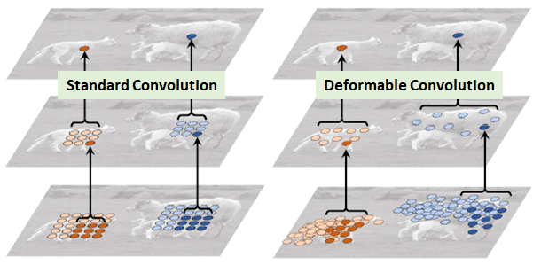
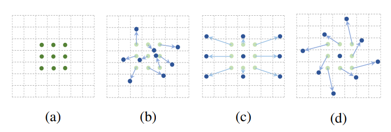
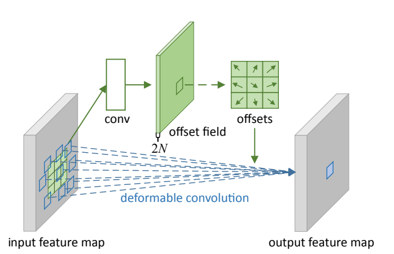
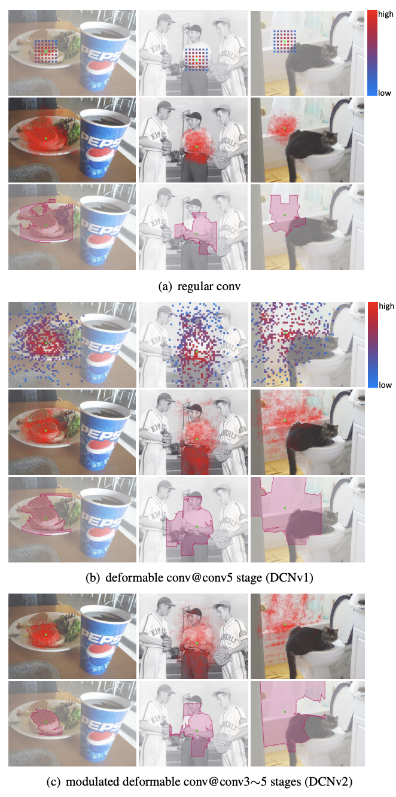
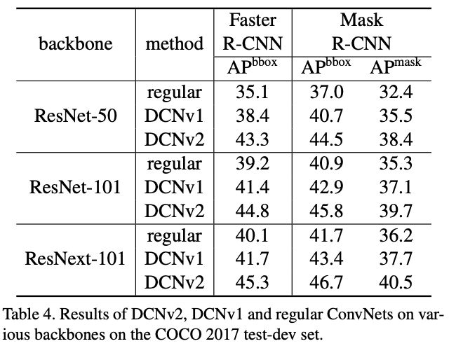

# 可变形卷积详解

## 提出背景

视觉识别的一个关键挑战是如何适应物体尺度、姿态、视点和零件变形的几何变化或模型几何变换。

但对于视觉识别的传统CNN模块，不可避免的都存在**固定几何结构**的缺陷：卷积单元在固定位置对输入特征图进行采样；池化层以固定比率降低空间分辨率；一个ROI（感兴趣区域）池化层将一个ROI分割成固定的空间单元；缺乏处理几何变换的内部机制等。

这些将会引起一些明显的问题。例如，同一CNN层中所有激活单元的感受野大小是相同的，这对于在空间位置上编码语义的高级CNN层是不需要的。而且，对于具有精细定位的视觉识别（例如，使用完全卷积网络的语义分割）的实际问题，由于不同的位置可能对应于具有不同尺度或变形的对象，因此，尺度或感受野大小的自适应确定是可取的。

为了解决以上所提到的局限性，一个自然地想法就诞生了：**卷积核自适应调整自身的形状**。这就产生了可变形卷积的方法。

## 可变形卷积

### DCN v1

可变形卷积顾名思义就是卷积的位置是可变形的，并非在传统的$N × N$的网格上做卷积，这样的好处就是更准确地提取到我们想要的特征（传统的卷积仅仅只能提取到矩形框的特征），通过一张图我们可以更直观地了解：



图1  绵羊特征提取

在上面这张图里面，左边传统的卷积显然没有提取到完整绵羊的特征，而右边的可变形卷积则提取到了完整的不规则绵羊的特征。

那可变卷积实际上是怎么做的呢？*其实就是在每一个卷积采样点加上了一个偏移量*，如下图所示：



图2  卷积核和可变形卷积核

(a) 所示的正常卷积规律的采样 9 个点(绿点)；(b)(c)(d) 为可变形卷积，在正常的采样坐标上加上一个位移量(蓝色箭头)；其中 (d) 作为 (b) 的特殊情况，展示了可变形卷积可以作为尺度变换，比例变换和旋转变换等特殊情况。

普通的卷积，以$3\times3$卷积为例对于每个输出$y_(\mathrm{p}_0)$，都要从$x$上采样9个位置，这9个位置都在中心位置$\mathrm{x}(p0)$向四周扩散，$(-1,-1)$代表$\mathrm{x}(p0)$的左上角，$(1,1)$代表$\mathrm{x}(p0)$的右下角。

$$
\mathrm{R} = 	\{(-1,-1),(-1,0),...,(0,1),(1,1)\}
$$

所以传统卷积的输出就是（其中$\mathrm{p}_n$就是网格中的$n$个点，$\mathrm{w}(\mathrm{p}_n)$表示对应点位置的卷积权重系数）：
$$
y(\mathrm{p}_0)=\sum_{\mathrm{p}_n\in\mathrm{R}}\mathrm{w}(\mathrm{p}_n) \cdot \mathrm{x}(\mathrm{p}_0+\mathrm{p}_n)
$$

正如上面阐述的可变形卷积，就是在传统的卷积操作上加入了一个偏移量$\Delta \mathrm{p}_n$，正是这个偏移量才让卷积变形为不规则的卷积，这里要注意这个偏移量可以是小数，所以下面的式子的特征值需要通过***双线性插值***的方法来计算。

$$
y(\mathrm{p}_0)=\sum_{\mathrm{p}_n\in\mathrm{R}}\mathrm{w}(\mathrm{p}_n) \cdot \mathrm{x}(\mathrm{p}_0+\mathrm{p}_n+\Delta \mathrm{p}_n)
$$

那这个偏移量如何算呢？我们来看：



图3  3x3 deformable convolution

对于输入的一张feature map，假设原来的卷积操作是$3\times3$的，那么为了学习偏移量offset，我们定义另外一个$3\times3$的卷积层（图中上面的那层），输出的维度其实就是原来feature map大小，channel数等于$2N$（分别表示$x,y$方向的偏移）。下面的可变形卷积可以看作先基于上面那部分生成的offset做了一个插值操作，然后再执行普通的卷积。

### DCN v2

DCN v2 在DCN v1基础（添加offset）上添加每个采样点的权重

为了解决引入了一些无关区域的问题，在DCN v2中我们不只添加每一个采样点的偏移，还添加了一个权重系数$\Delta m_k$，来区分我们引入的区域是否为我们感兴趣的区域，假如这个采样点的区域我们不感兴趣，则把权重学习为0即可：

$$
y(\mathrm{p}_0)=\sum_{\mathrm{p}_n\in\mathrm{R}}\mathrm{w}(\mathrm{p}_n) \cdot \mathrm{x}(\mathrm{p}_0+\mathrm{p}_n+\Delta \mathrm{p}_n) \cdot \Delta m_k
$$

## **paddle中的API**

`paddle.vision.ops.deform_conv2d(*x*, *offset*, *weight*, *bias=None*, *stride=1*, *padding=0*, *dilation=1*, *deformable_groups=1*, *groups=1*, *mask=None*, *name=None*);`

deform_conv2d 对输入4-D Tensor计算2-D可变形卷积。详情参考[deform_conv2d](https://www.paddlepaddle.org.cn/documentation/docs/zh/api/paddle/vision/ops/deform_conv2d_cn.html#deform-conv2d)。

**核心参数解析：**

- **x** (Tensor) - 形状为 $(N,C,H,W)$的输入Tensor，数据类型为float32或float64。
- **offset** (Tensor) – 可变形卷积层的输入坐标偏移，数据类型为float32或float64。

- **weight** (Tensor) – 卷积核参数，形状为 $M,C/g,k_H,k_W]$, 其中 M 是输出通道数，$g$ 是group组数，$k_H$是卷积核高度尺寸，$k_W$是卷积核宽度尺寸。数据类型为float32或float64。
- **stride** (`int|list|tuple`，可选) - 步长大小。卷积核和输入进行卷积计算时滑动的步长。如果它是一个列表或元组，则必须包含两个整型数：（stride_height,stride_width）。若为一个整数，stride_height = stride_width = stride。默认值：1。
- **padding** (`int|list|tuple`，可选) - 填充大小。卷积核操作填充大小。如果它是一个列表或元组，则必须包含两个整型数：（padding_height,padding_width）。若为一个整数，padding_height = padding_width = padding。默认值：0。
- **mask** (Tensor, 可选) – 可变形卷积层的输入掩码，**当使用可变形卷积算子v1时，请将mask设置为None**, 数据类型为float32或float64。

输入：

- input 形状：$(N,C_{in},H_{in},W_{in})$
- weight形状：$(C_{out},C_{in},H_f,W_f)$
- offset形状：$(N,2*H_f*W_f,H_{out},W_{out})$
- mask形状：$(N,H_f*W_f,H_{out},W_{out})$

输出：

- output形状：$(N,C_{out},H_{out},W_{out})$


其中：

$$
H_{out}=\frac{(H_{in}+2*paddings[0]-(dilations[0]*(H_f-1)+1))}
{strides[0]}+1 \\
W_{out}=\frac{(W_{in}+2*paddings[1]-(dilations[1]*(W_f-1)+1))}
{strides[1]}+1
$$

**算法实例：**

```python
#deformable conv v2:

import paddle
input = paddle.rand((8, 1, 28, 28))
kh, kw = 3, 3
weight = paddle.rand((16, 1, kh, kw))
# offset shape should be [bs, 2 * kh * kw, out_h, out_w]
# mask shape should be [bs, hw * hw, out_h, out_w]
# In this case, for an input of 28, stride of 1
# and kernel size of 3, without padding, the output size is 26
offset = paddle.rand((8, 2 * kh * kw, 26, 26))
mask = paddle.rand((8, kh * kw, 26, 26))
out = paddle.vision.ops.deform_conv2d(input, offset, weight, mask=mask)
print(out.shape)
# returns
[8, 16, 26, 26]

#deformable conv v1: 无mask参数

import paddle
input = paddle.rand((8, 1, 28, 28))
kh, kw = 3, 3
weight = paddle.rand((16, 1, kh, kw))
# offset shape should be [bs, 2 * kh * kw, out_h, out_w]
# In this case, for an input of 28, stride of 1
# and kernel size of 3, without padding, the output size is 26
offset = paddle.rand((8, 2 * kh * kw, 26, 26))
out = paddle.vision.ops.deform_conv2d(input, offset, weight)
print(out.shape)
# returns
[8, 16, 26, 26]

```

***说明：***

- 对于每个input的图片数据都是$(C,H_{in},W_{in})$类型的数据，其中offset和mask（如果有）中的$H_{out}$和$W_{out}$表示的是输出图片的feature数据格式高和宽。
- 对于每个input图片数据数据对应的输出feature map图中每一个输出的特征位置都有对应的一个大小为$2*H_f*W_f$的偏移项和$H_f*W_f$的掩膜项。这样的大小设置是因为偏移项对应的是我们采样的有$H_f*W_f$个点，每个点都有对应的两个偏移方向和一个重要程度。前者就对应了我们的偏移项，后者就对应了掩膜项。
- 算法的过程可以理解为以下三个步骤：
  1. 通过offset获取对应输出位置的偏移数据，进行采样点的偏移
  2. 正常使用卷积核对偏移后的采样点进行卷积操作
  3. 使用mask对卷积的输出进行对应位置相乘 ，这决定了不同位置的关注程度

## 实例效果



图4  regular、DCN v1、DCN v2的感受野对比

可以从上图4看到，可以看到当绿色点在目标上时，红色点所在区域也集中在目标位置，并且基本能够覆盖不同尺寸的目标，因此经过可变形卷积，我们可以更好地提取出感兴趣物体的完整特征，效果是非常不错的。

但DCN v1听起来不错，但其实也有问题：我们的可变形卷积有可能引入了无用的上下文（区域）来干扰我们的特征提取，这显然会降低算法的表现。通过上图4的对比实验结果（多边形区域框）我们也可以看到DCN v2更能集中在物体的完整有效的区域



图5  regular、DCN v1、DCN v2的准确率对比

使用可变形卷积，可以更加高效的从图片中获取到目标的特征信息，可以起到提升传统卷积神经网络（如`ResNet`、`Faster R-CNN`等）识别和分割上的性能。如以上图5，可以将`ResNet`等网络中的$3\times3$ 标准卷积操作更改为 $3\times3$ 可变形卷积操作，通过研究发现只要增加很少的计算量，就可以得到较大幅度的性能提升。

总结来说，***DCN v1中引入的offset是要寻找有效信息的区域位置，DCN v2中引入权重系数是要给找到的这个位置赋予权重，这两方面保证了有效信息的准确提取***。

## 参考文献

> [1] Dai J ,  Qi H ,  Xiong Y , et al. Deformable Convolutional Networks[J]. IEEE, 2017.
>
> [2] Zhu X ,  Hu H ,  Lin S , et al. Deformable ConvNets V2: More Deformable, Better Results[C]// 2019 IEEE/CVF Conference on Computer Vision and Pattern Recognition (CVPR). IEEE, 2019.
>
> [3] https://blog.csdn.net/cristiano20/article/details/107931844
>
> [4] https://www.zhihu.com/question/303900394/answer/540818451
>
> [5] https://www.paddlepaddle.org.cn/documentation/docs/zh/api/paddle/vision/ops/deform_conv2d_cn.html