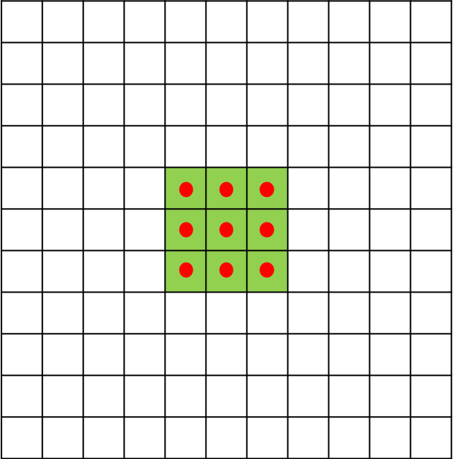
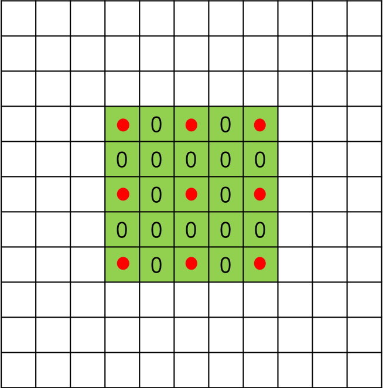
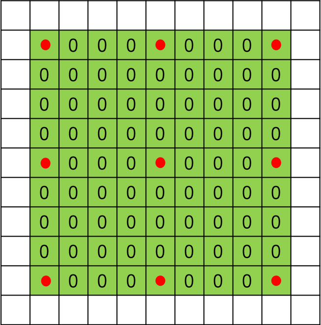
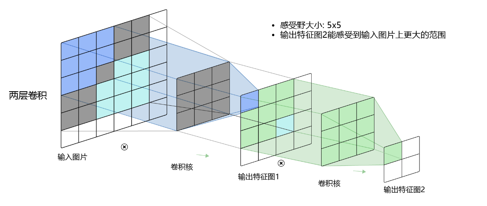
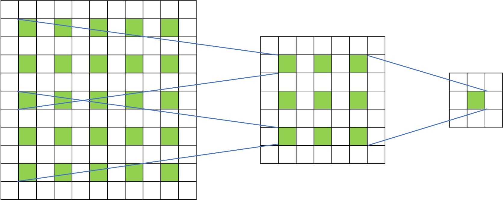

# 空洞卷积（Dilated Convolution）

## 一、空洞卷积提出背景

在像素级预测问题中（比如语义分割，这里以FCN[1]为例进行说明），图像输入到网络中，FCN先如同传统的CNN网络一样对图像做卷积以及池化计算，降低特征图尺寸的同时增大感受野。但是由于图像分割是一种像素级的预测问题，因此我们使用转置卷积（Transpose Convolution）进行上采样使得输出图像的尺寸与原始的输入图像保持一致。综上，在这种像素级预测问题中，就有两个关键步骤：首先是使用卷积或者池化操作减小图像尺寸，增大感受野；其次是使用上采样扩大图像尺寸。但是，使用卷积或者池化操作进行下采样会导致一个非常严重的问题：图像细节信息被丢失，小物体信息将无法被重建(假设有4个步长为2的池化层，则任何小于 $2^4$pixel 的物体信息将理论上无法重建)。

## 二、空洞卷积及其应用

空洞卷积(Dilated Convolution)，在某些文献中也被称为扩张卷积（Atrous Deconvolution），是针对图像语义分割问题中下采样带来的图像分辨率降低、信息丢失问题而提出的一种新的卷积思路。空洞卷积通过引入扩张率（Dilation Rate）这一参数使得同样尺寸的卷积核获得更大的感受野。相应地，也可以使得在相同感受野大小的前提下，空洞卷积比普通卷积的参数量更少。

空洞卷积在某些特定的领域有着非常广泛的应用，比如：

- 语义分割领域：DeepLab系列[2,3,4,5]与DUC[6]。在DeepLab v3算法中，将ResNet最后几个block替换为空洞卷积，使得输出尺寸变大了很多。在没有增大运算量的前提下，维持分辨率不降低，获得了更密集的特征响应，从而使得还原到原图时细节更好。

- 目标检测领域：RFBNet[7]。在RFBNet算法中，利用空洞卷积来模拟pRF在人类视觉皮层中的离心率的影响，设计了RFB模块，从而增强轻量级CNN网络的效果。提出基于RFB网络的检测器，通过用RFB替换SSD的顶部卷积层，带来了显著的性能增益，同时仍然保持受控的计算成本。

- 语音合成领域：WaveNet[8]等算法。

## 三、空洞卷积与标准卷积的区别

对于一个尺寸为 $3\times{3}$ 的标准卷积，卷积核大小为  $3\times{3}$ ，卷积核上共包含9个参数，在卷积计算时，卷积核中的元素会与输入矩阵上对应位置的元素进行逐像素的乘积并求和。而空洞卷积与标准卷积相比，多了扩张率这一个参数，扩张率控制了卷积核中相邻元素间的距离，扩张率的改变可以控制卷积核感受野的大小。尺寸为 $3\times{3}$ ，扩张率分别为 $1,2,4$ 时的空洞卷积分别如 **图1**，**图2**，**图3**所示。

图1 扩张率为1时的3*3空洞卷积

扩张率为1时，空洞卷积与标准卷积计算方式一样。

图2 扩张率为2时的3*3空洞卷积

图3 扩张率为4时的3*3空洞卷积

扩张率大于1时，在标准卷积的基础上，会注入空洞，空洞中的数值全部填0。

## 四、空洞卷积的感受野

对于标准卷积而言，当标准卷积核尺寸为 $3\times{3}$ 时，我们在输入矩阵上连续进行两次标准卷积计算，得到两个特征图。我们可以观察不同层数的卷积核感受野大小，如 **图4** 所示。

图4 标准卷积的感受野示例

其中，$3\times3$卷积对应的感受野大小就是$3\times3$，而通过两层$3\times3$的卷积之后，感受野的大小将会增加到$5\times5$。

空洞卷积的感受野计算方式与标准卷积大同小异。由于空洞卷积实际上可以看作在标准卷积核内填充'0'，所以我们可以将其想象为一个尺寸变大的标准卷积核，从而使用标准卷积核计算感受野的方式来计算空洞卷积的感受野大小。对于卷积核大小为 $k$ ，扩张率为 $r$ 的空洞卷积，感受野 $F$ 的计算公式为：

$$F = k + (k-1)(r-1)$$

卷积核大小 $k=3$ ，扩张率 $r=2$ 时，计算方式如 **图5** 所示。

图5 空洞卷积的感受野示例

其中，通过一层空洞卷积后，感受野大小为$5\times5$，而通过两层空洞卷积后，感受野的大小将会增加到$9\times9$。

## 参考文献

[1] [Fully Convolutional Networks for Semantic Segmentation](https://www.cv-foundation.org/openaccess/content_cvpr_2015/html/Long_Fully_Convolutional_Networks_2015_CVPR_paper.html)

[2] [Semantic image segmentation with deep convolutional nets and fully connected CRFs](https://arxiv.org/pdf/1412.7062v3.pdf)

[3] [DeepLab: Semantic Image Segmentation with Deep Convolutional Nets, Atrous Convolution, and Fully Connected CRFs](https://arxiv.org/pdf/1606.00915.pdf)

[4] [Rethinking Atrous Convolution for Semantic Image Segmentation](https://arxiv.org/pdf/1706.05587.pdf)

[5] [Encoder-Decoder with Atrous Separable Convolution for Semantic Image Segmentation](https://arxiv.org/pdf/1802.02611.pdf)

[6] [Understanding Convolution for Semantic Segmentation](https://arxiv.org/pdf/1702.08502.pdf)

[7 ] [Receptive Field Block Net for Accurate and Fast Object Detection](https://arxiv.org/pdf/1711.07767.pdf)

[8] [WaveNet: a generative model for raw audio](https://arxiv.org/pdf/1609.03499.pdf)

