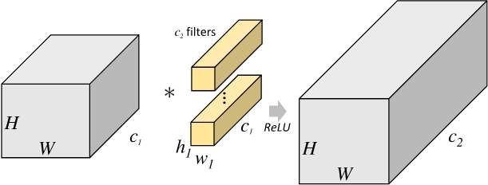
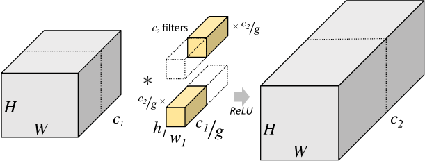
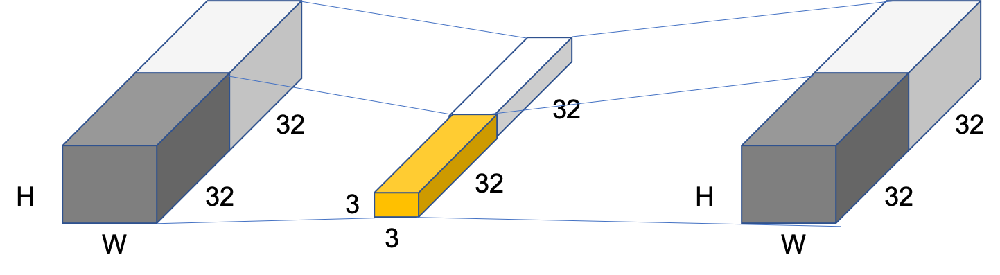

# 分组卷积（Group Convolution）

## 一、分组卷积提出背景

分组卷积（Group Convolution）最早出现在AlexNet[1]中。受限于当时的硬件资源，在AlexNet网络训练时，难以把整个网络全部放在一个GPU中进行训练，因此，作者将卷积运算分给多个GPU分别进行计算，最终把多个GPU的结果进行融合。因此分组卷积的概念应运而生。

## 二、分组卷积与标准卷积的区别

对于尺寸为 $H_1\times{W_1}\times{C_1}$ 的输入矩阵，当标准卷积核的尺寸为 $h_1\times{w_1}\times{C_1}$ ，共有 $C_2$ 个标准卷积核时，标准卷积会对完整的输入数据进行运算，最终得到的输出矩阵尺寸为 $H_2\times{W_2}\times{C_2}$ 。这里我们假设卷积运算前后的特征图尺寸保持不变，则上述过程可以展示为 **图1** 。

图1 标准卷积示意图

考虑到上述过程是完整运行在同一个设备上，这也对设备的性能提出了较高的要求。

分组卷积则是针对这一过程进行了改进。分组卷积中，通过指定组数 $g$ 来确定分组数量，将输入数据分成 $g$ 组。需要注意的是，这里的分组指的是在深度上进行分组，输入的宽和高保持不变，即将每 $\frac{C_1}{g}$ 个通道的数据分为一组。因为输入数据发生了改变，相应的卷积核也需要进行对应的变化，即每个卷积核的输入通道数也就变为了 $\frac{C_1}{g}$ ，而卷积核的大小是不需要改变的。同时，每组的卷积核个数也由原来的 $C_2$ 变为 $\frac{C_2}{g}$ 。对于每个组内的卷积运算，同样采用标准卷积运算的计算方式，这样就可以得到 $g$ 组尺寸为 $H_2\times{W_2}\times{\frac{C_2}{g}}$ 的输出矩阵，最终将这 $g$ 组输出矩阵进行拼接就可以得到最终的结果。这样拼接完成后，最终的输出尺寸就可以保持不变，仍然是 $H_2\times{W_2}\times{C_2}$ 。分组卷积的运算过程如 **图2** 所示。

图2 分组卷积示意图

由于我们将整个标准卷积过程拆分成了 $g$ 组规模更小的子运算来并行进行，所以最终降低了对运行设备的要求。同时，通过分组卷积的方式，参数量也可以得到降低。在上述的标准卷积中，参数量为：

$$
h_1 \times w_1 \times C_1 \times C_2
$$
而使用分组卷积后，参数量则变为：

$$
h_1 \times w_1 \times \frac{C_1}{g} \times \frac{C_2}{g} \times g = h_1 \times w_1 \times C_1 \times C_2 \times \frac{1}{g}
$$

## 三、应用示例

比如对于尺寸为 $H\times{W}\times{64}$ 的输入矩阵，当标准卷积核的尺寸为 $3\times{3}\times{64}$ ，共有 $64$ 个标准卷积核时，**图3** 为组数 $g=2$ 时的分组卷积计算方式。

图3 组数为2时分组卷积示意图

此时，每组的输入通道数变为32，卷积核通道数也变为为32。所以，标准卷积对应的参数量是 $3\times{3}\times{64}\times{64}=36864$ ，而分组卷积的参数量变为 $3\times{3}\times{32}\times{32}\times{2}=18432$，参数量减少了一半。

## 参考文献

[1] [ImageNet Classification with Deep Convolutional Neural Networks](http://stanford.edu/class/cs231m/references/alexnet.pdf)

