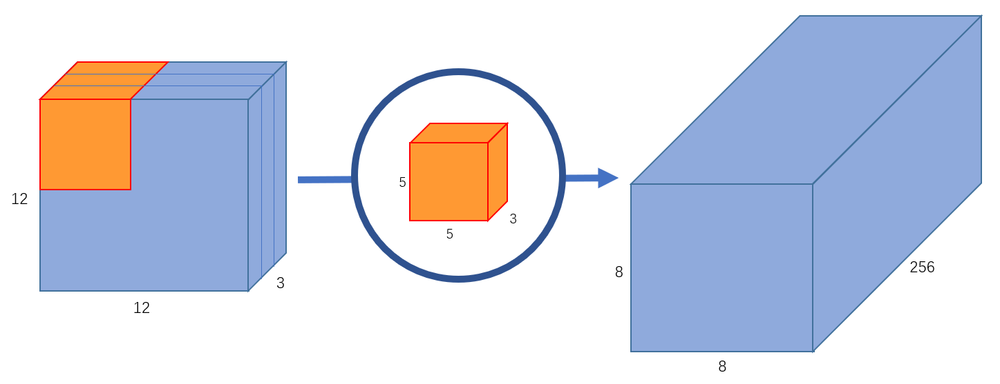

# 可分离卷积（Separable Convolution）

## 一、可分离卷积提出背景

传统的卷积神经网络在计算机视觉领域已经取得了非常好的成绩，但是依然存在一个待改进的问题—计算量大。

当卷积神经网络应用到实际工业场景时，模型的参数量和计算量都是十分重要的指标，较小的模型可以高效地进行分布式训练，减小模型更新开销，降低平台体积功耗存储和计算能力的限制，方便部署在移动端。

因此，为了更好地实现这个需求，在卷积运算的基础上，学者们提出了更为高效的可分离卷积。

## 二、空间可分离卷积

空间分离卷积（spatial separable convolutions），顾名思义就是在空间维度将标准卷积运算进行拆分，将标准卷积核拆分成多个小卷积核。例如我们可以将卷积核拆分成两个（或多个）向量的外积：

$$
\left[\begin{array}{ccc}
3 & 6 & 9 \\
4 & 8 & 12 \\
5 & 10 & 15
\end{array}\right]
=	
\left[\begin{array}{ccc}
3 \\
4 \\
5
\end{array}\right]	
\times
\left[\begin{array}{ccc}
1 \quad 2 \quad 3
\end{array}\right]
$$

此时，对于一副输入图像而言，我们就可以先用$3\times1$的kernel做一次卷积，再用$1\times3$的kernel做一次卷积，从而得到最终结果。具体操作如 **图1** 所示。

图1 空间可分离卷积

这样，我们将原始的卷积进行拆分，本来需要9次乘法操作的一个卷积运算，就变为了两个需要3次乘法操作的卷积运算，并且最终效果是不变的。可想而知，乘法操作减少，计算复杂性就降低了，网络运行速度也就更快了。

但是空间可分离卷积也存在一定的问题，那就是并非所有的卷积核都可以拆分成两个较小的卷积核。 所以这种方法使用的并不多。

### 应用示例

空间可分离卷积在深度学习中应用较少，在传统图像处理领域比较有名的是可用于边缘检测的sobel算子，分离的sobel算子计算方式如下：

$$
\left[\begin{array}{ccc}
-1 & 0 & 1 \\
-2 & 0 & 2 \\
-1 & 0 & 1
\end{array}\right]
=	
\left[\begin{array}{ccc}
1 \\
2 \\
1
\end{array}\right]	
\times
\left[\begin{array}{ccc}
-1 \quad 0 \quad 1
\end{array}\right]
$$

## 三、深度可分离卷积

深度可分离卷积（depthwise separable convolutions）的不同之处在于，其不仅仅涉及空间维度，还涉及深度维度（即 channel 维度）。通常输入图像会具有3个channel：R、G、B。在经过一系列卷积操作后，输入特征图就会变为多个channel。对于每个channel而言，我们可以将其想成对该图像某种特定特征的解释说明。例如输入图像中，“红色” channel 解释描述了图像中的“红色”特征，“绿色” channel 解释描述了图像中的“绿色”特征，“蓝色” channel 解释描述了图像中的“蓝色”特征。又例如 channel 数量为64的输出特征图，就相当于对原始输入图像的64种不同的特征进行了解释说明。

类似空间可分离卷积，深度可分离卷积也是将卷积核分成两个单独的小卷积核，分别进行2种卷积运算：深度卷积运算和逐点卷积运算。 首先，让我们看看正常的卷积是如何工作的。

### 标准卷积

假设我们有一个 $12\times 12\times 3$ 的输入图像，即图像尺寸为 $12\times 12$，通道数为3，对图像进行 $5\times 5$ 卷积，没有填充（padding）且步长为1。如果我们只考虑图像的宽度和高度，使用 $5\times 5$ 卷积来处理 $12\times 12$ 大小的输入图像，最终可以得到一个 $8\times 8$ 的输出特征图。然而，由于图像有3个通道，我们的卷积核也需要有3个通道。 这就意味着，卷积核在每个位置进行计算时，实际上会执行 $5\times 5\times 3=75$ 次乘法。如 **图2** 所示，我们使用一个 $5\times 5\times 3$ 的卷积核进行卷积运算，最终可以得到 $8\times 8\times 1$ 的输出特征图。

图2 输出通道为1的标准卷积

如果我们想增加输出的 channel 数量让网络学习更多种特征呢？这时我们可以创建多个卷积核，比如256个卷积核来学习256个不同类别的特征。此时，256个卷积核会分别进行运算，得到256个 $8\times 8\times 1$ 的输出特征图，将其堆叠在一起，最终可以得到 $8\times 8\times 256$ 的输出特征图。如 **图3** 所示。

图3 输出通道为256的标准卷积

接下来，再来看一下如何通过深度可分离卷积得到 $8\times 8\times 256$ 的输出特征图。

### 深度卷积运算

首先，我们对输入图像进行深度卷积运算，这里的深度卷积运算其实就是逐通道进行卷积运算。对于一幅 $12\times 12\times 3$ 的输入图像而言，我们使用大小为 $5\times 5$ 的卷积核进行逐通道运算，计算方式如 **图4** 所示。

图4 深度卷积运算

这里其实就是使用3个 $5\times 5\times 1$ 的卷积核分别提取输入图像中3个 channel 的特征，每个卷积核计算完成后，会得到3个 $8\times 8\times 1$ 的输出特征图，将这些特征图堆叠在一起就可以得到大小为 $8\times 8\times 3$ 的最终输出特征图。这里我们可以发现深度卷积运算的一个缺点，深度卷积运算缺少通道间的特征融合 ，并且运算前后通道数无法改变。

因此，接下来就需要连接一个逐点卷积来弥补它的缺点。

### 逐点卷积运算

前面我们使用深度卷积运算完成了从一幅 $12\times 12\times 3$ 的输入图像中得到 $8\times 8\times 3$ 的输出特征图，并且发现仅使用深度卷积无法实现不同通道间的特征融合，而且也无法得到与标准卷积运算一致的 $8\times 8\times 256$ 的特征图。那么，接下来就让我们看一下如何使用逐点卷积实现这两个任务。

逐点卷积其实就是 $1\times 1$ 卷积，因为其会遍历每个点，所以我们称之为逐点卷积。  $1\times 1$ 卷积在前面的内容中已经详细介绍了，这里我们还是结合上边的例子看一下它的具体作用。

我们使用一个3通道的 $1\times 1$ 卷积对上文中得到的 $8\times 8\times 3$ 的特征图进行运算，可以得到一个 $8\times 8\times 1$ 的输出特征图。如 **图5** 所示。此时，我们就使用逐点卷积实现了融合3个通道间特征的功能。

图5 输出通道为1的逐点卷积

此外，我们可以创建256个3通道的 $1\times 1$ 卷积对上文中得到的 $8\times 8\times 3$ 的特征图进行运算，这样，就可以实现得到与标准卷积运算一致的 $8\times 8\times 256$ 的特征图的功能。如 **图6** 所示。

图6 输出通道为256的逐点卷积

### 深度可分离卷积的意义

上文中，我们给出了深度可分离卷积的具体计算方式，那么使用深度可分离卷积代替标准卷积有什么意义呢？

这里我们看一下上文例子中标准卷积的乘法运算个数，我们创建了256个 $5\times 5\times 3$ 的卷积核进行卷积运算，每个卷积核会在输入图片上移动 $8\times 8$ 次，因此总的乘法运算个数为：

$$
256 \times 3 \times 5 \times 5 \times 8 \times 8=1228800
$$
而换成深度可分离卷积后，在深度卷积运算时，我们使用3个 $5\times 5\times 1$ 的卷积核在输入图片上移动 $8\times 8$ 次，此时乘法运算个数为：

$$
3 \times 5 \times 5 \times 8 \times 8=4800
$$
在逐点卷积运算时，我们使用256个 $1\times 1\times 3$ 的卷积在输入特征图上移动 $8\times 8$ 次，此时乘法运算个数为：

$$
256 \times 1 \times 1 \times 3 \times 8 \times 8=49152
$$
将这两步运算相加，即可得到，使用深度可分离卷积后，总的乘法运算个数变为：53952。可以看到，深度可分离卷积的运算量相较标准卷积而言，计算量少了很多。

### 应用示例

MobileNetv1[1]中使用的深度可分离卷积如 **图7** 右侧所示。相较于左侧的标准卷积，其进行了拆分，同时使用了BN层以及RELU激活函数穿插在深度卷积运算和逐点卷积运算中。

图7 MobileNetv1中的可分离卷积

### 参考文献

[1] [MobileNets: Efficient Convolutional Neural Networks for Mobile Vision Applications](https://arxiv.org/pdf/1704.04861.pdf)

