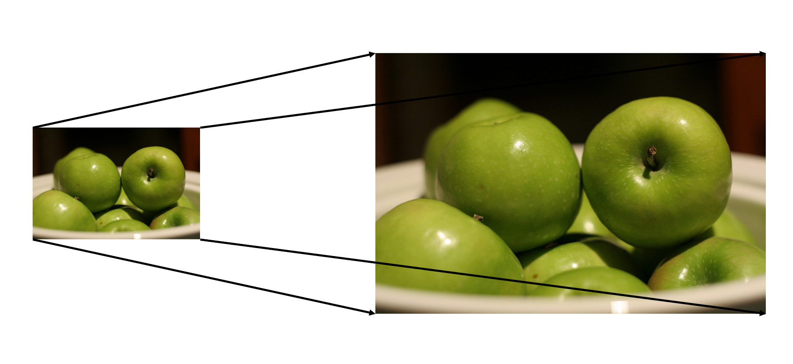
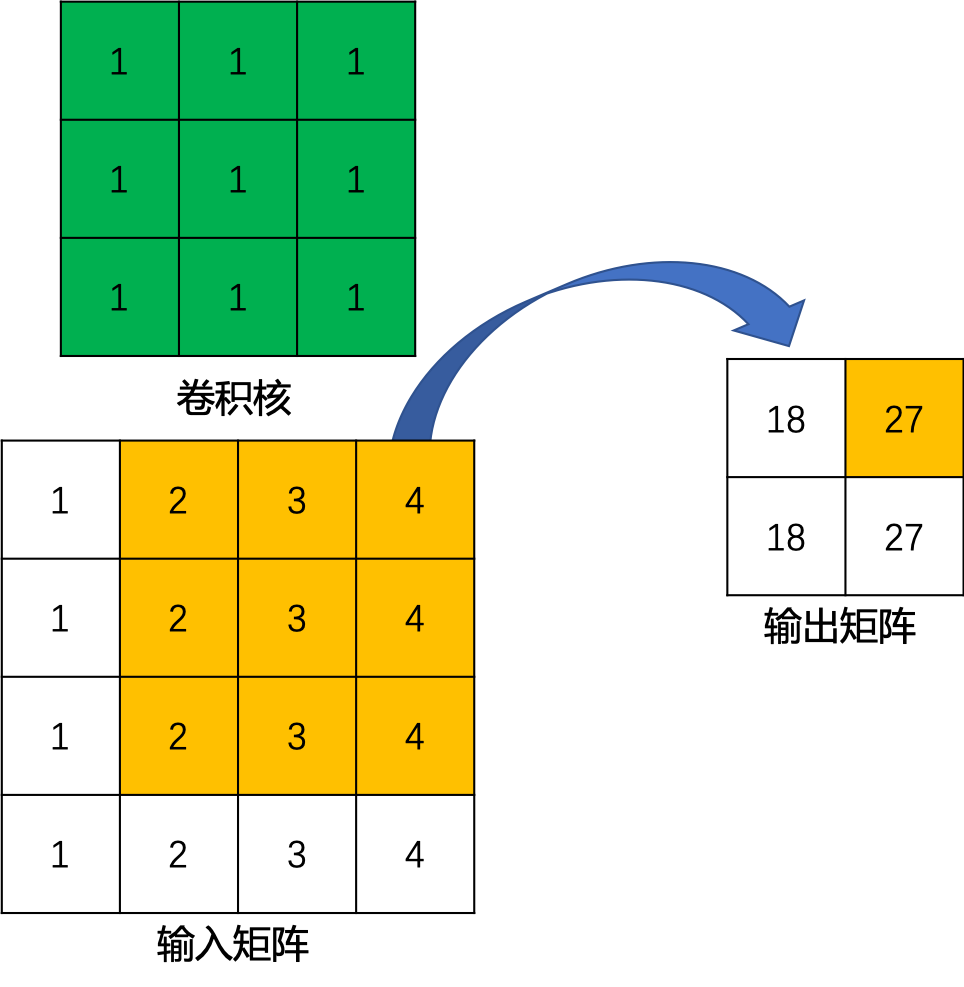
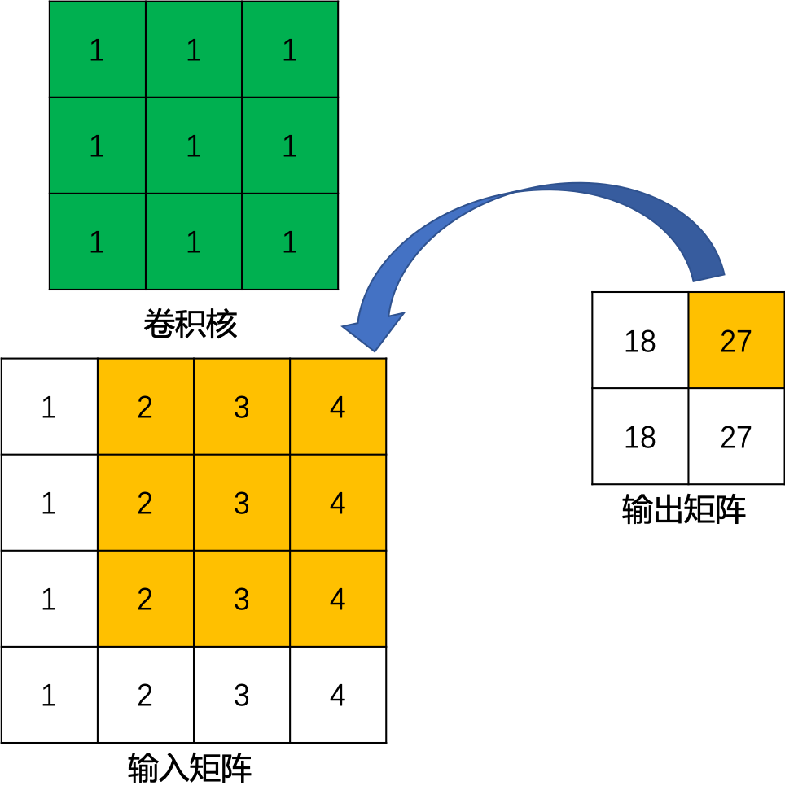
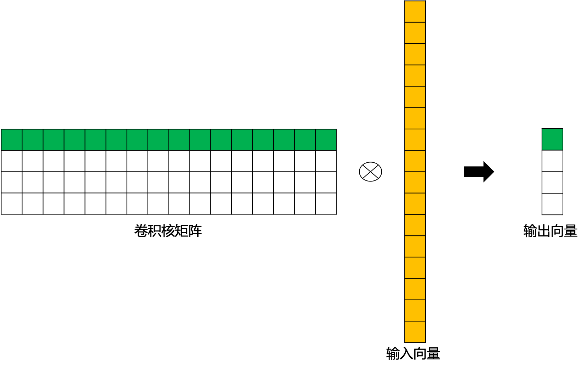
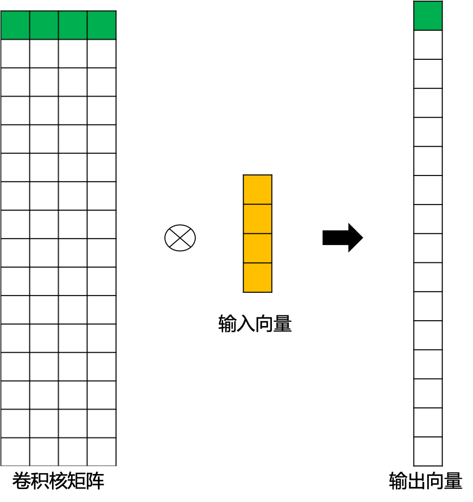
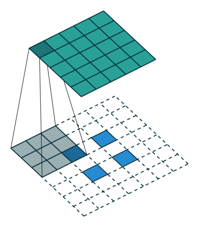

#  转置卷积（Transpose Convolution）

## 一、转置卷积提出背景

通常情况下，对图像进行卷积运算时，经过多层的卷积运算后，输出图像的尺寸会变得很小，即图像被约减。而对于某些特定的任务（比如：图像分割、GAN），我们需要将图像恢复到原来的尺寸再进行进一步的计算。这个恢复图像尺寸，实现图像由小分辨率到大分辨率映射的操作，叫做上采样（Upsample），如 **图1** 所示。

图1 上采样示例

上采样有多种方式，常见的包括：最近邻插值（Nearest neighbor interpolation）、双线性插值（Bi-Linear interpolation）等，但是这些上采样方法都是基于人们的先验经验来设计的，对于很多场景效果并不理想。因此，我们希望让神经网络自己学习如何更好地进行插值，这也就是接下来要介绍的转置卷积（Transpose Convolution）的方法。

## 二、转置卷积及其应用

转置卷积（Transpose Convolution），在某些文献中也被称为反卷积（Deconvolution）。转置卷积中，不会使用预先设定的插值方法，它具有可学习的参数，通过让网络自行学习，来获取最优的上采样方式。转置卷积在某些特定的领域有着非常广泛的应用，比如：

- 在DCGAN[1]，生成器将会用随机值转变为一个全尺寸(full-size)的图片，这个时候就需要用到转置卷积。
- 在语义分割中，会使用卷积层在编码器中进行特征提取，然后在解码层中进行恢复为原先的尺寸，这样才可以对原来图像的每个像素都进行分类。这个过程同样需要用到转置卷积。经典方法如：FCN[2]和Unet[3]。
- CNN的可视化[4]：通过转置卷积将CNN中得到的特征图还原到像素空间，以观察特定的特征图对哪些模式的图像敏感。

## 三、转置卷积与标准卷积的区别

标准卷积的运算操作其实就是对卷积核中的元素与输入矩阵上对应位置的元素进行逐像素的乘积并求和。然后使用卷积核在输入矩阵上以步长为单位进行滑动，直到遍历完输入矩阵的所有位置。

这里举一个简单的例子演示一下具体的操作过程。假设输入是一个$4\times{4}$的矩阵，使用$3\times{3}$的标准卷积进行计算，同时不使用填充，步长设置为1。最终输出的结果应该是一个$2\times{2}$的矩阵，如 **图2** 所示。

图2 标准卷积运算示例

在上边的例子中，输入矩阵右上角$3\times{3}$的值会影响输出矩阵中右上角的值，这其实也就对应了标准卷积中感受野的概念。所以，我们可以说$3\times{3}$的标准卷积核建立了输入矩阵中9个值与输出矩阵中1个值的对应关系。

综上所述，我们也就可以认为标准卷积操作实际上就是建立了一个多对一的关系。

对于转置卷积而言，我们实际上是想建立一个逆向操作，也就是建立一个一对多的关系。对于上边的例子，我们想要建立的其实是输出卷积中的1个值与输入卷积中的9个值的关系，如 **图3** 所示。

图3 卷积逆向运算示例

当然，从信息论的角度，卷积操作是不可逆的，**所以转置卷积并不是使用输出矩阵和卷积核计算原始的输入矩阵，而是计算得到保持了相对位置关系的矩阵**。

## 四、转置卷积数学推导

定义一个尺寸为$4\times{4}$ 的输入矩阵 $input$:

$$
input=\left[\begin{array}{ccc}
x_1 & x_2 & x_3 & x_4 \\
x_6 & x_7 & x_8 & x_9 \\
x_{10} & x_{11} & x_{12} & x_{13} \\
x_{14} & x_{15} & x_{16} & x_{17} 
\end{array}\right]
$$
一个尺寸为$3\times{3}$ 的标准卷积核 $kernel$:

$$
kernel=\left[\begin{array}{ccc}
w_{0,0} & w_{0,1} & w_{0,2} \\
w_{1,0} & w_{1,1} & w_{1,2} \\
w_{2,0} & w_{2,1} & w_{2,2}
\end{array}\right]
$$

令步长 $stride=1$，填充$padding=0$，按照输出特征图的计算方式$o = \frac{i + 2p - k}{s} + 1$，我们可以得到尺寸为 $2\times{2}$  的输出矩阵 $output$ ：

$$
output=\left[\begin{array}{ccc}
y_0 & y_1 \\
y_2 & y_3
\end{array}\right]
$$
这里，我们换一个表达方式，我们将输入矩阵 $ input$ 和输出矩阵 $output$ 展开成列向量$X$ 和列向量$Y$ ，那么向量$X$ 和向量$Y$ 的尺寸就分别是$16\times{1}$ 和$4\times{1}$，可以分别用如下公式表示：

$$
X=\left[\begin{array}{ccc}
x_1 \\ x_2 \\ x_3 \\ x_4 \\
x_6 \\ x_7 \\ x_8 \\ x_9 \\
x_{10} \\ x_{11} \\ x_{12} \\ x_{13} \\
x_{14} \\ x_{15} \\ x_{16} \\ x_{17} 
\end{array}\right]
$$

$$
Y=\left[\begin{array}{ccc}
y_0 \\ y_1 \\
y_2 \\ y_3
\end{array}\right]
$$

我们再用矩阵运算来描述标准卷积运算，这里使用矩阵$C$ 来表示新的卷积核矩阵：

$$
Y = CX
$$
经过推导，我们可以得到这个稀疏矩阵$C$，它的尺寸为$4\times{16}$：

$$
\scriptsize{
C=\left[\begin{array}{ccc}
w_{0,0} & w_{0,1} & w_{0,2} & 0 & w_{1,0} & w_{1,1} & w_{1,2} & 0 & w_{2,0} & w_{2,1} & w_{2,2} & 0 & 0 & 0 & 0 & 0 \\
0 & w_{0,0} & w_{0,1} & w_{0,2} & 0 & w_{1,0} & w_{1,1} & w_{1,2} & 0 & w_{2,0} & w_{2,1} & w_{2,2} & 0 & 0 & 0 & 0 \\
0 & 0 & 0 & 0 & w_{0,0} & w_{0,1} & w_{0,2} & 0 & w_{1,0} & w_{1,1} & w_{1,2} & 0 & w_{2,0} & w_{2,1} & w_{2,2} & 0 \\
0 & 0 & 0 & 0 & 0 & w_{0,0} & w_{0,1} & w_{0,2} & 0 & w_{1,0} & w_{1,1} & w_{1,2} & 0 & w_{2,0} & w_{2,1} & w_{2,2}  
\end{array}\right]
}
$$
这里，我们用 **图4** 为大家直观的展示一下上边的矩阵运算过程。

图4 标准卷积矩阵运算示例

而转置卷积其实就是要对这个过程进行逆运算，即通过 $C$ 和 $Y$ 得到 $X$ ：

$$
X = C^TY
$$
此时，新的稀疏矩阵就变成了尺寸为$16\times{4}$ 的$C^T$，这里我们通过 **图5** 为大家直观展示一下转置后的卷积矩阵运算示例。这里，用来进行转置卷积的权重矩阵不一定来自于原卷积矩阵. 只是权重矩阵的形状和转置后的卷积矩阵相同。

图5 转置后卷积矩阵运算示例

我们再将$16\times{1}$ 的输出结果进行重新排序，这样就可以通过尺寸为$2\times{2}$ 的输入矩阵得到尺寸为$4\times{4}$ 的输出矩阵了。

## 五、转置卷积输出特征图尺寸

- **stride=1的转置卷积**

我们同样使用上文中的卷积核矩阵$C$：

$$
\scriptsize{
C=\left[\begin{array}{ccc}w_{0,0} & w_{0,1} & w_{0,2} & 0 & w_{1,0} & w_{1,1} & w_{1,2} & 0 & w_{2,0} & w_{2,1} & w_{2,2} & 0 & 0 & 0 & 0 & 0 \\0 & w_{0,0} & w_{0,1} & w_{0,2} & 0 & w_{1,0} & w_{1,1} & w_{1,2} & 0 & w_{2,0} & w_{2,1} & w_{2,2} & 0 & 0 & 0 & 0 \\0 & 0 & 0 & 0 & w_{0,0} & w_{0,1} & w_{0,2} & 0 & w_{1,0} & w_{1,1} & w_{1,2} & 0 & w_{2,0} & w_{2,1} & w_{2,2} & 0 \\0 & 0 & 0 & 0 & 0 & w_{0,0} & w_{0,1} & w_{0,2} & 0 & w_{1,0} & w_{1,1} & w_{1,2} & 0 & w_{2,0} & w_{2,1} & w_{2,2}  \end{array}\right]
}
$$
对应的输出矩阵 $output$ 为 ：

$$
output=\left[\begin{array}{ccc}y_0 & y_1 \\y_2 & y_3\end{array}\right]
$$
我们将输出矩阵展开为列向量$Y$ ：

$$
Y=\left[\begin{array}{ccc}y_0 \\ y_1 \\y_2 \\ y_3\end{array}\right]
$$
带入到上文中提到的转置卷积计算公式，则转置卷积的计算结果为：

$$
\scriptsize{
C^Ty'=
\left[\begin{array}{ccc}
w_{0,0}y_0 & w_{0,1}y_0+w_{0,0}y_1 & w_{0,2}y_0+w_{0,1}y_1 & w_{0,2}y_1 \\
w_{1,0}y_0+w_{0,0}y_2 & w_{1,1}y_0+w_{1,0}y_1+w_{0,1}y_2+w_{0,0}y_3 & w_{1,2}y_0+w_{1,1}y_1+w_{0,2}y_2+w_{0,1}y_3 & w_{1,2}y_1+w_{0,2}y_3 \\
w_{2,0}y_0+w_{1,0}y_2 & w_{2,1}y_0+w_{2,0}y_1+w_{1,1}y_2+w_{1,0}y_3 & w_{2,2}y_0+w_{2,1}y_1+w_{1,2}y_2+w_{1,1}y_3 & w_{2,2}y_1+w_{1,2}y_3 \\
w_{2,0}y_2 & w_{2,1}y_2+w_{2,0}y_3 & w_{2,2}y_2+w_{2,1}y_3 & w_{2,2}y_3
\end{array}\right]
}
$$
这其实就等价于填充 $padding=2$，输入为：

$$
input=\left[\begin{array}{ccc}
0 & 0 & 0 & 0 & 0 & 0 \\
0 & 0 & 0 & 0 & 0 & 0 \\
0 & 0 & y_0 & y_1 & 0 & 0 \\
0 & 0 & y_2 & y_3 & 0 & 0 \\
0 & 0 & 0 & 0 & 0 & 0 \\
0 & 0 & 0 & 0 & 0 & 0
\end{array}\right]
$$
同时，标准卷积核进行转置：

$$
kernel‘=\left[\begin{array}{ccc}
w_{2,2} & w_{2,1} & w_{2,0} \\
w_{1,2} & w_{1,1} & w_{1,0} \\
w_{0,2} & w_{0,1} & w_{0,0}
\end{array}\right]
$$
之后的标准卷积的结果，运算过程如 **图6** 所示。

图6 s=1时，转置卷积运算示例

对于卷积核尺寸为 $k$，步长 $stride=1$，填充 $padding=0$ 的标准卷积，等价的转置卷积在尺寸为 $ i'$ 的输入矩阵上进行运算，输出特征图的尺寸 $ o'$ 为：

$$
o' = i'+(k-1)
$$
同时，转置卷积的输入矩阵需要进行 $padding'=k-1$ 的填充。

- **stride>1的转置卷积**

在实际使用的过程中，我们大多数时候使用的会是stride>1的转置卷积，从而获得较大的上采样倍率。这里，我们令输入尺寸为$5\times{5}$，标准卷积核的设置同上，步长 $stride=2$，填充 $padding=0$，标准卷积运算后，输出尺寸为$2\times{2}$。

$$
Y=\left[\begin{array}{ccc}y_0 \\ y_1 \\y_2 \\ y_3\end{array}\right]
$$
这里，步长$stride=2$，转换后的稀疏矩阵尺寸变为$25\times{4}$，由于矩阵太大这里不展开进行罗列。则转置卷积的结果为：

$$
\scriptsize{
C^Ty'=\left[\begin{array}{ccc}
w_{0,0}y_0 & w_{0,1}y_0 & w_{0,2}y_0+w_{0,0}y_1 & w_{0,1}y_1 & w_{0,2}y_1\\
w_{1,0}y_0 & w_{1,1}y_0 & w_{1,2}y_0+w_{1,0}y_1 & w_{1,1}y_1 & w_{1,2}y_1\\
w_{2,0}y_0+w_{0,0}y_2 & w_{2,1}y_0+w_{0,1}y_2 & w_{2,2}y_0+w_{2,0}y_1+w_{0,2}y_2+w_{0,0}y_3 & w_{2,1}y_1+w_{0,1}y_3 & w_{2,2}y_1+w_{0,2}y_3\\
w_{1,0}y_2 & w_{1,1}y_2 & w_{1,2}y_2+w_{1,0}y_3 & w_{1,1}y_3 & w_{1,2}y_3\\
w_{2,0}y_2 & w_{2,1}y_2 & w_{2,2}y_2+w_{2,0}y_3 & w_{2,1}y_3 & w_{2,2}y_3\\
\end{array}\right]
}
$$
此时，等价于输入矩阵添加了空洞，同时也添加了填充，标准卷积核进行转置之后的运算结果。运算过程如 **图7** 所示。

图7 s>1时，转置卷积运算示例

对于卷积核尺寸为 $k$，步长 $stride>1$，填充 $padding=0$ 的标准卷积，等价的转置卷积在尺寸为 $ i'$ 的输入矩阵上进行运算，输出特征图的尺寸 $ o'$ 为：

$$
o' = s(i'-1)+k
$$
同时，转置卷积的输入矩阵需要进行 $padding'=k-1$ 的填充，相邻元素间的空洞大小为 $s-1$。因此，可以通过控制步长 $stride$ 来控制上采样倍率。

## 参考文献

[1] [Unsupervised Representation Learning with Deep Convolutional Generative Adversarial Networks](https://arxiv.org/pdf/1511.06434.pdf)

[2] [Fully Convolutional Networks for Semantic Segmentation](https://www.cv-foundation.org/openaccess/content_cvpr_2015/html/Long_Fully_Convolutional_Networks_2015_CVPR_paper.html)

[3] [U-Net: Convolutional Networks for Biomedical Image Segmentation](https://arxiv.org/pdf/1505.04597.pdf)

[4] [Visualizing and Understanding Convolutional Networks](https://arxiv.org/pdf/1311.2901v2.pdf)

