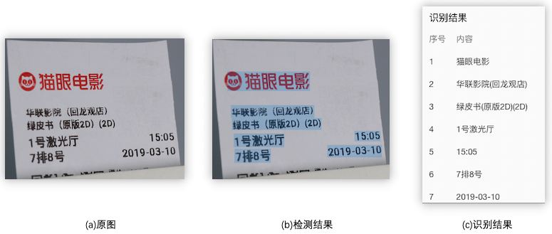
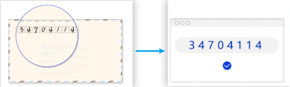
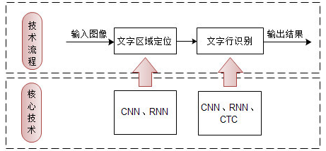
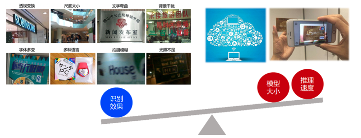

# OCR综述

## 什么是OCR

OCR(Optical Character Recognition,光学字符识别)是指对图像进行分析识别处理，获取文字和版面信息的过程，是典型的计算机视觉任务，通常由文本检测和文本识别两个子任务构成。

* 文字检测：将图片中的文字区域位置检测出来（如图1(b)所示）；
* 文字识别：对文字区域中的文字进行识别（如图1(c)所示）。

### OCR发展历程

早在60、70年代，人们就开始对OCR进行研究。在研究的初期，主要以文字识别方法研究为主，而且识别的文字仅为0-9的数字。数字识别主要应用在识别邮件上的邮政编码。

在深度学习出现之前，传统算法(如积分投影、腐蚀膨胀、旋转等)在OCR领域占据主导地位。其标准的处理流程包括：图像预处理、文本行检测、单字符分割、单字符识别、后处理。

其中：

* 图像预处理主要是对图像的成像问题进行修正，包括几何变换（透视、扭曲、旋转等），去模糊、光线矫正等；

* 文本检测通常使用连通域、滑动窗口两个方向；

* 字符识别算法主要包括图像分类、模版匹配等。

受传统算法的局限性，传统OCR仅在比较规整的印刷文档上表现比较好，但在复杂场景(图像模糊、低分辨率、干扰信息)之下，文字检测、识别性能都不够理想。

自2012年AlexNet在ImageNet竞赛夺冠以来，深度学习方法开始在图像视频领域大幅超越传统算法，OCR领域也引入了深度学习，包括基于卷积神经网络（Convolutional Neural Network, CNN）来取代传统算法提取特征。深度学习OCR主要分为2步，首先是检测出图像中的文本行、接着进行文本识别。

## OCR 常用检测方法

OCR文字检测就是将图片中的文字区域检测出来。

常用的基于深度学习的文字检测方法一般可以分为基于回归的、基于分割的两大类，当然还有一些将两者进行结合的方法。

###  基于回归的方法

基于回归的方法又分为box回归和像素值回归：

#### 1) box回归

采用box回归的方法主要有CTPN、Textbox系列和EAST

* **优点：**对规则形状文本检测效果较好

* **缺点：**无法准确检测不规则形状文本。

#### 2) 像素值回归

采用像素值回归的方法主要有CRAFT和SA-Text，这类算法能够检测弯曲文本且对小文本效果优秀但是实时性能不够。	

### 基于分割的算法

如PSENet，这类算法不受文本形状的限制，对各种形状的文本都能取得较好的效果，但是往往后处理比较复杂，导致耗时严重。目前也有一些算法专门针对这个问题进行改进，如DB，将二值化进行近似，使其可导，融入训练，从而获取更准确的边界，大大降低了后处理的耗时。

## OCR常用识别方法

[Rosetta](https://arxiv.org/abs/1910.05085)

[CRNN](https://arxiv.org/abs/1507.05717)

[STAR-Net](http://www.bmva.org/bmvc/2016/papers/paper043/index.html)

[RARE](https://arxiv.org/abs/1603.03915v1)

[SRN](https://arxiv.org/abs/2003.12294)

## OCR常用评估指标

（1）检测阶段：先按照检测框和标注框的IOU评估，IOU大于某个阈值判断为检测准确。这里检测框和标注框不同于一般的通用目标检测框，是采用多边形进行表示。检测准确率：正确的检测框个数在全部检测框的占比，主要是判断检测指标。检测召回率：正确的检测框个数在全部标注框的占比，主要是判断漏检的指标。

（2）识别阶段： 字符识别准确率，即正确识别的文本行占标注的文本行数量的比例，只有整行文本识别对才算正确识别。

（3）端到端统计： 端对端召回率：准确检测并正确识别文本行在全部标注文本行的占比； 端到端准确率：准确检测并正确识别文本行在 检测到的文本行数量 的占比； 准确检测的标准是检测框与标注框的IOU大于某个阈值，正确识别的的检测框中的文本与标注的文本相同。

## 应用场景

在日常生活中，文字内容无处不在，根据拍摄的内容，自动分析图像中的文字信息已经成为人们的广泛诉求。而通过深度学习技术，可以自动的定位文字区域，并且学习包含丰富语义信息的特征，识别出图像中的文字内容。当前这一技术已经广泛应用于金融、交通等各行各业中。

* 通用场景：办公文档、广告图、表格、手写数字、自然场景图等；
* 卡证：身份证、银行卡、营业执照、名片等；
* 汽车：车牌、驾驶证、合格证等；
* 财务票据：火车票、飞机票、银行支票等；
* 医疗票据：医疗发票、病例首页等；
* ...

## OCR面临的挑战

对应到OCR技术实现问题上，则一般面临仿射变换、尺度问题、光照不足、拍摄模糊等技术难点； 另外OCR应用常对接海量数据，因此要求数据能够得到实时处理；并且OCR应用常部署在移动端或嵌入式硬件，而端侧的存储空间和计算能力有限，因此对OCR模型的大小和预测速度有很高的要求。

