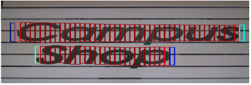
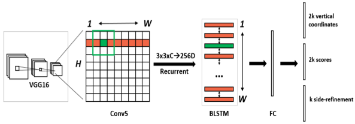

# CTPN

## 模型介绍

CTPN(Connectionist Text Proposal Network)[1]是目标检测算法[Faster R-CNN](https://arxiv.org/abs/1506.01497) 的改进算法，用于文字检测。CTPN根据文本区域的特点做了专门的优化：

* 使用更加符合自然场景文字检测特点的anchor（相比于物体，文字尺寸小）；
* 引入RNN用于处理场景文字检测中存在的序列特征；
* 引入Side-refinement(边界优化)提升文本框边界预测精度。

## 模型结构

CTPN采用的方法是将文本行分割成一个个小块（长度是固定的），然后去检测这些小块，最后使用一种文本行构造法将所有块连起来，如 **图1** 所示。

 图1 CTPN 序列特征 

CTPN网络结构如 **图2** 所示：

 图2 CTPN网络结构示意图 

整个检测分为5步：

1）准备数据集、并获取锚点anchor；

2）输入图片，经过backbone（用VGG16的前5个Conv stage，即Conv5），提取图片feature map。经过VGG16之后得到的特征图长宽是原图的1/16，通道是512。

3）在Conv5得到的feature map上再做卷积核大小为3，步长为1的卷积，进一步提取特征，用于预测当前卷积核所在位置k个anchor对应的类别信息、位置信息。其中，C表示通道数。

4）把每一行的所有窗口对应的3\*3*C的特征输入到BiLSTM（双向LSTM）网络中，提取文字的序列特征，这时候得到的特征是图像特征和序列特征的融合。

5）将第三步得到的特征输入到FC全连接层，并将FC层特征输入两个分类或者回归层中。

CTPN任务1的输出是 $$ 2k $$  ，用于预测候选区域box的起始$$y$$坐标和高度$$h$$ ；任务2是用来对前景和背景两个任务的分类评分；任务3是  $$k$$个输出的side-refinement的偏移(offset)预测。

## 模型loss

CTPN 的 loss 分为三部分：
  * Ls：预测每个 anchor 是否包含文本区域的classification loss，采用交叉熵损失；

  * Lv：文本区域中每个 anchor 的中心y坐标cy与高度h的regression loss，采用Smooth L1；

  * Lo：文本区域两侧 anchor 的中心x坐标cx 的regression loss，采用Smooth L1。

    公式如下：

    $L(s_{i},V_{j},O_{k})=\frac{1}{N_{s}}\sum\limits_{i}L^{cl}_{S}(S_{i},S^{*}_{i})+\frac{λ_{1}}{N_{v}}\sum\limits_{j}L^{re}_{V}(V_{j},V^{*}_{j})+\frac{λ_{2}}{N_{o}}\sum\limits_{k}L^{re}_{O}(O_{k},O^{*}_{k})$

    其中，i 表示预测的所有pn_anchor中的第 i 个 ，Ns表示 pn_anchor 的数量。

    j 表示 IoU>0.5 的所有 pn_anchor 中的第 j 个，$v_{j}$为判断有文本的pn_anchor，Nv 表示和 groudtruth 的 vertical IOU>0.5 的 pn_anchor 的数量。λ1 为多任务的平衡参数，一般取值1.0。

    Lo 只针对位于在文本区域的左边界和右边界的pn_anchor，来精修边缘。

## 模型缺点

* 对于非水平的文本的检测效果不好

## 参考文献

[1] [Detecting Text in Natural Image with Connectionist Text Proposal Network](https://arxiv.org/pdf/1609.03605.pdf)
