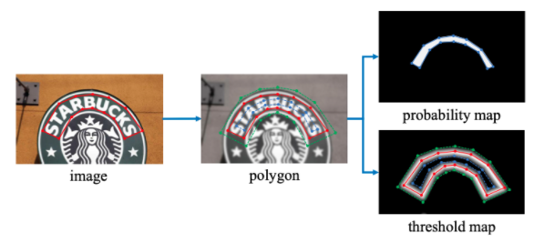
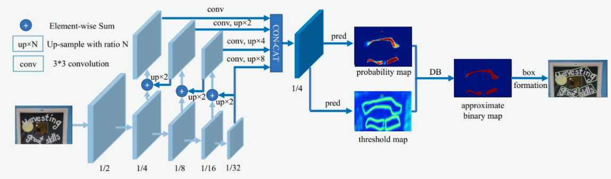
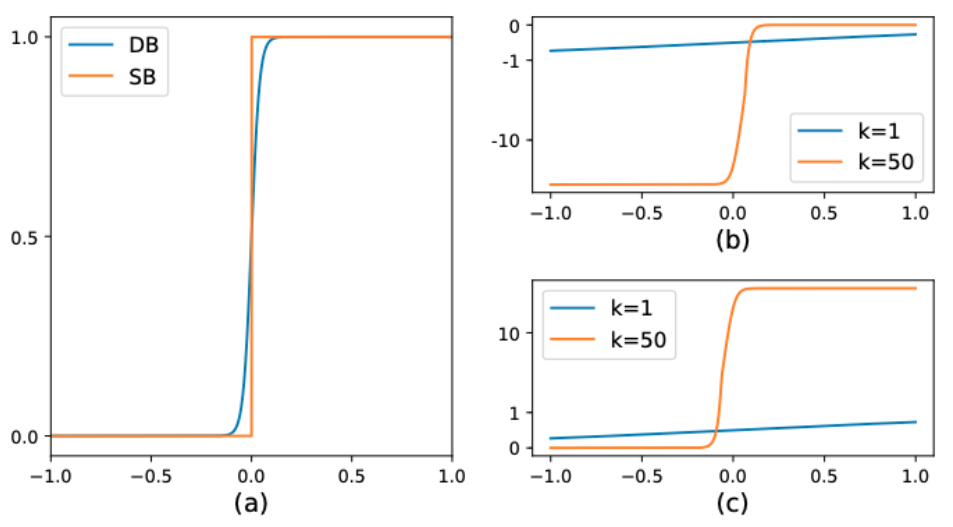

# DBNet

## 背景介绍

一般分割算法流程是先通过网络输出文本分割的概率图，然后使用预先设定好的阈值将概率图转换为二值图，最后使用后处理操作将像素级的结果转换为检测结果。然而，这样就会使得算法性能很大程度上取决于二值化时阈值的选择。

DBNet[1]对这个流程进行了优化，对每个像素点进行自适应二值化，二值化的阈值由网络学习得到，彻底将二值化这一步骤加入到网络里一起训练，这样最终的输出图对于阈值就会非常鲁棒。

## 模型输入标签

DB网络中，网络的输出为3个部分：概率图、阈值图和近似二值图：

* 概率图：图中每个像素点的值为该位置属于文本区域的概率。

* 阈值图：图中每个像素点的值为该位置的二值化阈值。

* 二值图：由概率图和阈值图通过DB算法计算得到，图中像素的值为0或1。

在构造损失函数时，我们需要获取对应的真实标签。阈值图的标签$$G_{d}$$，概率图标签$$G_{s}$$。DB网络中，标签的获取方式参考了PSENet(Progressive Scale Expansion Network,渐进式尺度扩展网络)中的方法，使用扩张和收缩的方式分别获取上述两个真实标签。标签的构造过程如 **图1** 所示：

 图1 DB标签构造示意图 

在该方法中，对于一幅文字图像，文本区域的每个多边形使用一组线段$G=\{S_k\}^n_{k=1}$来进行描述，n为线段个数。如 **图1** 所示，$n=14$。

概率图标签$G_s$的获取方法使用了Vatti clipping算法，该算法常用于收缩多边形，其中，收缩的偏移量D可以使用周长L和面积A计算得到，公式如下：
$$
D = \frac{A(1-r^2)}{L}
$$
其中，r为收缩因子，实验中根据经验设置为0.4。

在阈值图标签$G_d$的计算中，首先使用概率图标签$G_s$的计算过程中得到的偏移量D进行多边形的扩充，然后计算$G_d$与$G_s$之间的像素到原始框最近边的归一化距离，最后将其中的值进行缩放，得到的就是最终的阈值图标签$G_d$。

## 模型介绍

DB文本检测模型使用了标准的FPN结构，网络结构如 **图2** 所示。

 图2 DB模型网络结构示意图 

1. 第一模块：使用CNN网络，对输入图像提取特征，得到特征图，本实验使用的骨干网络是轻量化网络MobileNetv3，同时使用了FPN结构，获取多尺度的特征，在本实验中，我们提取4个不同尺度下的特征图做拼接。
2. 第二模块：使用一个卷积层和两个转置卷积层的结构获取预测的概率图和阈值图；
3. 第三模块：使用**DB方法**获取近似二值图。

> 注：这里的DB方法和本文的DB模型是有差别的，本文提出的DB方法为可微二值化（Differentiable Binarization），接下来将会详细解释。

在传统的图像分割算法中，我们获取概率图后，会使用标准二值化（Standard Binarize）方法进行处理，将低于阈值的像素点置0，高于阈值的像素点置1，公式如下：
$$ B_{i,j}=\left\{
\begin{aligned}
1 , if P_{i,j} >= t ,\\
0 , otherwise
\end{aligned}
\right.$$

但是标准的二值化方法是不可微的，所以也就无法放入到网络中进行优化。因此，本文中提出了可微二值化（Differentiable Binarization），简称DB方法。可微二值化也就是将标准二值化中的阶跃函数进行了近似，使用如下公式进行代替：

$$\hat{B} = \frac{1}{1 + e^{-k(P_{i,j}-T_{i,j})}}$$

其中，P是上文中获取的概率图，T是上文中获取的阈值图，k是增益因子，在实验中，根据经验选取为50。

标准二值化和可微二值化的对比图如 **图3(a)** 所示。

之所以DB方法会改善算法性能，我们可以在反向传播时梯度的计算上进行观察。当使用交叉熵损失时，正负样本的loss分别为 $l_+$ 和 $l_-$ 

$$ l_+ = -log(\frac{1}{1 + e^{-k(P_{i,j}-T_{i,j})}})$$

$$l_- = -log(1-\frac{1}{1 + e^{-k(P_{i,j}-T_{i,j})}})$$

我们对输入x求偏导，则会得到：

$$\frac{\delta{l_+}}{\delta{x}} = -kf(x)e^{-kx}$$

$$\frac{\delta{l_-}}{\delta{x}} = -kf(x)$$
此时，由于有了增强因子k，错误预测对梯度的影响也就被放大了，从而可以促进模型的优化过程并产生更为清晰的预测结果。**图3(b)** 中，$x<0$ 的部分为正样本预测为负样本的情况，可以看到，增益因子k将梯度进行了放大；而 **图3(c)** 中$x>0$ 的部分为负样本预测为正样本的情况，梯度同样也被放大了。

 图3 DB算法示意图 

在训练阶段，使用3个预测图与真实标签共同完成损失函数的计算以及模型训练；在预测阶段，只需要使用概率图，通过一系列的后处理方式即可获得最终的预测结果。

由于网络预测的概率图是经过收缩后的结果，所以在后处理步骤中，使用相同的偏移值将预测的多边形区域进行扩张，即可得到最终的文本框。

## 模型loss

由于训练阶段获取了3个预测图，所以在损失函数中，也需要结合这3个预测图与它们对应的真实标签分别构建3部分损失函数。总的损失函数的公式定义如下:

$$L = L_b + \alpha \times L_s + \beta \times L_t$$

其中，$L$为总的损失，$L_b$为近似二值图的损失，使用 Dice 损失；$L_s$为概率图损失，使用带 OHEM 的 Dice 损失；$L_t$为阈值图损失，使用预测值和标签间的$L_1$距离。其中，$\alpha$和$\beta$为权重系数。

接下来分析这3个loss：

1）首先是Dice Loss，Dice Loss是比较预测结果跟标签之间的相似度，常用于二值图像分割。

$dice\_loss = 1 - \frac{2 \times intersection\_area}{total\_area}$

2）其次是MaskL1 Loss，是计算预测值和标签间的$L_1$距离

2）最后是Balance Loss，是带OHEM的Dice Loss，目的是为了改善正负样本不均衡的问题。OHEM为一种特殊的自动采样方式，可以自动的选择难样本进行loss的计算，从而提升模型的训练效果。

## 模型优缺点

### 优点

* 可以同时检测水平、多方向和弯曲文字；
* 在性能和速度上都获取不错的效果。

## 参考文献

[1] [Real-time Scene Text Detection with Differentiable Binarization](https://arxiv.org/pdf/1911.08947.pdf)

