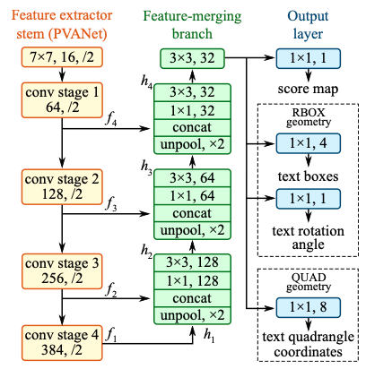

# EAST

## 模型介绍

CTPN在水平文本的检测方面效果比较好，但是对于竖直方向的文本，或者多方向的文本，CTPN检测就很差。然而，在实际场景中，我们会遇到多种存在竖直方向文本的情况，例如很多书本封面的文本，如 **图1** 所示。

图1 多方案文本示意图
>

因此，很多学者也提出了各种改进方法，其中，比较经典一篇的就是旷世科技在2017年提出来的EAST[1]模型。

## 模型结构

  EAST的网络结构总共包含三个部分：Feature extractor stem（特征提取分支）, Feature-merging branch（特征合并分支） 以及 Output layer（输出层），网络结构如 **图2** 所示：

图2 EAST网络结构示意图

每一部分网络结构：

1）特征提取分支

* 使用backbone网络提取特征，论文默认backbone为PVANet；

> 也可以使用其他的卷积网络，比如VGG16等

2）特征合并分支

由于在一张图片中，各个文字尺寸大小不一致，所以需要融合不同层次的特征图，小文字的预测需要用到底层的语义信息，大文字的预测要用到高层的语义信息。

* 上一步提取的feature map f1被最先送入unpool层(将原特征图放大２倍)；

* 然后与前一层的feature map f2进行拼接；
* 接着依次送入卷积核大小为1×1和3×3的卷积层，核数通道数随着层递减，依次为128，64，32；
* 重复上面三个步骤２次；
* 最后将经过一个卷积核大小为3×3，核数通道数为32个的卷积层；

3）输出层

网络层的输出包含文本得分和文本形状，根据不同的文本形状又分为RBOX和QUAD两种情况：

* RBOX：主要用来预测旋转矩形的文本，包含文本得分和文本形状(AABB boundingbox 和rotate angle)，一共有６个输出，这里AABB分别表示相对于top，right，bottom，left的偏移；

* QUAD：用来预测不规则四边形的文本，包含文本得分和文本形状(８个相对于corner vertices的偏移)，一共有９个输出，其中QUAD有８个，分别为 $$(x_{i},y_{i}),i\in[1,2,3,4]$$。

## 模型loss

EAST损失函数由两部分组成，具体公式如下：

$$L=L_{s}+λ_{g}L_{g}$$

其中，$$L_{s}$$为分数图损失，$$L_{g}$$为几何损失，$$λ_{g}$$表示两个损失之间的重要性。

### 分数图损失

使用类平衡交叉熵：

$$L_{s} = -\beta Y^{*}log(\hat{Y})-(1-\beta)（1-Y^*）log(1-\hat{Y})$$

#### 几何损失

* RBOX：IOU损失

$$L_{AABB} = -log\frac{\hat{R}\cap R^*}{\hat{R}\cup R^*}$$

选转角度损失计算：$L_{\theta}(\hat{\theta},\theta^*) = 1-cos(\hat{\theta}-\theta^*)$

$$L_g=L_{AABB} + \lambda L_\theta$$

其中$\hat{R}$代表预测的AABB几何形状**，**$R^*$为其对应的地面真实情况。

* QUAD：smooth L1损失

$$ L_g = \min\limits_{\tilde{Q}\in P_{Q^*}} \sum\limits_{c_i \in C_Q, \tilde c_i \in C_\tilde Q}\frac{smoothed_{L_1}(c_i, \tilde{c}_i)}{8*N_{Q^*}} $$

其中$N_{Q^*}$是四边形的短边长度，公式如下：

$$N_{Q^*} = \min\limits_{i=1}^{4} D(p_i, p_{(i mode 4)+1})$$

## 模型优缺点

### 优点

* 可以检测多方向的文本

### 缺点

* 不能检测弯曲文本

## 参考文献

[1] [EAST: An Efficient and Accurate Scene Text Detector](https://arxiv.org/pdf/1704.03155.pdf)

