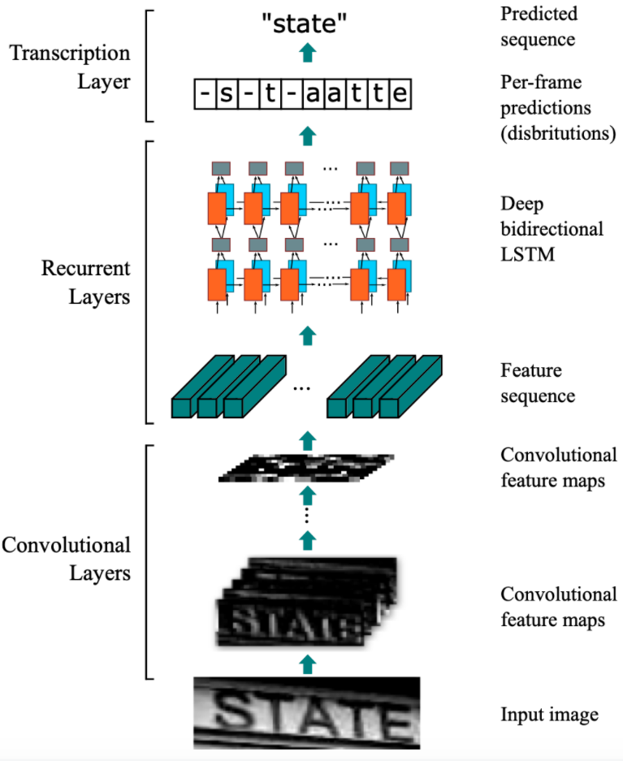

# CRNN

## 模型介绍

传统的文本识别方法需要先对单个文字进行切割，然后再对单个文字进行识别。本实验使用的是图像文本识别的经典算法CRNN[1]。CRNN是2015年被提出的，到目前为止还是被广泛应用。该算法的主要思想是认为文本识别其实需要对序列进行预测，所以采用了预测序列常用的RNN网络。算法通过CNN提取图片特征，然后采用RNN对序列进行预测，最终使用CTC方法得到最终结果。

## 模型结构

CRNN的主要结构包括基于CNN的图像特征提取模块以及基于多层双向LSTM的文字序列特征提取模块。CRNN的网络结构如 **图1** 所示：

图1 CRNN模型网络结构示意图

1）第一模块：使用CNN网络，对输入图像进行特征提取，从而得到特征图。本实验使用的CNN网络同样是轻量化网络MobileNetv3，其中输入图像的高度统一设置为32，宽度可以为任意长度，经过CNN网络后，特征图的高度缩放为1；

2）第二模块：Im2Seq，将CNN获取的特征图变换为RNN需要的特征向量序列的形状；

3）第三模块：使用双向LSTM（BiLSTM）对特征序列进行预测，学习序列中的每个特征向量并输出预测标签分布。这里其实相当于把特征向量的宽度视为LSTM中的时间维度；

4）第四模块：使用全连接层获取模型的预测结果；

5）第五模块：CTC转录层，解码模型输出的预测结果，得到最终输出。

## 模型loss

为了解决预测标签与真实标签无法对齐的问题，这里使用了CTC loss进行模型，具体参考：[CTC算法](https://paddlepedia.readthedocs.io/en/latest/tutorials/deep_learning/loss_functions/CTC.html)

## 模型优缺点

### 优点

* 可以进行端到端的训练；

* 可以进行不定长文本的识别；

* 模型简单，效果好。

### 缺点

* 受CTC算法对速度的要求，输出长度受到限制，识别文本不能太长。

## 参考文献

[1] [An End-to-End Trainable Neural Network for Image-based SequenceRecognition and Its Application to Scene Text Recognition](https://arxiv.org/pdf/1507.05717v1.pdf)

