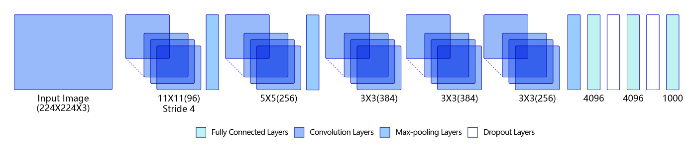
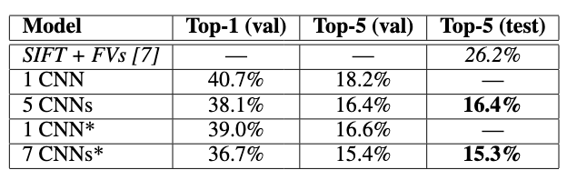

# AlexNet

## 模型介绍

AlexNet<sup>[1]</sup>是2012年ImageNet竞赛的冠军模型，其作者是神经网络领域三巨头之一的Hinton和他的学生Alex Krizhevsky。

AlexNet以极大的优势领先2012年ImageNet竞赛的第二名，也因此给当时的学术界和工业界带来了很大的冲击。此后，更多更深的神经网络相继被提出，比如优秀的VGG，GoogLeNet，ResNet等。 

## 模型结构

AlexNet与此前的LeNet相比，具有更深的网络结构，包含5层卷积和3层全连接，具体结构如 **图1** 所示。



<center>图1 AlexNet模型网络结构示意图</center><br></br>

1）第一模块：对于$224\times 224$的彩色图像，先用96个$11\times 11\times 3$的卷积核对其进行卷积，提取图像中包含的特征模式（步长为4，填充为2，得到96个$54\times 54$的卷积结果（特征图）；然后以$2\times 2$大小进行池化，得到了96个$27\times 27$大小的特征图；

2）第二模块：包含256个$5\times 5$的卷积和$2\times 2$池化，卷积操作后图像尺寸不变，经过池化后，图像尺寸变成$13\times 13$；

3）第三模块：包含384个$3\times 3$的卷积，卷积操作后图像尺寸不变；

4）第四模块：包含384个$3\times 3$的卷积，卷积操作后图像尺寸不变；

5）第五模块：包含256个$3\times 3$的卷积和$2\times 2$的池化，卷积操作后图像尺寸不变，经过池化后变成256个$6\times 6$大小的特征图。

将经过第5次卷积提取到的特征图输入到全连接层，得到原始图像的向量表达。前两个全连接层的输出神经元的个数是4096，第三个全连接层的输出神经元个数是分类标签的类别数（ImageNet比赛的分类类别数是1000），然后使用Softmax激活函数即可计算出每个类别的预测概率。

## 模型实现

基于Paddle框架，AlexNet的具体实现的代码如下所示：


```python
# -*- coding:utf-8 -*-

# 导入需要的包
import paddle
import numpy as np
from paddle.nn import Conv2D, MaxPool2D, Linear, Dropout
## 组网
import paddle.nn.functional as F

# 定义 AlexNet 网络结构
class AlexNet(paddle.nn.Layer):
    def __init__(self, num_classes=1):
        super(AlexNet, self).__init__()
        # AlexNet与LeNet一样也会同时使用卷积和池化层提取图像特征
        # 与LeNet不同的是激活函数换成了‘relu’
        self.conv1 = Conv2D(in_channels=3, out_channels=96, kernel_size=11, stride=4, padding=5)
        self.max_pool1 = MaxPool2D(kernel_size=2, stride=2)
        self.conv2 = Conv2D(in_channels=96, out_channels=256, kernel_size=5, stride=1, padding=2)
        self.max_pool2 = MaxPool2D(kernel_size=2, stride=2)
        self.conv3 = Conv2D(in_channels=256, out_channels=384, kernel_size=3, stride=1, padding=1)
        self.conv4 = Conv2D(in_channels=384, out_channels=384, kernel_size=3, stride=1, padding=1)
        self.conv5 = Conv2D(in_channels=384, out_channels=256, kernel_size=3, stride=1, padding=1)
        self.max_pool5 = MaxPool2D(kernel_size=2, stride=2)

        self.fc1 = Linear(in_features=12544, out_features=4096)
        self.drop_ratio1 = 0.5
        self.drop1 = Dropout(self.drop_ratio1)
        self.fc2 = Linear(in_features=4096, out_features=4096)
        self.drop_ratio2 = 0.5
        self.drop2 = Dropout(self.drop_ratio2)
        self.fc3 = Linear(in_features=4096, out_features=num_classes)
    
    def forward(self, x):
        x = self.conv1(x)
        x = F.relu(x)
        x = self.max_pool1(x)
        x = self.conv2(x)
        x = F.relu(x)
        x = self.max_pool2(x)
        x = self.conv3(x)
        x = F.relu(x)
        x = self.conv4(x)
        x = F.relu(x)
        x = self.conv5(x)
        x = F.relu(x)
        x = self.max_pool5(x)
        x = paddle.reshape(x, [x.shape[0], -1])
        x = self.fc1(x)
        x = F.relu(x)
        # 在全连接之后使用dropout抑制过拟合
        x = self.drop1(x)
        x = self.fc2(x)
        x = F.relu(x)
        # 在全连接之后使用dropout抑制过拟合
        x = self.drop2(x)
        x = self.fc3(x)
        return x

```

## 模型特点

AlexNet中包含了几个比较新的技术点，也首次在CNN中成功应用了ReLU、Dropout和LRN等Trick。同时AlexNet也使用了GPU进行运算加速。

AlexNet将LeNet的思想发扬光大，把CNN的基本原理应用到了很深很宽的网络中。AlexNet主要使用到的新技术点如下：

- 成功使用**ReLU**作为CNN的激活函数，并验证其效果在较深的网络超过了Sigmoid，成功解决了Sigmoid在网络较深时的梯度弥散问题。虽然ReLU激活函数在很久之前就被提出了，但是直到AlexNet的出现才将其发扬光大。
- 训练时使用**Dropout**随机忽略一部分神经元，以避免模型过拟合。Dropout虽有单独的论文论述，但是AlexNet将其实用化，通过实践证实了它的效果。在AlexNet中主要是最后几个全连接层使用了Dropout。
- 在CNN中使用重叠的**最大池化**。此前CNN中普遍使用平均池化，AlexNet全部使用最大池化，避免平均池化的模糊化效果。并且AlexNet中提出让步长比池化核的尺寸小的观点，这样池化层的输出之间会有重叠和覆盖，提升了特征的丰富性。
- 提出了**LRN局部响应归一化层**，对局部神经元的活动创建竞争机制，使得其中响应比较大的值变得相对更大，并抑制其他反馈较小的神经元，增强了模型的泛化能力。
- 使用**CUDA**加速深度卷积网络的训练，利用GPU强大的并行计算能力，处理神经网络训练时大量的矩阵运算。AlexNet使用了两块GTX 580 GPU进行训练，单个GTX 580只有3GB显存，这限制了可训练的网络的最大规模。因此作者将AlexNet分布在两个GPU上，在每个GPU的显存中储存一半的神经元的参数。因为GPU之间通信方便，可以互相访问显存，而不需要通过主机内存，所以同时使用多块GPU也是非常高效的。同时，AlexNet的设计让GPU之间的通信只在网络的某些层进行，控制了通信的性能损耗。 
- 使用**数据增强**，随机地从$256\times 256$ 大小的原始图像中截取$224\times 224$大小的区域（以及水平翻转的镜像），相当于增加了$2\times (256-224)^2=2048$倍的数据量。如果没有数据增强，仅靠原始的数据量，参数众多的CNN会陷入过拟合中，使用了数据增强后可以大大减轻过拟合，提升泛化能力。进行预测时，则是取图片的四个角加中间共5个位置，并进行左右翻转，一共获得10张图片，对他们进行预测并对10次结果求均值。同时，AlexNet论文中提到了会对图像的RGB数据进行PCA处理，并对主成分做一个标准差为0.1的高斯扰动，增加一些噪声，这个Trick可以让错误率再下降1%。

## 模型指标

AlexNet 作为 ImageNet 2012比赛的冠军算法，在 ImageNet 测试集上达到了 15.3% 的 top-5 error rate，远远超过第二名（SIFT+FVs）的 26.2% 。如 **图2** 所示。



<center>图2 AlexNet模型指标</center><br></br>

## 参考文献

[1] [Imagenet classification with deep convolutional neural networks. ](https://www.nvidia.cn/content/tesla/pdf/machine-learning/imagenet-classification-with-deep-convolutional-nn.pdf)

