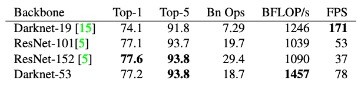

# DarkNet

## 模型介绍

在目标检测领域的YOLO系列算法中，作者为了达到更好的分类效果，自己设置并训练了DarkNet网络作为骨干网络。其中，YOLOv2<sup>[1]</sup>首次提出DarkNet网络，由于其具有19个卷积层，所以也称之为DarkNet19。后来在YOLOv3<sup>[2]</sup>中，作者继续吸收了当前优秀算法的思想，如残差网络和特征融合等，提出了具有53个卷积层的骨干网络DarkNet53。作者在ImageNet上进行了实验，发现相较于ResNet-152和ResNet-101，DarkNet53在分类精度差不多的前提下，计算速度取得了领先。

## 模型结构

### DarkNet19

DarkNet19中，借鉴了许多优秀算法的经验，比如：借鉴了VGG的思想，使用了较多的$3\times 3$卷积，在每一次池化操作后，将通道数翻倍；借鉴了network in network的思想，使用全局平均池化（global average pooling）做预测，并把$1\times 1$的卷积核置于$3\times 3$的卷积核之间，用来压缩特征；同时，使用了批归一化层稳定模型训练，加速收敛，并且起到正则化作用。DarkNet19的网络结构如 **图1** 所示。


<center>图1 DarkNet19模型网络结构示意图</center><br></br>

DarkNet19精度与VGG网络相当，但浮点运算量只有其 $\frac{1}{5}$ 左右，因此运算速度极快。

### DarkNet53

DarkNet53在之前的基础上，借鉴了ResNet的思想，在网络中大量使用了残差连接，因此网络结构可以设计的很深，并且缓解了训练中梯度消失的问题，使得模型更容易收敛。同时，使用步长为2的卷积层代替池化层实现降采样。DarkNet53的网络结构如 **图2** 所示。


<center>图2 DarkNet53模型网络结构示意图</center><br></br>

考虑到当前 Darknet19 网络使用频率较低，接下来主要针对Darknet53网络进行实现与讲解。

## 模型实现

基于Paddle框架，DarkNet53的具体实现的代码如下所示：

```python
import paddle
from paddle import ParamAttr
import paddle.nn as nn
import paddle.nn.functional as F
from paddle.nn import Conv2D, BatchNorm, Linear, Dropout
from paddle.nn import AdaptiveAvgPool2D, MaxPool2D, AvgPool2D
from paddle.nn.initializer import Uniform
import math

# 将卷积和批归一化封装为ConvBNLayer，方便后续复用
class ConvBNLayer(nn.Layer):
    def __init__(self,
                 input_channels,
                 output_channels,
                 filter_size,
                 stride,
                 padding,
                 name=None):
      	# 初始化函数
        super(ConvBNLayer, self).__init__()
				# 创建卷积层
        self._conv = Conv2D(
            in_channels=input_channels,
            out_channels=output_channels,
            kernel_size=filter_size,
            stride=stride,
            padding=padding,
            weight_attr=ParamAttr(name=name + ".conv.weights"),
            bias_attr=False)
				# 创建批归一化层
        bn_name = name + ".bn"
        self._bn = BatchNorm(
            num_channels=output_channels,
            act="relu",
            param_attr=ParamAttr(name=bn_name + ".scale"),
            bias_attr=ParamAttr(name=bn_name + ".offset"),
            moving_mean_name=bn_name + ".mean",
            moving_variance_name=bn_name + ".var")

    def forward(self, inputs):
      	# 前向计算
        x = self._conv(inputs)
        x = self._bn(x)
        return x

# 定义残差块
class BasicBlock(nn.Layer):
    def __init__(self, input_channels, output_channels, name=None):
      	# 初始化函数
        super(BasicBlock, self).__init__()
				# 定义两个卷积层
        self._conv1 = ConvBNLayer(
            input_channels, output_channels, 1, 1, 0, name=name + ".0")
        self._conv2 = ConvBNLayer(
            output_channels, output_channels * 2, 3, 1, 1, name=name + ".1")

    def forward(self, inputs):
      	# 前向计算
        x = self._conv1(inputs)
        x = self._conv2(x)
        # 将第二个卷积层的输出和最初的输入值相加
        return paddle.add(x=inputs, y=x)


class DarkNet53(nn.Layer):
    def __init__(self, class_dim=1000):
      	# 初始化函数
        super(DarkNet, self).__init__()
				# DarkNet 每组残差块的个数，来自DarkNet的网络结构图
        self.stages = [1, 2, 8, 8, 4]
        # 第一层卷积
        self._conv1 = ConvBNLayer(3, 32, 3, 1, 1, name="yolo_input")
        # 下采样，使用stride=2的卷积来实现
        self._conv2 = ConvBNLayer(
            32, 64, 3, 2, 1, name="yolo_input.downsample")
				# 添加各个层级的实现
        self._basic_block_01 = BasicBlock(64, 32, name="stage.0.0")
        # 下采样，使用stride=2的卷积来实现
        self._downsample_0 = ConvBNLayer(
            64, 128, 3, 2, 1, name="stage.0.downsample")

        self._basic_block_11 = BasicBlock(128, 64, name="stage.1.0")
        self._basic_block_12 = BasicBlock(128, 64, name="stage.1.1")
        # 下采样，使用stride=2的卷积来实现
        self._downsample_1 = ConvBNLayer(
            128, 256, 3, 2, 1, name="stage.1.downsample")

        self._basic_block_21 = BasicBlock(256, 128, name="stage.2.0")
        self._basic_block_22 = BasicBlock(256, 128, name="stage.2.1")
        self._basic_block_23 = BasicBlock(256, 128, name="stage.2.2")
        self._basic_block_24 = BasicBlock(256, 128, name="stage.2.3")
        self._basic_block_25 = BasicBlock(256, 128, name="stage.2.4")
        self._basic_block_26 = BasicBlock(256, 128, name="stage.2.5")
        self._basic_block_27 = BasicBlock(256, 128, name="stage.2.6")
        self._basic_block_28 = BasicBlock(256, 128, name="stage.2.7")
        # 下采样，使用stride=2的卷积来实现
        self._downsample_2 = ConvBNLayer(
            256, 512, 3, 2, 1, name="stage.2.downsample")

        self._basic_block_31 = BasicBlock(512, 256, name="stage.3.0")
        self._basic_block_32 = BasicBlock(512, 256, name="stage.3.1")
        self._basic_block_33 = BasicBlock(512, 256, name="stage.3.2")
        self._basic_block_34 = BasicBlock(512, 256, name="stage.3.3")
        self._basic_block_35 = BasicBlock(512, 256, name="stage.3.4")
        self._basic_block_36 = BasicBlock(512, 256, name="stage.3.5")
        self._basic_block_37 = BasicBlock(512, 256, name="stage.3.6")
        self._basic_block_38 = BasicBlock(512, 256, name="stage.3.7")
        # 下采样，使用stride=2的卷积来实现
        self._downsample_3 = ConvBNLayer(
            512, 1024, 3, 2, 1, name="stage.3.downsample")

        self._basic_block_41 = BasicBlock(1024, 512, name="stage.4.0")
        self._basic_block_42 = BasicBlock(1024, 512, name="stage.4.1")
        self._basic_block_43 = BasicBlock(1024, 512, name="stage.4.2")
        self._basic_block_44 = BasicBlock(1024, 512, name="stage.4.3")
				# 自适应平均池化
        self._pool = AdaptiveAvgPool2D(1)

        stdv = 1.0 / math.sqrt(1024.0)
        # 分类层
        self._out = Linear(
            1024,
            class_dim,
            weight_attr=ParamAttr(
                name="fc_weights", initializer=Uniform(-stdv, stdv)),
            bias_attr=ParamAttr(name="fc_offset"))

    def forward(self, inputs):
        x = self._conv1(inputs)
        x = self._conv2(x)

        x = self._basic_block_01(x)
        x = self._downsample_0(x)

        x = self._basic_block_11(x)
        x = self._basic_block_12(x)
        x = self._downsample_1(x)

        x = self._basic_block_21(x)
        x = self._basic_block_22(x)
        x = self._basic_block_23(x)
        x = self._basic_block_24(x)
        x = self._basic_block_25(x)
        x = self._basic_block_26(x)
        x = self._basic_block_27(x)
        x = self._basic_block_28(x)
        x = self._downsample_2(x)

        x = self._basic_block_31(x)
        x = self._basic_block_32(x)
        x = self._basic_block_33(x)
        x = self._basic_block_34(x)
        x = self._basic_block_35(x)
        x = self._basic_block_36(x)
        x = self._basic_block_37(x)
        x = self._basic_block_38(x)
        x = self._downsample_3(x)

        x = self._basic_block_41(x)
        x = self._basic_block_42(x)
        x = self._basic_block_43(x)
        x = self._basic_block_44(x)

        x = self._pool(x)
        x = paddle.squeeze(x, axis=[2, 3])
        x = self._out(x)
        return x

```

## 模型特点

- DarkNet53模型使用了大量的残差连接，缓解了训练中梯度消失的问题，使得模型更容易收敛。
- DarkNet53模型使用步长为2的卷积层代替池化层实现降采样。

## 模型指标

在 YOLOv3 论文中，作者在 ImageNet 数据集上对比了 DarkNet 网络与ResNet 网络的精度及速度，如图3所示。可以看到DarkNet53的top-5准确率可以达到93.8%，同时速度也明显超过了ResNet101和ResNet152。



<center>图3 DarkNet模型指标</center><br></br>

## 参考文献

[1] [YOLO9000: Better, Faster, Stronger](https://arxiv.org/abs/1612.08242)

[2] [YOLOv3: An Incremental Improvement](https://pjreddie.com/media/files/papers/YOLOv3.pdf)

