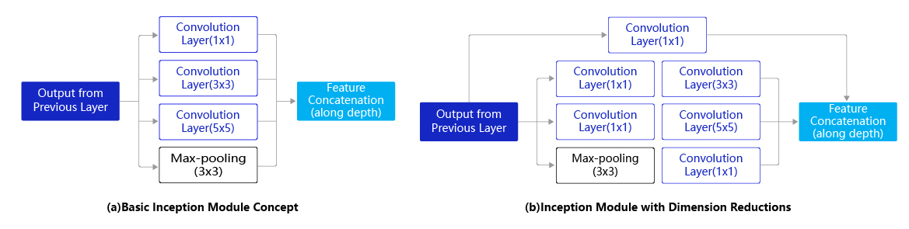
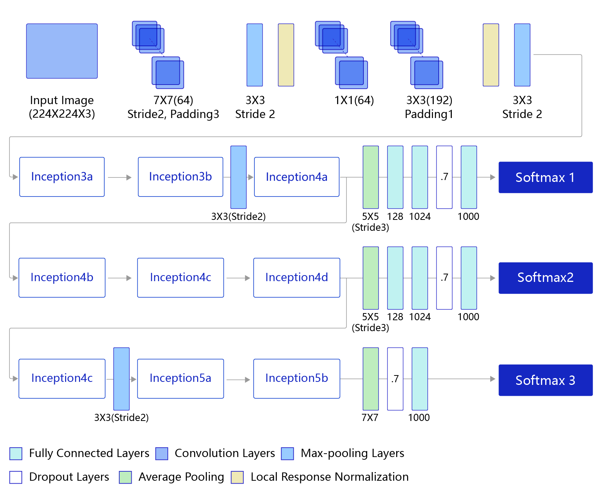
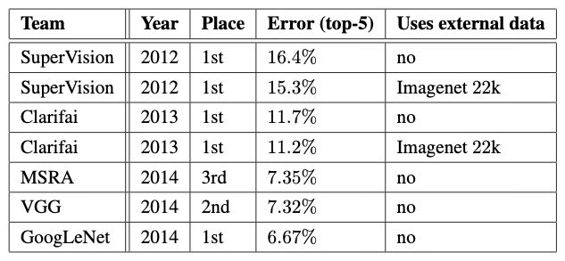

# GoogLeNet

## 模型介绍

GoogLeNet<sup>[1]</sup>是2014年ImageNet比赛的冠军，它的主要特点是网络不仅有深度，还在横向上具有“宽度”。从名字GoogLeNet可以知道这是来自谷歌工程师所设计的网络结构，而名字中GoogLeNet更是致敬了LeNet。GoogLeNet中最核心的部分是其内部子网络结构Inception，该结构灵感来源于NIN(Network In Network)。

## 模型结构

由于图像信息在空间尺寸上的巨大差异，如何选择合适的卷积核来提取特征就显得比较困难了。空间分布范围更广的图像信息适合用较大的卷积核来提取其特征；而空间分布范围较小的图像信息则适合用较小的卷积核来提取其特征。为了解决这个问题，GoogLeNet提出了一种被称为Inception模块的方案。如 **图1** 所示：

------

**说明：**

- Google的研究人员为了向LeNet致敬，特地将模型命名为GoogLeNet。

- Inception一词来源于电影《盗梦空间》（Inception）。

  

<center>图1 Inception模块结构示意图</center><br></br>

图1(a)是Inception模块的设计思想，使用3个不同大小的卷积核对输入图片进行卷积操作，并附加最大池化，将这4个操作的输出沿着通道这一维度进行拼接，构成的输出特征图将会包含经过不同大小的卷积核提取出来的特征，从而达到捕捉不同尺度信息的效果。Inception模块采用多通路(multi-path)的设计形式，每个支路使用不同大小的卷积核，最终输出特征图的通道数是每个支路输出通道数的总和，这将会导致输出通道数变得很大，尤其是使用多个Inception模块串联操作的时候，模型参数量会变得非常大。

为了减小参数量，Inception模块使用了图(b)中的设计方式，在每个3x3和5x5的卷积层之前，增加1x1的卷积层来控制输出通道数；在最大池化层后面增加1x1卷积层减小输出通道数。基于这一设计思想，形成了上图(b)中所示的结构。下面这段程序是Inception块的具体实现方式，可以对照图(b)和代码一起阅读。

------

**提示：**

可能有读者会问，经过3x3的最大池化之后图像尺寸不会减小吗，为什么还能跟另外3个卷积输出的特征图进行拼接？这是因为池化操作可以指定窗口大小$k_h = k_w = 3$，stride=1和padding=1，输出特征图尺寸可以保持不变。

------


Inception模块的具体实现如下代码所示：


```python
# GoogLeNet模型代码
import numpy as np
import paddle
from paddle.nn import Conv2D, MaxPool2D, AdaptiveAvgPool2D, Linear
## 组网
import paddle.nn.functional as F

# 定义Inception块
class Inception(paddle.nn.Layer):
    def __init__(self, c0, c1, c2, c3, c4, **kwargs):
        '''
        Inception模块的实现代码，
        
        c1,图(b)中第一条支路1x1卷积的输出通道数，数据类型是整数
        c2,图(b)中第二条支路卷积的输出通道数，数据类型是tuple或list, 
               其中c2[0]是1x1卷积的输出通道数，c2[1]是3x3
        c3,图(b)中第三条支路卷积的输出通道数，数据类型是tuple或list, 
               其中c3[0]是1x1卷积的输出通道数，c3[1]是3x3
        c4,图(b)中第一条支路1x1卷积的输出通道数，数据类型是整数
        '''
        super(Inception, self).__init__()
        # 依次创建Inception块每条支路上使用到的操作
        self.p1_1 = Conv2D(in_channels=c0,out_channels=c1, kernel_size=1)
        self.p2_1 = Conv2D(in_channels=c0,out_channels=c2[0], kernel_size=1)
        self.p2_2 = Conv2D(in_channels=c2[0],out_channels=c2[1], kernel_size=3, padding=1)
        self.p3_1 = Conv2D(in_channels=c0,out_channels=c3[0], kernel_size=1)
        self.p3_2 = Conv2D(in_channels=c3[0],out_channels=c3[1], kernel_size=5, padding=2)
        self.p4_1 = MaxPool2D(kernel_size=3, stride=1, padding=1)
        self.p4_2 = Conv2D(in_channels=c0,out_channels=c4, kernel_size=1)

    def forward(self, x):
        # 支路1只包含一个1x1卷积
        p1 = F.relu(self.p1_1(x))
        # 支路2包含 1x1卷积 + 3x3卷积
        p2 = F.relu(self.p2_2(F.relu(self.p2_1(x))))
        # 支路3包含 1x1卷积 + 5x5卷积
        p3 = F.relu(self.p3_2(F.relu(self.p3_1(x))))
        # 支路4包含 最大池化和1x1卷积
        p4 = F.relu(self.p4_2(self.p4_1(x)))
        # 将每个支路的输出特征图拼接在一起作为最终的输出结果
        return paddle.concat([p1, p2, p3, p4], axis=1)
```

GoogLeNet的架构如 **图2** 所示，在主体卷积部分中使用5个模块（block），每个模块之间使用步幅为2的3 ×3最大池化层来减小输出高宽。

* 第一模块使用一个64通道的7 × 7卷积层。
* 第二模块使用2个卷积层:首先是64通道的1 × 1卷积层，然后是将通道增大3倍的3 × 3卷积层。
* 第三模块串联2个完整的Inception块。
* 第四模块串联了5个Inception块。
* 第五模块串联了2 个Inception块。
* 第五模块的后面紧跟输出层，使用全局平均池化层来将每个通道的高和宽变成1，最后接上一个输出个数为标签类别数的全连接层。

-----

**说明：**
在原作者的论文中添加了图中所示的softmax1和softmax2两个辅助分类器，如下图所示，训练时将三个分类器的损失函数进行加权求和，以缓解梯度消失现象。



<center>图2 GoogLeNet模型网络结构示意图</center><br></br>

## 模型实现

GoogLeNet的具体实现如下代码所示：


```python
# GoogLeNet模型代码
import paddle
from paddle import ParamAttr
import paddle.nn as nn
import paddle.nn.functional as F
from paddle.nn import Conv2D, BatchNorm, Linear, Dropout
from paddle.nn import AdaptiveAvgPool2D, MaxPool2D, AvgPool2D
from paddle.nn.initializer import Uniform
import math

# 全连接层参数初始化
def xavier(channels, filter_size, name):
    stdv = (3.0 / (filter_size**2 * channels))**0.5
    param_attr = ParamAttr(initializer=Uniform(-stdv, stdv), name=name + "_weights")
    return param_attr


class ConvLayer(nn.Layer):
    def __init__(self,
                 num_channels,
                 num_filters,
                 filter_size,
                 stride=1,
                 groups=1,
                 act=None,
                 name=None):
        super(ConvLayer, self).__init__()

        self._conv = Conv2D(
            in_channels=num_channels,
            out_channels=num_filters,
            kernel_size=filter_size,
            stride=stride,
            padding=(filter_size - 1) // 2,
            groups=groups,
            weight_attr=ParamAttr(name=name + "_weights"),
            bias_attr=False)

    def forward(self, inputs):
        y = self._conv(inputs)
        return y

# 定义Inception块
class Inception(nn.Layer):
    def __init__(self,
                 input_channels,
                 output_channels,
                 filter1,
                 filter3R,
                 filter3,
                 filter5R,
                 filter5,
                 proj,
                 name=None):
      	'''
        Inception模块的实现代码，
        
        c1,图(b)中第一条支路1x1卷积的输出通道数，数据类型是整数
        c2,图(b)中第二条支路卷积的输出通道数，数据类型是tuple或list, 
               其中c2[0]是1x1卷积的输出通道数，c2[1]是3x3
        c3,图(b)中第三条支路卷积的输出通道数，数据类型是tuple或list, 
               其中c3[0]是1x1卷积的输出通道数，c3[1]是3x3
        c4,图(b)中第一条支路1x1卷积的输出通道数，数据类型是整数
        '''
        super(Inception, self).__init__()
				# 依次创建Inception块每条支路上使用到的操作
        self._conv1 = ConvLayer(input_channels, filter1, 1, name="inception_" + name + "_1x1")
        self._conv3r = ConvLayer(input_channels, filter3R, 1, name="inception_" + name + "_3x3_reduce")
        self._conv3 = ConvLayer(filter3R, filter3, 3, name="inception_" + name + "_3x3")
        self._conv5r = ConvLayer(input_channels, filter5R, 1, name="inception_" + name + "_5x5_reduce")
        self._conv5 = ConvLayer(filter5R, filter5, 5, name="inception_" + name + "_5x5")
        self._pool = MaxPool2D(kernel_size=3, stride=1, padding=1)
        self._convprj = ConvLayer(input_channels, proj, 1, name="inception_" + name + "_3x3_proj")

    def forward(self, inputs):
      	# 支路1只包含一个1x1卷积
        conv1 = self._conv1(inputs)
				# 支路2包含 1x1卷积 + 3x3卷积
        conv3r = self._conv3r(inputs)
        conv3 = self._conv3(conv3r)
				# 支路3包含 1x1卷积 + 5x5卷积
        conv5r = self._conv5r(inputs)
        conv5 = self._conv5(conv5r)
				# 支路4包含 最大池化和1x1卷积
        pool = self._pool(inputs)
        convprj = self._convprj(pool)
				# 将每个支路的输出特征图拼接在一起作为最终的输出结果
        cat = paddle.concat([conv1, conv3, conv5, convprj], axis=1)
        cat = F.relu(cat)
        return cat


class GoogLeNet(nn.Layer):
    def __init__(self, class_dim=1000):
        super(GoogLeNetDY, self).__init__()
        # GoogLeNet包含五个模块，每个模块后面紧跟一个池化层
        # 第一个模块包含1个卷积层
        self._conv = ConvLayer(3, 64, 7, 2, name="conv1")
        # 3x3最大池化
        self._pool = MaxPool2D(kernel_size=3, stride=2)
        # 第二个模块包含2个卷积层
        self._conv_1 = ConvLayer(64, 64, 1, name="conv2_1x1")
        self._conv_2 = ConvLayer(64, 192, 3, name="conv2_3x3")
				# 第三个模块包含2个Inception块
        self._ince3a = Inception(192, 192, 64, 96, 128, 16, 32, 32, name="ince3a")
        self._ince3b = Inception(256, 256, 128, 128, 192, 32, 96, 64, name="ince3b")
				# 第四个模块包含5个Inception块
        self._ince4a = Inception(480, 480, 192, 96, 208, 16, 48, 64, name="ince4a")
        self._ince4b = Inception(512, 512, 160, 112, 224, 24, 64, 64, name="ince4b")
        self._ince4c = Inception(512, 512, 128, 128, 256, 24, 64, 64, name="ince4c")
        self._ince4d = Inception(512, 512, 112, 144, 288, 32, 64, 64, name="ince4d")
        self._ince4e = Inception(528, 528, 256, 160, 320, 32, 128, 128, name="ince4e")
				# 第五个模块包含2个Inception块
        self._ince5a = Inception(832, 832, 256, 160, 320, 32, 128, 128, name="ince5a")
        self._ince5b = Inception(832, 832, 384, 192, 384, 48, 128, 128, name="ince5b")
				# 全局池化
        self._pool_5 = AvgPool2D(kernel_size=7, stride=7)

        self._drop = Dropout(p=0.4, mode="downscale_in_infer")
        self._fc_out = Linear(
            1024,
            class_dim,
            weight_attr=xavier(1024, 1, "out"),
            bias_attr=ParamAttr(name="out_offset"))
        self._pool_o1 = AvgPool2D(kernel_size=5, stride=3)
        self._conv_o1 = ConvLayer(512, 128, 1, name="conv_o1")
        self._fc_o1 = Linear(
            1152,
            1024,
            weight_attr=xavier(2048, 1, "fc_o1"),
            bias_attr=ParamAttr(name="fc_o1_offset"))
        self._drop_o1 = Dropout(p=0.7, mode="downscale_in_infer")
        self._out1 = Linear(
            1024,
            class_dim,
            weight_attr=xavier(1024, 1, "out1"),
            bias_attr=ParamAttr(name="out1_offset"))
        self._pool_o2 = AvgPool2D(kernel_size=5, stride=3)
        self._conv_o2 = ConvLayer(528, 128, 1, name="conv_o2")
        self._fc_o2 = Linear(
            1152,
            1024,
            weight_attr=xavier(2048, 1, "fc_o2"),
            bias_attr=ParamAttr(name="fc_o2_offset"))
        self._drop_o2 = Dropout(p=0.7, mode="downscale_in_infer")
        self._out2 = Linear(
            1024,
            class_dim,
            weight_attr=xavier(1024, 1, "out2"),
            bias_attr=ParamAttr(name="out2_offset"))

    def forward(self, inputs):
        x = self._conv(inputs)
        x = self._pool(x)
        x = self._conv_1(x)
        x = self._conv_2(x)
        x = self._pool(x)

        x = self._ince3a(x)
        x = self._ince3b(x)
        x = self._pool(x)

        ince4a = self._ince4a(x)
        x = self._ince4b(ince4a)
        x = self._ince4c(x)
        ince4d = self._ince4d(x)
        x = self._ince4e(ince4d)
        x = self._pool(x)

        x = self._ince5a(x)
        ince5b = self._ince5b(x)

        x = self._pool_5(ince5b)
        x = self._drop(x)
        x = paddle.squeeze(x, axis=[2, 3])
        out = self._fc_out(x)

        x = self._pool_o1(ince4a)
        x = self._conv_o1(x)
        x = paddle.flatten(x, start_axis=1, stop_axis=-1)
        x = self._fc_o1(x)
        x = F.relu(x)
        x = self._drop_o1(x)
        out1 = self._out1(x)

        x = self._pool_o2(ince4d)
        x = self._conv_o2(x)
        x = paddle.flatten(x, start_axis=1, stop_axis=-1)
        x = self._fc_o2(x)
        x = self._drop_o2(x)
        out2 = self._out2(x)
        return [out, out1, out2]
```

## 模型特色

- 采用不同大小的卷积核意味着不同大小的感受野，最后通过拼接实现不同尺度特征的融合；
- 之所以卷积核大小采用1、3和5，主要是为了方便对齐。设定卷积步长stride=1之后，只要分别设定pad=0、1、2，那么卷积之后便可以得到相同维度的特征，然后这些特征就可以直接拼接在一起了；
- 网络越到后面，特征越抽象，而且每个特征所涉及的感受野也更大了，因此随着层数的增加，3x3和5x5卷积的比例也要增加。但是，使用5x5的卷积核仍然会带来巨大的计算量。 为此，文章采用1x1卷积核来进行降维。

## 模型指标

GoogLeNet 在 2014 年的 ImageNet 比赛上取得了冠军的好成绩，具体指标如 **图3** 所示。在测试集上Error rate 达到了6.67%。



<center>图3 GoogLeNet模型指标</center><br></br>

## 参考文献

[1]  [Going deeper with convolutions.](https://arxiv.org/abs/1409.4842)