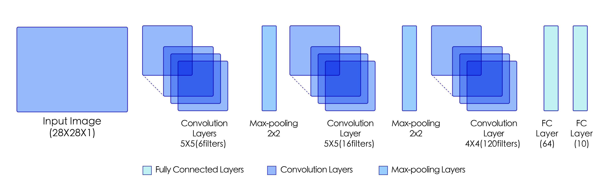
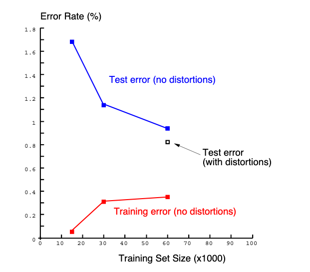

# LeNet

## 模型介绍

LeNet是最早的卷积神经网络之一<sup>[1]</sup>，其被提出用于识别手写数字和机器印刷字符。1998年，Yann LeCun第一次将LeNet卷积神经网络应用到图像分类上，在手写数字识别任务中取得了巨大成功。算法中阐述了图像中像素特征之间的相关性能够由参数共享的卷积操作所提取，同时使用卷积、下采样（池化）和非线性映射这样的组合结构，是当前流行的大多数深度图像识别网络的基础。

## 模型结构

LeNet通过连续使用卷积和池化层的组合提取图像特征，其架构如 **图1** 所示，这里展示的是用于MNIST手写体数字识别任务中的LeNet-5模型：



<center>图1 LeNet模型网络结构示意图</center><br></br>


* 第一模块：包含5×5的6通道卷积和2×2的池化。卷积提取图像中包含的特征模式（激活函数使用Sigmoid），图像尺寸从28减小到24。经过池化层可以降低输出特征图对空间位置的敏感性，图像尺寸减到12。

* 第二模块：和第一模块尺寸相同，通道数由6增加为16。卷积操作使图像尺寸减小到8，经过池化后变成4。

* 第三模块：包含4×4的120通道卷积。卷积之后的图像尺寸减小到1，但是通道数增加为120。将经过第3次卷积提取到的特征图输入到全连接层。第一个全连接层的输出神经元的个数是64，第二个全连接层的输出神经元个数是分类标签的类别数，对于手写数字识别的类别数是10。然后使用Softmax激活函数即可计算出每个类别的预测概率。

------

**提示：**

卷积层的输出特征图如何当作全连接层的输入使用呢？

卷积层的输出数据格式是$[N, C, H, W]$，在输入全连接层的时候，会自动将数据拉平，

也就是对每个样本，自动将其转化为长度为$K$的向量，

其中$K = C \times H \times W$，一个mini-batch的数据维度变成了$N\times K$的二维向量。

------

## 模型实现

LeNet网络的实现代码如下：


```python
# 导入需要的包
import paddle
import numpy as np
from paddle.nn import Conv2D, MaxPool2D, Linear

## 组网
import paddle.nn.functional as F

# 定义 LeNet 网络结构
class LeNet(paddle.nn.Layer):
    def __init__(self, num_classes=1):
        super(LeNet, self).__init__()
        # 创建卷积和池化层
        # 创建第1个卷积层
        self.conv1 = Conv2D(in_channels=1, out_channels=6, kernel_size=5)
        self.max_pool1 = MaxPool2D(kernel_size=2, stride=2)
        # 尺寸的逻辑：池化层未改变通道数；当前通道数为6
        # 创建第2个卷积层
        self.conv2 = Conv2D(in_channels=6, out_channels=16, kernel_size=5)
        self.max_pool2 = MaxPool2D(kernel_size=2, stride=2)
        # 创建第3个卷积层
        self.conv3 = Conv2D(in_channels=16, out_channels=120, kernel_size=4)
        # 尺寸的逻辑：输入层将数据拉平[B,C,H,W] -> [B,C*H*W]
        # 输入size是[28,28]，经过三次卷积和两次池化之后，C*H*W等于120
        self.fc1 = Linear(in_features=120, out_features=64)
        # 创建全连接层，第一个全连接层的输出神经元个数为64， 第二个全连接层输出神经元个数为分类标签的类别数
        self.fc2 = Linear(in_features=64, out_features=num_classes)
    # 网络的前向计算过程
    def forward(self, x):
        x = self.conv1(x)
        # 每个卷积层使用Sigmoid激活函数，后面跟着一个2x2的池化
        x = F.sigmoid(x)
        x = self.max_pool1(x)
        x = F.sigmoid(x)
        x = self.conv2(x)
        x = self.max_pool2(x)
        x = self.conv3(x)
        # 尺寸的逻辑：输入层将数据拉平[B,C,H,W] -> [B,C*H*W]
        x = paddle.reshape(x, [x.shape[0], -1])
        x = self.fc1(x)
        x = F.sigmoid(x)
        x = self.fc2(x)
        return x
```

## 模型特点

- 卷积网络使用一个3层的序列组合：卷积、下采样（池化）、非线性映射（LeNet-5最重要的特性，奠定了目前深层卷积网络的基础）；
- 使用卷积提取空间特征；
- 使用映射的空间均值进行下采样；
- 使用$tanh$或$sigmoid$进行非线性映射；
- 多层神经网络（MLP）作为最终的分类器；
- 层间的稀疏连接矩阵以避免巨大的计算开销。

## 模型指标

LeNet-5在MNIST手写数字识别任务上进行了模型训练与测试，论文中提供的模型指标如 **图2** 所示。使用 distortions 方法处理后，error rate能够达到0.8%。



<center>图2 LeNet模型指标</center><br></br>

## 参考文献

[1] [Gradient-based learn- ing applied to document recognition.](http://vision.stanford.edu/cs598_spring07/papers/Lecun98.pdf)