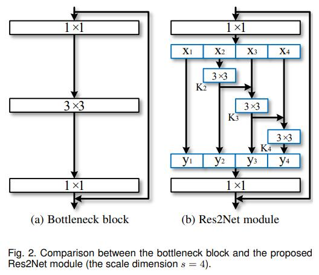
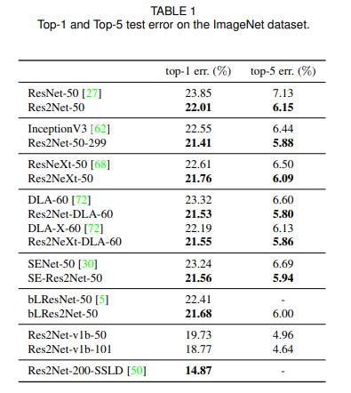
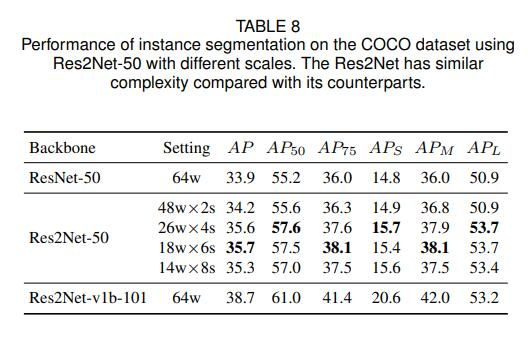
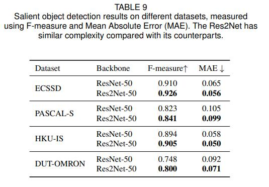

# Res2Net

## 1. 模型介绍
2020年，南开大学程明明组提出了一种面向目标检测任务的新模块Res2Net。并且其论文已被TPAMI2020录用。Res2Net和ResNeXt一样，是ResNet的变体形式，只不过Res2Net不止提高了分类任务的准确率，还提高了检测任务的精度。Res2Net的新模块可以和现有其他优秀模块轻松整合，在不增加计算负载量的情况下，在ImageNet、CIFAR-100等数据集上的测试性能超过了ResNet。因为模型的残差块里又有残差连接，所以取名为Res2Net。

## 2. 模型结构


模型结构看起来很简单，将输入的特征x，split为k个特征，第i+1（i = 0， 1， 2,...,k-1) 个特征经过3×3卷积后以残差连接的方式融合到第 i+2 个特征中。这就是Res2Net的主要结构。那么这样做的目的是为什么呢？能够有什么好处呢？
答案就是多尺度卷积。多尺度特征在检测任务中一直是很重要的，自从空洞卷积提出以来，基于空洞卷积搭建的多尺度金字塔模型在检测任务上取得里程碑式的效果。不同感受野下获取的物体的信息是不同的，小的感受野可能会看到更多的物体细节，对于检测小目标也有很大的好处，而大的感受野可以感受物体的整体结构，方便网络定位物体的位置，细节与位置的结合可以更好地得到具有清晰边界的物体信息，因此，结合了多尺度金字塔的模型往往能获得很好地效果。在Res2Net中，特征k2经过3×3卷积后被送入x3所在的处理流中，k2再次被3×3的卷积优化信息，两个3×3的卷积相当于一个5×5的卷积。那么，k3就想当然与融合了3×3的感受野和5×5的感受野处理后的特征。以此类推，7×7的感受野被应用在k4中。就这样，Res2Net提取多尺度特征用于检测任务，以提高模型的准确率。在这篇论文中，s是比例尺寸的控制参数，也就是可以将输入通道数平均等分为多个特征通道。s越大表明多尺度能力越强，此外一些额外的计算开销也可以忽略。


## 3. 模型实现
Res2Net与ResNet的模型结构一致，主要差别在于block的搭建，因此这里用paddle框架来实现block的代码
```python
class ConvBNLayer(nn.Layer):
    def __init__(
            self,
            num_channels,
            num_filters,
            filter_size,
            stride=1,
            groups=1,
            is_vd_mode=False,
            act=None,
            name=None, ):
        super(ConvBNLayer, self).__init__()

        self.is_vd_mode = is_vd_mode
        self._pool2d_avg = AvgPool2D(
            kernel_size=2, stride=2, padding=0, ceil_mode=True)
        self._conv = Conv2D(
            in_channels=num_channels,
            out_channels=num_filters,
            kernel_size=filter_size,
            stride=stride,
            padding=(filter_size - 1) // 2,
            groups=groups,
            weight_attr=ParamAttr(name=name + "_weights"),
            bias_attr=False)
        if name == "conv1":
            bn_name = "bn_" + name
        else:
            bn_name = "bn" + name[3:]
        self._batch_norm = BatchNorm(
            num_filters,
            act=act,
            param_attr=ParamAttr(name=bn_name + '_scale'),
            bias_attr=ParamAttr(bn_name + '_offset'),
            moving_mean_name=bn_name + '_mean',
            moving_variance_name=bn_name + '_variance')

    def forward(self, inputs):
        if self.is_vd_mode:
            inputs = self._pool2d_avg(inputs)
        y = self._conv(inputs)
        y = self._batch_norm(y)
        return y


class BottleneckBlock(nn.Layer):
    def __init__(self,
                 num_channels1,
                 num_channels2,
                 num_filters,
                 stride,
                 scales,
                 shortcut=True,
                 if_first=False,
                 name=None):
        super(BottleneckBlock, self).__init__()
        self.stride = stride
        self.scales = scales
        self.conv0 = ConvBNLayer(
            num_channels=num_channels1,
            num_filters=num_filters,
            filter_size=1,
            act='relu',
            name=name + "_branch2a")
        self.conv1_list = []
        for s in range(scales - 1):
            conv1 = self.add_sublayer(
                name + '_branch2b_' + str(s + 1),
                ConvBNLayer(
                    num_channels=num_filters // scales,
                    num_filters=num_filters // scales,
                    filter_size=3,
                    stride=stride,
                    act='relu',
                    name=name + '_branch2b_' + str(s + 1)))
            self.conv1_list.append(conv1)
        self.pool2d_avg = AvgPool2D(kernel_size=3, stride=stride, padding=1)

        self.conv2 = ConvBNLayer(
            num_channels=num_filters,
            num_filters=num_channels2,
            filter_size=1,
            act=None,
            name=name + "_branch2c")

        if not shortcut:
            self.short = ConvBNLayer(
                num_channels=num_channels1,
                num_filters=num_channels2,
                filter_size=1,
                stride=1,
                is_vd_mode=False if if_first else True,
                name=name + "_branch1")

        self.shortcut = shortcut

    def forward(self, inputs):
        y = self.conv0(inputs)
        xs = paddle.split(y, self.scales, 1)
        ys = []
        for s, conv1 in enumerate(self.conv1_list):
            if s == 0 or self.stride == 2:
                ys.append(conv1(xs[s]))
            else:
                ys.append(conv1(xs[s] + ys[-1]))
        if self.stride == 1:
            ys.append(xs[-1])
        else:
            ys.append(self.pool2d_avg(xs[-1]))
        conv1 = paddle.concat(ys, axis=1)
        conv2 = self.conv2(conv1)

        if self.shortcut:
            short = inputs
        else:
            short = self.short(inputs)
        y = paddle.add(x=short, y=conv2)
        y = F.relu(y)
        return y
```
## 4. 模型特点
1. 可与其他结构整合，如SENEt， ResNeXt， DLA等，从而增加准确率。
2. 计算负载不增加，特征提取能力更强大。

## 5. 模型指标
ImageNet分类效果如下图



Res2Net-50就是对标ResNet50的版本。

Res2Net-50-299指的是将输入图片裁剪到299×299进行预测的Res2Net-50，因为一般都是裁剪或者resize到224×224。

Res2NeXt-50为融合了ResNeXt的Res2Net-50。

Res2Net-DLA-60指的是融合了DLA-60的Res2Net-50。

Res2NeXt-DLA-60为融合了ResNeXt和DLA-60的Res2Net-50。

SE-Res2Net-50 为融合了SENet的Res2Net-50。

blRes2Net-50为融合了Big-Little Net的Res2Net-50。

Res2Net-v1b-50为采取和ResNet-vd-50一样的处理方法的Res2Net-50。

Res2Net-200-SSLD为Paddle使用简单的半监督标签知识蒸馏（SSLD，Simple Semi-supervised Label Distillation）的方法来提升模型效果得到的。具体详情可以见[半监督知识蒸馏](https://github.com/PaddlePaddle/PaddleClas/blob/release/2.2/docs/zh_CN/advanced_tutorials/distillation/distillation.md)

可见，Res2Net都取得了十分不错的成绩。

COCO数据集效果如下图



Res2Net-50的各种配置都比ResNet-50高。

显著目标检测数据集指标效果如下图



ECSSD、PASCAL-S、DUT-OMRON、HKU-IS都是显著目标检测任务中现在最为常用的测试集，显著目标检测任务的目的就是分割出图片中的显著物体，并用白色像素点表示，其他背景用黑色像素点表示。从图中可以看出来，使用Res2Net作为骨干网络，效果比ResNet有了很大的提升。

## 6. 参考文献
[Res2Net](https://arxiv.org/pdf/1904.01169.pdf)


```python

```
