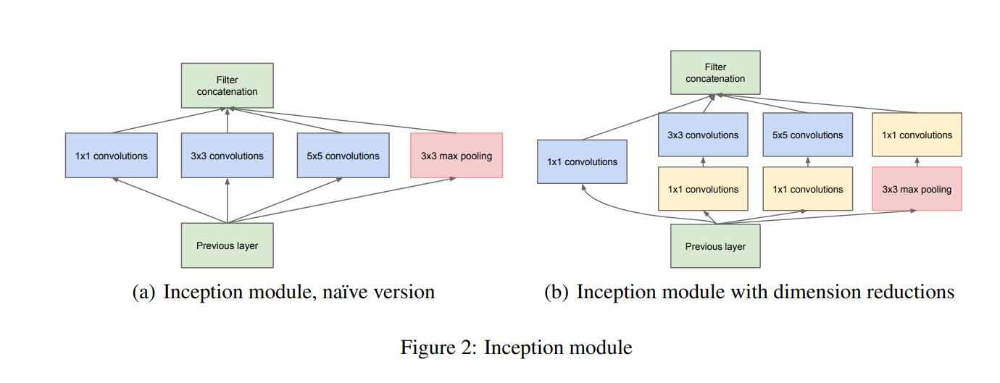
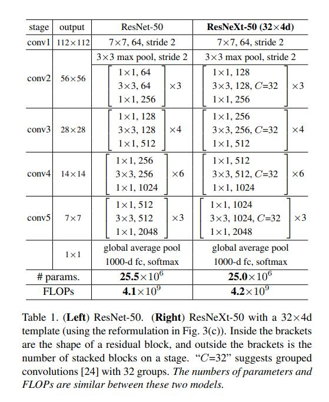
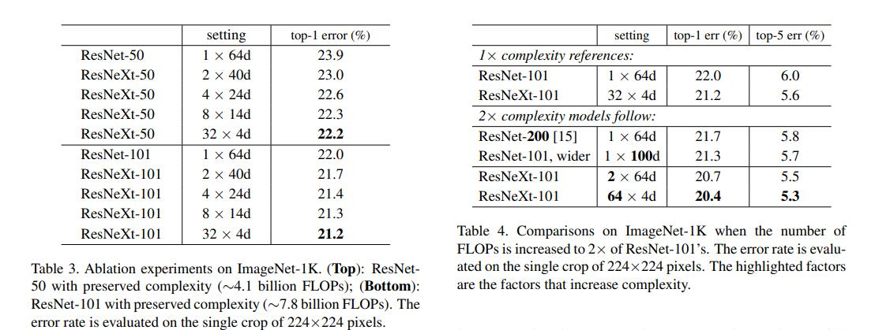
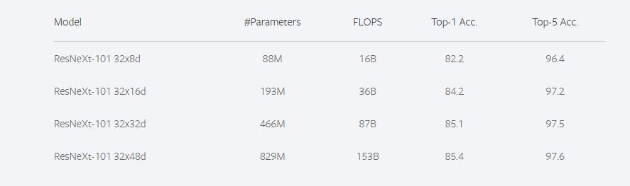

# ResNeXt
## 1. 模型介绍
ResNeXt是由何凯明团队在2017年CVPR会议上提出来的新型图像分类网络。ResNeXt是ResNet的升级版，在ResNet的基础上，引入了cardinality的概念，类似于ResNet，ResNeXt也有ResNeXt-50，ResNeXt-101的版本。那么相较于ResNet，ResNeXt的创新点在哪里？既然是分类网络，那么在ImageNet数据集上的指标相较于ResNet有何变化？之后的ResNeXt_WSL又是什么东西？下面我和大家一起分享一下这些知识。
## 2. 模型结构
在ResNeXt的论文中，作者提出了当时普遍存在的一个问题，如果要提高模型的准确率，往往采取加深网络或者加宽网络的方法。虽然这种方法是有效的，但是随之而来的，是网络设计的难度和计算开销的增加。为了一点精度的提升往往需要付出更大的代价。因此，需要一个更好的策略，在不额外增加计算代价的情况下，提升网络的精度。由此，何等人提出了cardinality的概念。

下图是ResNet（左）与ResNeXt（右）block的差异。在ResNet中，输入的具有256个通道的特征经过1×1卷积压缩4倍到64个通道，之后3×3的卷积核用于处理特征，经1×1卷积扩大通道数与原特征残差连接后输出。ResNeXt也是相同的处理策略，但在ResNeXt中，输入的具有256个通道的特征被分为32个组，每组被压缩64倍到4个通道后进行处理。32个组相加后与原特征残差连接后输出。这里cardinatity指的是一个block中所具有的相同分支的数目。


下图是InceptionNet的两种inception module结构，左边是inception module的naive版本，右边是使用了降维方法的inception module。相较于右边，左边很明显的缺点就是参数大，计算量巨大。使用不同大小的卷积核目的是为了提取不同尺度的特征信息，对于图像而言，多尺度的信息有助于网络更好地对图像信息进行选择，并且使得网络对于不同尺寸的图像输入有更好的适应能力，但多尺度带来的问题就是计算量的增加。因此在右边的模型中，InceptionNet很好地解决了这个问题，首先是1×1的卷积用于特征降维，减小特征的通道数后再采取多尺度的结构提取特征信息，在降低参数量的同时捕获到多尺度的特征信息。

ResNeXt正是借鉴了这种“分割-变换-聚合”的策略，但用相同的拓扑结构组建ResNeXt模块。每个结构都是相同的卷积核，保持了结构的简洁，使得模型在编程上更方便更容易，而InceptionNet则需要更为复杂的设计。



## 3. 模型实现
ResNeXt与ResNet的模型结构一致，主要差别在于block的搭建，因此这里用paddle框架来实现block的代码
```python
class ConvBNLayer(nn.Layer):
    def __init__(self, num_channels, num_filters, filter_size, stride=1,
                 groups=1, act=None, name=None, data_format="NCHW"
                ):
        super(ConvBNLayer, self).__init__()
        self._conv = Conv2D(
            in_channels=num_channels, out_channels=num_filters,
            kernel_size=filter_size, stride=stride,
            padding=(filter_size - 1) // 2, groups=groups,
            weight_attr=ParamAttr(name=name + "_weights"), bias_attr=False,
            data_format=data_format
        )
        if name == "conv1":
            bn_name = "bn_" + name
        else:
            bn_name = "bn" + name[3:]
        self._batch_norm = BatchNorm(
            num_filters, act=act, param_attr=ParamAttr(name=bn_name + '_scale'),
            bias_attr=ParamAttr(bn_name + '_offset'), moving_mean_name=bn_name + '_mean',
            moving_variance_name=bn_name + '_variance', data_layout=data_format
        )

    def forward(self, inputs):
        y = self._conv(inputs)
        y = self._batch_norm(y)
        return y


class BottleneckBlock(nn.Layer):
    def __init__(self, num_channels, num_filters, stride, cardinality, shortcut=True,
                 name=None, data_format="NCHW"
                ):
        super(BottleneckBlock, self).__init__()
        self.conv0 = ConvBNLayer(num_channels=num_channels, num_filters=num_filters,
            filter_size=1, act='relu', name=name + "_branch2a",
            data_format=data_format
           )
        self.conv1 = ConvBNLayer(
            num_channels=num_filters, num_filters=num_filters,
            filter_size=3, groups=cardinality,
            stride=stride, act='relu', name=name + "_branch2b",
            data_format=data_format
        )

        self.conv2 = ConvBNLayer(
            num_channels=num_filters,
            num_filters=num_filters * 2 if cardinality == 32 else num_filters,
            filter_size=1, act=None,
            name=name + "_branch2c",
            data_format=data_format
        )

        if not shortcut:
            self.short = ConvBNLayer(
                num_channels=num_channels, num_filters=num_filters * 2
                if cardinality == 32 else num_filters,
                filter_size=1, stride=stride,
                name=name + "_branch1", data_format=data_format
            )

        self.shortcut = shortcut

    def forward(self, inputs):
        y = self.conv0(inputs)
        conv1 = self.conv1(y)
        conv2 = self.conv2(conv1)

        if self.shortcut:
            short = inputs
        else:
            short = self.short(inputs)

        y = paddle.add(x=short, y=conv2)
        y = F.relu(y)
        return y
```

## 4. 模型特点
1. ResNeXt通过控制cardinality的数量，使得ResNeXt的参数量和GFLOPs与ResNet几乎相同。
2. 通过cardinality的分支结构，为网络提供更多的非线性，从而获得更精确的分类效果。

## 5. 模型指标


上图是ResNet与ResNeXt的参数对比，可以看出，ResNeXt与ResNet几乎是一模一样的参数量和计算量，然而两者在ImageNet上的表现却不一样。

从图中可以看出，ResNeXt除了可以增加block中3×3卷积核的通道数，还可以增加cardinality的分支数来提升模型的精度。ResNeXt-50和ResNeXt-101都大大降低了对应ResNet的错误率。图中，ResNeXt-101从32×4d变为64×4d，虽然增加了两倍的计算量，但也能有效地降低分类错误率。

在2019年何凯明团队开源了ResNeXt_WSL，ResNeXt_WSL是何凯明团队使用弱监督学习训练的ResNeXt，ResNeXt_WSL中的WSL就表示Weakly Supervised Learning（弱监督学习)。

ResNeXt101_32×48d_WSL有8亿+的参数，是通过弱监督学习预训练的方法在Instagram数据集上训练，然后用ImageNet数据集做微调，Instagram有9.4亿张图片，没有经过特别的标注，只带着用户自己加的话题标签。
ResNeXt_WSL与ResNeXt是一样的结构，只是训练方式有所改变。下图是ResNeXt_WSL的训练效果。


## 6. 参考文献
[ResNet](https://arxiv.org/pdf/1512.03385)

[ResNeXt](https://arxiv.org/abs/1611.05431)

[GoogLeNet](https://arxiv.org/abs/1409.4842)


```python

```
