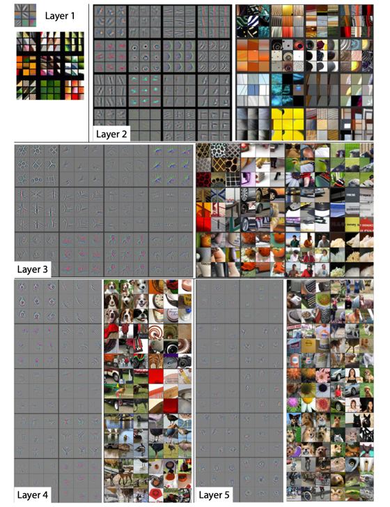
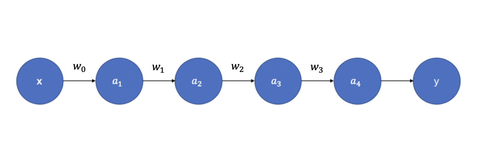
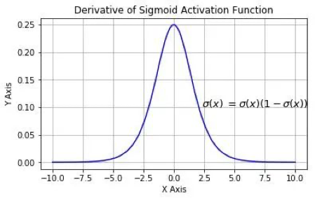
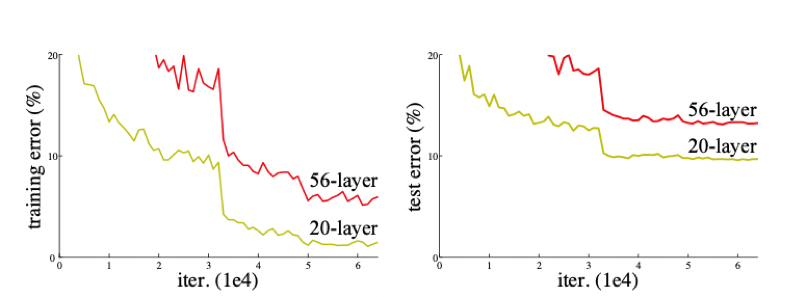
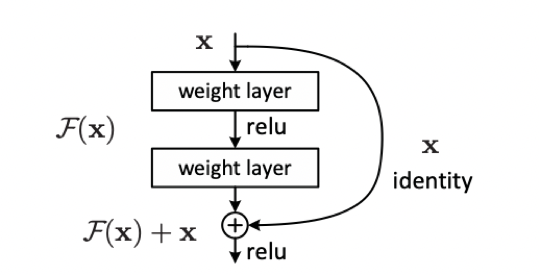

# ResNet

相较于VGG的19层和GoogLeNet的22层，ResNet可以提供18、34、50、101、152甚至更多层的网络，同时获得更好的精度。但是为什么要使用更深层次的网络呢？同时，如果只是网络层数的堆叠，那么为什么前人没有获得ResNet一样的成功呢？

## 1. 更深层次的网络？

从理论上来讲，加深深度学习网络可以提升性能。深度网络以端到端的多层方式集成了低/中/高层特征和分类器，且特征的层次可通过加深网络层次的方式来丰富。举一个例子，当深度学习网络只有一层时，要学习的特征会非常复杂，但如果有多层，就可以分层进行学习，如 **图1** 所示，网络的第一层学习到了边缘和颜色，第二层学习到了纹理，第三层学习到了局部的形状，而第五层已逐渐学习到全局特征。网络的加深，理论上可以提供更好的表达能力，使每一层可以学习到更细化的特征。

图1 特征可视化
  

## 2. 为什么深度网络不仅仅是层数的堆叠？

### 2.1 梯度消失 or 爆炸

但网络加深真的只有堆叠层数这么简单么？当然不是！首先，最显著的问题就是梯度消失/梯度爆炸。我们都知道神经网络的参数更新依靠梯度反向传播（Back Propagation），那么为什么会出现梯度的消失和爆炸呢？举一个例子解释。如 **图2** 所示，假设每层只有一个神经元，且激活函数使用Sigmoid函数，则有：

$$
z_{i+1} = w_ia_i+b_i\\
a_{i+1} = \sigma(z_{i+1})
$$

其中，$\sigma(\cdot)$ 为sigmoid函数。

图2 单个神经元的神经网络
  

根据链式求导和反向传播，我们可以得到：

$$
\frac{\partial y}{\partial a_1} = \frac{\partial y}{\partial a_4}\frac{\partial a_4}{\partial z_4}\frac{\partial z_4}{\partial a_3}\frac{\partial a_3}{\partial z_3}\frac{\partial z_3}{\partial a_2}\frac{\partial a_2}{\partial z_2}\frac{\partial z_2}{\partial a_1} \\
= \frac{\partial y}{\partial a_4}\sigma^{'}(z_4)w_3\sigma^{'}(z_3)w_2\sigma^{'}(z_2)w_1
$$
Sigmoid 函数的导数 $\sigma^{'}(x)$ 如 **图3** 所示：

图3 sigmoid函数的导数
  

我们可以看到sigmoid的导数最大值为0.25，那么随着网络层数的增加，小于1的小数不断相乘导致 $\frac{\partial y}{\partial a_1}$ 逐渐趋近于零，从而产生梯度消失。

那么梯度爆炸又是怎么引起的呢？同样的道理，当权重初始化为一个较大值时，虽然和激活函数的导数相乘会减小这个值，但是随着神经网络的加深，梯度呈指数级增长，就会引发梯度爆炸。但是从AlexNet开始，神经网络中就使用ReLU函数替换了Sigmoid，同时BN（Batch Normalization)层的加入，也基本解决了梯度消失/爆炸问题。

### 2.2 网络退化

现在，梯度消失/爆炸的问题解决了是不是就可以通过堆叠层数来加深网络了呢？Still no！

我们来看看ResNet论文中提到的例子（见 **图4**），很明显，56层的深层网络，在训练集和测试集上的表现都远不如20层的浅层网络，这种随着网络层数加深，accuracy逐渐饱和，然后出现急剧下降，具体表现为深层网络的训练效果反而不如浅层网络好的现象，被称为网络退化（degradation）。

图4 CIFAR-10上20层和56层网络的训练误差和测试误差
  

为什么会引起网络退化呢？按照理论上的想法，当浅层网络效果不错的时候，网络层数的增加即使不会引起精度上的提升也不该使模型效果变差。但事实上非线性的激活函数的存在，会造成很多不可逆的信息损失，网络加深到一定程度，过多的信息损失就会造成网络的退化。

而ResNet就是提出一种方法让网络拥有**恒等映射**能力，即随着网络层数的增加，深层网络至少不会差于浅层网络。

## 3. 残差块

现在我们明白了，为了加深网络结构，使每一次能够学到更细化的特征从而提高网络精度，需要实现的一点是**恒等映射**。那么残差网络如何能够做到这一点呢？

恒等映射即为 $H(x) = x$，已有的神经网络结构很难做到这一点，但是如果我们将网络设计成 $H(x) = F(x) + x$，即 $F(x) = H(x) - x$，那么只需要使残差函数 $F(x) = 0$，就构成了恒等映射 $H(x) = F(x)$。

图5 恒等映射
  

残差结构的目的是，随着网络的加深，使 $F(x)$ 逼近于0，使得深度网络的精度在最优浅层网络的基础上不会下降。看到这里你或许会有疑问，既然如此为什么不直接选取最优的浅层网络呢？这是因为最优的浅层网络结构并不易找寻，而ResNet可以通过增加深度，找到最优的浅层网络并保证深层网络不会因为层数的叠加而发生网络退化。

## 参考文献

[1] [Visualizing and Understanding Convolutional Networks](https://arxiv.org/pdf/1311.2901.pdf)

[2] [Deep Residual Learning for Image Recognition](https://arxiv.org/pdf/1512.03385.pdf)

