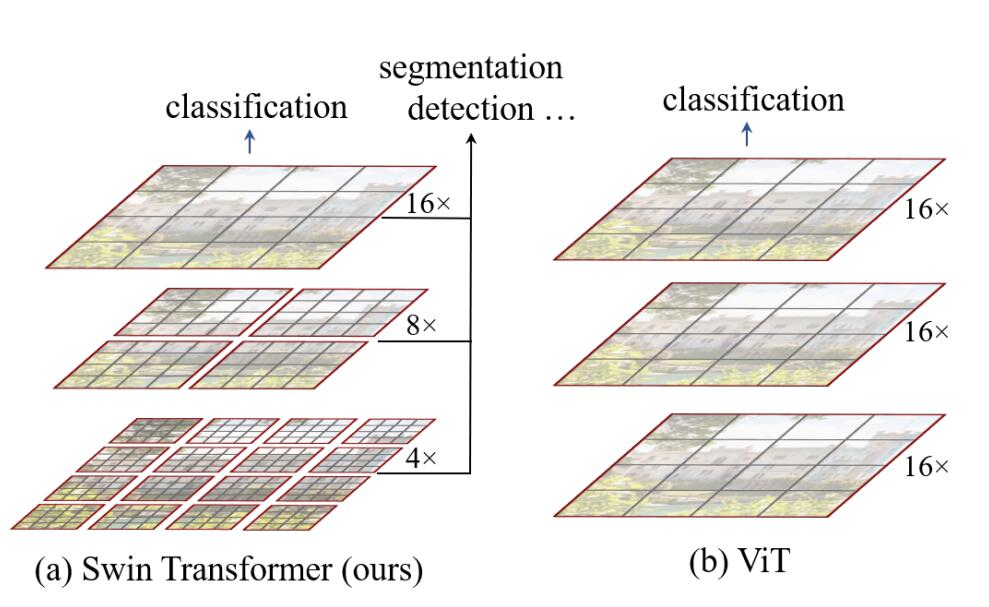
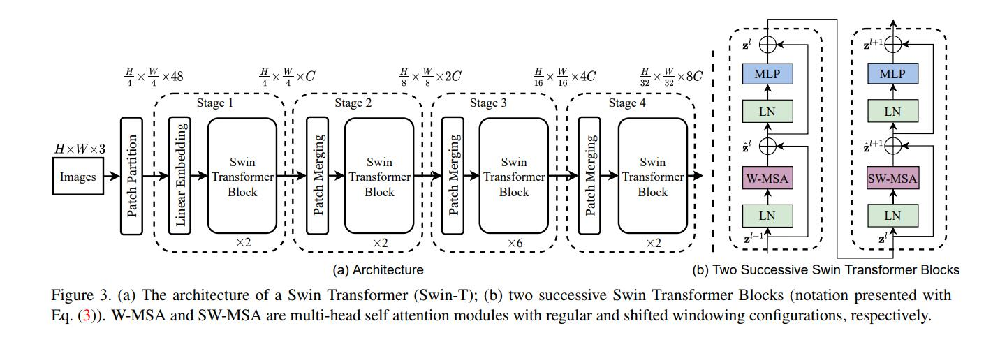
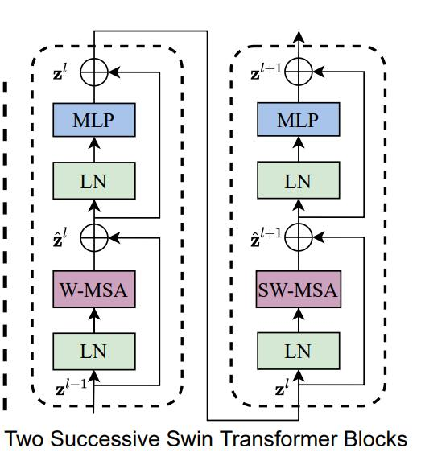
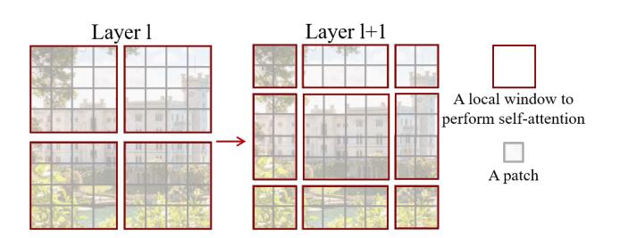
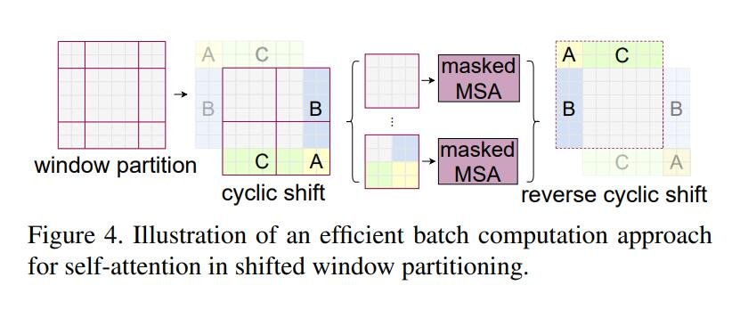
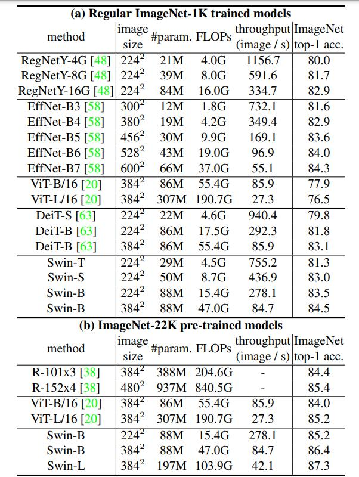
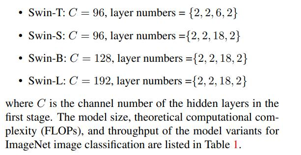
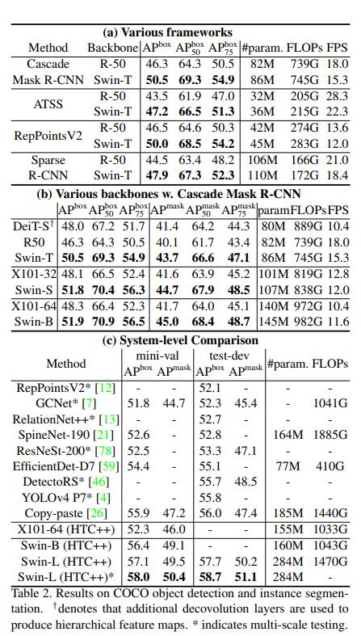
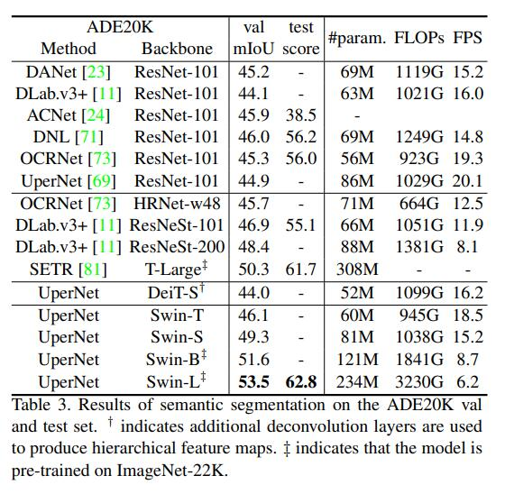

# Swin Trasnformer

## 1. 模型介绍
Swin Transformer是由微软亚洲研究院在今年公布的一篇利用transformer架构处理计算机视觉任务的论文。Swin Transformer 在图像分类，图像分割，目标检测等各个领域已经屠榜，在论文中，作者分析表明，Transformer从NLP迁移到CV上没有大放异彩主要有两点原因：1. 两个领域涉及的scale不同，NLP的token是标准固定的大小，而CV的特征尺度变化范围非常大。2. CV比起NLP需要更大的分辨率，而且CV中使用Transformer的计算复杂度是图像尺度的平方，这会导致计算量过于庞大。为了解决这两个问题，Swin Transformer相比之前的ViT做了两个改进：1.引入CNN中常用的层次化构建方式构建层次化Transformer 2.引入locality思想，对无重合的window区域内进行self-attention计算。另外，Swin Transformer可以作为图像分类、目标检测和语义分割等任务的通用骨干网络，可以说，Swin Transformer可能是CNN的完美替代方案。

## 2. 模型结构
下图为Swin Transformer与ViT在处理图片方式上的对比，可以看出，Swin Transformer有着ResNet一样的残差结构和CNN具有的多尺度图片结构。


整体概括：

下图为Swin Transformer的网络结构，输入的图像先经过一层卷积进行patch映射，将图像先分割成4 × 4的小块，图片是224×224输入，那么就是56个path块，如果是384×384的尺寸，则是96个path块。这里以224 × 224的输入为例，输入图像经过这一步操作，每个patch的特征维度为4x4x3=48的特征图。因此，输入的图像变成了H/4×W/4×48的特征图。然后，特征图开始输入到stage1，stage1中linear embedding将path特征维度变成C，因此变成了H/4×W/4×C。然后送入Swin Transformer Block，在进入stage2前，接下来先通过Patch Merging操作，Patch Merging和CNN中stride=2的1×1卷积十分相似，Patch Merging在每个Stage开始前做降采样，用于缩小分辨率，调整通道数，当H/4×W/4×C的特征图输送到Patch Merging，将输入按照2x2的相邻patches合并，这样子patch块的数量就变成了H/8 x W/8，特征维度就变成了4C，之后经过一个MLP，将特征维度降为2C。因此变为H/8×W/8×2C。接下来的stage就是重复上面的过程。


每步细说：

Linear embedding

下面用Paddle代码逐步讲解Swin Transformer的架构。 以下代码为Linear embedding的操作，整个操作可以看作一个patch大小的卷积核和patch大小的步长的卷积对输入的B，C，H，W的图片进行卷积，得到的自然就是大小为 B，C，H/patch，W/patch的特征图，如果放在第一个Linear embedding中，得到的特征图就为 B，96，56，56的大小。Paddle核心代码如下。
```python
class PatchEmbed(nn.Layer):
    """ Image to Patch Embedding
    Args:
        img_size (int): Image size.  Default: 224.
        patch_size (int): Patch token size. Default: 4.
        in_chans (int): Number of input image channels. Default: 3.
        embed_dim (int): Number of linear projection output channels. Default: 96.
        norm_layer (nn.Layer, optional): Normalization layer. Default: None
    """

    def __init__(self,
                 img_size=224,
                 patch_size=4,
                 in_chans=3,
                 embed_dim=96,
                 norm_layer=None):
        super().__init__()
        img_size = to_2tuple(img_size)
        patch_size = to_2tuple(patch_size)
        patches_resolution = [
            img_size[0] // patch_size[0], img_size[1] // patch_size[1]
        ]
        self.img_size = img_size
        self.patch_size = patch_size
        self.patches_resolution = patches_resolution
        self.num_patches = patches_resolution[0] * patches_resolution[1] #patch个数

        self.in_chans = in_chans
        self.embed_dim = embed_dim

        self.proj = nn.Conv2D(
            in_chans, embed_dim, kernel_size=patch_size, stride=patch_size) #将stride和kernel_size设置为patch_size大小
        if norm_layer is not None:
            self.norm = norm_layer(embed_dim)
        else:
            self.norm = None

    def forward(self, x):
        B, C, H, W = x.shape
        
        x = self.proj(x) # B, 96, H/4, W4 

        x = x.flatten(2).transpose([0, 2, 1])  # B Ph*Pw 96
        if self.norm is not None:
            x = self.norm(x)
        return x
```

Patch Merging

以下为PatchMerging的操作。该操作以2为步长，对输入的图片进行采样，总共得到4张下采样的特征图，H和W降低2倍，因此，通道级拼接后得到的是B，4C，H/2，W/2的特征图。然而这样的拼接不能够提取有用的特征信息，于是，一个线性层将4C的通道筛选为2C, 特征图变为了B，2C， H/2， W/2。细细体会可以发现，该操作像极了
卷积常用的Pooling操作和步长为2的卷积操作。Poling用于下采样，步长为2的卷积同样可以下采样，另外还起到了特征筛选的效果。总结一下，经过这个操作原本B，C，H，W的特征图就变为了B，2C，H/2，W/2的特征图，完成了下采样操作。
```python
class PatchMerging(nn.Layer):
    r""" Patch Merging Layer.
    Args:
        input_resolution (tuple[int]): Resolution of input feature.
        dim (int): Number of input channels.
        norm_layer (nn.Layer, optional): Normalization layer.  Default: nn.LayerNorm
    """

    def __init__(self, input_resolution, dim, norm_layer=nn.LayerNorm):
        super().__init__()
        self.input_resolution = input_resolution
        self.dim = dim
        self.reduction = nn.Linear(4 * dim, 2 * dim, bias_attr=False)
        self.norm = norm_layer(4 * dim)
    
    def forward(self, x):
        """
        x: B, H*W, C
        """
        H, W = self.input_resolution
        B, L, C = x.shape
        assert L == H * W, "input feature has wrong size"
        assert H % 2 == 0 and W % 2 == 0, "x size ({}*{}) are not even.".format(
            H, W)

        x = x.reshape([B, H, W, C])
        # 每次降采样是两倍，因此在行方向和列方向上，间隔2选取元素。
        x0 = x[:, 0::2, 0::2, :]  # B H/2 W/2 C
        x1 = x[:, 1::2, 0::2, :]  # B H/2 W/2 C
        x2 = x[:, 0::2, 1::2, :]  # B H/2 W/2 C
        x3 = x[:, 1::2, 1::2, :]  # B H/2 W/2 C
        # 拼接在一起作为一整个张量，展开。通道维度会变成原先的4倍（因为H,W各缩小2倍）
        x = paddle.concat([x0, x1, x2, x3], -1)  # B H/2 W/2 4*C
        x = x.reshape([B, H * W // 4, 4 * C])  # B H/2*W/2 4*C 

        x = self.norm(x)
        # 通过一个全连接层再调整通道维度为原来的两倍
        x = self.reduction(x)

        return x
```


Swin Transformer Block：

下面的操作是根据window_size划分特征图的操作和还原的操作，原理很简单就是并排划分即可。

```python
def window_partition(x, window_size):
    """
    Args:
        x: (B, H, W, C)
        window_size (int): window size

    Returns:
        windows: (num_windows*B, window_size, window_size, C)
    """
    B, H, W, C = x.shape
    x = x.reshape([B, H // window_size, window_size, W // window_size, window_size, C])
    windows = x.transpose([0, 1, 3, 2, 4, 5]).reshape([-1, window_size, window_size, C])
    return windows


def window_reverse(windows, window_size, H, W):
    """
    Args:
        windows: (num_windows*B, window_size, window_size, C)
        window_size (int): Window size
        H (int): Height of image
        W (int): Width of image

    Returns:
        x: (B, H, W, C)
    """
    B = int(windows.shape[0] / (H * W / window_size / window_size))
    x = windows.reshape([B, H // window_size, W // window_size, window_size, window_size, -1])
    x = x.transpose([0, 1, 3, 2, 4, 5]).reshape([B, H, W, -1])
    return x
```


Swin Transformer中重要的当然是Swin Transformer Block了，下面解释一下Swin Transformer Block的原理。
先看一下MLP和LN，MLP和LN为多层感知机和相对于BatchNorm的LayerNorm。原理较为简单，因此直接看paddle代码即可。

```python
class Mlp(nn.Layer):
    def __init__(self, in_features, hidden_features=None, out_features=None, act_layer=nn.GELU, drop=0.):
        super().__init__()
        out_features = out_features or in_features
        hidden_features = hidden_features or in_features
        self.fc1 = nn.Linear(in_features, hidden_features)
        self.act = act_layer()
        self.fc2 = nn.Linear(hidden_features, out_features)
        self.drop = nn.Dropout(drop)

    def forward(self, x):
        x = self.fc1(x)
        x = self.act(x)
        x = self.drop(x)
        x = self.fc2(x)
        x = self.drop(x)
        return x
```
[Layer Norm paddle API](https://www.paddlepaddle.org.cn/documentation/docs/zh/api/paddle/nn/LayerNorm_cn.html#layernorm)

下图就是Shifted Window based MSA是Swin Transformer的核心部分。Shifted Window based MSA包括了两部分，一个是W-MSA（窗口多头注意力），另一个就是SW-MSA（移位窗口多头自注意力）。这两个是一同出现的。



一开始，Swin Transformer 将一张图片分割为4份，也叫4个Window，然后独立地计算每一部分的MSA。由于每一个Window都是独立的，缺少了信息之间的交流，因此作者又提出了SW-MSA的算法，即采用规则的移动窗口的方法。通过不同窗口的交互，来达到特征的信息交流。注意，这一部分是本论文的精华，想要了解的同学必须要看懂源代码

```python
class WindowAttention(nn.Layer):
    """ Window based multi-head self attention (W-MSA) module with relative position bias.
    It supports both of shifted and non-shifted window.

    Args:
        dim (int): Number of input channels.
        window_size (tuple[int]): The height and width of the window.
        num_heads (int): Number of attention heads.
        qkv_bias (bool, optional):  If True, add a learnable bias to query, key, value. Default: True
        qk_scale (float | None, optional): Override default qk scale of head_dim ** -0.5 if set
        attn_drop (float, optional): Dropout ratio of attention weight. Default: 0.0
        proj_drop (float, optional): Dropout ratio of output. Default: 0.0
    """

    def __init__(self, dim, window_size, num_heads, qkv_bias=True, qk_scale=None, attn_drop=0., proj_drop=0.):

        super().__init__()
        self.dim = dim
        self.window_size = window_size  # Wh, Ww
        self.num_heads = num_heads
        head_dim = dim // num_heads
        self.scale = qk_scale or head_dim ** -0.5

        # define a parameter table of relative position bias
        relative_position_bias_table = self.create_parameter(
            shape=((2 * window_size[0] - 1) * (2 * window_size[1] - 1), num_heads), default_initializer=nn.initializer.Constant(value=0))  # 2*Wh-1 * 2*Ww-1, nH
        self.add_parameter("relative_position_bias_table", relative_position_bias_table)

        # get pair-wise relative position index for each token inside the window
        coords_h = paddle.arange(self.window_size[0])
        coords_w = paddle.arange(self.window_size[1])
        coords = paddle.stack(paddle.meshgrid([coords_h, coords_w]))                   # 2, Wh, Ww
        coords_flatten = paddle.flatten(coords, 1)                                     # 2, Wh*Ww
        relative_coords = coords_flatten.unsqueeze(-1) - coords_flatten.unsqueeze(1)   # 2, Wh*Ww, Wh*Ww
        relative_coords = relative_coords.transpose([1, 2, 0])                         # Wh*Ww, Wh*Ww, 2
        relative_coords[:, :, 0] += self.window_size[0] - 1                            # shift to start from 0
        relative_coords[:, :, 1] += self.window_size[1] - 1
        relative_coords[:, :, 0] *= 2 * self.window_size[1] - 1
        self.relative_position_index = relative_coords.sum(-1)                         # Wh*Ww, Wh*Ww
        self.register_buffer("relative_position_index", self.relative_position_index)

        self.qkv = nn.Linear(dim, dim * 3, bias_attr=qkv_bias)
        self.attn_drop = nn.Dropout(attn_drop)
        self.proj = nn.Linear(dim, dim)
        self.proj_drop = nn.Dropout(proj_drop)

        self.softmax = nn.Softmax(axis=-1)

    def forward(self, x, mask=None):
        """
        Args:
            x: input features with shape of (num_windows*B, N, C)
            mask: (0/-inf) mask with shape of (num_windows, Wh*Ww, Wh*Ww) or None
        """
        B_, N, C = x.shape
        qkv = self.qkv(x).reshape([B_, N, 3, self.num_heads, C // self.num_heads]).transpose([2, 0, 3, 1, 4])
        q, k, v = qkv[0], qkv[1], qkv[2]  # make torchscript happy (cannot use tensor as tuple)

        q = q * self.scale
        attn = q @ swapdim(k ,-2, -1)

        relative_position_bias = paddle.index_select(self.relative_position_bias_table,
                                                     self.relative_position_index.reshape((-1,)),axis=0).reshape((self.window_size[0] * self.window_size[1],self.window_size[0] * self.window_size[1], -1))

        relative_position_bias = relative_position_bias.transpose([2, 0, 1])  # nH, Wh*Ww, Wh*Ww
        attn = attn + relative_position_bias.unsqueeze(0)

        if mask is not None:
            nW = mask.shape[0]
            attn = attn.reshape([B_ // nW, nW, self.num_heads, N, N]) + mask.unsqueeze(1).unsqueeze(0)
            attn = attn.reshape([-1, self.num_heads, N, N])
            attn = self.softmax(attn)
        else:
            attn = self.softmax(attn)

        attn = self.attn_drop(attn)

        x = swapdim((attn @ v),1, 2).reshape([B_, N, C])
        x = self.proj(x)
        x = self.proj_drop(x)
        return x
```




## 3. 模型实现
Swin Transformer涉及模型代码较多，所以建议完整的看Swin Transformer的代码，因此推荐一下桨的[Swin Transformer](https://github.com/PaddlePaddle/PaddleClas/blob/release/2.2/ppcls/arch/backbone/model_zoo/swin_transformer.py)实现。

## 4. 模型特点
1. 首次在cv领域的transformer模型中采用了分层结构。分层结构因为其不同大小的尺度，使不同层特征有了更加不同的意义，较浅层的特征具有大尺度和细节信息，较深层的特征具有小尺度和物体的整体轮廓信息，在图像分类领域，深层特征具有更加有用的作用，只需要根据这个信息判定物体的类别即可，但是在像素级的分割和检测任务中，则需要更为精细的细节信息，因此，分层结构的模型往往更适用于分割和检测这样的像素级要求的任务中。Swin Transformer 模仿ResNet采取了分层的结构，使其成为了cv领域的通用框架。

2. 引入locality思想，对无重合的window区域内进行self-attention计算。不仅减少了计算量，而且多了不同窗口之间的交互。

## 5. 模型效果


第一列为对比的方法，第二列为图片尺寸的大小（尺寸越大浮点运算量越大），第三列为参数量，第四列为浮点运算量，第五列为模型吞吐量。可以看出，Swin-T 在top1准确率上超过了大部分模型EffNet-B3确实是个优秀的网络，在参数量和FLOPs都比Swin-T少的情况下，略优于Swin-T,然而，基于ImageNet1K数据集，Swin-B在这些模型上取得了最优的效果。另外，Swin-L在ImageNet-22K上的top1准确率达到了87.3%的高度，这是以往的模型都没有达到的。并且Swin Transformer的其他配置也取得了优秀的成绩。图中不同配置的Swin Transformer解释如下。



C就是上面提到的类似于通道数的值，layer numbers就是Swin Transformer Block的数量了。这两个都是值越大，效果越好。和ResNet十分相似。

下图为COCO数据集上目标检测与实例分割的表现。都是相同网络在不同骨干网络下的对比。可以看出在不同AP下，Swin Transformer都有大约5%的提升，这已经是很优秀的水平了。怪不得能成为ICCV2021最佳paer。



下图为语义分割数据集ADE20K上的表现。相较于同为transformer的DeiT-S, Swin Transformer-S有了5%的性能提升。相较于ResNeSt-200，Swin Transformer-L也有5%的提升。另外可以看到，在UNet的框架下，Swin Transformer的各个版本都有十分优秀的成绩，这充分说明了Swin Transformer是CV领域的通用骨干网络。




## 6. 参考文献
[Swin Transformer](https://arxiv.org/pdf/2103.14030.pdf)
