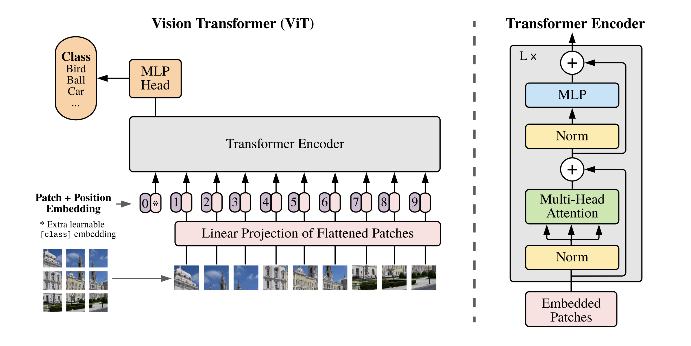
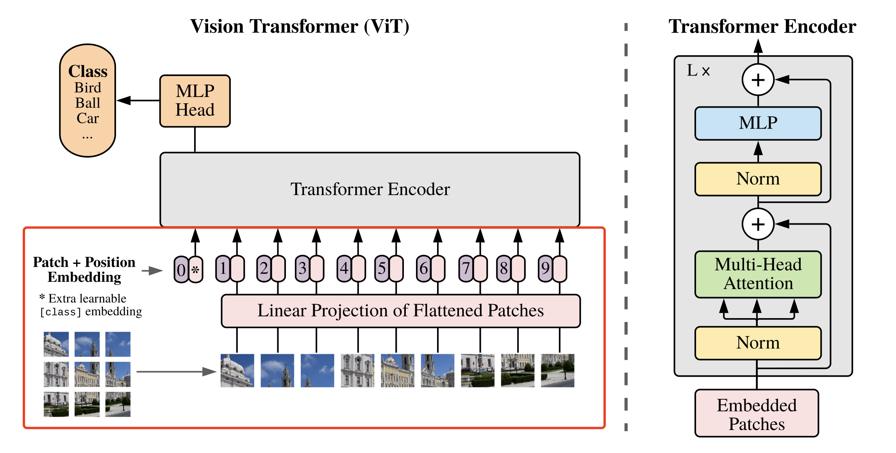
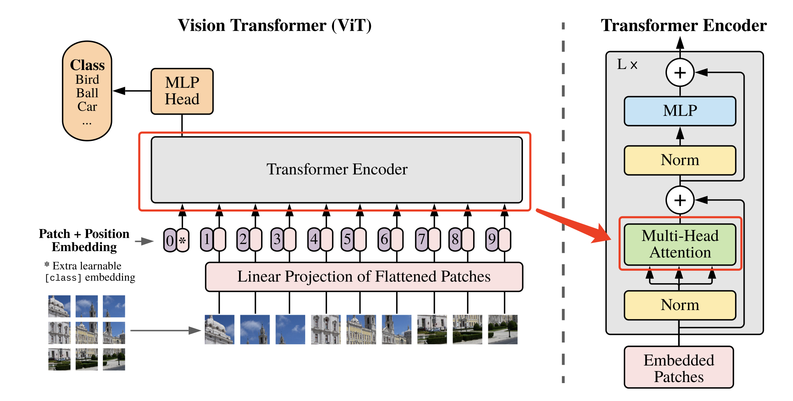
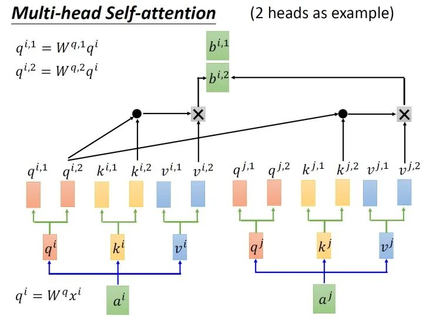
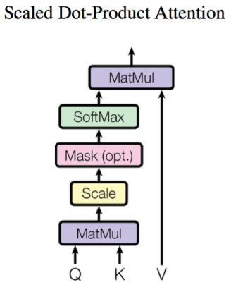
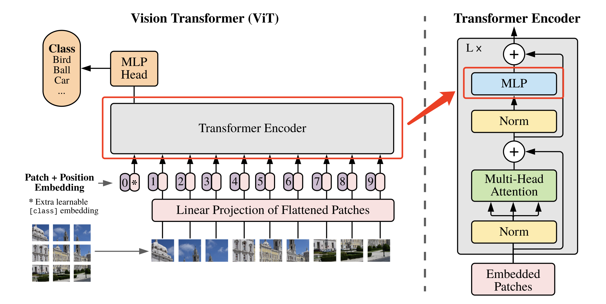
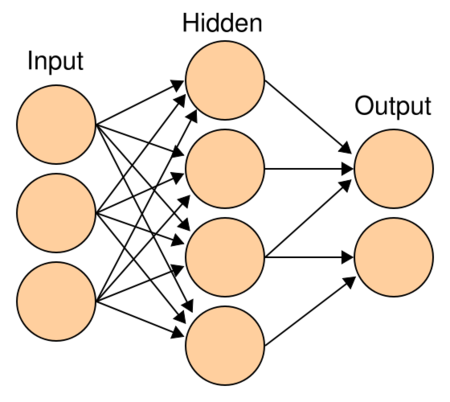
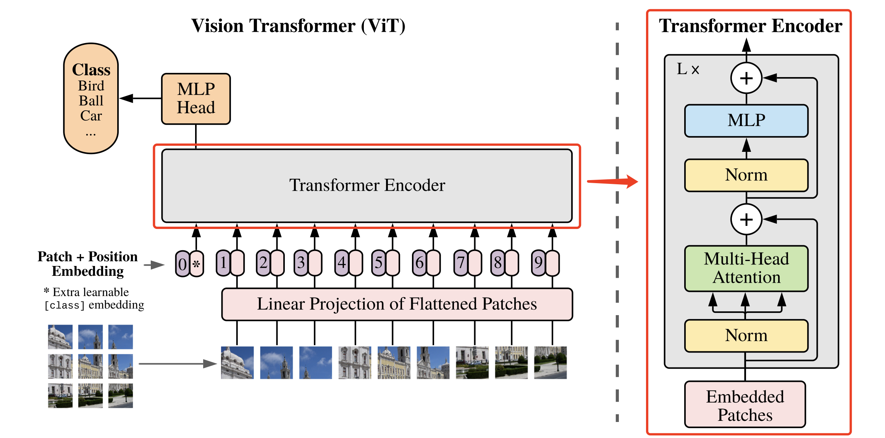
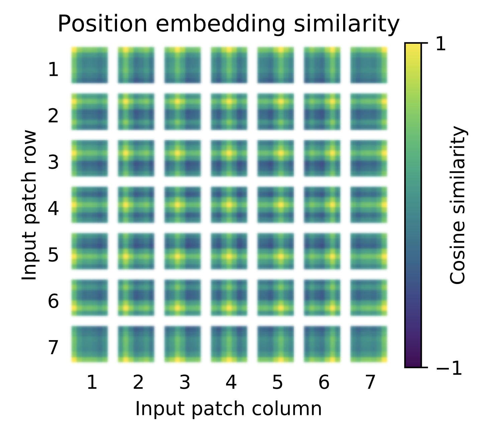
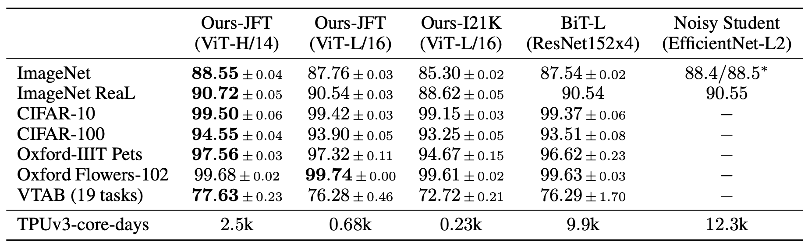

# ViT( Vision Transformer)

## 模型介绍

在计算机视觉领域中，多数算法都是保持CNN整体结构不变，在CNN中增加attention模块或者使用attention模块替换CNN中的某些部分。有研究者提出，没有必要总是依赖于CNN。因此，作者提出ViT<sup>[1]</sup>算法，仅仅使用Transformer结构也能够在图像分类任务中表现很好。

受到NLP领域中Transformer成功应用的启发，ViT算法中尝试将标准的Transformer结构直接应用于图像，并对整个图像分类流程进行最少的修改。具体来讲，ViT算法中，会将整幅图像拆分成小图像块，然后把这些小图像块的线性嵌入序列作为Transformer的输入送入网络，然后使用监督学习的方式进行图像分类的训练。

该算法在中等规模（例如ImageNet）以及大规模（例如ImageNet-21K、JFT-300M）数据集上进行了实验验证，发现：
* Transformer相较于CNN结构，缺少一定的平移不变性和局部感知性，因此在数据量不充分时，很难达到同等的效果。具体表现为使用中等规模的ImageNet训练的Transformer会比ResNet在精度上低几个百分点。
* 当有大量的训练样本时，结果则会发生改变。使用大规模数据集进行预训练后，再使用迁移学习的方式应用到其他数据集上，可以达到或超越当前的SOTA水平。

## 模型结构与实现

ViT算法的整体结构如 **图1** 所示。



<center>图1 ViT算法结构示意图</center><br></br>

### 1. 图像分块嵌入

考虑到在Transformer结构中，输入是一个二维的矩阵，矩阵的形状可以表示为 $(N,D)$，其中 $N$ 是sequence的长度，而 $D$ 是sequence中每个向量的维度。因此，在ViT算法中，首先需要设法将 $H \times W \times C$ 的三维图像转化为 $(N,D)$ 的二维输入。

ViT中的具体实现方式为：将 $H \times W \times C$ 的图像，变为一个 $N \times (P^2 * C)$ 的序列。这个序列可以看作是一系列展平的图像块，也就是将图像切分成小块后，再将其展平。该序列中一共包含了 $N=HW/P^2$ 个图像块，每个图像块的维度则是 $(P^2*C)$。其中  $P$ 是图像块的大小，$C$ 是通道数量。经过如上变换，就可以将 $N$ 视为sequence的长度了。

但是，此时每个图像块的维度是 $(P^2*C)$，而我们实际需要的向量维度是 $D$，因此我们还需要对图像块进行 Embedding。这里 Embedding 的方式非常简单，只需要对每个 $(P^2*C)$ 的图像块做一个线性变换，将维度压缩为 $D$ 即可。

上述对图像进行分块以及 Embedding 的具体方式如 **图2** 所示。



<center>图2 图像分块嵌入示意图</center><br></br>

具体代码实现如下所示。本文中将每个大小为 $P$ 的图像块经过大小为 $P$ 的卷积核来代替原文中将大小为 $P$ 的图像块展平后接全连接运算的操作。


```python
# 图像分块、Embedding
class PatchEmbed(nn.Layer):
    def __init__(self, img_size=224, patch_size=16, in_chans=3, embed_dim=768):
        super().__init__()
        # 原始大小为int，转为tuple，即：img_size原始输入224，变换后为[224,224]
        img_size = to_2tuple(img_size)
        patch_size = to_2tuple(patch_size)
        # 图像块的个数
        num_patches = (img_size[1] // patch_size[1]) * \
            (img_size[0] // patch_size[0])
        self.img_size = img_size
        self.patch_size = patch_size
        self.num_patches = num_patches
        # kernel_size=块大小，即每个块输出一个值，类似每个块展平后使用相同的全连接层进行处理
        # 输入维度为3，输出维度为块向量长度
        # 与原文中：分块、展平、全连接降维保持一致
        # 输出为[B, C, H, W]
        self.proj = nn.Conv2D(
            in_chans, embed_dim, kernel_size=patch_size, stride=patch_size)

    def forward(self, x):
        B, C, H, W = x.shape
        assert H == self.img_size[0] and W == self.img_size[1], \
            "Input image size ({H}*{W}) doesn't match model ({self.img_size[0]}*{self.img_size[1]})."
        # [B, C, H, W] -> [B, C, H*W] ->[B, H*W, C]
        x = self.proj(x).flatten(2).transpose((0, 2, 1))
        return x
```

### 2. 多头注意力

将图像转化为 $N \times (P^2 * C)$ 的序列后，就可以将其输入到 Transformer 结构中进行特征提取了，如 **图3** 所示。



<center>图3 多头注意力示意图</center><br></br>

Transformer 结构中最重要的结构就是 Multi-head Attention，即多头注意力结构。具有2个head的 Multi-head Attention 结构如 **图4** 所示。输入 $a^i$ 经过转移矩阵，并切分生成 $q^{(i,1)}$、$q^{(i,2)}$、$k^{(i,1)}$、$k^{(i,2)}$、$v^{(i,1)}$、$v^{(i,2)}$，然后 $q^{(i,1)}$ 与 $k^{(i,1)}$ 做 attention，得到权重向量 $\alpha$，将 $\alpha$ 与 $v^{(i,1)}$ 进行加权求和，得到最终的 $b^{(i,1)}(i=1,2,…,N)$，同理可以得到 $b^{(i,2)}(i=1,2,…,N)$。接着将它们拼接起来，通过一个线性层进行处理，得到最终的结果。



<center>图4 多头注意力</center><br></br>

其中，使用 $q^{(i,j)}$、$k^{(i,j)}$ 与 $v^{(i,j)}$ 计算 $b^{(i,j)}(i=1,2,…,N)$ 的方法是缩放点积注意力 (Scaled Dot-Product Attention)。 结构如 **图5** 所示。首先使用每个 $q^{(i,j)}$ 去与 $k^{(i,j)}$ 做 attention，这里说的 attention 就是匹配这两个向量有多接近，具体的方式就是计算向量的加权内积，得到 $\alpha_{(i,j)}$。这里的加权内积计算方式如下所示：

$$ \alpha_{(1,i)} =  q^1 * k^i / \sqrt{d} $$

其中，$d$ 是 $q$ 和 $k$ 的维度，因为 $q*k$ 的数值会随着维度的增大而增大，因此除以 $\sqrt{d}$ 的值也就相当于归一化的效果。

接下来，把计算得到的 $\alpha_{(i,j)}$ 取 softmax 操作，再将其与 $v^{(i,j)}$ 相乘。



<center>图5 缩放点积注意力</center><br></br>

具体代码实现如下所示。


```python
# Multi-head Attention
class Attention(nn.Layer):
    def __init__(self,
                 dim,
                 num_heads=8,
                 qkv_bias=False,
                 qk_scale=None,
                 attn_drop=0.,
                 proj_drop=0.):
        super().__init__()
        self.num_heads = num_heads
        head_dim = dim // num_heads
        self.scale = qk_scale or head_dim**-0.5
        # 计算 q,k,v 的转移矩阵
        self.qkv = nn.Linear(dim, dim * 3, bias_attr=qkv_bias)
        self.attn_drop = nn.Dropout(attn_drop)
        # 最终的线性层
        self.proj = nn.Linear(dim, dim)
        self.proj_drop = nn.Dropout(proj_drop)

    def forward(self, x):
        N, C = x.shape[1:]
        # 线性变换
        qkv = self.qkv(x).reshape((-1, N, 3, self.num_heads, C //
                                   self.num_heads)).transpose((2, 0, 3, 1, 4))
        # 分割 query key value
        q, k, v = qkv[0], qkv[1], qkv[2]
        # Scaled Dot-Product Attention
        # Matmul + Scale
        attn = (q.matmul(k.transpose((0, 1, 3, 2)))) * self.scale
        # SoftMax
        attn = nn.functional.softmax(attn, axis=-1)
        attn = self.attn_drop(attn)
        # Matmul
        x = (attn.matmul(v)).transpose((0, 2, 1, 3)).reshape((-1, N, C))
        # 线性变换
        x = self.proj(x)
        x = self.proj_drop(x)
        return x
```

### 3. 多层感知机（MLP）

 Transformer 结构中还有一个重要的结构就是 MLP，即多层感知机，如 **图6** 所示。



<center>图6 MLP多层感知机的结构</center><br></br>

多层感知机由输入层、输出层和至少一层的隐藏层构成。网络中各个隐藏层中神经元可接收相邻前序隐藏层中所有神经元传递而来的信息，经过加工处理后将信息输出给相邻后续隐藏层中所有神经元。在多层感知机中，相邻层所包含的神经元之间通常使用“全连接”方式进行连接。多层感知机可以模拟复杂非线性函数功能，所模拟函数的复杂性取决于网络隐藏层数目和各层中神经元数目。多层感知机的结构如 **图7** 所示。



<center>图7 多层感知机</center><br></br>

具体代码实现如下所示。


```python
class Mlp(nn.Layer):
    def __init__(self,
                 in_features,
                 hidden_features=None,
                 out_features=None,
                 act_layer=nn.GELU,
                 drop=0.):
        super().__init__()
        out_features = out_features or in_features
        hidden_features = hidden_features or in_features
        self.fc1 = nn.Linear(in_features, hidden_features)
        self.act = act_layer()
        self.fc2 = nn.Linear(hidden_features, out_features)
        self.drop = nn.Dropout(drop)

    def forward(self, x):
        # 输入层：线性变换
        x = self.fc1(x)
        # 应用激活函数
        x = self.act(x)
        # Dropout
        x = self.drop(x)
        # 输出层：线性变换
        x = self.fc2(x)
        # Dropout
        x = self.drop(x)
        return x
```

### 4. DropPath

除了以上重要模块意外，代码实现过程中还使用了DropPath（Stochastic Depth）来代替传统的Dropout结构，DropPath可以理解为一种特殊的 Dropout。其作用是在训练过程中随机丢弃子图层（randomly drop a subset of layers），而在预测时正常使用完整的 Graph。

具体实现如下：


```python
def drop_path(x, drop_prob=0., training=False):
    if drop_prob == 0. or not training:
        return x
    keep_prob = paddle.to_tensor(1 - drop_prob)
    shape = (paddle.shape(x)[0], ) + (1, ) * (x.ndim - 1)
    random_tensor = keep_prob + paddle.rand(shape, dtype=x.dtype)
    random_tensor = paddle.floor(random_tensor)
    output = x.divide(keep_prob) * random_tensor
    return output

class DropPath(nn.Layer):
    def __init__(self, drop_prob=None):
        super(DropPath, self).__init__()
        self.drop_prob = drop_prob

    def forward(self, x):
        return drop_path(x, self.drop_prob, self.training)
```

### 5. 基础模块

基于上面实现的 Attention、MLP、DropPath模块就可以组合出 Vision Transformer 模型的一个基础模块，如 **图8** 所示。



<center>图8 基础模块示意图</center><br></br>

基础模块的具体实现如下：


```python
class Block(nn.Layer):
    def __init__(self,
                 dim,
                 num_heads,
                 mlp_ratio=4.,
                 qkv_bias=False,
                 qk_scale=None,
                 drop=0.,
                 attn_drop=0.,
                 drop_path=0.,
                 act_layer=nn.GELU,
                 norm_layer='nn.LayerNorm',
                 epsilon=1e-5):
        super().__init__()
        self.norm1 = eval(norm_layer)(dim, epsilon=epsilon)
        # Multi-head Self-attention
        self.attn = Attention(
            dim,
            num_heads=num_heads,
            qkv_bias=qkv_bias,
            qk_scale=qk_scale,
            attn_drop=attn_drop,
            proj_drop=drop)
        # DropPath
        self.drop_path = DropPath(drop_path) if drop_path > 0. else Identity()
        self.norm2 = eval(norm_layer)(dim, epsilon=epsilon)
        mlp_hidden_dim = int(dim * mlp_ratio)
        self.mlp = Mlp(in_features=dim,
                       hidden_features=mlp_hidden_dim,
                       act_layer=act_layer,
                       drop=drop)

    def forward(self, x):
        # Multi-head Self-attention， Add， LayerNorm
        x = x + self.drop_path(self.attn(self.norm1(x)))
        # Feed Forward， Add， LayerNorm
        x = x + self.drop_path(self.mlp(self.norm2(x)))
        return x
```

### 6. 定义ViT网络

基础模块构建好后，就可以构建完整的ViT网络了。在构建完整网络结构之前，还需要给大家介绍几个模块：

* Class Token

假设我们将原始图像切分成 $3 \times 3$ 共9个小图像块，最终的输入序列长度却是10，也就是说我们这里人为的增加了一个向量进行输入，我们通常将人为增加的这个向量称为 Class Token。那么这个 Class Token 有什么作用呢？

我们可以想象，如果没有这个向量，也就是将 $N=9$ 个向量输入 Transformer 结构中进行编码，我们最终会得到9个编码向量，可对于图像分类任务而言，我们应该选择哪个输出向量进行后续分类呢？因此，ViT算法提出了一个可学习的嵌入向量 Class Token，将它与9个向量一起输入到 Transformer 结构中，输出10个编码向量，然后用这个 Class Token 进行分类预测即可。

其实这里也可以理解为：ViT 其实只用到了 Transformer 中的 Encoder，而并没有用到 Decoder，而 Class Token 的作用就是寻找其他9个输入向量对应的类别。

* Positional Encoding

按照 Transformer 结构中的位置编码习惯，这个工作也使用了位置编码。不同的是，ViT 中的位置编码没有采用原版 Transformer 中的 $sincos$ 编码，而是直接设置为可学习的 Positional Encoding。对训练好的 Positional Encoding 进行可视化，如 **图9** 所示。我们可以看到，位置越接近，往往具有更相似的位置编码。此外，出现了行列结构，同一行/列中的 patch 具有相似的位置编码。



<center>图9 Positional Encoding</center><br></br>

* MLP Head

得到输出后，ViT中使用了 MLP Head对输出进行分类处理，这里的 MLP Head 由 LayerNorm 和两层全连接层组成，并且采用了 GELU 激活函数。

具体代码如下所示。

首先构建基础模块部分，包括：参数初始化配置、独立的不进行任何操作的网络层。


```python
# 参数初始化配置
trunc_normal_ = nn.initializer.TruncatedNormal(std=.02)
zeros_ = nn.initializer.Constant(value=0.)
ones_ = nn.initializer.Constant(value=1.)

# 将输入 x 由 int 类型转为 tuple 类型
def to_2tuple(x):
    return tuple([x] * 2)

# 定义一个什么操作都不进行的网络层
class Identity(nn.Layer):
    def __init__(self):
        super(Identity, self).__init__()

    def forward(self, input):
        return input
```

完整代码如下所示。


```python
class VisionTransformer(nn.Layer):
    def __init__(self,
                 img_size=224,
                 patch_size=16,
                 in_chans=3,
                 class_dim=1000,
                 embed_dim=768,
                 depth=12,
                 num_heads=12,
                 mlp_ratio=4,
                 qkv_bias=False,
                 qk_scale=None,
                 drop_rate=0.,
                 attn_drop_rate=0.,
                 drop_path_rate=0.,
                 norm_layer='nn.LayerNorm',
                 epsilon=1e-5,
                 **args):
        super().__init__()
        self.class_dim = class_dim

        self.num_features = self.embed_dim = embed_dim
        # 图片分块和降维，块大小为patch_size，最终块向量维度为768
        self.patch_embed = PatchEmbed(
            img_size=img_size,
            patch_size=patch_size,
            in_chans=in_chans,
            embed_dim=embed_dim)
        # 分块数量
        num_patches = self.patch_embed.num_patches
        # 可学习的位置编码
        self.pos_embed = self.create_parameter(
            shape=(1, num_patches + 1, embed_dim), default_initializer=zeros_)
        self.add_parameter("pos_embed", self.pos_embed)
        # 人为追加class token，并使用该向量进行分类预测
        self.cls_token = self.create_parameter(
            shape=(1, 1, embed_dim), default_initializer=zeros_)
        self.add_parameter("cls_token", self.cls_token)
        self.pos_drop = nn.Dropout(p=drop_rate)

        dpr = np.linspace(0, drop_path_rate, depth)
        # transformer
        self.blocks = nn.LayerList([
            Block(
                dim=embed_dim,
                num_heads=num_heads,
                mlp_ratio=mlp_ratio,
                qkv_bias=qkv_bias,
                qk_scale=qk_scale,
                drop=drop_rate,
                attn_drop=attn_drop_rate,
                drop_path=dpr[i],
                norm_layer=norm_layer,
                epsilon=epsilon) for i in range(depth)
        ])

        self.norm = eval(norm_layer)(embed_dim, epsilon=epsilon)

        # Classifier head
        self.head = nn.Linear(embed_dim,
                              class_dim) if class_dim > 0 else Identity()

        trunc_normal_(self.pos_embed)
        trunc_normal_(self.cls_token)
        self.apply(self._init_weights)
    # 参数初始化
    def _init_weights(self, m):
        if isinstance(m, nn.Linear):
            trunc_normal_(m.weight)
            if isinstance(m, nn.Linear) and m.bias is not None:
                zeros_(m.bias)
        elif isinstance(m, nn.LayerNorm):
            zeros_(m.bias)
            ones_(m.weight)
    
    def forward_features(self, x):
        B = paddle.shape(x)[0]
        # 将图片分块，并调整每个块向量的维度
        x = self.patch_embed(x)
        # 将class token与前面的分块进行拼接
        cls_tokens = self.cls_token.expand((B, -1, -1))
        x = paddle.concat((cls_tokens, x), axis=1)
        # 将编码向量中加入位置编码
        x = x + self.pos_embed
        x = self.pos_drop(x)
        # 堆叠 transformer 结构
        for blk in self.blocks:
            x = blk(x)
        # LayerNorm
        x = self.norm(x)
        # 提取分类 tokens 的输出
        return x[:, 0]

    def forward(self, x):
        # 获取图像特征
        x = self.forward_features(x)
        # 图像分类
        x = self.head(x)
        return x
```

## 模型指标

ViT模型在常用数据集上进行迁移学习，最终指标如 **图10** 所示。可以看到，在ImageNet上，ViT达到的最高指标为88.55%；在ImageNet ReaL上，ViT达到的最高指标为90.72%；在CIFAR100上，ViT达到的最高指标为94.55%；在VTAB(19 tasks)上，ViT达到的最高指标为88.55%。



<center>图10 ViT网络指标</center><br></br>

## 模型特点

- 作为CV领域最经典的 Transformer 算法之一，不同于传统的CNN算法，ViT尝试将标准的Transformer结构直接应用于图像，并对整个图像分类流程进行最少的修改。
- 为了满足 Transformer 输入结构的要求，将整幅图像拆分成小图像块，然后把这些小图像块的线性嵌入序列输入到网络。同时，使用了Class Token的方式进行分类预测。

## 参考文献

[1] [An Image is Worth 16x16 Words:Transformers for Image Recognition at Scale](https://arxiv.org/abs/2010.11929)