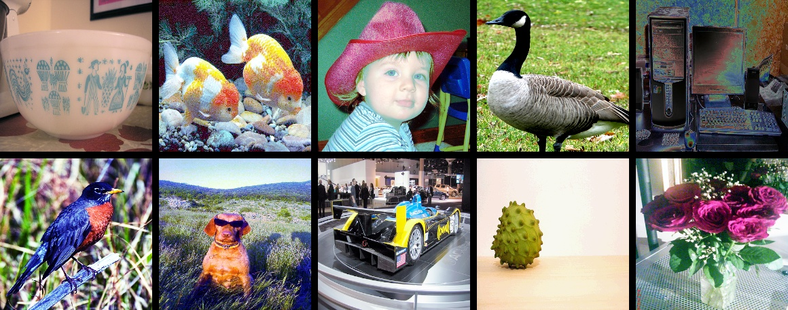

# 一、数据增广

在图像分类任务中，图像数据的增广是一种常用的正则化方法，主要用于增加训练数据集，让数据集尽可能的多样化，使得训练的模型具有更强的泛化能力，常用于数据量不足或者模型参数较多的场景。除了 ImageNet 分类任务标准数据增广方法外，还有8种数据增广方式非常常用，这里对其进行简单的介绍和对比，大家也可以将这些增广方法应用到自己的任务中，以获得模型精度的提升。这8种数据增广方式在ImageNet上的精度指标如 **图1** 所示。

图1 8种数据增广方法

# 二、常用数据增广方法

> 注：如果没有特殊说明，本章节中所有示例为 ImageNet 分类，并且假设最终输入网络的数据维为：[batch-size, 3, 224, 224]

在ImageNet 分类任务中，训练阶段的标准数据增广方法为以下几步：

1. 图像解码：简写为 `ImageDecode`
2. 随机裁剪到长宽均为 224 的图像：简写为 `RandCrop`
3. 水平方向随机翻转：简写为 `RandFlip`
4. 图像数据的归一化：简写为 `Normalize`
5. 图像数据的重排，`[224, 224, 3]` 变为 `[3, 224, 224]`：简写为 `Transpose`
6. 多幅图像数据组成 batch 数据，如 `batch-size` 个 `[3, 224, 224]` 的图像数据拼组成 `[batch-size, 3, 224, 224]`：简写为 `Batch`

相比于上述标准的图像增广方法，研究者也提出了很多改进的图像增广策略，这些策略均是在标准增广方法的不同阶段插入一定的操作，基于这些策略操作所处的不同阶段，我们将其分为了三类：

1. 对 `RandCrop` (上述的阶段2)后的 224 的图像进行一些变换: AutoAugment，RandAugment
2. 对`Transpose` (上述的阶段5)后的 224 的图像进行一些裁剪: CutOut，RandErasing，HideAndSeek，GridMask
3. 对 `Batch`(上述的阶段6) 后的数据进行混合: Mixup，Cutmix

增广后的可视化效果如 **图2** 所示。

图2 数据增广后可视化

下文将介绍这些策略的原理与使用方法，其中，每种数据增广策略的参考论文与参考开源代码均在下面的介绍中列出。

以 **图3** 为测试图像，第三节将基于测试图像进行变换，并将变换后的效果进行可视化。

> 由于`RandCrop`是随机裁剪，变换前后的图像内容可能会有一定的差别，无法直观地对比变换前后的图像。因此，本节将 `RandCrop` 替换为 `Resize`。

图3 测试图像

# 三、图像变换类

图像变换类指的是对 `RandCrop` 后的224 的图像进行一些变换，主要包括：

+ AutoAugment[1]
+ RandAugment[2]

## 3.1 AutoAugment

论文地址：[https://arxiv.org/abs/1805.09501v1](https://arxiv.org/abs/1805.09501v1)

开源代码github地址：[https://github.com/DeepVoltaire/AutoAugment](https://github.com/DeepVoltaire/AutoAugment)

不同于常规的人工设计图像增广方式，AutoAugment 是在一系列图像增广子策略的搜索空间中通过搜索算法找到的适合特定数据集的图像增广方案。针对 ImageNet 数据集，最终搜索出来的数据增广方案包含 25 个子策略组合，每个子策略中都包含两种变换，针对每幅图像都随机的挑选一个子策略组合，然后以一定的概率来决定是否执行子策略中的每种变换。

结果如 **图4** 所示。

图4 AutoAugment后图像可视化

## 3.2 RandAugment

论文地址：[https://arxiv.org/pdf/1909.13719.pdf](https://arxiv.org/pdf/1909.13719.pdf)

开源代码github地址：[https://github.com/heartInsert/randaugment](https://github.com/heartInsert/randaugment)

`AutoAugment` 的搜索方法比较暴力，直接在数据集上搜索针对该数据集的最优策略，其计算量很大。在 `RandAugment` 文章中作者发现，一方面，针对越大的模型，越大的数据集，使用 `AutoAugment` 方式搜索到的增广方式产生的收益也就越小；另一方面，这种搜索出的最优策略是针对该数据集的，其迁移能力较差，并不太适合迁移到其他数据集上。

在 `RandAugment` 中，作者提出了一种随机增广的方式，不再像 `AutoAugment` 中那样使用特定的概率确定是否使用某种子策略，而是所有的子策略都会以同样的概率被选择到，论文中的实验也表明这种数据增广方式即使在大模型的训练中也具有很好的效果。

结果如 **图5** 所示。

图5 RandAugment后图像可视化

# 四、图像裁剪类

图像裁剪类主要是对`Transpose` 后的 224 的图像进行一些裁剪，并将裁剪区域的像素值置为特定的常数（默认为0），主要包括：

+ CutOut[3]
+ RandErasing[4]
+ HideAndSeek[5]
+ GridMask[6]

图像裁剪的这些增广并非一定要放在归一化之后，也有不少实现是放在归一化之前的，也就是直接对 uint8 的图像进行操作，两种方式的差别是：如果直接对 uint8 的图像进行操作，那么再经过归一化之后被裁剪的区域将不再是纯黑或纯白（减均值除方差之后像素值不为0）。而对归一后之后的数据进行操作，裁剪的区域会是纯黑或纯白。

上述的裁剪变换思路是相同的，都是为了解决训练出的模型在有遮挡数据上泛化能力较差的问题，不同的是他们的裁剪方式、区域不太一样。

## 4.1 Cutout

论文地址：[https://arxiv.org/abs/1708.04552](https://arxiv.org/abs/1708.04552)

开源代码github地址：[https://github.com/uoguelph-mlrg/Cutout](https://github.com/uoguelph-mlrg/Cutout)

Cutout 可以理解为 Dropout 的一种扩展操作，不同的是 Dropout 是对图像经过网络后生成的特征进行遮挡，而 Cutout 是直接对输入的图像进行遮挡，相对于Dropout，Cutout 对噪声的鲁棒性更好。作者在论文中也进行了说明，这样做法有以下两点优势：(1) 通过 Cutout 可以模拟真实场景中主体被部分遮挡时的分类场景；(2) 可以促进模型充分利用图像中更多的内容来进行分类，防止网络只关注显著性的图像区域，从而发生过拟合。

结果如 **图6** 所示。

图6 Cutout后图像可视化

## 4.2 RandomErasing

论文地址：[https://arxiv.org/pdf/1708.04896.pdf](https://arxiv.org/pdf/1708.04896.pdf)

开源代码github地址：[https://github.com/zhunzhong07/Random-Erasing](https://github.com/zhunzhong07/Random-Erasing)

`RandomErasing` 与 `Cutout` 方法类似，同样是为了解决训练出的模型在有遮挡数据上泛化能力较差的问题，作者在论文中也指出，随机裁剪的方式与随机水平翻转具有一定的互补性。作者也在行人再识别（REID）上验证了该方法的有效性。与`Cutout`不同的是，在`RandomErasing`中，图片以一定的概率接受该种预处理方法，生成掩码的尺寸大小与长宽比也是根据预设的超参数随机生成。

结果如 **图7** 所示。

图7 RandomErasing后图像可视化

## 4.3 HideAndSeek

论文地址：[https://arxiv.org/pdf/1811.02545.pdf](https://arxiv.org/pdf/1811.02545.pdf)

开源代码github地址：[https://github.com/kkanshul/Hide-and-Seek](https://github.com/kkanshul/Hide-and-Seek)

`HideAndSeek`论文将图像分为若干块区域(patch)，对于每块区域，都以一定的概率生成掩码，不同区域的掩码含义如 **图8** 所示。

图8 HideAndSeek分块掩码图

结果如 **图9** 所示。

图9 HideAndSeek后图像可视化

## 4.4 GridMask
论文地址：[https://arxiv.org/abs/2001.04086](https://arxiv.org/abs/2001.04086)

开源代码github地址：[https://github.com/akuxcw/GridMask](https://github.com/akuxcw/GridMask)

作者在论文中指出，此前存在的基于对图像 crop 的方法存在两个问题，如 **图10** 所示：

1. 过度删除区域可能造成目标主体大部分甚至全部被删除，或者导致上下文信息的丢失，导致增广后的数据成为噪声数据；

2. 保留过多的区域，对目标主体及上下文基本产生不了什么影响，失去增广的意义。

   

图10 增广后的噪声数据

因此如果避免过度删除或过度保留成为需要解决的核心问题。

`GridMask`是通过生成一个与原图分辨率相同的掩码，并将掩码进行随机翻转，与原图相乘，从而得到增广后的图像，通过超参数控制生成的掩码网格的大小。

在训练过程中，有两种以下使用方法：
1. 设置一个概率p，从训练开始就对图片以概率p使用`GridMask`进行增广。
2. 一开始设置增广概率为0，随着迭代轮数增加，对训练图片进行`GridMask`增广的概率逐渐增大，最后变为p。

论文中验证上述第二种方法的训练效果更好一些。

结果如 **图11** 所示。

图11 GridMask后图像可视化

# 五、图像混叠

图像混叠主要对 `Batch` 后的数据进行混合，包括：

+ Mixup[7]
+ Cutmix[8]

前文所述的图像变换与图像裁剪都是针对单幅图像进行的操作，而图像混叠是对两幅图像进行融合，生成一幅图像，两种方法的主要区别为混叠的方式不太一样。

## 5.1 Mixup

论文地址：[https://arxiv.org/pdf/1710.09412.pdf](https://arxiv.org/pdf/1710.09412.pdf)

开源代码github地址：[https://github.com/facebookresearch/mixup-cifar10](https://github.com/facebookresearch/mixup-cifar10)

Mixup 是最先提出的图像混叠增广方案，其原理简单、方便实现，不仅在图像分类上，在目标检测上也取得了不错的效果。为了便于实现，通常只对一个 batch 内的数据进行混叠，在 `Cutmix` 中也是如此。

如下是 `imaug` 中的实现，需要指出的是，下述实现会出现对同一幅进行相加的情况，也就是最终得到的图和原图一样，随着 `batch-size` 的增加这种情况出现的概率也会逐渐减小。

结果如 **图12** 所示。

图12 Mixup后图像可视化

## 5.2 Cutmix

论文地址：[https://arxiv.org/pdf/1905.04899v2.pdf](https://arxiv.org/pdf/1905.04899v2.pdf)

开源代码github地址：[https://github.com/clovaai/CutMix-PyTorch](https://github.com/clovaai/CutMix-PyTorch)

与  `Mixup` 直接对两幅图进行相加不一样，`Cutmix` 是从一幅图中随机裁剪出一个 `ROI`，然后覆盖当前图像中对应的区域。

结果如 **图13** 所示。

图13 Cutmix后图像可视化

# 六、实验

基于PaddleClas套件，使用上述几种数据增广方法在ImageNet1k数据集上进行了实验测试，每个方法的分类精度如下。

| 模型          | 初始学习率策略  | l2 decay | batch size | epoch | 数据变化策略         | Top1 Acc    | 论文中结论 |
|-------------|------------------|--------------|------------|-------|----------------|------------|----|
| ResNet50 | 0.1/cosine_decay | 0.0001       | 256        | 300   | 标准变换           | 0.7731 | - |
| ResNet50 | 0.1/cosine_decay | 0.0001       | 256        | 300   | AutoAugment    | 0.7795 |  0.7763 |
| ResNet50 | 0.1/cosine_decay | 0.0001       | 256        | 300   | mixup          | 0.7828 |  0.7790 |
| ResNet50 | 0.1/cosine_decay | 0.0001       | 256        | 300   | cutmix         | 0.7839 |  0.7860 |
| ResNet50 | 0.1/cosine_decay | 0.0001       | 256        | 300   | cutout         | 0.7801 |  - |
| ResNet50 | 0.1/cosine_decay | 0.0001       | 256        | 300   | gridmask       | 0.7785 |  0.7790 |
| ResNet50 | 0.1/cosine_decay | 0.0001       | 256        | 300   | random-augment | 0.7770 |  0.7760 |
| ResNet50 | 0.1/cosine_decay | 0.0001       | 256        | 300   | random erasing | 0.7791 |  - |
| ResNet50 | 0.1/cosine_decay | 0.0001       | 256        | 300   | hide and seek  | 0.7743 |  0.7720 |

**注意**：
* 在实验中，为了便于对比，将l2 decay固定设置为1e-4，在实际使用中，推荐尝试使用更小的l2 decay。结合数据增广，发现将l2 decay由1e-4减小为7e-5均能带来至少0.3~0.5%的精度提升。

* 在使用数据增广后，由于训练数据更难，所以训练损失函数可能较大，训练集的准确率相对较低，但其拥有更好的泛化能力，所以验证集的准确率相对较高。

* 在使用数据增广后，模型可能会趋于欠拟合状态，建议可以适当的调小`l2_decay`的值来获得更高的验证集准确率。

# 参考文献

[1] [Autoaugment: Learning augmentation strategies from data](https://arxiv.org/abs/1805.09501v1)

[2] [Randaugment: Practical automated data augmentation with a reduced search space](https://arxiv.org/pdf/1909.13719.pdf)

[3] [Improved regularization of convolutional neural networks with cutout](https://arxiv.org/abs/1708.04552)

[4] [Random erasing data augmentation](https://arxiv.org/pdf/1708.04896.pdf)

[5] [Hide-and-seek: Forcing a network to be meticulous for weakly-supervised object and action localization](https://arxiv.org/pdf/1811.02545.pdf)

[6] [GridMask Data Augmentation](https://arxiv.org/abs/2001.04086)

[7] [mixup: Beyond empirical risk minimization](https://arxiv.org/pdf/1710.09412.pdf)

[8] [Cutmix: Regularization strategy to train strong classifiers with localizable features](https://arxiv.org/pdf/1905.04899v2.pdf))