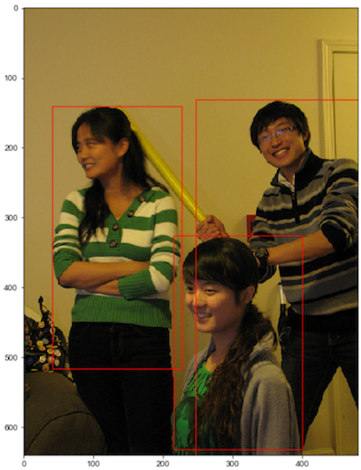
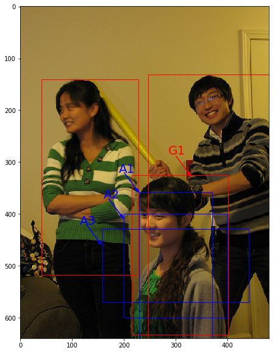

# 边界框（bounding box）

在检测任务中，我们需要同时预测物体的类别和位置，因此需要引入一些跟位置相关的概念。通常使用边界框（bounding box，bbox）来表示物体的位置，边界框是正好能包含物体的矩形框，如 **图1** 所示，图中3个人分别对应3个边界框。



图1 边界框

通常表示边界框的位置有两种方式：

1. 即$(x_1, y_1, x_2, y_2)$，其中$(x_1, y_1)$是矩形框左上角的坐标，$(x_2, y_2)$是矩形框右下角的坐标。**图1** 中3个红色矩形框用$xyxy$格式表示如下：

* 左：$(40.93, 141.1, 226.99, 515.73)$。
* 中：$(214.29, 325.03, 399.82, 631.37)$。
* 右：$(247.2, 131.62, 480.0, 639.32)$。

2. $xywh$，即$(x, y, w, h)$，其中$(x, y)$是矩形框中心点的坐标，$w$是矩形框的宽度，$h$是矩形框的高度。

在检测任务中，训练数据集的标签里会给出目标物体真实边界框所对应的$(x_1, y_1, x_2, y_2)$，这样的边界框也被称为真实框（ground truth box），**图1** 画出了3个人像所对应的真实框。模型会对目标物体可能出现的位置进行预测，由模型预测出的边界框则称为预测框（prediction box）。

要完成一项检测任务，我们通常希望模型能够根据输入的图片，输出一些预测的边界框，以及边界框中所包含的物体的类别或者说属于某个类别的概率，例如这种格式: $[L, P, x_1, y_1, x_2, y_2]$，其中$L$是预测出的类别标签，$P$是预测物体属于该类别的概率。一张输入图片可能会产生多个预测框，接下来让我们一起学习如何完成这项任务。

---

**注意：**

1. 在阅读代码时，请注意使用的是哪一种格式的表示方式。
1. 图片坐标的原点在左上角，$x$轴向右为正方向，$y$轴向下为正方向。

---

# 锚框（Anchor box）

目标检测算法通常会在输入图像中采样大量的区域，然后判断这些区域中是否包含我们感兴趣的目标，并调整区域边缘从而更准确地预测目标的真实边界框（ground-truth bounding box）。不同的模型使用的区域采样方法可能不同。这里我们介绍其中的一种方法：它以每个像素为中心生成多个大小和宽高比（aspect ratio）不同的边界框。这些边界框被称为锚框（anchor box）。

在目标检测任务中，我们会先设定好锚框的大小和形状，再以图像上某一个点为中心画出这些锚框，将这些锚框当成可能的候选区域。

---

目前，常用的锚框尺寸选择方法有：

1. 人为经验选取
2. k-means聚类
3. 作为超参数进行学习

---

模型对这些候选区域是否包含物体进行预测，如果包含目标物体，则还需要进一步预测出物体所属的类别。还有更为重要的一点是，模型需要预测出微调的幅度。这是因为锚框位置是固定的，它不大可能刚好跟物体边界框重合，所以需要在锚框的基础上进行微调以形成能准确描述物体位置的预测框。

在训练过程中，模型通过学习不断的调整参数，最终能学会如何判别出锚框所代表的候选区域是否包含物体，如果包含物体的话，物体属于哪个类别，以及物体边界框相对于锚框位置需要调整的幅度。而不同的模型往往有着不同的生成锚框的方式。

在下图中，以像素点[300, 500]为中心可以使用下面的程序生成3个框，如 **图2** 中蓝色框所示，其中锚框A1跟人像区域非常接近。



图2 锚框


```python
# 画图展示如何绘制边界框和锚框
import numpy as np
import matplotlib.pyplot as plt
import matplotlib.patches as patches
from matplotlib.image import imread
import math

# 定义画矩形框的程序    
def draw_rectangle(currentAxis, bbox, edgecolor = 'k', facecolor = 'y', fill=False, linestyle='-'):
    # currentAxis，坐标轴，通过plt.gca()获取
    # bbox，边界框，包含四个数值的list， [x1, y1, x2, y2]
    # edgecolor，边框线条颜色
    # facecolor，填充颜色
    # fill, 是否填充
    # linestype，边框线型

    # patches.Rectangle(xy, width, height,linewidth,edgecolor,facecolor,fill, linestyle)
    # xy:左下角坐标; width:矩形框的宽; height:矩形框的高; linewidth:线宽; edgecolor:边界颜色; facecolor:填充颜色; fill:是否填充; linestyle:线断类型
    rect=patches.Rectangle((bbox[0], bbox[1]), bbox[2]-bbox[0]+1, bbox[3]-bbox[1]+1, linewidth=1,
                           edgecolor=edgecolor,facecolor=facecolor,fill=fill, linestyle=linestyle)
    currentAxis.add_patch(rect)

    
plt.figure(figsize=(10, 10))
# 传入图片路径
filename = '/home/aistudio/work/images/section3/000000086956.jpg'
im = imread(filename)
plt.imshow(im)

# 使用xyxy格式表示物体真实框
bbox1 = [214.29, 325.03, 399.82, 631.37]
bbox2 = [40.93, 141.1, 226.99, 515.73]
bbox3 = [247.2, 131.62, 480.0, 639.32]

currentAxis=plt.gca()
# 绘制3个真实框
draw_rectangle(currentAxis, bbox1, edgecolor='r')
draw_rectangle(currentAxis, bbox2, edgecolor='r')
draw_rectangle(currentAxis, bbox3,edgecolor='r')

# 绘制锚框
def draw_anchor_box(center, length, scales, ratios, img_height, img_width):
    """
    以center为中心，产生一系列锚框
    其中length指定了一个基准的长度
    scales是包含多种尺寸比例的list
    ratios是包含多种长宽比的list
    img_height和img_width是图片的尺寸，生成的锚框范围不能超出图片尺寸之外
    """
    bboxes = []
    for scale in scales:
        for ratio in ratios:
            h = length*scale*math.sqrt(ratio)
            w = length*scale/math.sqrt(ratio) 
            x1 = max(center[0] - w/2., 0.)
            y1 = max(center[1] - h/2., 0.)
            x2 = min(center[0] + w/2. - 1.0, img_width - 1.0)
            y2 = min(center[1] + h/2. - 1.0, img_height - 1.0)
            print(center[0], center[1], w, h)
            bboxes.append([x1, y1, x2, y2])

    for bbox in bboxes:
        draw_rectangle(currentAxis, bbox, edgecolor = 'b')

img_height = im.shape[0]
img_width = im.shape[1] 
# 绘制锚框
draw_anchor_box([300., 500.], 100., [2.0], [0.5, 1.0, 2.0], img_height, img_width)

################# 以下为添加上图中的文字说明和箭头###############################
plt.text(285, 285, 'G1', color='red', fontsize=20)
plt.arrow(300, 288, 30, 40, color='red', width=0.001, length_includes_head=True, \
         head_width=5, head_length=10, shape='full')

plt.text(190, 320, 'A1', color='blue', fontsize=20)
plt.arrow(200, 320, 30, 40, color='blue', width=0.001, length_includes_head=True, \
         head_width=5, head_length=10, shape='full')

plt.text(160, 370, 'A2', color='blue', fontsize=20)
plt.arrow(170, 370, 30, 40, color='blue', width=0.001, length_includes_head=True, \
         head_width=5, head_length=10, shape='full')

plt.text(115, 420, 'A3', color='blue', fontsize=20)
plt.arrow(127, 420, 30, 40, color='blue', width=0.001, length_includes_head=True, \
         head_width=5, head_length=10, shape='full')

plt.show()
```

锚框的概念最早在Faster rcnn<sup>[1]</sup>目标检测算法中被提出，后来被YOLOv2<sup>[2]</sup>等各种目标检测算法借鉴。对比于早期目标检测算法中使用的滑动窗口或Selective Search方法，使用锚框来提取候选区域大大减少了时间开销。而对比YOLOv1<sup>[3]</sup>中直接回归坐标值来计算检测框，使用锚框可以简化目标检测问题，使得网络仅仅学习锚框的位置偏移量即可，从而使得网络模型更容易学习。

[1] [Faster R-CNN: Towards Real-Time Object Detection with Region Proposal Networks](https://arxiv.org/pdf/1506.01497.pdf)

[2] [YOLO9000: Better, Faster, Stronger](https://arxiv.org/pdf/1612.08242v1.pdf)

[3] [You Only Look Once: Unified, Real-Time Object Detection](https://arxiv.org/pdf/1506.02640.pdf)

